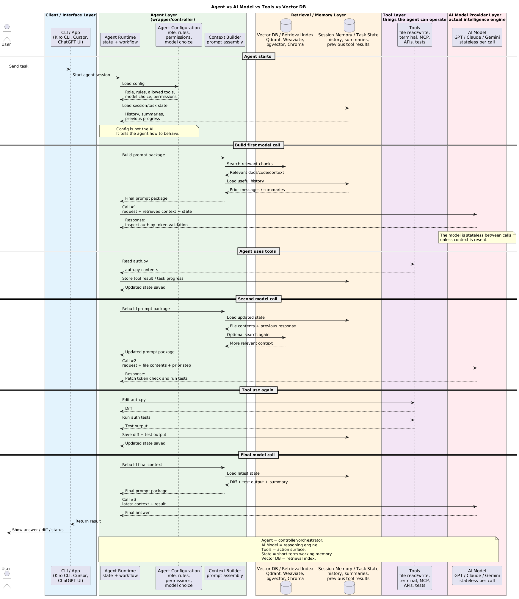

# AI Agents

Use this page to understand systems in which a model chooses tools or next steps. The safest default is a deterministic workflow with narrowly bounded model decisions.

## 1. LLM, tool use, workflow, and agent {#section-1-boundaries}

- **LLM**: produces a probabilistic response from supplied context.
- **LLM + tool**: proposes a typed operation; the application validates and executes it.
- **Workflow**: code defines states, transitions, retries, and approvals; a model may perform individual steps.
- **Agent**: a controller repeatedly asks a model what action to take, observes the result, updates state, and decides whether to continue.
- A single function call is tool use, not necessarily an agent.
- “Agentic” means the model has meaningful runtime discretion over action or sequence.

```text
Known process and transitions?       → deterministic workflow
Known process, ambiguous subtask?    → workflow with bounded model step
Unknown path, dynamic tool choice?   → bounded agent
High-impact irreversible action?     → explicit human approval
```

<div class="image-wrapper">
  
  <div class="diagram-caption" data-snippet-id="agent-architecture-snippet">
    🧭 Bounded agent tool sequence
  </div>
  <script type="text/plain" id="agent-architecture-snippet">
@startuml
title Bounded agent tool loop
actor User
participant "Agent Controller" as Agent
participant Model
database "Durable State" as State
participant "Policy / Approval" as Policy
participant Tool
User -> Agent: Task + identity
Agent -> State: Load task state
loop Within step/time/cost limits
  Agent -> Model: Goal + permitted tools + observations
  Model --> Agent: Proposed action or final answer
  Agent -> Policy: Validate schema, authorization, risk
  alt Approved tool call
    Policy --> Agent: Allow
    Agent -> Tool: Execute with idempotency key
    Tool --> Agent: Bounded observation
    Agent -> State: Persist transition and result
  else Rejected or approval required
    Policy --> Agent: Reject / request approval
  end
end
Agent --> User: Result, partial result, or escalation
@enduml
  </script>
</div>

## 2. Deterministic versus agentic orchestration {#section-2-orchestration}

- Prefer deterministic workflows when:
  - business steps and transitions are known;
  - auditability and repeatability matter;
  - operations have financial, legal, or irreversible effects;
  - reliable retries and compensation are required;
  - strict latency and cost bounds exist.
- Consider an agent when:
  - input is open-ended;
  - useful tools cannot be selected using stable rules;
  - the path depends on observations discovered at runtime;
  - partial success and human escalation are acceptable.
- Strong hybrid pattern:
  - deterministic outer state machine;
  - model chooses among a small set of allowed next steps;
  - application validates every transition;
  - high-impact branches require approval.
- Avoid agents for simple classification, fixed API composition, known approval processes, or deterministic calculations.

## 3. Tool design and execution boundary {#section-3-tools}

- A tool needs:
  - narrow purpose and descriptive name;
  - typed input/output schema;
  - clear error categories;
  - timeout and payload limits;
  - least-privilege credentials;
  - idempotency and audit behaviour;
  - risk classification: read, reversible write, irreversible action.
- The controller must validate:
  - authenticated user and tenant;
  - permission for the exact resource and action;
  - required/allowed fields and enum values;
  - domain invariants such as account status and transaction limits;
  - freshness of data used for the decision;
  - whether human approval is required.
- Tool descriptions are part of the prompt and can be misunderstood.
- Do not expose broad tools such as unrestricted shell, SQL, HTTP, email, or file access when narrow domain operations are possible.
- Return bounded, structured observations; large raw responses increase cost and prompt-injection exposure.

## 4. Planning and execution loops {#section-4-planning}

- **Direct action**: model selects one tool, observes once, then answers.
- **Plan then execute**: model proposes a plan; controller validates and executes steps.
- **ReAct-style loop**: model alternates between action selection and observations.
- **State machine agent**: code constrains legal states while the model chooses permitted transitions.
- **Reflection/critique**: another model pass checks work:
  - can catch omissions;
  - is still probabilistic and correlated with the original model;
  - does not replace tests or business validation.
- Every loop needs hard budgets:
  - maximum steps and repeated actions;
  - wall-clock deadline;
  - input/output tokens;
  - tool calls and parallelism;
  - monetary spend;
  - maximum observation size.
- Termination outcomes should be explicit: completed, partial, needs approval, needs user input, failed safely, or budget exhausted.

## 5. State and memory {#section-5-memory}

- **Conversation state**: recent messages needed for the current interaction.
- **Task state**: goal, plan, current step, tool results, errors, and approvals.
- **Working memory**: temporary summaries or facts selected for the current reasoning loop.
- **Long-term memory**: durable preferences, facts, or past outcomes retrieved later.
- Durable memory requires:
  - source/provenance;
  - owner and tenant;
  - confidence and timestamp;
  - retention and deletion;
  - user correction;
  - access control;
  - versioning and conflict rules.
- A vector store is a retrieval mechanism, not inherently trustworthy memory.
- Do not save model inferences as user facts without validation or clear labelling.
- Persist state before and after side effects so retries can determine what occurred.

## 6. MCP {#section-6-mcp}

- The Model Context Protocol standardizes how clients discover and use tools, resources, and prompts from servers.
- MCP improves interoperability; it does not create trust or authorization.
- Treat an MCP server as:
  - a network dependency;
  - a software supply-chain dependency;
  - a source of untrusted content;
  - a holder of potentially powerful credentials.
- Controls:
  - authenticate client and server;
  - allowlist servers and capabilities;
  - expose only required tools/resources;
  - keep credentials outside model-visible context;
  - validate tool arguments and returned content;
  - apply network egress restrictions;
  - pin/review versions and audit calls.
- A malicious resource may tell the model to ignore policy or exfiltrate data; instruction hierarchy alone is not an adequate defence.

## 7. Multi-agent systems {#section-7-multi-agent}

- Multiple agents are justified only when separate roles, permissions, models, contexts, or parallel work create measurable value.
- Possible patterns:
  - coordinator delegates bounded specialist tasks;
  - independent workers run safe read-only research in parallel;
  - reviewer checks an output against a separate rubric;
  - handoff routes work between different trust domains.
- Added costs:
  - duplicated work and context;
  - inconsistent plans;
  - more failure and retry paths;
  - larger attack surface;
  - difficult attribution and debugging;
  - latency and token multiplication.
- Do not create multiple personas when one workflow with clear functions is sufficient.

## 8. Failure modes and controls {#section-8-failures}

- **Infinite/repeated loops**:
  - detect repeated state/action pairs;
  - enforce step, time, token, and spend budgets.
- **Hallucinated parameters**:
  - use strict schemas, enums, existence checks, and tool-side authorization.
- **Prompt injection**:
  - separate instructions from data;
  - minimize tool privilege;
  - block secrets and unauthorized outbound destinations.
- **Duplicate side effects**:
  - use idempotency keys, durable execution records, and safe retry semantics.
- **Partial failure**:
  - model compensation steps explicitly;
  - report what completed and what did not.
- **State corruption**:
  - version transitions;
  - use transactional writes where needed;
  - reconstruct from an append-only event/audit history.
- **Cost/latency explosion**:
  - parallelize only independent safe reads;
  - summarize observations;
  - route simple steps to smaller models;
  - stop with a partial result rather than loop indefinitely.
- **Excessive autonomy**:
  - require approval for external communications, payments, deletions, privilege changes, and other high-impact actions.

## 9. Evaluation and observability {#section-9-evaluation}

- Offline scenarios should test:
  - correct tool selection;
  - argument validity and semantic correctness;
  - permission denial;
  - tool timeout/error recovery;
  - loop termination;
  - prompt-injection resistance;
  - task completion within budget.
- Production traces should capture:
  - model request/version;
  - proposed action;
  - policy and approval decision;
  - tool request/result reference;
  - state transition;
  - token, latency, and cost;
  - final outcome and user feedback.
- Key metrics:
  - task completion rate;
  - tool success and invalid-argument rate;
  - average/p95 steps per task;
  - approval and escalation rate;
  - duplicate-action incidents;
  - cost and latency per completed task.

See [AI fundamentals](/study/aiFundamentals) for tool-calling mechanics and [AI infrastructure and evaluation](/study/aiInfrastructure) for production controls.
