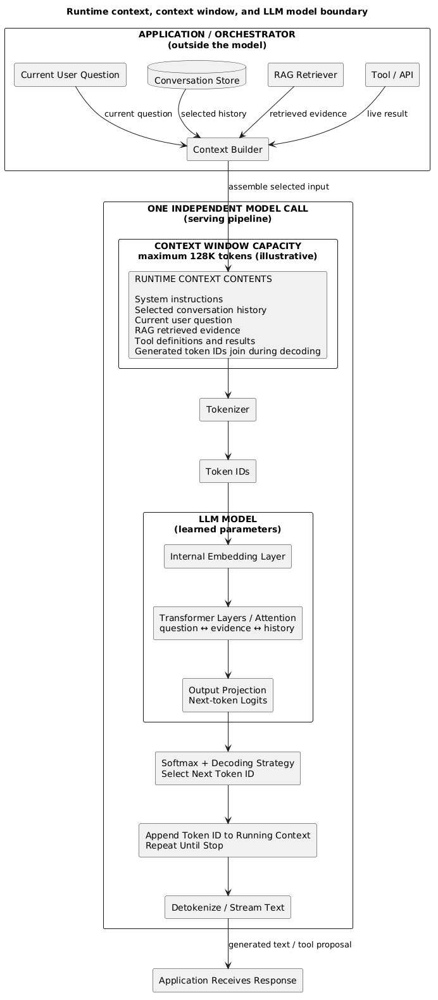
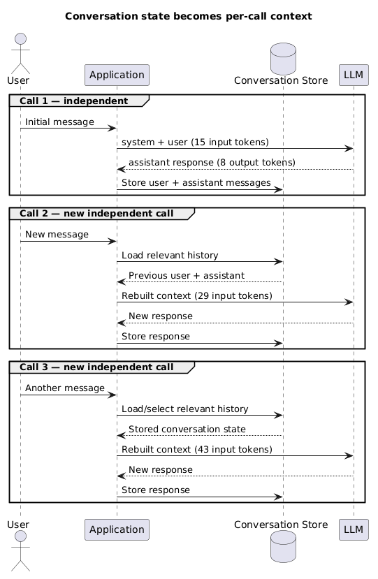
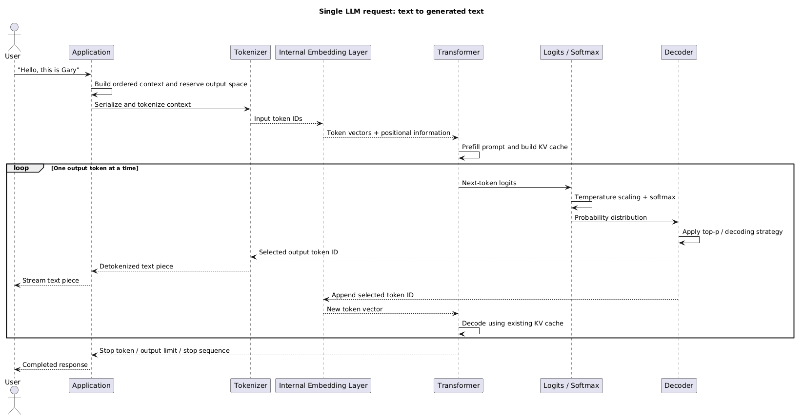

# AI Fundamentals

This page follows one request from text on the screen to generated text. The running example is:

```text
"Hello, this is Gary"
```

## 1. The request at a glance {#section-1-request}

- An LLM is a learned function that predicts the **next token** from the tokens already in its context.
- It does not generate an entire sentence in one step.
- The complete path is:

```text
text
  → tokenizer
  → token IDs
  → internal token-embedding lookup
  → transformer and attention
  → next-token logits
  → softmax probabilities
  → decoding selects one token ID
  → append and repeat
  → detokenize / stream text
```

- The surrounding application builds the request and owns memory, retrieval, tools, permissions, and validation.

## 2. Text becomes tokens and token IDs {#section-2-tokenization}

- A **tokenizer** splits text using a vocabulary designed for that model.
- A token may be:
  - a whole word;
  - part of a word;
  - punctuation;
  - a whitespace pattern;
  - one or more bytes.
- Leading spaces can be part of a token, which is why examples often show tokens such as `" Gary"`.

Illustrative tokenization:

```text
"Hello, this is Gary"
          ↓ tokenizer
["Hello", ",", " this", " is", " Gary"]
          ↓ vocabulary lookup
[882, 11, 341, 291, 9281]
```

- The numbers are illustrative; every tokenizer/model can assign different boundaries and IDs.
- A **token ID** is an integer index into the model vocabulary.
- `882` does not itself contain the meaning of “Hello”; it identifies the relevant vocabulary entry.
- Tokenization affects:
  - context usage and input cost;
  - truncation;
  - latency;
  - handling of code, URLs, identifiers, tables, and different languages.

## 3. Token IDs become internal vectors {#section-3-embedding-lookup}

- The transformer does not meaningfully reason over raw integers such as `882`.
- The model contains a learned **token-embedding table**.
- The token ID selects one row from that table:

```text
token ID 882
      ↓ embedding lookup
[0.83, 0.17, -0.31, ...]
```

- Each input token becomes a vector with the model's internal hidden dimension.
- These vectors were learned with the rest of the model during training.
- The vectors begin as token representations; transformer layers then make them contextual.

Important boundary:

- Standard LLM inference normally uses the generation model's **internal embedding layer**.
- It does not normally call a separate external embedding model before generation.
- A dedicated embedding model used for semantic search or a vector database is a different model and interface; see [AI Knowledge Bases](/study/aiKnowledgebases).

### 3.1 The model pipeline is coupled {#section-3-1-coupling}

- The tokenizer, vocabulary, internal embedding weights, transformer weights, output vocabulary, and detokenizer form one model-compatible pipeline.
- This coupling is **model-specific or checkpoint/model-family-specific**, not simply provider-specific.

```text
                    MODEL / CHECKPOINT
                           │
          ┌────────────────┼────────────────┐
          ↓                ↓                ↓
 tokenizer/vocabulary  embedding table  transformer weights
          │                │                │
     token IDs       learned vectors   contextual processing
          └────────────────┼────────────────┘
                           ↓
                  vocabulary logits
                           ↓
                  matching detokenizer
```

- Token ID `882` only means something relative to its tokenizer vocabulary.
- Arbitrary token IDs from Model A cannot normally be supplied to Model B.
- The internal embedding table and transformer are trained together; GPT's internal vectors cannot normally be substituted into Llama's transformer, for example.
- Output logits correspond to the same model vocabulary, so generated IDs need the matching detokenizer.
- The concepts of softmax, greedy decoding, temperature, and top-p are general; providers decide which controls and implementations their serving APIs expose.
- Through an API, this coupled machinery is normally packaged behind a text/messages-in → text/tokens-out interface.

## 4. Prefill processes the prompt {#section-4-prefill}

- The model first processes the supplied input tokens in the **prefill phase**.
- Prompt tokens can generally be processed together across each transformer layer, subject to causal attention.

```text
"Hello, this is Gary"
          ↓
[882, 11, 341, 291, 9281]
          ↓ embedding lookup
[vector, vector, vector, vector, vector]
          ↓
transformer prefill
```

- A causal mask prevents a token position from reading future positions.
- The last input position can use the earlier prompt when predicting what comes next.
- During prefill, the model normally builds a **key-value (KV) cache** containing reusable attention information for each processed token.
- **Time to first token (TTFT)** includes:
  - request/network overhead;
  - tokenization and scheduling;
  - prefill computation;
  - generation of the first output token.
- Larger prompts require more prefill work and memory, so they commonly increase TTFT before output appears.

## 5. The transformer makes tokens contextual {#section-5-transformer}

- **Positional information** tells the model where tokens occur in the sequence.
  - Exact implementations vary; many modern models apply relative or rotary positional information in attention.
- **Self-attention** lets each token position weigh relevant earlier positions.
  - When predicting after `"Hello, this is Gary"`, the final representation can use `"Gary"`, `"Hello"`, and the surrounding words.
- **Multiple attention heads** can focus on different relationships, such as:
  - local syntax;
  - names and references;
  - long-range dependencies;
  - task or formatting patterns.
- **Feed-forward layers** transform each position after attention.
- **Residual connections** preserve and combine earlier representations.
- **Normalization** keeps activations stable through a deep network.
- This attention-plus-transformation block is repeated through many transformer layers.

Engineering mental model:

```text
initial token vectors
        ↓
attention: gather relevant context
        ↓
feed-forward: transform each position
        ↓
residual + normalization
        ↓
repeat through many layers
        ↓
contextual representation used for next-token prediction
```

- Attention learns useful contextual patterns; it does not guarantee logical reasoning or factual verification.

## 6. Contextual representation becomes the next token {#section-6-logits-decoding}

- The transformer projects the final position's representation into one score for every token in its output vocabulary.
- These raw scores are **logits**.
- Logits are not yet probabilities and do not need to sum to anything.

Illustrative first assistant-token candidates:

| Token | Logit | Probability after decoding controls |
|---|---:|---:|
| `"Hello"` | 8.4 | 47% |
| `"Hi"` | 7.9 | 28% |
| `"Nice"` | 7.2 | 14% |
| other tokens | … | 11% |

- The values are illustrative, not output from a particular model.
- Decoding occurs at this exact boundary:
  - **temperature** scales logits before softmax;
  - **softmax** converts the logits into a probability distribution;
  - **top-p** can restrict sampling to a high-probability cumulative set;
  - greedy decoding or sampling selects the next token ID.
- Lower temperature concentrates probability on likely tokens; it does not make them factual.
- Maximum output tokens, stop sequences, or an end-of-sequence token stop generation.

## 7. Output generation is autoregressive {#section-7-autoregressive}

The input/output distinction is fundamental:

- **Input/prefill**: many prompt tokens can be processed together.
- **Output/decode**: token `N + 1` depends on token `N`, so generation is sequential.

```text
prompt context
      ↓
predict token ID for "Hello"
      ↓ append to context
predict token ID for " Gary"
      ↓ append to context
predict token ID for "!"
      ↓ append to context
predict end-of-sequence
```

- Every generated token becomes part of the context used to predict the next token.
- The KV cache lets decoding reuse attention information from previous tokens instead of recomputing the entire prefix each time.
- The new token must still pass through the transformer before the following token can be chosen.
- **Time per output token (TPOT)** measures the average decode time between generated tokens.
- TPOT is influenced by model size, serving hardware, batch/load, KV-cache size, and provider implementation.
- Because tokens are produced one at a time, the server can stream each completed text piece to the client instead of waiting for the full response.

## 8. Token IDs become text again {#section-8-detokenization}

- The decoder produces token IDs.
- The tokenizer maps each selected ID back to its token text/bytes and joins the pieces.

```text
3912 → "Hello"
9281 → " Gary"
   0 → "!"
        ↓ detokenize
"Hello Gary!"
```

- IDs are illustrative and model-specific.
- The output does **not** pass through an embedding model again.
- With streaming enabled, the application may receive and display decoded text pieces incrementally.
- A client may buffer incomplete byte/Unicode sequences so only valid text is displayed.

## 9. Conversation, context, and context window {#section-9-context-window}

- **Conversation**: the logical history stored by the application or agent.
- **Context**: the tokens actually constructed and supplied to this particular model call.
- **Context window**: the model-defined maximum token budget available to one call, usually covering input context plus generated output.
- Each API call is independent:
  - the model does not automatically retain the previous call;
  - the application stores messages or another memory representation;
  - the application selects and resends the relevant history for the next call.

The application may build context from:

```text
system/developer instructions
+ previous user messages
+ previous assistant messages
+ retrieved documents
+ tool definitions and tool results
+ current user message
+ space reserved for generated output
```

- **Runtime context** is the actual content assembled for one independent LLM call; generated token IDs join the running context during decoding.
- **Runtime context = contents. Context window = maximum capacity.**
- A **128K** context window in the diagram is illustrative; limits differ by model and may include separate output constraints.
- RAG and tools run outside the model, then add retrieved evidence or tool results to that context.
- The transformer has no special “RAG mode”: after tokenization, attention processes evidence, history, instructions, and the question as tokens in the same context.
- Model parameter count and context-window size are separate:
  - parameters are learned weights inside the model;
  - the context window is the per-request token budget.

<div class="image-wrapper">
  
  <div class="diagram-caption" data-snippet-id="llm-runtime-context-snippet">
    🧩 Runtime context: application inputs become one LLM request
  </div>
  <script type="text/plain" id="llm-runtime-context-snippet">
@startuml
title Runtime context, context window, and LLM model boundary
top to bottom direction
skinparam componentStyle rectangle

rectangle "APPLICATION / ORCHESTRATOR\n(outside the model)" {
  component "Context Builder" as Builder
  component "Current User Question" as Question
  database "Conversation Store" as History
  component "RAG Retriever" as RAG
  component "Tool / API" as Tool

  Question --> Builder : current question
  History --> Builder : selected history
  RAG --> Builder : retrieved evidence
  Tool --> Builder : live result
}

rectangle "ONE INDEPENDENT MODEL CALL\n(serving pipeline)" {
  rectangle "CONTEXT WINDOW CAPACITY\nmaximum 128K tokens (illustrative)" {
    card "RUNTIME CONTEXT CONTENTS\n\nSystem instructions\nSelected conversation history\nCurrent user question\nRAG retrieved evidence\nTool definitions and results\nGenerated token IDs join during decoding" as Context
  }

  component Tokenizer
  component "Token IDs" as IDs

  rectangle "LLM MODEL\n(learned parameters)" {
    component "Internal Embedding Layer" as Embeddings
    component "Transformer Layers / Attention\nquestion ↔ evidence ↔ history" as Transformer
    component "Output Projection\nNext-token Logits" as Logits

    Embeddings --> Transformer
    Transformer --> Logits
  }

  component "Softmax + Decoding Strategy\nSelect Next Token ID" as Decoder
  component "Append Token ID to Running Context\nRepeat Until Stop" as Append
  component "Detokenize / Stream Text" as Detokenizer

  Context --> Tokenizer
  Tokenizer --> IDs
  IDs --> Embeddings
  Logits --> Decoder
  Decoder --> Append
  Append --> Detokenizer
}

component "Application Receives Response" as Output
Builder -down-> Context : assemble selected input
Detokenizer -down-> Output : generated text / tool proposal
@enduml
  </script>
</div>

- Python analogy:

~~~python
MAX_CONTEXT_TOKENS = 128_000  # illustrative model limit
model_parameters = load_learned_weights()

def llm_call(input_tokens, max_output_tokens):
    assert len(input_tokens) + max_output_tokens <= MAX_CONTEXT_TOKENS
    running_context = list(input_tokens)

    for _ in range(max_output_tokens):
        logits = model_forward(model_parameters, running_context)
        next_token_id = decode(logits)
        running_context.append(next_token_id)
        yield detokenize(next_token_id)
        if is_stop_token(next_token_id):
            break
~~~

- **model_parameters** stay fixed during inference; **running_context** is different for every call and grows during generation.
- The pseudocode shows the mental model; production serving normally reuses a KV cache rather than recomputing the entire prefix.

- The selected context is serialized according to the model's chat format, tokenized, and supplied to a new inference call.
- Message roles are structured context conventions:
  - **system/developer**: application behaviour and constraints;
  - **user**: caller request and data;
  - **assistant**: earlier or generated model output;
  - **tool**: observation returned by external execution.

### 9.1 A 1,000-token calculation {#section-9-1-calculation}

The diagram used `128K` to show the boundary. Shrink it to `1,000` tokens to make the same capacity calculation easier to follow:

```text
input context tokens + generated output tokens ≤ context window
```

Each call is independent, but resending selected conversation history usually makes later input contexts larger:

```text
CALL 1 — independent request
Input context: [system + user] = 15 tokens
Output:                              8 tokens
Total used:                   15 + 8 = 23 / 1,000
Unused capacity:            1,000 - 23 = 977 tokens
Application stores the 8-token assistant response.

CALL 2 — new independent request
Input context:
[system + previous user + previous assistant + new user] = 29 tokens
Theoretical output headroom:                    1,000 - 29 = 971 tokens
Application stores the new response.

CALL 3 — new independent request
Input context:
[previous context + previous response + new message] = 43 tokens
Theoretical output headroom:                    1,000 - 43 = 957 tokens
```

- The previous output consumed Call 1's budget while it was generated.
- If the application resends that output in Call 2, it is counted again as part of Call 2's input context.
- Theoretical headroom is not necessarily the allowed output size:

```text
available output budget = minimum of:
  configured max output tokens
  model/provider output limit
  context window - input context tokens
```

<div class="image-wrapper">
  
  <div class="diagram-caption" data-snippet-id="llm-conversation-context-snippet">
    💬 Conversation history and independent context windows
  </div>
  <script type="text/plain" id="llm-conversation-context-snippet">
@startuml
title Conversation state becomes per-call context
actor User
participant Application as App
database "Conversation Store" as Store
participant LLM
group Call 1 — independent
  User -> App: Initial message
  App -> LLM: system + user (15 input tokens)
  LLM --> App: assistant response (8 output tokens)
  App -> Store: Store user + assistant messages
end
group Call 2 — new independent call
  User -> App: New message
  App -> Store: Load relevant history
  Store --> App: Previous user + assistant
  App -> LLM: Rebuilt context (29 input tokens)
  LLM --> App: New response
  App -> Store: Store response
end
group Call 3 — new independent call
  User -> App: Another message
  App -> Store: Load/select relevant history
  Store --> App: Stored conversation state
  App -> LLM: Rebuilt context (43 input tokens)
  LLM --> App: New response
  App -> Store: Store response
end
@enduml
  </script>
</div>

- A useful prompt makes the task, required evidence, refusal conditions, and output shape explicit.
- Prompting can improve model behaviour; it cannot enforce identity, authorization, factual truth, or transaction integrity.
- Treat user text, retrieved documents, and tool results as untrusted data because they may contain conflicting or malicious instructions.
- Practical consequences:
  - longer context increases input tokens, cost, prefill work, TTFT, and KV-cache memory;
  - output capacity must be reserved;
  - excess history must be trimmed, summarized/compacted, or retrieved selectively;
  - important evidence can be buried in irrelevant or repeated content;
  - a larger advertised window does not guarantee reliable attention to every detail.
- A provider may offer managed conversation state, but that remains an application/platform feature around independent inference calls.

## 10. Training, fine-tuning, and inference {#section-10-training}

- **Pretraining**:
  - adjusts model parameters to reduce next-token prediction error over large datasets;
  - learns language and broad patterns without creating a traceable facts database.
- **Instruction/preference tuning**:
  - shapes task following, response style, refusals, and preferred behaviour.
- **Fine-tuning**:
  - adapts behaviour, terminology, format, or a narrow task using examples;
  - is not the default solution for frequently changing facts, citations, or authorization.
- **Inference**:
  - runs the trained parameters for the current request;
  - consists of prefill followed by autoregressive decoding.

Fictional thought experiment: assume the base model was trained before Apple Inc. existed, so its weights strongly associate `Apple → fruit`.

| Approach | What changes? | Result |
|---|---|---|
| **Prompt** | Add “Apple means the technology company” to this request. | The model can follow that meaning for this request; weights do not change. |
| **RAG** | Retrieve current Apple documents into this request's context. | The model can answer from supplied evidence; weights do not change. |
| **Fine-tuning** | Train further on many representative Apple examples. | Weights change, making terminology and behavioural associations more consistent. |
| **New pretraining** | Train a new base model on newer broad data containing Apple Inc. | Apple-company associations become part of base training. |

```text
old model weights: Apple → mostly fruit
                         +
request context: Apple Inc. is a technology company ...
                         ↓
transformer processes question + current context
                         ↓
answer: Apple is a technology company ...
```

- Without that prompt/RAG context on a later independent call, the unchanged model may return to the fruit interpretation.
- Fine-tuning can change learned associations, but it remains a poor database for products, prices, executives, policies, or inventory that change frequently.
- Use RAG for current document knowledge and APIs/tools for authoritative live state.

### 10.1 Apply it: an Apple support assistant {#section-10-1-mechanism}

Apple now builds a support assistant for Gary's device repair. **Apple wants the assistant** to behave consistently, but the surrounding application—not the model—must enforce security and transactions.

| Need | Example | Use |
|---|---|---|
| **Behaviour** | Apple wants the assistant to call service requests **Repairs**, use its support tone, and follow its classification conventions. | Prompt first → fine-tuning if stronger consistency is needed |
| **Knowledge** | Gary asks, “Does my battery qualify for service under today's support policy?” | RAG retrieves the current policy |
| **Live state** | Gary asks, “What is the current status of Repair #123?” | API/tool reads the repair system |
| **Identity** | The application must verify that the signed-in caller is Gary. | Authentication |
| **Authorization** | The application must decide whether Gary may view or approve Repair #123. | Authorization / IAM |
| **Transaction integrity** | After Gary confirms, create one replacement order—even if the request is retried. | Deterministic application/database logic |

```text
Gary signs in → authenticate → authorize Repair #123
              → retrieve current policy with RAG
              → read live repair status through an API
              → assistant explains the result
Gary confirms → application creates one replacement order transactionally
```

- Prompting/fine-tuning changes how the assistant **tends to behave**. Start with prompts, examples, and schemas; fine-tune only when complex repeated behaviour remains inconsistent.
- RAG can also retrieve behavioural instructions, but supplying “how to behave” on each request differs from making that behaviour a consistent model default.
- Model output is only a proposal. Authentication, authorization, validation, idempotency, and database guarantees remain deterministic application controls.

For deeper treatment, see [AI Knowledge Bases](/study/aiKnowledgebases), [AI Agents](/study/aiAgents), and [AI Infrastructure and Evaluation](/study/aiInfrastructure).

## 11. Hallucination, grounding, and structured output {#section-11-hallucination}

- The model selects plausible next tokens from learned patterns and supplied context; it does not automatically verify claims.
- A **hallucination** is a claim, citation, entity, calculation, or tool argument unsupported by available evidence.

Fictional example:

```text
Question: "Who is the CEO of Glucolte?"
Trusted evidence in this request: none

After "The CEO of Glucolte is ..."
illustrative next-token probabilities:
  "Gary"     38%
  "John"     21%
  "Michael"  12%
  ...

Generated answer: "The CEO of Glucolte is Gary Lu."
```

- The probabilities are illustrative; names may also span several tokens.
- The answer is grammatical and may sound confident, but the request contained no evidence supporting it. Even if it were accidentally correct, the answer would still be ungrounded.
- The model does not reliably execute an internal rule such as `fact unknown → stop`. Its basic operation remains:

```text
learned weights + supplied context
               ↓
next-token probability distribution
               ↓
plausible continuation
```

- Unsupported output can arise because:
  - the fact was absent, incorrect, or stale in training data;
  - the request context is missing or conflicting;
  - retrieval returned irrelevant or outdated evidence;
  - the model ignored or incorrectly combined valid evidence.
- RAG improves the evidence available to next-token prediction; it does not change the underlying generation process:

```text
without RAG: weights + question                         → plausible guess
with RAG:    weights + question + authoritative evidence → better-grounded answer
```

- RAG therefore reduces hallucination risk but cannot eliminate it: retrieval can fail, and the model can still misuse correct evidence.
- Low temperature does not solve this:
  - it makes high-probability continuations more likely;
  - a likely continuation can still be wrong;
  - the model may repeat the same wrong answer more consistently.
- Reduce risk by:
  - supplying authoritative evidence through retrieval or tools;
  - requiring an insufficient-evidence response;
  - carrying source IDs into citations;
  - validating calculations, identifiers, and business rules in code;
  - using human approval for high-impact outcomes.
- **Structured output** constrains syntax or shape, not truth:
  - valid JSON can contain a nonexistent customer;
  - schema-valid tool arguments can still be unauthorized or unsafe.

## 12. What remains outside the model {#section-12-boundaries}

- The model can propose text, structured data, or a tool call.
- The surrounding application must own:
  - authentication and authorization;
  - retrieval of permitted evidence;
  - tool execution and least-privilege credentials;
  - schema and domain validation;
  - retries, idempotency, state, and approvals;
  - logging, evaluation, and user-visible error handling.
- Prompt instructions cannot enforce permissions or transaction integrity.
- Never treat generated tool arguments as authorization.

```text
user request → model proposes tool + arguments
             → application validates identity, policy, schema, and risk
             → tool executes with least privilege
             → model receives bounded observation
             → model produces the next token or final answer
```

- Retrieval internals: [AI Knowledge Bases](/study/aiKnowledgebases)
- Tool loops and agents: [AI Agents](/study/aiAgents)
- Production controls: [AI Infrastructure and Evaluation](/study/aiInfrastructure)

## 13. Complete request flow {#section-13-complete-flow}

```text
Application builds context
        ↓
Tokenizer
        ↓
Token IDs
        ↓
Internal embedding lookup
        ↓
Transformer / attention
        ↓
Next-token logits
        ↓
Temperature → softmax → top-p / decoding strategy
        ↓
Next token ID
        ↓
Append to context ───────────────┐
        ↑                        │
        └── repeat transformer ──┘
        ↓ stop condition
Detokenize / stream
        ↓
User sees text
```

<div class="image-wrapper">
  
  <div class="diagram-caption" data-snippet-id="llm-single-request-snippet">
    🧠 Complete single-request sequence
  </div>
  <script type="text/plain" id="llm-single-request-snippet">
@startuml
title Single LLM request: text to generated text
actor User
participant Application as App
participant Tokenizer
participant "Internal Embedding Layer" as Embed
participant "Transformer" as Model
participant "Logits / Softmax" as Scores
participant Decoder
User -> App: "Hello, this is Gary"
App -> App: Build ordered context and reserve output space
App -> Tokenizer: Serialize and tokenize context
Tokenizer --> Embed: Input token IDs
Embed --> Model: Token vectors + positional information
Model -> Model: Prefill prompt and build KV cache
loop One output token at a time
  Model -> Scores: Next-token logits
  Scores -> Scores: Temperature scaling + softmax
  Scores -> Decoder: Probability distribution
  Decoder -> Decoder: Apply top-p / decoding strategy
  Decoder --> Tokenizer: Selected output token ID
  Tokenizer --> App: Detokenized text piece
  App --> User: Stream text piece
  Decoder --> Embed: Append selected token ID
  Embed --> Model: New token vector
  Model -> Model: Decode using existing KV cache
end
Model --> App: Stop token / output limit / stop sequence
App --> User: Completed response
@enduml
  </script>
</div>
