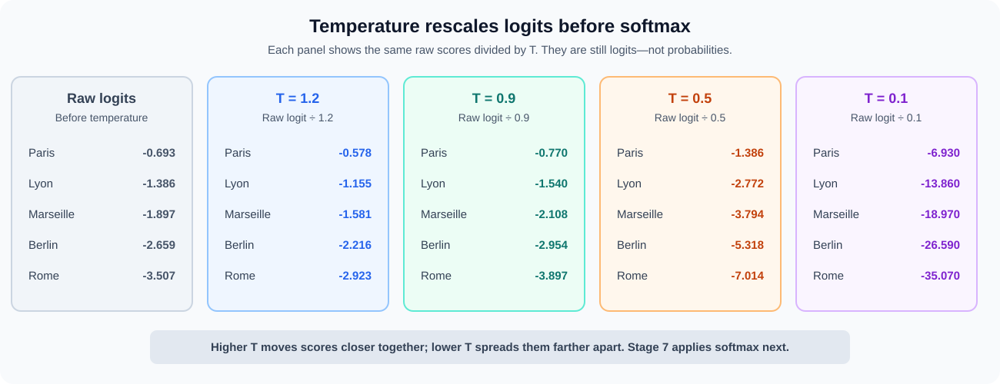
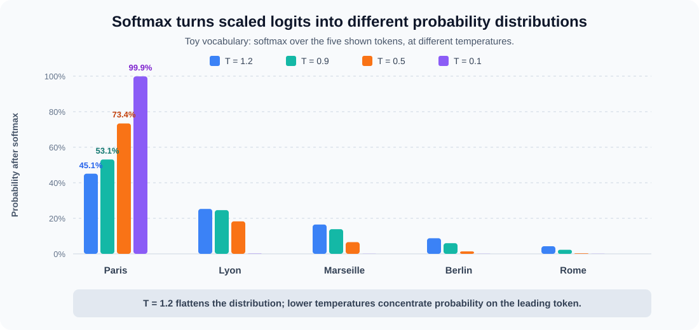
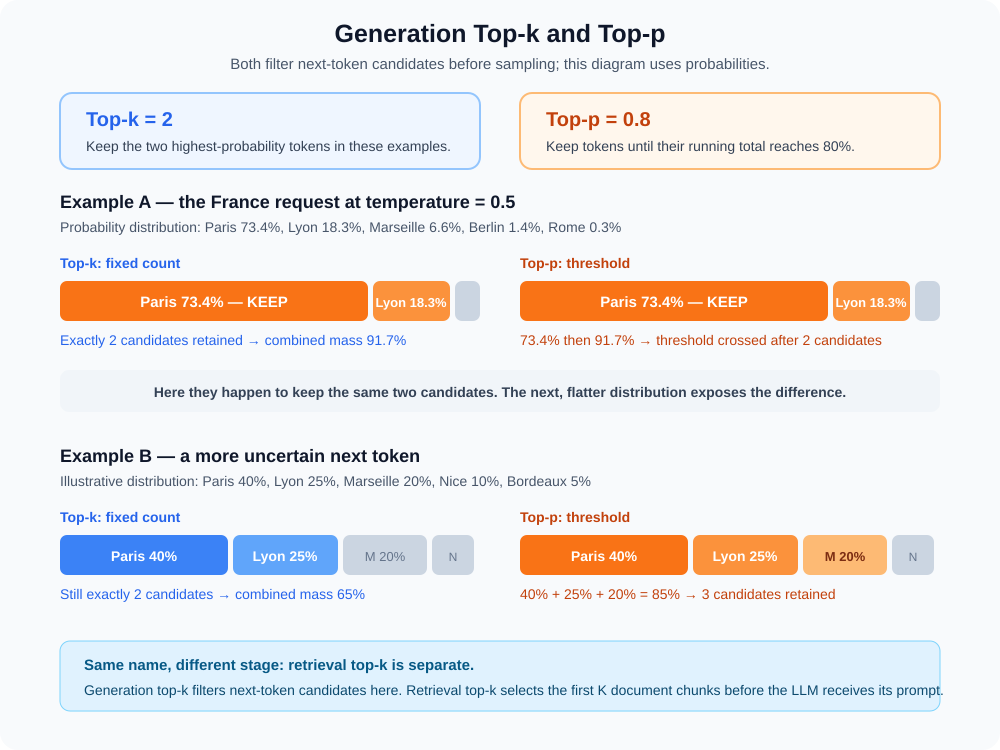
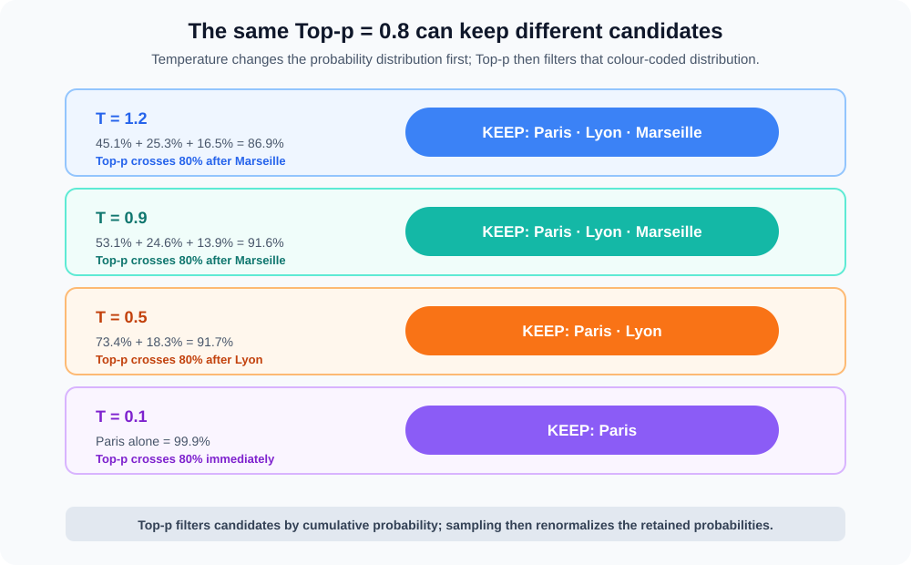
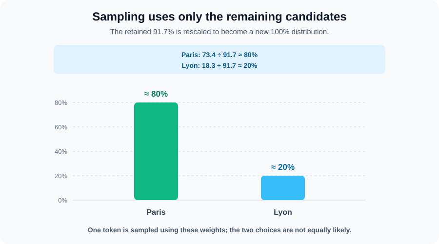
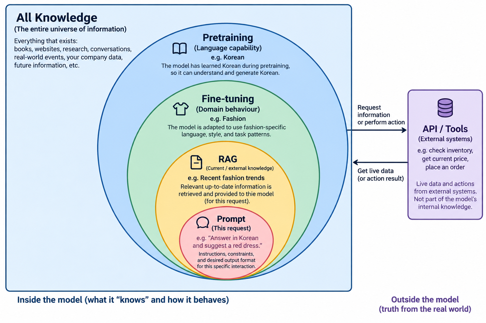

# AI Fundamentals

This page follows **one LLM request** from text on the screen to generated, streamed text.

**Part 1 of 7:** **Fundamentals** → [Prompt engineering](/study/aiPromptEngineering) → [Models and providers](/study/aiModels) → [Knowledge bases](/study/aiKnowledgebases) → [Agents](/study/aiAgents) → [Infrastructure](/study/aiInfrastructure) → [AWS AI Services](/study/infrastructureAWSAiServices).

```text
"The capital of France is"
```

An LLM generates a response one token at a time. First use the map below to see the entire journey; the rest of the page then walks through each box in order.

## 1. Big picture: complete request flow {#section-1-request}

The prompt is processed once, then the generated token loops through the model until a stop condition is reached:

```text
"The capital of France is"
        ↓ tokenizer
tokens → token IDs
        ↓ internal embedding lookup
vectors
        ↓ transformer / attention
contextual representation
        ↓ output projection
logits
        ↓ temperature → softmax
probabilities
        ↓ top-p / sampling
next token ID → " Paris"
        ↓ append to context and repeat
detokenize / stream text
```

- The values, IDs, and token boundaries on this page are illustrative; every model has its own compatible tokenizer and vocabulary.
- The surrounding application submits text and receives text. Its broader concerns—such as conversation history, permissions, tools, and validation—are supporting concepts later in the page, not steps performed inside this single inference loop.

<div class="image-wrapper">
  
  <div class="diagram-caption" data-snippet-id="llm-single-request-snippet">
    🧠 Complete single-request sequence — the map for this page
  </div>
  <script type="text/plain" id="llm-single-request-snippet">
@startuml
title Single LLM request: text to generated text
actor User
participant Application as App
participant Tokenizer
participant "Internal Embedding Layer" as Embed
participant "Transformer" as Model
participant "Logits / Softmax" as Scores
participant Decoder
User -> App: "The capital of France is"
App -> App: Build ordered context and reserve output space
App -> Tokenizer: Serialize and tokenize context
Tokenizer --> Embed: Input token IDs
Embed --> Model: Token vectors + positional information
Model -> Model: Prefill prompt and build KV cache
loop One output token at a time
  Model -> Scores: Next-token logits
  Scores -> Scores: Temperature scaling + softmax
  Scores -> Decoder: Probability distribution
  Decoder -> Decoder: Apply top-p / decoding strategy
  Decoder --> Tokenizer: Selected output token ID (for example, " Paris")
  Tokenizer --> App: Detokenized text piece
  App --> User: Stream text piece
  Decoder --> Embed: Append selected token ID
  Embed --> Model: New token vector
  Model -> Model: Decode using existing KV cache
end
Model --> App: Stop token / output limit / stop sequence
App --> User: Completed response
@enduml
  </script>
</div>

### Before Stage 1 — construct the prompt

Before this text reaches the tokenizer, the application combines the user's request with the task instructions, relevant context, optional examples, and desired output format. Learn how to design that input in [AI Prompt Engineering](/study/aiPromptEngineering).

## 2. Stage 1 — text becomes tokens and token IDs {#section-2-tokenization}

- A **tokenizer** splits text using a vocabulary designed for that model.
- A token may be:
  - a whole word;
  - part of a word;
  - punctuation;
  - a whitespace pattern;
  - one or more bytes.
- Leading spaces can be part of a token, which is why examples often show tokens such as `" Gary"`.

Illustrative tokenization:

```text
"The capital of France is"
          ↓ tokenizer
["The", " capital", " of", " France", " is"]
          ↓ vocabulary lookup
[464, 3139, 286, 4881, 318]
```

- The numbers are illustrative; every tokenizer/model can assign different boundaries and IDs.
- A **token ID** is an integer index into the model vocabulary.
- `464` does not itself contain the meaning of “The”; it identifies the relevant vocabulary entry.
- Tokenization affects:
  - context usage and input cost;
  - truncation;
  - latency;
  - handling of code, URLs, identifiers, tables, and different languages.

## 3. Stage 2 — token IDs become internal vectors {#section-3-embedding-lookup}

- The transformer does not meaningfully reason over raw integers such as `464`.
- The model contains a learned **token-embedding table**.
- The token ID selects one row from that table:

```text
token ID 464
      ↓ embedding lookup
[0.83, 0.17, -0.31, ...]
```

- For our running request, each of `[464, 3139, 286, 4881, 318]` selects a learned vector.
- Each input token becomes a vector with the model's internal hidden dimension.
- These vectors were learned with the rest of the model during training.
- The vectors begin as token representations; transformer layers then make them contextual.

Important boundary:

- Standard LLM inference normally uses the generation model's **internal embedding layer**.
- It does not normally call a separate external embedding model before generation.
- A dedicated embedding model used for semantic search or a vector database is a different model and interface; see [AI Knowledge Bases](/study/aiKnowledgebases).

### 3.1 The model pipeline is coupled {#section-3-1-coupling}

- The tokenizer, vocabulary, internal embedding weights, transformer weights, output vocabulary, and detokenizer form one model-compatible pipeline.
- This coupling is **model-specific or checkpoint/model-family-specific**, not simply provider-specific.

```text
                    MODEL / CHECKPOINT
                           │
          ┌────────────────┼────────────────┐
          ↓                ↓                ↓
 tokenizer/vocabulary  embedding table  transformer weights
          │                │                │
     token IDs       learned vectors   contextual processing
          └────────────────┼────────────────┘
                           ↓
                  vocabulary logits
                           ↓
                  matching detokenizer
```

- Token ID `464` only means something relative to its tokenizer vocabulary.
- Arbitrary token IDs from Model A cannot normally be supplied to Model B.
- The internal embedding table and transformer are trained together; GPT's internal vectors cannot normally be substituted into Llama's transformer, for example.
- Output logits correspond to the same model vocabulary, so generated IDs need the matching detokenizer.
- The concepts of softmax, greedy decoding, temperature, and top-p are general; providers decide which controls and implementations their serving APIs expose.
- Through an API, this coupled machinery is normally packaged behind a text/messages-in → text/tokens-out interface.

## 4. Stage 3 — prefill processes the prompt {#section-4-prefill}

**Prefill is the initial forward pass over the supplied prompt, before the first response token is selected.** Starting with the vectors from Stage 2, the model processes the prompt through its Transformer layers. This computes the context needed to predict the first new token and normally fills a **key-value (KV) cache** for later generation.

All five prompt tokens are already known, so their positions can be processed **together within each layer**. The layers still run in sequence. This differs from later decoding, where the next generated token must be selected before it can become the next input.

<figure class="inference-diagram" aria-labelledby="prefill-caption">
  <div class="inference-progress"><strong>3 · Prompt pass</strong><span aria-hidden="true">›</span><span>4 · Inside the Transformer</span><span aria-hidden="true">→</span><span>5 · Vocabulary logits</span></div>
  <div class="inference-label">From Stage 2 · all five prompt vectors are ready</div>
  <div class="inference-tokens">
    <div><span>The</span><span class="inference-dot" aria-hidden="true">●</span><span>v₁</span></div>
    <div><span>capital</span><span class="inference-dot" aria-hidden="true">●</span><span>v₂</span></div>
    <div><span>of</span><span class="inference-dot" aria-hidden="true">●</span><span>v₃</span></div>
    <div><span>France</span><span class="inference-dot" aria-hidden="true">●</span><span>v₄</span></div>
    <div><span>is</span><span class="inference-dot" aria-hidden="true">●</span><span>v₅</span></div>
  </div>
  <div class="inference-input-arrows" aria-hidden="true"><span>↓</span><span>↓</span><span>↓</span><span>↓</span><span>↓</span></div>
  <div class="inference-node inference-node--initial"><span class="inference-label">Prefill · run the prompt through the Transformer</span><strong>Layer 1 → Layer 2 → … → Layer N</strong><br>Process the five positions together in each layer.<br><a href="#section-5-transformer">Stage 4 zooms inside this same pass.</a></div>
  <div class="inference-lanes">
    <div class="inference-flow">
      <div class="inference-arrow">↓ <span>result for next-token prediction</span></div>
      <div class="inference-node inference-node--context"><span class="inference-star" aria-hidden="true">★</span> <strong>Final hidden state at “is”</strong><br><span class="inference-note">The last position can use “The capital of France is”.</span></div>
      <div class="inference-arrow" aria-hidden="true">↓</div>
      <div class="inference-node"><strong>Stage 5: vocabulary scores</strong><br>Stages 6–9 select the first new token:<br><code>" Paris"</code></div>
    </div>
    <div class="inference-flow">
      <div class="inference-arrow">↓ <span>attention information saved along the way</span></div>
      <div class="inference-node"><strong>KV cache for the prompt</strong><br><span class="inference-note">Each layer saves its attention keys and values for the five positions.</span></div>
      <div class="inference-arrow" aria-hidden="true">↓</div>
      <div class="inference-node"><strong>Reuse during decoding</strong><br>Process the new <code>" Paris"</code> token using the saved prompt cache.<br><a href="#section-7-autoregressive">Continue this loop in Stage 10.</a></div>
    </div>
  </div>
  <figcaption id="prefill-caption">Prefill does the prompt's initial computation and saves attention work for reuse. Each dot represents a whole vector from Stage 2; text labels are for us, with leading spaces omitted.</figcaption>
</figure>

**Together does not mean looking ahead.** A causal mask allows each position to use only itself and earlier positions: `"The"` can use only `"The"`; `"is"` can use all five prompt positions. No position can use `" Paris"` yet.

**What is being “prefilled”?** In typical cached generation, the attention cache is populated with the prompt's computed keys and values. These are per-layer numerical features that later tokens can attend to, so the model can reuse earlier work. They are temporary computation for this context, not newly learned model weights. See [how KV caching works](https://huggingface.co/docs/transformers/main/en/cache_explanation).

**Why the pause before the first token?** The prompt pass must finish before the first response token can be selected. Longer prompts generally increase this work and cache memory. **Time to first token (TTFT)** includes prefill plus network overhead, tokenization, scheduling, and first-token selection.

<details class="inference-details">
  <summary>Does every request process the entire prompt in one batch?</summary>
  <p>This example starts with no reusable cache. Serving systems may reuse a cached prefix or split a long prompt into chunks. Prefill still processes the supplied input that has not yet been cached, preparing it for subsequent generation.</p>
</details>

## 5. Stage 4 — the transformer makes tokens contextual {#section-5-transformer}

**What does the Transformer change?** Each position's initial representation becomes a **context-dependent hidden state**, also called a **contextual representation**. Follow the vector at `"is"`: its token label stays the same, but the information represented by its numbers changes.

This is a closer look inside the prefill pass from Stage 3. The same Transformer layers also process each new token during the later decoding loop. **Positional information** supplies token order: some models add position vectors to embeddings; others apply position inside attention, such as rotary positions. “Embedding + position” below is a conceptual shorthand.

<figure class="inference-diagram" aria-labelledby="context-caption">
  <div class="inference-progress"><span>3 · Prompt pass</span><span aria-hidden="true">›</span><strong>4 · Inside the Transformer</strong><span aria-hidden="true">→</span><span>5 · Vocabulary logits</span></div>
  <div class="inference-label">Before · Stage 2's vectors entering the prompt pass</div>
  <p class="inference-comparison"><strong>Before at “is”:</strong> mainly its token embedding + position. It has not yet incorporated this prompt's preceding context.</p>
  <div class="inference-tokens">
    <div><span>The</span><span class="inference-dot" aria-hidden="true">●</span><span>v₁</span></div>
    <div><span>capital</span><span class="inference-dot" aria-hidden="true">●</span><span>v₂</span></div>
    <div><span>of</span><span class="inference-dot" aria-hidden="true">●</span><span>v₃</span></div>
    <div><span>France</span><span class="inference-dot" aria-hidden="true">●</span><span>v₄</span></div>
    <div class="inference-focus"><span>is</span><span class="inference-dot" aria-hidden="true">●</span><strong>v₅</strong></div>
  </div>
  <div class="inference-attention">
    <svg viewBox="0 0 600 100" role="img" aria-labelledby="attention-title attention-desc">
      <title id="attention-title">Information from all five positions can contribute at “is”</title>
      <desc id="attention-desc">Five paths from The, capital, of, France, and is converge at the is position. These show allowed information flow, not measured attention weights or vector geometry.</desc>
      <defs><marker id="inference-arrowhead" viewBox="0 0 10 10" refX="8" refY="5" markerWidth="6" markerHeight="6" orient="auto-start-reverse"><path d="M 0 0 L 10 5 L 0 10 z"/></marker></defs>
      <g class="inference-attention-lines" marker-end="url(#inference-arrowhead)">
        <path d="M60 4 C60 55 530 25 540 86"/>
        <path d="M180 4 C180 48 530 30 540 86"/>
        <path d="M300 4 C300 44 530 36 540 86"/>
        <path d="M420 4 C420 40 530 42 540 86"/>
        <path d="M540 4 L540 86"/>
      </g>
    </svg>
    <p><strong>Self-attention at “is”</strong> combines information from relevant earlier positions and itself, using learned, context-dependent weights.</p>
  </div>
  <div class="inference-blocks" aria-label="Initial vectors pass through Transformer Block 1, Block 2, and further blocks through Block N">
    <div>Transformer<br><strong>Block 1</strong></div><span aria-hidden="true">↓</span>
    <div>Transformer<br><strong>Block 2</strong></div><span aria-label="More blocks">⋮</span>
    <div>Transformer<br><strong>Block N</strong></div>
  </div>
  <p class="inference-note">Each block updates all five representations. The paths above highlight only the information available at “is”.</p>
  <div class="inference-arrow" aria-hidden="true">↓</div>
  <div class="inference-label">After · contextual hidden states</div>
  <div class="inference-tokens inference-tokens--context">
    <div><span>The</span><span class="inference-dot" aria-hidden="true">●</span><span>h₁</span></div>
    <div><span>capital</span><span class="inference-dot" aria-hidden="true">●</span><span>h₂</span></div>
    <div><span>of</span><span class="inference-dot" aria-hidden="true">●</span><span>h₃</span></div>
    <div><span>France</span><span class="inference-dot" aria-hidden="true">●</span><span>h₄</span></div>
    <div class="inference-focus"><span>is</span><span class="inference-star" aria-hidden="true">★</span><strong>h₅ = h</strong></div>
  </div>
  <p class="inference-comparison inference-comparison--context"><strong>After at “is”:</strong> h encodes contextually useful information for predicting what follows <em>“The capital of France is …”</em></p>
  <figcaption id="context-caption">Five vectors in → five contextual hidden states out, each still d_model dimensions. The star marks the final position we follow into Stage 5; it is still a vector, not a word.</figcaption>
</figure>

The Transformer repeatedly transforms a sequence of vectors so that each position contains contextually useful information. Attention combines learned numerical features; it does not literally copy word meanings into `"is"`. Each position can use only its own prefix, so `"France"` cannot use the later `"is"`.

<details class="inference-details">
  <summary>What happens inside each Transformer block?</summary>
  <p><strong>Multiple self-attention heads</strong> combine information across allowed positions in different learned ways. <strong>Feed-forward layers</strong> then transform each position's features. <strong>Residual connections</strong> combine updates with earlier representations, and <strong>normalization</strong> helps keep activations stable. Repeating these operations across many blocks produces the final hidden states.</p>
  <p>The dots and paths are an educational schematic, not literal vector geometry or measured attention strengths. Contextualization does not guarantee factual accuracy.</p>
</details>

## 6. Stage 5 — output projection produces logits {#section-6-logits-decoding}

**How does a contextual vector become scores for words?** Take **h**, the final hidden state at `"is"` from Stage 4. The **output projection** is a learned mapping from the hidden dimension to the vocabulary dimension: it produces one **logit** (raw score) for **every vocabulary token**, including word pieces and punctuation.

<figure class="inference-diagram" aria-labelledby="logits-caption">
  <div class="inference-progress"><span>3 · Prompt pass</span><span aria-hidden="true">›</span><span>4 · Inside the Transformer</span><span aria-hidden="true">→</span><strong>5 · Vocabulary logits</strong></div>
  <div class="inference-tokens inference-tokens--context">
    <div><span>The</span><span class="inference-dot" aria-hidden="true">●</span><span>h₁</span></div>
    <div><span>capital</span><span class="inference-dot" aria-hidden="true">●</span><span>h₂</span></div>
    <div><span>of</span><span class="inference-dot" aria-hidden="true">●</span><span>h₃</span></div>
    <div><span>France</span><span class="inference-dot" aria-hidden="true">●</span><span>h₄</span></div>
    <div class="inference-focus"><span>is</span><span class="inference-star" aria-hidden="true">★</span><strong>h₅ = h</strong></div>
  </div>
  <div class="inference-select" aria-hidden="true">↓</div>
  <div class="inference-node inference-node--context"><span class="inference-label">Select the last position's final hidden state</span><span class="inference-star" aria-hidden="true">★</span> <code>h = […, …, …, …]</code><br><span class="inference-note">d_model dimensions · after any final normalization</span></div>
  <div class="inference-arrow" aria-hidden="true">↓</div>
  <div class="inference-node"><span class="inference-label">Learned output projection</span><code>logits = W_vocab · h + b</code><br><span class="inference-note">W_vocab: vocabulary_size × d_model · bias b is optional</span></div>
  <div class="inference-arrow" aria-hidden="true">↓</div>
  <div class="inference-node"><span class="inference-label">Vocabulary-sized vector of raw scores</span><code>[…, -0.693, …, -1.386, …, -3.507, …]</code><br><span class="inference-note">vocabulary_size dimensions · one entry per token ID</span></div>
  <div class="inference-logits" role="group" aria-label="Illustrative vocabulary logits, five entries shown; higher, less negative scores rank above lower scores">
    <div class="inference-logit-axis" aria-hidden="true"><span>Token / logit</span><span>−4 <span>0</span></span></div>
    <div class="inference-logit-row inference-logit-row--top"><span><code>" Paris"</code><strong>−0.693</strong></span><span class="inference-logit-track" aria-hidden="true"><i style="width:17.325%"></i></span></div>
    <div class="inference-logit-row"><span><code>" Lyon"</code><strong>−1.386</strong></span><span class="inference-logit-track" aria-hidden="true"><i style="width:34.65%"></i></span></div>
    <div class="inference-logit-row"><span><code>" Marseille"</code><strong>−1.897</strong></span><span class="inference-logit-track" aria-hidden="true"><i style="width:47.425%"></i></span></div>
    <div class="inference-logit-row"><span><code>" Berlin"</code><strong>−2.659</strong></span><span class="inference-logit-track" aria-hidden="true"><i style="width:66.475%"></i></span></div>
    <div class="inference-logit-row"><span><code>" Rome"</code><strong>−3.507</strong></span><span class="inference-logit-track" aria-hidden="true"><i style="width:87.675%"></i></span></div>
    <p class="inference-note">… every other vocabulary token also has a score.<br>Bars extend left from zero. Here, less negative = higher score; “ Paris” scores highest among the entries shown.</p>
  </div>
  <figcaption id="logits-caption">Illustrative values, reused in Stage 6. Five vocabulary entries are displayed, not the full vocabulary. Logits can be positive or negative; they are not probabilities and need not sum to 1.</figcaption>
</figure>

**This is not vector search.** The model does not run “find the nearest word to h”. It multiplies h by a learned weight matrix to compute all vocabulary scores. Each row supplies a token's scoring weights: a dot product with h, plus an optional bias. Although dot products also appear in similarity search—and some models share input embedding and output weights—this operation scores the fixed model vocabulary; it does not retrieve nearest words from a vector database.

<div class="inference-diagram inference-handoff" aria-label="Continue from hidden state to the sampled token">
  <span><span class="inference-star" aria-hidden="true">★</span> Contextual hidden state h</span><b aria-hidden="true">↓</b>
  <span>Output projection → raw logits</span><b aria-hidden="true">↓</b>
  <a href="#section-6-1-temperature-top-p">Stage 6 · Temperature</a><b aria-hidden="true">↓</b>
  <span>Stage 7 · Softmax → probabilities</span><b aria-hidden="true">↓</b>
  <span>Stage 8 · Top-P → candidate tokens</span><b aria-hidden="true">↓</b>
  <a href="#section-6-4-next-token">Stage 9 · Sampling → <code>" Paris"</code></a>
</div>

The output projection has scored the next-token candidates; it has not selected one. The next four stages turn those scores into the sampled `" Paris"` in this walkthrough. For the underlying embedding, attention, and linear output mapping, see [Attention Is All You Need, §§3.2–3.5](https://arxiv.org/html/1706.03762v7#S3.SS4).

## 7. Stage 6 — temperature {#section-6-1-temperature-top-p}

Temperature is applied at every generated-token step. It changes the shape of the logits before they become probabilities:

- Lower temperature concentrates probability on likely tokens; it does not make them factual.
- Temperature does not remove tokens or choose the next token by itself.
- `T = 1` is the baseline: it leaves the logits unchanged. Values below `1` sharpen the distribution; values above `1`, if an API allows them, flatten it. If your API only offers `0–1`, then `1` is simply its least-conservative setting. This walkthrough compares `1.2`, `0.9`, `0.5`, and `0.1`.

Continue the France request with these illustrative **relative logits**. Conceptually, temperature divides each logit by `T`: a lower `T` increases the separation between scores.

| Token | Raw logit | `÷ 1.2` | `÷ 0.9` | `÷ 0.5` | `÷ 0.1` |
|---|---:|---:|---:|---:|---:|
| `" Paris"` | -0.693 | -0.578 | -0.770 | -1.386 | -6.930 |
| `" Lyon"` | -1.386 | -1.155 | -1.540 | -2.772 | -13.860 |
| `" Marseille"` | -1.897 | -1.581 | -2.108 | -3.794 | -18.970 |
| `" Berlin"` | -2.659 | -2.216 | -2.954 | -5.318 | -26.590 |
| `" Rome"` | -3.507 | -2.923 | -3.897 | -7.014 | -35.070 |

These are still **logits**, not probabilities. The diagram shows only the Stage 6 rescaling; Stage 7 applies softmax next.

<div class="image-wrapper">
  
  <div class="diagram-caption">📐 Stage 6: temperature rescales logits only — no probabilities yet</div>
</div>

## 8. Stage 7 — softmax produces probabilities

**Softmax** converts the temperature-adjusted logits from Stage 6 into a probability distribution: every probability is non-negative and the full vocabulary sums to 100%. For the France example, it produces:

| Token | `temperature = 1.2` | `temperature = 0.9` | `temperature = 0.5` | `temperature = 0.1` |
|---|---:|---:|---:|---:|
| `" Paris"` | 45.1% | 53.2% | 73.4% | 99.9% |
| `" Lyon"` | 25.3% | 24.6% | 18.3% | 0.1% |
| `" Marseille"` | 16.5% | 13.9% | 6.6% | <0.1% |
| `" Berlin"` | 8.8% | 6.0% | 1.4% | <0.1% |
| `" Rome"` | 4.3% | 2.3% | 0.3% | <0.1% |

Only now do we have probabilities that top-p can use. To keep one concrete path through the later stages, use the orange `temperature = 0.5` column below; the next diagram also shows how the top-p candidates change at `1.2`, `0.9`, and `0.1`.

<div class="image-wrapper">
  
  <div class="diagram-caption">📊 Stage 7: softmax makes the temperature effect visible as probabilities</div>
</div>

## 9. Stage 8 — top-p filters the sampling candidates

**Apply `top-p = 0.8`** to the Stage 7 probabilities. Starting from the most likely token, keep tokens until their cumulative probability reaches at least 80%:

**Tip:** higher top-p keeps a larger probability mass and more candidate tokens; lower top-p keeps fewer, more likely candidates.

### How top-k and top-p differ — and can combine

**Top-k** keeps exactly the `k` most likely next-token candidates. **Top-p** keeps a variable number of candidates until their combined probability reaches `p`. They are not inherently an either/or choice: when a model API supports both, both can constrain the candidate pool before sampling. The exact filtering order is implementation-specific.

| Setting | With the `temperature = 0.5` probabilities below | What is fixed? |
|---|---|---|
| `top-k = 2` | keeps `" Paris"` and `" Lyon"` | The number of candidates: 2. |
| `top-k = 3` | keeps `" Paris"`, `" Lyon"`, and `" Marseille"` | The number of candidates: 3. |
| `top-p = 0.8` | keeps `" Paris"` and `" Lyon"` because their cumulative probability reaches 91.7% | The probability mass: at least 80%. |
| `top-k = 2` **and** `top-p = 0.8` | both filters apply; the final pool cannot be wider than Top-k's two candidates in this example | Both constraints. |

Think of both together as a double boundary: Top-k prevents a pool from growing beyond a fixed count; Top-p prevents sampling from candidates outside its probability-mass cutoff. Top-k and top-p are decoding controls, not context length or retrieval `top-k`. Whether an API exposes either control, or allows both together, is model-specific.

<div class="image-wrapper">
  
  <div class="diagram-caption">🔢 Top-k fixes the number of candidates; ✂️ Top-p fixes the probability mass; supported APIs can apply both</div>
</div>

**Cumulative probability** is the running total in descending probability order: each row adds its probability to every row above it.

| Token | Probability from Stage 7 | Cumulative (running total) |
|---|---:|---:|
| `" Paris"` | 73.4% | 73.4% |
| `" Lyon"` | 18.3% | 91.7% |
| `" Marseille"` | 6.6% | 98.3% |
| `" Berlin"` | 1.4% | 99.7% |
| `" Rome"` | 0.3% | 100.0% |

The threshold is crossed at `" Lyon"` (91.7%), so retain Paris and Lyon and exclude the remaining candidates. Top-p does not require any individual token to have an 80% probability.

<div class="image-wrapper">
  
  <div class="diagram-caption">✂️ With the same Top-p = 0.8, lower temperature reaches the threshold with fewer candidates</div>
</div>

## 10. Stage 9 — sample the next token {#section-6-4-next-token}

Continue the orange `temperature = 0.5` path: only `" Paris"` and `" Lyon"` are eligible. Their probabilities are normalized within that candidate set—roughly 80% versus 20%—and one is sampled. They are not equally likely. In this walkthrough, sampling selects `" Paris"`.

<div class="image-wrapper">
  
  <div class="diagram-caption">🎲 The retained probabilities are rescaled to 100%, then one token is sampled</div>
</div>

The selected ID now becomes input to the next decode step.

## 11. Stage 10 — append the token and repeat autoregressively {#section-7-autoregressive}

The input/output distinction is fundamental:

- **Input/prefill**: many prompt tokens can be processed together.
- **Output/decode**: token `N + 1` depends on token `N`, so generation is sequential.

```text
"The capital of France is"
      ↓
predict token ID for " Paris"
      ↓ append to context
"The capital of France is Paris"
      ↓
predict token ID for "."
      ↓ append to context
predict end-of-sequence
```

- Every generated token becomes part of the context used to predict the next token.
- The KV cache lets decoding reuse attention information from previous tokens instead of recomputing the entire prefix each time.
- The new token must still pass through the transformer before the following token can be chosen.
- **Time per output token (TPOT)** measures the average decode time between generated tokens.
- TPOT is influenced by model size, serving hardware, batch/load, KV-cache size, and provider implementation.
- Because tokens are produced one at a time, the server can stream each completed text piece to the client instead of waiting for the full response.

## 12. Stage 11 — token IDs become text again and stream {#section-8-detokenization}

- The decoder produces token IDs.
- The tokenizer maps each selected ID back to its token text/bytes and joins the pieces.

```text
7123 → " Paris"
  13 → "."
        ↓ detokenize
"The capital of France is Paris."
```

- IDs are illustrative and model-specific.
- The output does **not** pass through an embedding model again.
- With streaming enabled, the application may receive and display decoded text pieces incrementally.
- A client may buffer incomplete byte/Unicode sequences so only valid text is displayed.

## 13. Supporting concepts beyond the single-request loop {#section-9-context-window}

The core journey ends when decoded text is streamed. The following material explains the surrounding constraints and related concepts without changing the inference path above.

### 13.1 Conversation, context, and context window

- **Conversation**: the logical history stored by the application or agent.
- **Context**: the tokens actually constructed and supplied to this particular model call.
- **Context window**: the model-defined maximum token budget available to one call, usually covering input context plus generated output.
- Each API call is independent:
  - the model does not automatically retain the previous call;
  - the application stores messages or another memory representation;
  - the application selects and resends the relevant history for the next call.

The application may build context from:

```text
system/developer instructions
+ previous user messages
+ previous assistant messages
+ retrieved documents
+ tool definitions and tool results
+ current user message
+ space reserved for generated output
```

- **Runtime context** is the actual content assembled for one independent LLM call; generated token IDs join the running context during decoding.
- **Runtime context = contents. Context window = maximum capacity.**
- A **128K** context window in the diagram is illustrative; limits differ by model and may include separate output constraints.
- RAG and tools run outside the model, then add retrieved evidence or tool results to that context.
- The transformer has no special “RAG mode”: after tokenization, attention processes evidence, history, instructions, and the question as tokens in the same context.
- Model parameter count and context-window size are separate:
  - parameters are learned weights inside the model;
  - the context window is the per-request token budget.

<div class="image-wrapper">
  
  <div class="diagram-caption" data-snippet-id="llm-runtime-context-snippet">
    🧩 Runtime context: application inputs become one LLM request
  </div>
  <script type="text/plain" id="llm-runtime-context-snippet">
@startuml
title Runtime context, context window, and LLM model boundary
top to bottom direction
skinparam componentStyle rectangle

rectangle "APPLICATION / ORCHESTRATOR\n(outside the model)" {
  component "Context Builder" as Builder
  component "Current User Question" as Question
  database "Conversation Store" as History
  component "RAG Retriever" as RAG
  component "Tool / API" as Tool

  Question --> Builder : current question
  History --> Builder : selected history
  RAG --> Builder : retrieved evidence
  Tool --> Builder : live result
}

rectangle "ONE INDEPENDENT MODEL CALL\n(serving pipeline)" {
  rectangle "CONTEXT WINDOW CAPACITY\nmaximum 128K tokens (illustrative)" {
    card "RUNTIME CONTEXT CONTENTS\n\nSystem instructions\nSelected conversation history\nCurrent user question\nRAG retrieved evidence\nTool definitions and results\nGenerated token IDs join during decoding" as Context
  }

  component Tokenizer
  component "Token IDs" as IDs

  rectangle "LLM MODEL\n(learned parameters)" {
    component "Internal Embedding Layer" as Embeddings
    component "Transformer Layers / Attention\nquestion ↔ evidence ↔ history" as Transformer
    component "Output Projection\nNext-token Logits" as Logits

    Embeddings --> Transformer
    Transformer --> Logits
  }

  component "Softmax + Decoding Strategy\nSelect Next Token ID" as Decoder
  component "Append Token ID to Running Context\nRepeat Until Stop" as Append
  component "Detokenize / Stream Text" as Detokenizer

  Context --> Tokenizer
  Tokenizer --> IDs
  IDs --> Embeddings
  Logits --> Decoder
  Decoder --> Append
  Append --> Detokenizer
}

component "Application Receives Response" as Output
Builder -down-> Context : assemble selected input
Detokenizer -down-> Output : generated text / tool proposal
@enduml
  </script>
</div>

- Python analogy:

~~~python
MAX_CONTEXT_TOKENS = 128_000  # illustrative model limit
model_parameters = load_learned_weights()

def llm_call(input_tokens, max_output_tokens):
    assert len(input_tokens) + max_output_tokens <= MAX_CONTEXT_TOKENS
    running_context = list(input_tokens)

    for _ in range(max_output_tokens):
        logits = model_forward(model_parameters, running_context)
        next_token_id = decode(logits)
        running_context.append(next_token_id)
        yield detokenize(next_token_id)
        if is_stop_token(next_token_id):
            break
~~~

- **model_parameters** stay fixed during inference; **running_context** is different for every call and grows during generation.
- The pseudocode shows the mental model; production serving normally reuses a KV cache rather than recomputing the entire prefix.

- The selected context is serialized according to the model's chat format, tokenized, and supplied to a new inference call.
- Message roles are structured context conventions:
  - **system/developer**: application behaviour and constraints;
  - **user**: caller request and data;
  - **assistant**: earlier or generated model output;
  - **tool**: observation returned by external execution.

### 13.2 A 1,000-token calculation {#section-9-1-calculation}

The diagram used `128K` to show the boundary. Shrink it to `1,000` tokens to make the same capacity calculation easier to follow:

```text
input context tokens + generated output tokens ≤ context window
```

Each call is independent, but resending selected conversation history usually makes later input contexts larger:

```text
CALL 1 — independent request
Input context: [system + user] = 15 tokens
Output:                              8 tokens
Total used:                   15 + 8 = 23 / 1,000
Unused capacity:            1,000 - 23 = 977 tokens
Application stores the 8-token assistant response.

CALL 2 — new independent request
Input context:
[system + previous user + previous assistant + new user] = 29 tokens
Theoretical output headroom:                    1,000 - 29 = 971 tokens
Application stores the new response.

CALL 3 — new independent request
Input context:
[previous context + previous response + new message] = 43 tokens
Theoretical output headroom:                    1,000 - 43 = 957 tokens
```

- The previous output consumed Call 1's budget while it was generated.
- If the application resends that output in Call 2, it is counted again as part of Call 2's input context.
- Theoretical headroom is not necessarily the allowed output size:

```text
available output budget = minimum of:
  configured max output tokens
  model/provider output limit
  context window - input context tokens
```

<div class="image-wrapper">
  
  <div class="diagram-caption" data-snippet-id="llm-conversation-context-snippet">
    💬 Conversation history and independent context windows
  </div>
  <script type="text/plain" id="llm-conversation-context-snippet">
@startuml
title Conversation state becomes per-call context
actor User
participant Application as App
database "Conversation Store" as Store
participant LLM
group Call 1 — independent
  User -> App: Initial message
  App -> LLM: system + user (15 input tokens)
  LLM --> App: assistant response (8 output tokens)
  App -> Store: Store user + assistant messages
end
group Call 2 — new independent call
  User -> App: New message
  App -> Store: Load relevant history
  Store --> App: Previous user + assistant
  App -> LLM: Rebuilt context (29 input tokens)
  LLM --> App: New response
  App -> Store: Store response
end
group Call 3 — new independent call
  User -> App: Another message
  App -> Store: Load/select relevant history
  Store --> App: Stored conversation state
  App -> LLM: Rebuilt context (43 input tokens)
  LLM --> App: New response
  App -> Store: Store response
end
@enduml
  </script>
</div>

- Practical consequences:
  - longer context increases input tokens, cost, prefill work, TTFT, and KV-cache memory;
  - output capacity must be reserved;
  - excess history must be trimmed, summarized/compacted, or retrieved selectively;
  - important evidence can be buried in irrelevant or repeated content;
  - a larger advertised window does not guarantee reliable attention to every detail.
- A provider may offer managed conversation state, but that remains an application/platform feature around independent inference calls.

## 14. Training, fine-tuning, and inference {#section-10-training}

- **Pretraining** learns model parameters from broad data.
- **Fine-tuning** updates parameters for a more specific behaviour or task.
- **Inference** uses those parameters to generate output; the request changes context, not weights.

The Korean-fashion example shows how a trained model can be combined with retrieved evidence, a prompt, and external tools. The choice of adaptation method belongs in [Models: prompt engineering, RAG, or customization](/study/aiModels#model-adaptation).

The nesting below shows conceptual scope, not literal data containment: each inner layer narrows what is used for the current task.

<div class="image-wrapper">
  
  <div class="diagram-caption">🧩 Model + context narrows toward this request; API / Tools remain outside the model</div>
</div>

<span id="141-exam-distinction-ragknowledge-bases-versus-fine-tuning"></span>

### 14.1 Apply it: a Korean fashion assistant {#section-10-1-mechanism}

For “한국어로 최근 트렌드를 요약하고 빨간 옷을 추천해 주세요,” the application can retrieve trend documents with RAG, look up a live price and stock through an API, then instruct the model to answer in Korean. These techniques complement one another; they are not alternatives.

<span id="143-compact-ml-concepts-for-exam-questions"></span>

### 14.2 Related ML vocabulary

| Concept | Recognition rule |
|---|---|
| **Overfitting** | Very high training performance but weak performance on unseen validation/test data; excessive complexity for the amount of training data increases the risk. |
| **Underfitting** | Poor performance on both training and unseen data; often too simple or insufficiently trained. |
| **GAN** | A **generator** creates synthetic samples; a **discriminator** learns to distinguish real from generated samples. Their adversarial feedback improves the generator. |
| **Reinforcement learning** | An agent learns by acting in an environment to maximize cumulative reward. The reward function must reward desired outcomes and penalize unsafe or unproductive behaviour; refine it from observed failures. |

For deeper treatment, see [AI Knowledge Bases](/study/aiKnowledgebases), [AI Agents](/study/aiAgents), and [AI Infrastructure and Evaluation](/study/aiInfrastructure).

## 15. Hallucination, grounding, and structured output {#section-11-hallucination}

- The model selects plausible next tokens from learned patterns and supplied context; it does not automatically verify claims.
- A **hallucination** is a claim, citation, entity, calculation, or tool argument unsupported by available evidence.

Fictional example:

```text
Question: "Who is the CEO of Glucolte?"
Trusted evidence in this request: none

After "The CEO of Glucolte is ..."
illustrative next-token probabilities:
  "Gary"     38%
  "John"     21%
  "Michael"  12%
  ...

Generated answer: "The CEO of Glucolte is Gary Lu."
```

- The probabilities are illustrative; names may also span several tokens.
- The answer is grammatical and may sound confident, but the request contained no evidence supporting it. Even if it were accidentally correct, the answer would still be ungrounded.
- The model does not reliably apply `fact unknown → stop`; the same next-token process from the walkthrough still applies.

- Unsupported output can arise because:
  - the fact was absent, incorrect, or stale in training data;
  - the request context is missing or conflicting;
  - retrieval returned irrelevant or outdated evidence;
  - the model ignored or incorrectly combined valid evidence.
- RAG can reduce hallucination risk by supplying evidence, but retrieval can fail and the model can misuse correct evidence. [RAG evaluation](/study/aiKnowledgebases#evaluation-does-the-system-retrieve-and-answer-well) measures these separately.
- Low temperature does not solve this:
  - it makes high-probability continuations more likely;
  - a likely continuation can still be wrong;
  - the model may repeat the same wrong answer more consistently.
- Reduce risk by:
  - supplying authoritative evidence through retrieval or tools;
  - requiring an insufficient-evidence response;
  - carrying source IDs into citations;
  - validating calculations, identifiers, and business rules in code;
  - using human approval for high-impact outcomes.
- **Structured output** constrains syntax or shape, not truth:
  - valid JSON can contain a nonexistent customer;
  - schema-valid tool arguments can still be unauthorized or unsafe.

## 16. What remains outside the model {#section-12-boundaries}

The model proposes output. The application decides which evidence to supply, which actions to execute, and whether the result is acceptable. Continue with the page that owns each responsibility:

- Retrieval internals: [AI Knowledge Bases](/study/aiKnowledgebases)
- Tool loops and agents: [AI Agents](/study/aiAgents)
- Production controls: [AI Infrastructure and Evaluation](/study/aiInfrastructure)
