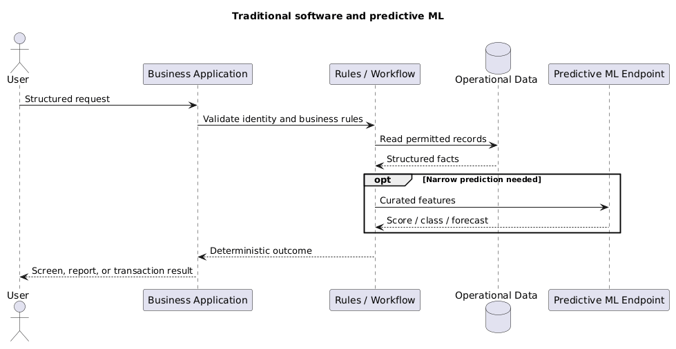
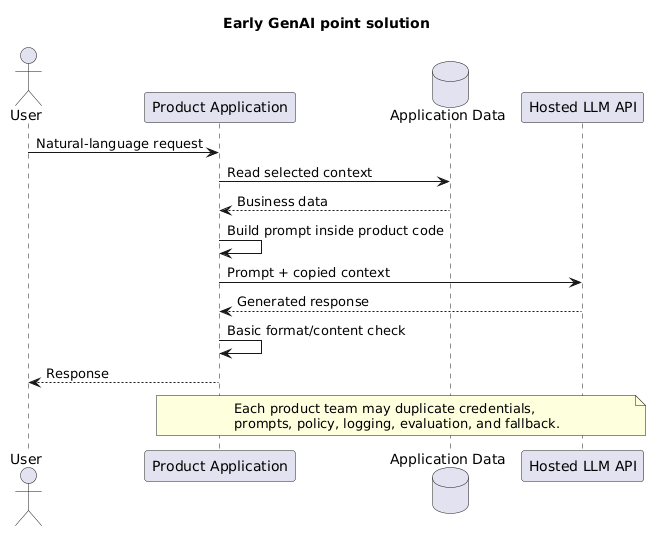
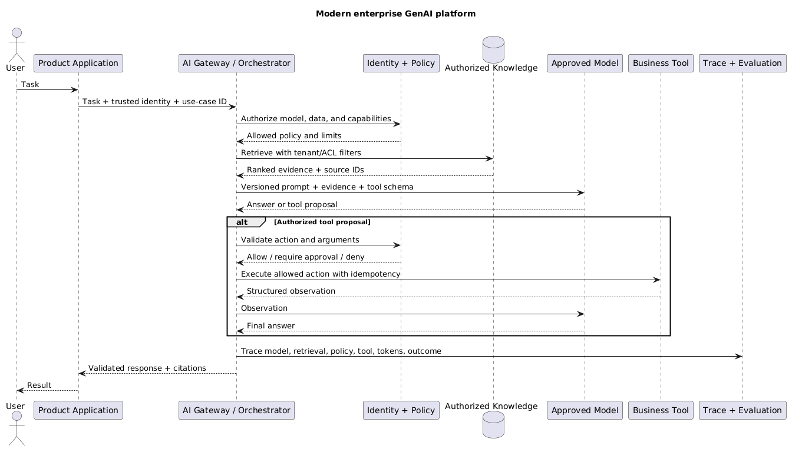

# AI Infrastructure and Evaluation

Use this page for the cloud-neutral production envelope around an AI system and the evaluation loop that proves changes are safe. AWS service mappings belong in [AWS AI services](/study/infrastructureAWSAiServices).

## 1. Production reference architecture {#section-1-architecture}

```text
user → identity → API/application → authorization → AI orchestrator
                                                    ├─ model gateway
                                                    ├─ retrieval
                                                    ├─ tools/workflows
                                                    ├─ policy/guardrails
                                                    └─ state/cache
                         ← validated response + citations + audit trace ←
```

- **Identity** proves who or what is calling.
- **Authorization** decides which model, document, tool, tenant, and operation the caller may use.
- **AI orchestrator** builds context, routes models, invokes retrieval/tools, applies policy, and records traces.
- **Model gateway** normalizes model access, quotas, timeouts, routing, fallback, and usage accounting.
- **Retrieval layer** supplies changing/private evidence and enforces document access.
- **Tool/workflow layer** performs deterministic operations and side effects.
- **Guardrails/validators** inspect requests and responses but do not replace identity, authorization, or domain rules.
- **Observability/evaluation** surrounds every component; it is not a final model-only check.

## 2. How companies set up GenAI {#section-2-company-adoption}

- These are maturity patterns, not mandatory migration stages.
- A company may use all four patterns at once for workloads with different risk and complexity.
- The important change is not merely replacing an API:
  - traditional applications keep intelligence inside code, rules, data, and narrow models;
  - early GenAI applications add a language model directly inside each product;
  - modern platforms centralize model access, retrieval, policy, evaluation, and observability;
  - agentic systems add bounded runtime tool choice where fixed workflows are insufficient.

### 2.1 Traditional software and predictive ML {#section-2-1-traditional}

- The application owns the business workflow and deterministic decisions.
- Search/databases provide facts; a narrow ML model may predict a score, class, forecast, or recommendation.
- The predictive model normally returns structured output rather than generating the user experience.
- Strengths:
  - explicit logic and permissions;
  - predictable tests and failure handling;
  - strong transaction boundaries.
- Limits:
  - natural-language interfaces and unstructured content require substantial custom code;
  - every new task needs rules, features, models, or workflow changes.

<div class="image-wrapper">
  
  <div class="diagram-caption" data-snippet-id="company-ai-traditional-snippet">
    🏢 Traditional software and predictive ML
  </div>
  <script type="text/plain" id="company-ai-traditional-snippet">
@startuml
title Traditional software and predictive ML
actor User
participant "Business Application" as App
participant "Rules / Workflow" as Rules
database "Operational Data" as Data
participant "Predictive ML Endpoint" as ML
User -> App: Structured request
App -> Rules: Validate identity and business rules
Rules -> Data: Read permitted records
Data --> Rules: Structured facts
opt Narrow prediction needed
  Rules -> ML: Curated features
  ML --> Rules: Score / class / forecast
end
Rules --> App: Deterministic outcome
App --> User: Screen, report, or transaction result
@enduml
  </script>
</div>

### 2.2 Early GenAI: direct model integration {#section-2-2-direct-llm}

- A product team calls a hosted LLM directly from its application backend.
- The application builds a prompt from user input and selected business data.
- This is useful for prototypes and one bounded use case.
- It becomes difficult at company scale because teams duplicate:
  - provider credentials and SDK integration;
  - prompt storage and model configuration;
  - safety filters and logging;
  - retrieval pipelines;
  - cost controls and evaluation;
  - fallback and model-upgrade work.
- Common failure: the prototype becomes production without proper authorization, data classification, regression tests, or ownership.

<div class="image-wrapper">
  
  <div class="diagram-caption" data-snippet-id="company-ai-direct-llm-snippet">
    🚀 Early GenAI direct model integration
  </div>
  <script type="text/plain" id="company-ai-direct-llm-snippet">
@startuml
title Early GenAI point solution
actor User
participant "Product Application" as App
database "Application Data" as Data
participant "Hosted LLM API" as LLM
User -> App: Natural-language request
App -> Data: Read selected context
Data --> App: Business data
App -> App: Build prompt inside product code
App -> LLM: Prompt + copied context
LLM --> App: Generated response
App -> App: Basic format/content check
App --> User: Response
note over App,LLM
Each product team may duplicate credentials,
prompts, policy, logging, evaluation, and fallback.
end note
@enduml
  </script>
</div>

### 2.3 Modern enterprise GenAI platform {#section-2-3-enterprise-platform}

- Product teams own the user journey, domain workflow, acceptance criteria, and business outcome.
- A shared AI platform provides reusable controls:
  - model gateway and provider adapters;
  - identity propagation and policy enforcement;
  - approved prompt/model configuration;
  - retrieval and knowledge-source connectors;
  - tool registry and execution boundaries;
  - guardrails, tracing, token/cost accounting, and evaluation services.
- Security/data teams define classification, retention, model/provider approval, and high-impact action policy.
- Domain owners remain responsible for source quality and document permissions.
- The platform should be a paved road, not a central team that must build every AI feature.
- Avoid a universal orchestrator that hides all workload differences; allow product-specific flows behind shared policy and telemetry interfaces.

<div class="image-wrapper">
  
  <div class="diagram-caption" data-snippet-id="company-ai-enterprise-platform-snippet">
    🏗️ Modern shared enterprise GenAI platform
  </div>
  <script type="text/plain" id="company-ai-enterprise-platform-snippet">
@startuml
title Modern enterprise GenAI platform
actor User
participant "Product Application" as Product
participant "AI Gateway / Orchestrator" as Platform
participant "Identity + Policy" as Policy
database "Authorized Knowledge" as Knowledge
participant "Approved Model" as Model
participant "Business Tool" as Tool
participant "Trace + Evaluation" as Observe
User -> Product: Task
Product -> Platform: Task + trusted identity + use-case ID
Platform -> Policy: Authorize model, data, and capabilities
Policy --> Platform: Allowed policy and limits
Platform -> Knowledge: Retrieve with tenant/ACL filters
Knowledge --> Platform: Ranked evidence + source IDs
Platform -> Model: Versioned prompt + evidence + tool schema
Model --> Platform: Answer or tool proposal
alt Authorized tool proposal
  Platform -> Policy: Validate action and arguments
  Policy --> Platform: Allow / require approval / deny
  Platform -> Tool: Execute allowed action with idempotency
  Tool --> Platform: Structured observation
  Platform -> Model: Observation
  Model --> Platform: Final answer
end
Platform -> Observe: Trace model, retrieval, policy, tool, tokens, outcome
Platform --> Product: Validated response + citations
Product --> User: Result
@enduml
  </script>
</div>

### 2.4 Agentic extension {#section-2-4-agentic}

- An enterprise platform does not make every request agentic.
- Add an agent only when the path or tool choice genuinely depends on runtime observations.
- Keep:
  - deterministic outer workflow and termination states;
  - allowlisted narrow tools;
  - application-side authorization and validation;
  - durable state and idempotency;
  - approval for high-impact actions;
  - step, latency, token, and cost limits.
- See the complete PlantUML sequence in [AI Agents](/study/aiAgents).

### 2.5 Practical adoption path {#section-2-5-adoption-path}

```text
bounded experiment
  → prove user value with an evaluation set
  → classify data and threat-model the flow
  → add identity, retrieval authorization, tracing, and cost limits
  → standardize repeated capabilities into a shared platform
  → add agentic tool choice only where deterministic workflows fail
```

- Centralize capabilities when several teams need the same control, not before the first use case is understood.
- Keep domain logic and source ownership close to the product/domain team.
- Measure adoption by completed business tasks, quality, risk, latency, and cost—not by number of model calls or chatbots launched.

## 3. Identity, authorization, and tenant isolation {#section-3-identity}

- Authenticate users, services, jobs, and agent/tool identities.
- Use:
  - **RBAC** for stable job-function permissions;
  - **ABAC** for tenant, region, classification, resource ownership, and request context;
  - both when role grants need resource-specific constraints.
- Authorize every boundary:
  - API operation;
  - model and capability;
  - retrieved document/chunk;
  - tool and exact resource;
  - state/memory record;
  - generated file or external message.
- Tenant isolation controls:
  - derive tenant from trusted identity, not a prompt field;
  - include tenant ownership in primary data keys and policies;
  - apply retrieval filters before context reaches the model;
  - separate indexes, keys, networks, or accounts when risk demands stronger isolation;
  - fail closed when tenant/ACL metadata is missing;
  - run cross-tenant leakage tests.
- Prompt instructions are never an authorization boundary.

## 4. Networking and service boundaries {#section-4-networking}

- Decide for every dependency whether access is:
  - public internet;
  - private service endpoint;
  - private network/peering;
  - controlled outbound proxy or egress gateway.
- Apply:
  - service-to-service authentication;
  - TLS in transit;
  - network allowlists and segmentation;
  - DNS and certificate validation;
  - explicit outbound destinations for tools and agents;
  - request/response size and timeout limits.
- Private networking reduces exposure; it does not fix excessive IAM permissions, prompt injection, or data leakage through an allowed destination.
- Treat model providers, vector stores, MCP servers, plugins, and external tools as separate trust boundaries.

## 5. Data protection and secrets {#section-5-data-protection}

- Classify data before it enters prompts, indexes, fine-tuning datasets, caches, or logs.
- For PII, secrets, regulated data, and customer content:
  - minimize collection and prompt exposure;
  - redact, tokenize, or mask where the original value is unnecessary;
  - encrypt in transit and at rest;
  - define storage location, retention, deletion, and backup behaviour;
  - record data lineage and access;
  - review provider retention/training terms.
- Keep secrets out of:
  - prompts and retrieved chunks;
  - model-visible environment descriptions;
  - client code;
  - traces and error messages;
  - long-term agent memory.
- Use short-lived credentials and workload identity where possible; rotate stored secrets.
- Store complete sensitive payloads only when required. Prefer controlled references or redacted trace views.

## 6. AI-specific security threats {#section-6-security}

- **Direct prompt injection**: user asks the model to ignore policy.
- **Indirect prompt injection**: retrieved document, email, web page, or tool result contains malicious instructions.
- **Data exfiltration**: model sends sensitive context through a permitted tool, URL, or external message.
- **Tool abuse**: valid tool call performs an unauthorized or unsafe operation.
- **Poisoning**: attacker changes source documents, memory, evaluation data, or fine-tuning data.
- **Model/supply-chain risk**: compromised model artifact, container, library, MCP server, or parser.
- **Denial of wallet/service**: large prompts, recursive agents, repeated tools, or expensive model routes consume quotas and budget.
- Controls:
  - separate trusted instructions from untrusted content;
  - least privilege and narrow tools;
  - validate destinations and arguments outside the model;
  - require approval for high-impact actions;
  - sign/version artifacts and review dependencies;
  - apply token, time, step, request, and spend limits;
  - test attacks continuously, not only before launch.

## 7. Scalability and quota management {#section-7-scalability}

- Capacity planning must include:
  - concurrent requests;
  - input/output token rate;
  - provider/model quotas;
  - retrieval and reranking load;
  - tool/database limits;
  - queue depth and worker concurrency.
- Patterns:
  - rate-limit by user, tenant, model route, and cost risk;
  - place long-running/non-interactive work on queues;
  - use backpressure instead of unlimited retries;
  - batch embedding and offline inference where supported;
  - scale stateless orchestration horizontally;
  - partition hot tenants or workloads;
  - reserve/provision capacity only when utilization and SLA justify it.
- Watch correlated bursts: one user request may fan out into many retrieval queries, model calls, and tools.

## 8. Reliability and degraded modes {#section-8-reliability}

- Set deadlines for the full request and shorter timeouts for each dependency.
- Retry only transient failures:
  - use exponential backoff with jitter;
  - respect provider retry guidance;
  - bound attempts and remaining deadline;
  - never blindly retry non-idempotent side effects.
- Use circuit breakers to stop repeated calls to a failing dependency.
- Use idempotency keys and durable state for tool calls and asynchronous jobs.
- Test fallback semantics:
  - alternate model may lack tools, modalities, context, or schema support;
  - stale cache may be acceptable for one workload and unsafe for another;
  - “search only”, queued completion, or human escalation may be safer than a weaker answer.
- Design explicit degraded modes and tell the user when quality or freshness is reduced.

## 9. Latency engineering {#section-9-latency}

```text
total latency = network + identity + retrieval + reranking + context build
              + model input processing + model output generation + tools
```

- Measure p50, p95, and p99 for every component and end-to-end task.
- Optimize the actual bottleneck:
  - reduce network hops or use regional/private paths;
  - cache query-independent embeddings and stable results;
  - tune ANN candidate count and reranking depth;
  - remove duplicated/irrelevant context;
  - route simple tasks to smaller models;
  - parallelize only independent safe reads;
  - stream output for faster perceived response;
  - move long tasks to asynchronous jobs.
- Streaming improves time to first visible token but does not reduce total compute or make output safe before validation.
- Output tokens are sequential and often dominate generation latency; cap verbosity when the task allows it.

## 10. Cost engineering {#section-10-cost}

- Include:
  - model input/output and reasoning tokens;
  - embeddings and reranking;
  - tool/API calls;
  - retries and agent loops;
  - storage, indexing, logs, and data transfer;
  - provisioned/idle accelerator or endpoint capacity;
  - human review and incident cost.
- Levers:
  - model routing and cascades;
  - shorter prompts and retrieved context;
  - output caps;
  - semantic/result/prefix caching where safe;
  - batch and asynchronous processing;
  - retrieval before expensive reasoning;
  - early termination for invalid or unauthorized requests.
- Measure **cost per successful task**, not only cost per request or token.
- Segment by tenant and task so a small expensive cohort is visible.

## 11. Observability {#section-11-observability}

- Give each request one trace ID across:
  - identity and authorization decisions;
  - prompt/template and model version;
  - token counts and decoding configuration;
  - retrieved candidates, filters, scores, and citations;
  - reranker and routing decisions;
  - tool proposals, approvals, execution, and results;
  - retries, errors, latency, and cost;
  - user feedback and final outcome.
- Log metadata by default; store sensitive prompt/response payloads only with explicit access and retention controls.
- Operational signals:
  - error, timeout, throttle, and refusal rates;
  - p50/p95/p99 latency;
  - queue age and saturation;
  - quota headroom;
  - tool success and invalid arguments;
  - cost per completed task;
  - retrieval and groundedness indicators.
- A trace should make it possible to answer: which user, model, prompt, documents, tools, policy decisions, and configuration produced this outcome?

## 12. Evaluation architecture {#section-12-evaluation}

```text
change: prompt / model / parser / chunking / index / tool / policy
                                  ↓
versioned evaluation suite → compare baseline and slices → deploy or reject
                                  ↓
                      canary + production feedback
```

- Evaluation levels:
  - **component**: parser, retriever, reranker, classifier, schema validator, tool;
  - **end-to-end**: final answer or completed task;
  - **security/safety**: authorization, leakage, injection, refusal, harmful action;
  - **operational**: latency, throughput, quota, reliability, and cost.
- Build datasets from:
  - real anonymized tasks;
  - domain-expert examples;
  - known incidents and regressions;
  - difficult edge cases and adversarial inputs;
  - no-answer and permission-denied cases.
- Version:
  - dataset and rubric;
  - prompt/template;
  - model ID and parameters;
  - parser/chunk/index configuration;
  - tool schemas and software version.

## 13. Retrieval and generation metrics {#section-13-metrics}

- Retrieval metrics:
  - **Recall@K**: relevant evidence was available in the first `K` results;
  - **Precision@K**: returned evidence was relevant;
  - **MRR**: first relevant result appeared early;
  - **NDCG**: graded relevance was ordered well.
- Generation metrics:
  - correctness;
  - relevance;
  - completeness;
  - faithfulness/groundedness to supplied evidence;
  - citation entailment and source validity;
  - refusal and uncertainty behaviour;
  - schema and domain validity.
- Agent/tool metrics:
  - task completion;
  - correct tool and argument selection;
  - step count and loop termination;
  - side-effect correctness;
  - approval/escalation behaviour.
- Keep component metrics separate:
  - good final wording can hide poor retrieval;
  - high Recall@K can still produce an ungrounded answer;
  - schema validity can hide wrong values.

## 14. LLM-as-judge and human evaluation {#section-14-judging}

- LLM judges are useful for scalable rubric-based scoring and pairwise comparison.
- Risks:
  - preference for verbosity or style;
  - position/order bias;
  - self/model-family agreement bias;
  - weak domain understanding;
  - sensitivity to rubric wording;
  - non-deterministic scores.
- Controls:
  - define observable rubric levels;
  - blind model identity and randomize answer order;
  - include calibrated examples;
  - compare multiple judges or deterministic checks;
  - measure agreement with expert humans;
  - manually review disagreements and high-impact failures.
- Human evaluation:
  - use domain experts for ambiguous or safety-sensitive tasks;
  - sample routine traffic;
  - provide consistent grading guidance;
  - track inter-rater agreement;
  - turn confirmed failures into regression cases.

## 15. Production evaluation and release gates {#section-15-production-eval}

- Production outcomes:
  - task completion;
  - user correction and re-query;
  - abandonment and escalation;
  - citation usage;
  - tool success;
  - refusal override;
  - incident rate;
  - latency and cost per successful task.
- Segment by task, tenant, language, document type, risk, model route, and difficulty.
- Release process:
  - run offline regression suite;
  - reject security regressions regardless of average quality;
  - compare quality, latency, and cost against baseline;
  - canary or shadow on representative traffic;
  - monitor slices and rollback criteria;
  - promote only after evidence supports the change.
- Every production incident should create:
  - a root-cause category;
  - a reproducible test case;
  - a control or recovery improvement;
  - an observable alert where possible.

Continue with [AI knowledge bases](/study/aiKnowledgebases) for retrieval tuning, [AI agents](/study/aiAgents) for autonomous tool use, or [AWS AI services](/study/infrastructureAWSAiServices) for AWS mappings.
