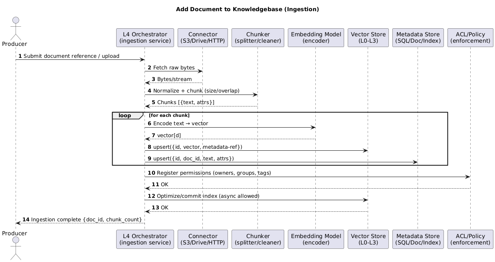
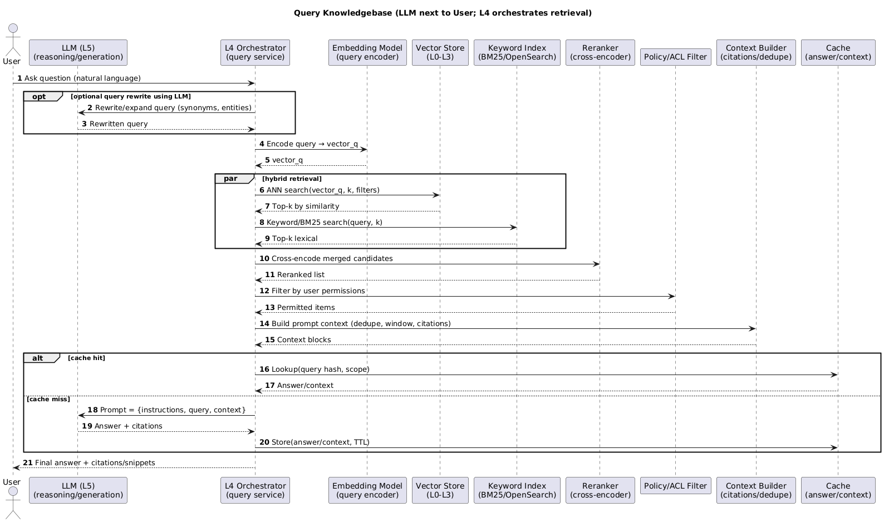

# Modern Knowledgebases

A few weeks ago, I migrated a dataset of around 30 million rows from **MySQL** to **Parquet + DuckDB**.  
The query time dropped from nearly a minute to just a few seconds.  
That shift changed how I thought about data: sometimes, the biggest gains come not from more compute,  
but from **how data is organized and read**.

That realization made me curious — if columnar databases redefined analytics,  
what’s the equivalent shift happening in **knowledge systems**?

Over the past year, I’ve been exploring how new systems—**vector databases**, **embedding models**, and **retrieval frameworks**—are quietly rebuilding the foundation of how machines represent and reason over information.  
This post is my attempt to organize that understanding.

---

## 1. The Architecture of Modern Knowledgebases

At a high level, every modern “AI knowledgebase” sits on a stack of layers.  
Each one has a distinct responsibility—from raw storage to semantic reasoning.

<table class="study-table">
  <thead>
    <tr>
      <th>Layer</th>
      <th>Responsibility</th>
      <th>Focus Area</th>
      <th>Analogy</th>
    </tr>
  </thead>
  <tbody>
    <tr>
      <td><strong>L0 – Physical Storage</strong></td>
      <td>Where the bytes actually live: disk, SSD, S3, or block storage.</td>
      <td>Durability, throughput, cost.</td>
      <td>The warehouse floor — where everything physically sits.</td>
    </tr>
    <tr>
      <td><strong>L1 – Data Layout</strong></td>
      <td>How vectors and metadata are serialized or chunked on disk.</td>
      <td>Data formats, compression, compaction.</td>
      <td>The shelving system — how boxes are arranged.</td>
    </tr>
    <tr>
      <td><strong>L2 – Indexing & Retrieval</strong></td>
      <td>How we find similar vectors quickly, without scanning everything.</td>
      <td>ANN algorithms like HNSW, IVF, PQ, DiskANN.</td>
      <td>The map of aisles — guiding you to the right shelf.</td>
    </tr>
    <tr>
      <td><strong>L3 – Search & API Layer</strong></td>
      <td>The database interface: how you insert, query, and filter.</td>
      <td>Schema design, access control, hybrid filters.</td>
      <td>The reception desk — turns requests into lookups.</td>
    </tr>
    <tr>
      <td><strong>L4 – Integration / Retrieval Orchestration</strong></td>
      <td>Coordinates ingestion, embeddings, hybrid search, and reranking.</td>
      <td>Connectors, embedding pipelines, rerankers, query rewriting.</td>
      <td>The librarian — knows where to look and stacks the right boxes for you.</td>
    </tr>
    <tr>
      <td><strong>L5 – Reasoning / Generation</strong></td>
      <td>The layer that actually “thinks.” Uses context from L4 and responds in language.</td>
      <td>Prompting, planning, grounding, LLM reasoning.</td>
      <td>The subject-matter expert — reads the boxes and explains.</td>
    </tr>
  </tbody>
</table>

Notes:
1. **Vector stores (L0–L3)** handle how knowledge is stored, indexed, and retrieved efficiently.  
2. **Integration layers (L4)** orchestrate embeddings, rerankers, and retrieval pipelines.  
3. **Reasoning layers (L5)** use that context to generate insights, answers, or summaries.  
4. **Weaviate** extends into L4; **Kendra** is a managed retrieval system; **LangChain** and **LlamaIndex** span both retrieval and reasoning.  
5. Together, these layers define the architecture of a **modern AI knowledgebase** — a system that doesn’t just *store* information, but can *understand and communicate* it.

---

## 2. Vectors and Meaning

At the heart of this new architecture is the **vector** — a numerical representation of meaning.

For example:

```
"The cat sits on the mat" → [0.12, -0.45, 0.88, ...] # 1536-dimensional embedding
```


A vector is just a long list of floating-point numbers, but its geometry captures relationships:  
sentences or images that “mean” similar things are close together in this high-dimensional space.  
Different models produce different kinds of embeddings, depending on what they were trained for.

<table class="study-table">
  <thead>
    <tr>
      <th>Model</th>
      <th>Training Focus</th>
      <th>Strengths</th>
    </tr>
  </thead>
  <tbody>
    <tr>
      <td><strong>OpenAI text-embedding-3-large</strong></td>
      <td>General-purpose text</td>
      <td>Broad coverage and strong multilingual performance.</td>
    </tr>
    <tr>
      <td><strong>AWS Titan Embeddings G1</strong></td>
      <td>Enterprise documents</td>
      <td>Handles structured, factual content effectively.</td>
    </tr>
    <tr>
      <td><strong>Cohere Embed v3</strong></td>
      <td>Multi-domain semantic search</td>
      <td>Tunable for classification and retrieval tasks.</td>
    </tr>
    <tr>
      <td><strong>CLIP (OpenAI)</strong></td>
      <td>Image ↔ text alignment</td>
      <td>Bridges visual and language representations.</td>
    </tr>
    <tr>
      <td><strong>E5 (Microsoft)</strong></td>
      <td>Sentence-level retrieval</td>
      <td>Optimized for semantic search and ranking.</td>
    </tr>
    <tr>
      <td><strong>Instructor XL</strong></td>
      <td>Task-specific embeddings</td>
      <td>Performs well in RAG and domain-tuned workflows.</td>
    </tr>
  </tbody>
</table>


Understanding embeddings is the first step.  
But storing and searching through millions of them efficiently is what brought about **vector databases**.

---

## 3. Vector Databases: How They Differ

Not all vector stores are built the same way.  
Some focus on scalability, others on analytics or simplicity.  
Each can be understood through the same layered lens used above.

<table class="study-table">
  <thead>
    <tr>
      <th>System</th>
      <th>Implements</th>
      <th>Indexing (L2)</th>
      <th>Storage Layout (L1)</th>
      <th>Physical Storage (L0)</th>
      <th>Summary</th>
    </tr>
  </thead>
  <tbody>
    <tr>
      <td><strong>Weaviate</strong></td>
      <td>L3–L0 (+ optional L4 modules)</td>
      <td>HNSW / DiskANN</td>
      <td>Custom KV schema</td>
      <td>Disk + S3 backup</td>
      <td>A full-featured vector database with built-in hybrid search and RAG extensions.</td>
    </tr>
    <tr>
      <td><strong>LanceDB</strong></td>
      <td>L3–L0</td>
      <td>IVF_FLAT / PQ (Arrow-native)</td>
      <td>Apache Arrow / Lance</td>
      <td>Local / S3</td>
      <td>Columnar and analytics-friendly, ideal for local or hybrid workloads.</td>
    </tr>
    <tr>
      <td><strong>ChromaDB</strong></td>
      <td>L3–L0</td>
      <td>FAISS / HNSW</td>
      <td>DuckDB / SQLite</td>
      <td>Local</td>
      <td>Lightweight and Python-first — great for experimentation and rapid prototyping.</td>
    </tr>
    <tr>
      <td><strong>S3 Vector Bucket</strong></td>
      <td>L3–L0 (managed)</td>
      <td>AWS-managed ANN</td>
      <td>Proprietary format</td>
      <td>S3</td>
      <td>Serverless and fully managed; indexing and scaling handled by AWS.</td>
    </tr>
    <tr>
      <td><strong>OpenSearch (KNN Plugin)</strong></td>
      <td>L3–L0 (Lucene-based)</td>
      <td>HNSW / IVF / PQ</td>
      <td>Lucene segments</td>
      <td>Disk / EBS</td>
      <td>Text-first search engine with added vector retrieval capabilities.</td>
    </tr>
  </tbody>
</table>


Common indexing methods:
- **HNSW** – graph-based, high recall with good latency.  
- **DiskANN** – optimized for billion-scale datasets on disk.  
- **IVF_FLAT / IVF_PQ** – cluster-based approaches balancing memory and speed.  
- **FAISS** – a foundational library for many open-source vector stores.  
- **AWS-managed ANN** – a proprietary, abstracted approach used in serverless systems.

---

## 4. From Storage to Understanding

Once the data is stored and indexed, the next challenge is orchestration — how to retrieve and reason over it.

<table class="study-table">
  <thead>
    <tr>
      <th>System</th>
      <th>L0</th>
      <th>L1</th>
      <th>L2</th>
      <th>L3</th>
      <th>L4</th>
      <th>L5</th>
      <th>Notes</th>
    </tr>
  </thead>
  <tbody>
    <tr>
      <td><strong>Weaviate</strong></td>
      <td>✅</td>
      <td>✅</td>
      <td>✅</td>
      <td>✅</td>
      <td>✅ (auto-embed, hybrid, rerank, “generative” plugins)</td>
      <td>❌</td>
      <td>Has optional L4 modules but relies on external LLMs for reasoning.</td>
    </tr>
    <tr>
      <td><strong>Pinecone</strong></td>
      <td>✅</td>
      <td>✅</td>
      <td>✅</td>
      <td>✅</td>
      <td>❌</td>
      <td>❌</td>
      <td>Pure vector database; bring your own orchestration and reasoning layers.</td>
    </tr>
    <tr>
      <td><strong>LanceDB</strong></td>
      <td>✅</td>
      <td>✅</td>
      <td>✅</td>
      <td>✅</td>
      <td>Minimal</td>
      <td>❌</td>
      <td>Focused on analytics; orchestration handled externally.</td>
    </tr>
    <tr>
      <td><strong>ChromaDB</strong></td>
      <td>✅</td>
      <td>✅</td>
      <td>✅</td>
      <td>✅</td>
      <td>Light</td>
      <td>❌</td>
      <td>Great for quick RAG prototypes via LangChain or LlamaIndex.</td>
    </tr>
    <tr>
      <td><strong>OpenSearch (KNN)</strong></td>
      <td>✅</td>
      <td>✅</td>
      <td>✅</td>
      <td>✅</td>
      <td>Hybrid keyword + vector</td>
      <td>❌</td>
      <td>Adds ANN to a text-based search engine.</td>
    </tr>
    <tr>
      <td><strong>Amazon Kendra</strong></td>
      <td>Managed</td>
      <td>Managed</td>
      <td>Managed</td>
      <td>Managed</td>
      <td>✅</td>
      <td>❌*</td>
      <td>A managed retrieval system; for generation, pair with Bedrock or another LLM.</td>
    </tr>
    <tr>
      <td><strong>LangChain</strong></td>
      <td>❌</td>
      <td>❌</td>
      <td>❌</td>
      <td>❌</td>
      <td>✅</td>
      <td>✅</td>
      <td>Framework that orchestrates retrieval (L4) and reasoning (L5) across data sources.</td>
    </tr>
    <tr>
      <td><strong>LlamaIndex</strong></td>
      <td>❌</td>
      <td>❌</td>
      <td>❌</td>
      <td>❌</td>
      <td>✅</td>
      <td>✅</td>
      <td>Similar to LangChain; adds graph-based indexing and composability.</td>
    </tr>
    <tr>
      <td><strong>Bedrock / OpenAI / Claude / Gemini</strong></td>
      <td>❌</td>
      <td>❌</td>
      <td>❌</td>
      <td>❌</td>
      <td>❌</td>
      <td>✅</td>
      <td>Pure reasoning layer — uses retrieved context to generate answers.</td>
    </tr>
  </tbody>
</table>

“Managed” means the internal indexing and storage details are not visible to the user.

---

## 5. E2E Flow


### Ingestion Pipeline
- Vector Store (L0–L3) handles the upserts and index commits.
- L4 performs connectors, chunking, embedding, and ACL registration.
- Metadata goes to a metadata store for filters, facets, and citations.

<div class="image-wrapper">
  
  <div class="diagram-caption" data-snippet-id="kb-ingestion-snippet">
    🖼️ KB - Ingestion Pipeline Example 
  </div>
    <!-- Keep your PlantUML raw here -->
  <script type="text/plain" id="kb-ingestion-snippet">
@startuml
title Add Document to Knowledgebase (Ingestion)

autonumber
actor Producer as U
participant "L4 Orchestrator\n(ingestion service)" as L4
participant "Connector\n(S3/Drive/HTTP)" as Conn
participant "Chunker\n(splitter/cleaner)" as Chunker
participant "Embedding Model\n(encoder)" as Embed
participant "Vector Store\n(L0–L3)" as VS
participant "Metadata Store\n(SQL/Doc/Index)" as Meta
participant "ACL/Policy\n(enforcement)" as ACL

U -> L4: Submit document reference / upload
L4 -> Conn: Fetch raw bytes
Conn --> L4: Bytes/stream

L4 -> Chunker: Normalize + chunk (size/overlap)
Chunker --> L4: Chunks [{text, attrs}]

loop for each chunk
  L4 -> Embed: Encode text → vector
  Embed --> L4: vector[d]
  L4 -> VS: upsert({id, vector, metadata-ref})
  L4 -> Meta: upsert({id, doc_id, text, attrs})
end

L4 -> ACL: Register permissions (owners, groups, tags)
ACL --> L4: OK

L4 -> VS: Optimize/commit index (async allowed)
VS --> L4: OK

L4 --> U: Ingestion complete {doc_id, chunk_count}
@enduml

  </script>
</div>


### Query the knowledgebase (retrieval orchestration + LLM)

In this sequence, the LLM (L5) is drawn directly beside the User because it’s the layer the user interacts with — the conversational or reasoning interface.

Conceptually, however, L5 depends on L4: the orchestrator (L4) handles retrieval, embeddings, reranking, filtering, and context assembly before the LLM can reason over it.

In other words, L4 prepares the knowledge, and L5 expresses it.
The Vector Store (L0–L3) remains purely a retrieval substrate — it stores, indexes, and returns vectors, but performs no reasoning or synthesis.

<div class="image-wrapper">
  
  <div class="diagram-caption" data-snippet-id="kb-query-snippet">
    🖼️ KB - Query Pipeline Example 
  </div>
    <!-- Keep your PlantUML raw here -->
  <script type="text/plain" id="kb-query-snippet">
@startuml
title Query Knowledgebase (LLM next to User; L4 orchestrates retrieval)

autonumber
actor User as U
participant "LLM (L5)\n(reasoning/generation)" as LLM
participant "L4 Orchestrator\n(query service)" as L4
participant "Embedding Model\n(query encoder)" as EmbedQ
participant "Vector Store\n(L0–L3)" as VS
participant "Keyword Index\n(BM25/OpenSearch)" as KW
participant "Reranker\n(cross-encoder)" as Rerank
participant "Policy/ACL Filter" as ACL
participant "Context Builder\n(citations/dedupe)" as Ctx
participant "Cache\n(answer/context)" as Cache

U -> L4: Ask question (natural language)

opt optional query rewrite using LLM
  L4 -> LLM: Rewrite/expand query (synonyms, entities)
  LLM --> L4: Rewritten query
end

L4 -> EmbedQ: Encode query → vector_q
EmbedQ --> L4: vector_q

par hybrid retrieval
  L4 -> VS: ANN search(vector_q, k, filters)
  VS --> L4: Top-k by similarity
  L4 -> KW: Keyword/BM25 search(query, k)
  KW --> L4: Top-k lexical
end

L4 -> Rerank: Cross-encode merged candidates
Rerank --> L4: Reranked list

L4 -> ACL: Filter by user permissions
ACL --> L4: Permitted items

L4 -> Ctx: Build prompt context (dedupe, window, citations)
Ctx --> L4: Context blocks

alt cache hit
  L4 -> Cache: Lookup(query hash, scope)
  Cache --> L4: Answer/context
else cache miss
  L4 -> LLM: Prompt = {instructions, query, context}
  LLM --> L4: Answer + citations
  L4 -> Cache: Store(answer/context, TTL)
end

L4 --> U: Final answer + citations/snippets
@enduml


  </script>
</div>