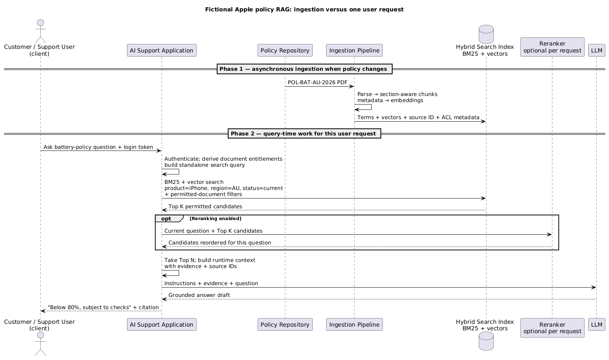

# AI Knowledge Bases and Retrieval

Use this page to understand retrieval-augmented generation (RAG): how external knowledge is ingested, found, authorized, ranked, supplied to a model, and evaluated.

## 1. Why RAG exists {#section-1-why-rag}

- Model weights are difficult to update, cannot provide reliable source provenance, and should not contain every tenant's private data.
- RAG keeps changing or private facts in external stores and retrieves evidence at request time.
- The split is deliberate:
  - **retrieval** decides which evidence is available;
  - **generation** uses that evidence to form an answer;
  - **authorization** decides which evidence the caller may access.
- RAG improves freshness and traceability, but does not guarantee correctness:
  - the right evidence may not be retrieved;
  - unauthorized evidence may be exposed by a broken filter;
  - the model may ignore or misinterpret correct evidence.

### 1.1 Running example: fictional Apple battery policy {#section-1-1-example}

- Assume the base model does not reliably know Apple's current private support policy.
- The fictional source document is:

~~~text
Document: POL-BAT-AU-2026
Section:  Battery service eligibility
Text:     An iPhone battery qualifies for service when tested capacity is
          below 80%, subject to diagnostic and coverage checks.
Metadata: product=iPhone, region=AU, status=current
~~~

- The user asks:

~~~text
"When does an iPhone battery qualify for service
under today's Australian support policy?"
~~~

- RAG should retrieve that permitted policy section and supply it to the model; it does not retrain or modify the model's weights.
- All Apple policy details and identifiers on this page are fictional and exist only to explain retrieval.
- Keep two lifecycles separate:
  - **ingestion** runs asynchronously when documents are added or changed;
  - **query/answering** runs for each user request.
- A reranker is an optional per-request query step:
  - first-stage search cheaply retrieves a small candidate set from the index;
  - the reranker compares the current question with those candidates and reorders them;
  - it does not normally process the whole corpus or run during ingestion.

```text
INGESTION: documents → parse → chunk → enrich → embed/index → searchable corpus
QUERY:     question → process → retrieve → authorize → fuse → rerank
                                                       ↓
             cited answer ← LLM ← context assembly ← permitted evidence
```

<div class="image-wrapper">
  
  <div class="diagram-caption" data-snippet-id="rag-architecture-snippet">
    🍎 Two RAG lifecycles: ingest documents, then answer each client request
  </div>
  <script type="text/plain" id="rag-architecture-snippet">
@startuml
title Fictional Apple policy RAG: ingestion versus one user request
actor "Customer / Support User\n(client)" as User
participant "AI Support Application" as App
participant "Policy Repository" as Docs
participant "Ingestion Pipeline" as Ingest
database "Hybrid Search Index\nBM25 + vectors" as Index
participant "Reranker\noptional per request" as Reranker
participant LLM

== Phase 1 — asynchronous ingestion when policy changes ==
Docs -> Ingest: POL-BAT-AU-2026 PDF
Ingest -> Ingest: Parse → section-aware chunks\nmetadata → embeddings
Ingest -> Index: Terms + vectors + source ID + ACL metadata

== Phase 2 — query-time work for this user request ==
User -> App: Ask battery-policy question + login token
App -> App: Authenticate; derive document entitlements\nbuild standalone search query
App -> Index: BM25 + vector search\nproduct=iPhone, region=AU, status=current\n+ permitted-document filters
Index --> App: Top K permitted candidates

opt Reranking enabled
  App -> Reranker: Current question + Top K candidates
  Reranker --> App: Candidates reordered for this question
end

App -> App: Take Top N; build runtime context\nwith evidence + source IDs
App -> LLM: Instructions + evidence + question
LLM --> App: Grounded answer draft
App --> User: "Below 80%, subject to checks" + citation
@enduml
  </script>
</div>

## 2. Parsing: preserve meaning before retrieval {#section-2-parsing}

- Parsing converts source formats into a canonical document representation.
- Preserve:
  - title, headings, paragraphs, lists, and reading order;
  - page/slide/sheet numbers and source URI;
  - table rows, columns, headers, units, and footnotes;
  - image captions and OCR coordinates where useful;
  - document version, timestamp, language, owner, tenant, and ACL metadata.
- Format-specific risks:
  - **PDF**: visual order may differ from extracted order; headers and footers can repeat in every chunk.
  - **HTML**: navigation, cookie banners, and hidden text can dominate useful content.
  - **Markdown/code**: heading hierarchy, code fences, symbols, and file paths carry meaning.
  - **Tables**: flattening cells can detach values from their row and column headers.
  - **Scans/images**: OCR can corrupt identifiers, decimals, and punctuation.
- Practical controls:
  - keep the original document and parser version;
  - test representative difficult files, not only clean prose;
  - reject or quarantine low-confidence extraction;
  - render and compare parsed output during ingestion QA.
- Apple example: if a PDF table separates **iPhone**, **AU**, **below 80%**, and its effective date into different columns, flattening it incorrectly can detach the threshold from its product, Region, or policy version.
- Failure principle: embeddings cannot recover structure or text discarded by the parser.

## 3. Chunking: choose the retrieval unit {#section-3-chunking}

- **Fixed-size chunks**:
  - simple and predictable;
  - can split headings, procedures, code, and tables.
- **Overlap**:
  - preserves concepts crossing a boundary;
  - increases index size, duplicate retrieval, and prompt cost.
- **Paragraph/sentence chunks**:
  - preserve natural prose boundaries;
  - vary widely in length and can separate a heading from its content.
- **Section-aware chunks**:
  - retain heading path and document structure;
  - depend on reliable parsing and fallback logic.
- **Semantic chunks**:
  - detect topic changes dynamically;
  - add compute and can create unstable boundaries across parser/model changes.
- **Parent-child retrieval**:
  - retrieve a small child for precision;
  - expand to a larger parent for context;
  - requires stable IDs, deduplication, and careful token budgets.
- **Hierarchical retrieval**:
  - first select document/section, then passage;
  - useful for large corpora but can lose recall at either stage.

Tune together:

- chunk size and overlap;
- headings and surrounding context included in embeddings;
- child retrieval `K` and parent expansion;
- duplicate rate;
- Recall@K and NDCG;
- answer quality and prompt tokens.

There is no universal chunk size. A useful size is the smallest unit that is independently retrievable while still containing enough evidence to answer.

Apple example:

~~~text
Poor fixed split:
  chunk A: "An iPhone battery qualifies when tested capacity is below"
  chunk B: "80%, subject to diagnostic and coverage checks."

Better section-aware chunk:
  heading: "Battery service eligibility"
  text:    "An iPhone battery qualifies when tested capacity is below 80%,
            subject to diagnostic and coverage checks."
~~~

## 4. Embeddings and semantic search {#section-4-embeddings}

- An embedding model maps text into a fixed-length vector where task-related meanings are expected to be near one another.
- In retrieval:
  - documents are embedded during ingestion;
  - the query is embedded at request time;
  - the vector index finds nearby document vectors.
- Similarity functions:
  - **cosine similarity** compares vector direction;
  - **dot product** compares alignment and magnitude;
  - **Euclidean distance** measures geometric distance.
- Use the metric, normalization, dimensions, and query/document prefixes expected by the embedding model.
- Query and document vectors must be compatible; changing the embedding model normally requires re-embedding and rebuilding the index.

Semantic search is strong when vocabulary differs:

~~~text
query:    "When will Apple service a worn-out phone battery?"
document: "An iPhone battery qualifies when tested capacity is below 80%."
~~~

Semantic search can fail on:

- exact identifiers: **POL-BAT-AU-2026**;
- error strings: `InvalidInstanceID.NotFound`;
- short ambiguous queries;
- acronyms and uncommon product names;
- numbers, dates, negation, and small wording differences with large operational meaning;
- domains not represented by the embedding model;
- chunks containing several unrelated topics.

## 5. Lexical and hybrid search {#section-5-hybrid}

- Lexical search uses an inverted index from terms to documents.
- **TF-IDF** mental model: a term matters when it is frequent in one document but rare across the corpus.
- **BM25** improves this with:
  - diminishing returns for repeated terms;
  - document-length normalization;
  - tunable term-frequency and length effects.
- Lexical search is strong for identifiers, acronyms, names, quoted phrases, and exact error text.
- It is weaker when query and document use different vocabulary.

Using the same Apple corpus:

~~~text
semantic: "When will Apple service a worn-out battery?"
          → finds the eligibility wording despite different vocabulary

lexical:  "POL-BAT-AU-2026"
          → finds the exact policy identifier

hybrid:   "POL-BAT-AU-2026 iPhone battery threshold"
          → combines the exact identifier with semantic meaning
~~~

Hybrid retrieval combines complementary signals:

```text
BM25 candidates ──────────┐
                          ├─ normalize/fuse ranks → candidate set → rerank
vector/ANN candidates ────┘
```

- **Weighted score fusion**:
  - normalizes lexical and vector scores, then applies weights;
  - offers direct control but is sensitive to score distributions.
- **Reciprocal Rank Fusion (RRF)**:
  - combines result positions instead of raw scores;
  - is robust when score scales are incompatible;
  - still needs its constant and candidate depth evaluated.
- Hybrid search usually helps mixed enterprise corpora, but can hurt if noisy semantic results displace exact matches.
- Evaluate by query class; identifiers may need a lexical boost while natural-language questions may benefit from vector weight.

## 6. Vector indexes: recall, latency, and memory {#section-6-ann}

- Exact nearest-neighbour search compares the query with every vector and becomes expensive at scale.
- Approximate nearest-neighbour (ANN) indexes trade some recall for speed.
- **HNSW**:
  - builds a navigable multi-layer graph;
  - higher construction/search effort generally improves recall at memory, ingestion, and latency cost;
  - filter selectivity and deletions can affect behaviour.
- **IVF**:
  - clusters vectors into partitions;
  - searches selected partitions only;
  - more probes improve recall while increasing work.
- **Quantization**:
  - compresses vectors to reduce memory and improve throughput;
  - introduces approximation error.
- Tune:
  - candidate `K`;
  - search effort/probes;
  - index construction parameters;
  - replicas and memory;
  - pre-filter versus post-filter behaviour;
  - refresh, deletion, and compaction.
- Measure ANN recall against exact search or a high-quality reference set; low latency alone says nothing about relevance.

## 7. Query processing {#section-7-query-processing}

- **Conversation rewriting**: converts “what about Australia?” into “What is the current iPhone battery-service threshold in Australia?”
- **Expansion**: adds useful variants such as **battery service**, **battery replacement**, and **capacity threshold**.
- **Decomposition**: splits “Am I eligible and what is Repair #123's status?” into a policy retrieval query and a live repair-status API call.
- **Multi-query retrieval**: searches several reformulations, increasing recall and cost.
- **HyDE**: generates a hypothetical answer/document and embeds it:
  - can bridge vocabulary mismatch;
  - can also anchor retrieval on invented assumptions.
- **Routing**: sends queries to the correct corpus, index, SQL source, graph, API, or search method.
- Controls:
  - preserve the original query for exact matching and audit;
  - cap expansions and subqueries;
  - trace every rewritten query;
  - evaluate rewriting separately from retrieval.

## 8. Metadata filtering and authorization {#section-8-authorization}

- Useful metadata includes:
  - tenant and organisation;
  - user/group ACLs;
  - region and jurisdiction;
  - document type and owner;
  - security classification;
  - effective date, expiry, and version;
  - language and product.
- **Relevance filtering** narrows results to improve quality or speed.
- **Authorization** enforces whether the caller may access a document.
- They are different concerns even when both use metadata.
- Apple example:
  - **product=iPhone**, **region=AU**, and **status=current** improve relevance;
  - the caller's trusted policy/document entitlement determines authorization;
  - matching the right Region does not prove that the caller may read the document.
- Security requirements:
  - derive identity and entitlements from trusted systems, not prompt text;
  - enforce access before evidence reaches the model;
  - fail closed when ACL metadata is absent or stale;
  - re-evaluate access when documents or group memberships change;
  - test tenant leakage and ACL revocation explicitly;
  - authorize source-document and tool access, not only the final answer.

## 9. Reranking and context assembly {#section-9-reranking}

```text
query → retrieve 100 cheaply → rerank permitted candidates → take 5–10
      → deduplicate/assemble context → LLM → cited answer
```

- **Bi-encoder retrieval**:
  - encodes query and documents separately;
  - supports fast broad retrieval;
  - loses fine-grained query/document interaction.
- **Cross-encoder reranking**:
  - reads the query and each candidate together;
  - often improves top-result precision;
  - adds latency proportional to candidate count.
- **LLM reranking**:
  - supports complex relevance rubrics;
  - costs more and may be less stable;
  - should return traceable scores/reasons, not rewrite evidence.
- Reranking cannot recover a document absent from first-stage retrieval.
- Apple example:

~~~text
Before reranking:
1. Mac battery calibration guide
2. Expired iPhone battery policy for another Region
3. Current AU iPhone battery eligibility policy

After reranking for the complete question:
1. Current AU iPhone battery eligibility policy
~~~

- Context assembly should:
  - remove duplicate/overlapping chunks;
  - retain source boundaries, version, and citation IDs;
  - group child chunks with needed parent context;
  - order evidence deliberately;
  - resolve or expose conflicting sources;
  - cap tokens and prefer high-value evidence;
  - instruct the model to report insufficient evidence.

## 10. Diagnose retrieval and generation separately {#section-10-diagnosis}

- **Retrieval failure**:
  - relevant content was parsed incorrectly;
  - wrong chunks were indexed;
  - query rewrite lost meaning;
  - filters removed the correct document;
  - ANN or fusion ranked it below `K`;
  - reranking promoted the wrong candidate.
- **Generation failure**:
  - correct evidence was in context;
  - the model ignored, contradicted, overgeneralized, or mis-cited it.
- Apple diagnosis:
  - retrieving a Mac policy or an expired non-AU policy is a **retrieval failure**;
  - supplying the correct fictional **below 80%** evidence but answering **below 70%** is a **generation failure**.
- Debug order:
  - inspect parsed source and chunk;
  - inspect original and rewritten queries;
  - inspect candidates, scores, filters, and authorization decisions;
  - inspect reranked context sent to the model;
  - only then change the prompt or generation model.

## 11. Retrieval evaluation {#section-11-evaluation}

- Build a golden set with:
  - realistic query;
  - caller/tenant identity;
  - relevant and permitted documents;
  - graded relevance labels;
  - expected citations;
  - exact-match, stale, ambiguous, and no-answer cases.
- Apple golden example:
  - query: the Australian iPhone battery-eligibility question;
  - expected source: **POL-BAT-AU-2026**, eligibility section;
  - expected retrieval: current AU policy ranked in the first K;
  - expected answer evidence: **below 80%**, including its conditions and citation.
- Metrics:
  - **Recall@K**: fraction of relevant items found in the first `K` results;
  - **Precision@K**: fraction of first `K` results that are relevant;
  - **MRR**: reciprocal rank of the first relevant result, averaged across queries;
  - **NDCG**: ranking quality when relevance has grades and order matters.

```text
Question
   ↓
Retriever → retrieved chunks
             ├─ Precision@K: are returned chunks relevant?
             ├─ Recall@K: did we find the relevant chunks?
             ├─ MRR: did the first relevant chunk appear early?
             └─ NDCG: are the best chunks ranked highest?
   ↓
LLM → answer
       ├─ Groundedness / faithfulness: supported by retrieved evidence?
       ├─ Relevance: answers the question?
       └─ Correctness: factually and operationally right?
```

### Read Precision@K and Recall@K with one small example

Assume the corpus contains **four** relevant policy chunks for a question. At `K = 5`, the retriever returns five chunks; three are relevant.

```text
Precision@5 = relevant returned / all returned = 3 / 5 = 60%
Recall@5    = relevant returned / all relevant = 3 / 4 = 75%
```

- Low **precision**: too much noise reaches the LLM. Improve query understanding, metadata filters, hybrid search, or reranking.
- Low **recall**: important evidence exists but is absent from the candidate set. Check parsing/chunking, embedding fit, query rewriting, filters, candidate depth, and ANN settings.
- Low **MRR**: a relevant result exists but appears too late. Improve ranking/reranking.
- Low **NDCG**: relevance is graded and the most useful evidence is not consistently near the top.

Retrieval evaluation asks whether the right evidence was available. Generation evaluation asks whether the model used that available evidence correctly. Do not use a fluent final answer to hide weak retrieval.
- Also measure:
  - authorization leakage and revocation;
  - freshness and indexing delay;
  - duplicate context rate;
  - no-result correctness;
  - p50/p95 latency;
  - cost per successful answer.
- Evaluate by query class and corpus segment; one average can hide poor exact-ID or tenant-specific performance.

For production controls see [AI infrastructure and evaluation](/study/aiInfrastructure). For AWS implementations see [AWS AI services](/study/infrastructureAWSAiServices).
