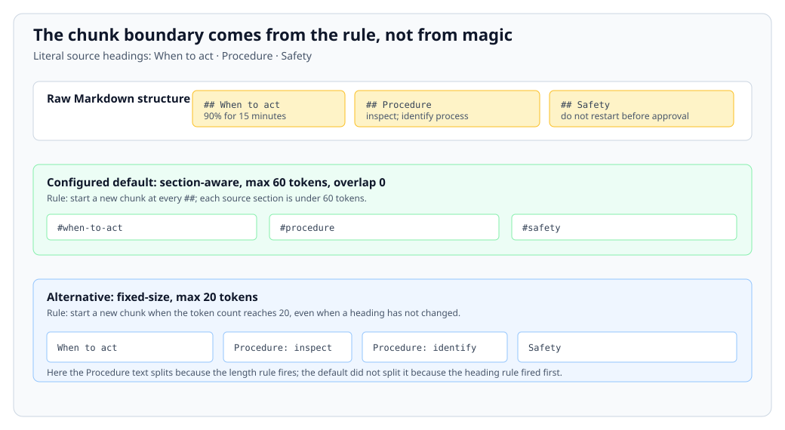
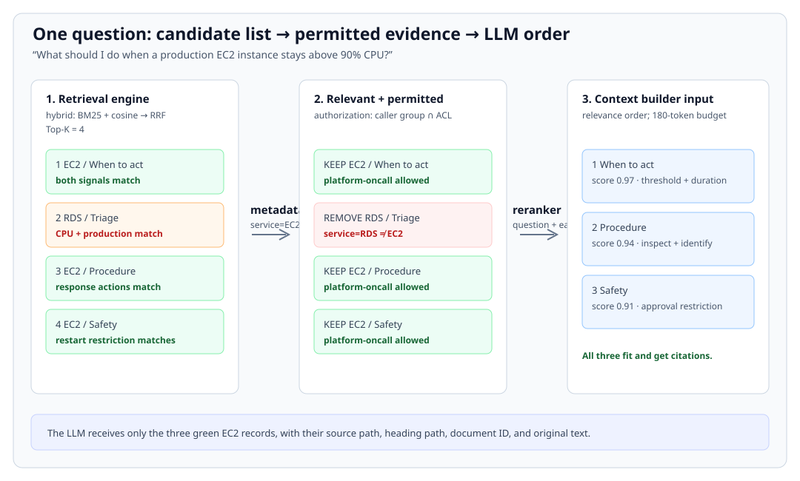

# AI Knowledge Bases and Retrieval

This page follows **one RAG request** from a Markdown file in a repository to a cited on-call answer. Its running question is:

```text
What should I do when a production EC2 instance stays above 90% CPU?
```

Start with the map. The first question has no evidence; after the runbook is ingested, the second question follows every arrow in order. Every stage names its **input**, the component that acts (**who**), its **rule/configuration**, and its **output**.

## 1. Big picture: complete RAG flow {#section-1-rag-flow}

```text
runbooks/ec2-cpu.md
        ↓ parse → chunk → embed → index
vector database: chunks + vectors + source metadata

user question
        ↓ preserve original → embed → hybrid retrieve
candidates
        ↓ metadata filter → authorization → rerank
permitted, ordered evidence
        ↓ context builder
exact LLM context
        ↓ LLM
grounded answer + citation
```

<div class="image-wrapper">
  
  <div class="diagram-caption" data-snippet-id="rag-causal-architecture-snippet">
    🧭 Complete request map — follow this once, then inspect every stage below
  </div>
  <script type="text/plain" id="rag-causal-architecture-snippet">
@startuml
title One causal RAG run: Markdown file to cited EC2 answer
actor "On-call engineer" as User
participant "Application" as App
participant "Ingestion service" as Ingest
participant "ops-embed-demo-v1" as Embed
database "runbooks-v1\nvector database" as Index
participant "Authorization layer" as Auth
participant "ops-reranker-v1" as Reranker
participant "operations-answer-llm-v1" as LLM

== Ingest runbooks/ec2-cpu.md ==
App -> Ingest: Raw Markdown file
Ingest -> Ingest: markdown-parser-v2\nfrontmatter schema + headings
Ingest -> Ingest: Structured document\nsections + copied metadata
Ingest -> Ingest: section-chunker-v1\nmax 60 tokens, overlap 0
Ingest -> Embed: Three chunk text fields
Embed --> Ingest: Three six-number vectors
Ingest -> Index: index-writer-v1\nchunk + vector + metadata

== Answer one question ==
User -> App: "Production EC2 stays above 90% CPU"
App -> App: query-processor-v1\npreserve original; rewrite=false
App -> Embed: Retrieval text
Embed --> App: Query vector
App -> Index: Hybrid search: BM25 + cosine\nRRF; Top-K = 4
Index --> App: EC2 when, RDS triage,\nEC2 procedure, EC2 safety
App -> App: Metadata rule: EC2 + prod +\nap-southeast-2 + current\nRemove RDS (service=RDS)
App -> Auth: Caller groups + 3 EC2 ACLs
Auth --> App: Permit all 3: platform-oncall matches
App -> Reranker: Question + permitted chunks
Reranker --> App: When → Procedure → Safety
App -> LLM: 3 cited evidence blocks + question
LLM --> App: Inspect metrics/process;\nowner approval before restart
App --> User: Grounded answer + RUN-EC2-CPU-2026
@enduml
  </script>
</div>

## 2. Before Stage 1 — empty means no evidence {#section-1-why-rag}

The on-call engineer asks:

~~~text
What should I do when a production EC2 instance stays above 90% CPU?
~~~

At this moment, the vector database has no runbook records.

~~~text
INPUT:     user question
WHO:       retrieval engine
RULE:      search only indexed records
OUTPUT:    []

INPUT:     []
WHO:       LLM
RULE:      answer only from supplied evidence
OUTPUT:    "Insufficient evidence to give an operational instruction."
~~~

Nothing failed: there is simply no evidence to retrieve. The platform team now commits a Markdown runbook.

## 3. Stage 1 — ingest one file into index records {#section-2-parsing}

### The actual source file

**Physical input:** the repository contains this exact UTF-8 file at `runbooks/ec2-cpu.md`.

~~~markdown
---
document_id: RUN-EC2-CPU-2026
service: EC2
environment: prod
region: ap-southeast-2
status: current
allowed_groups:
  - platform-oncall
---

# Production EC2 CPU triage

## When to act

If production EC2 CPU exceeds 90% for 15 minutes, start this procedure.

## Procedure

1. Inspect CloudWatch metrics.
2. Identify the process using the CPU.

## Safety

Do not restart a production instance before service-owner approval.
~~~

For this walkthrough, all metadata comes from this file's frontmatter. It is not inferred from the prose, and it is not supplied by the user at query time.

<div class="rag-flow" role="img" aria-label="The literal Markdown file is parsed into a structured document, section-aware chunked, embedded, and written as records to the vector database.">
  <div class="rag-node rag-node--data"><strong>Raw Markdown file</strong><code>runbooks/ec2-cpu.md</code></div>
  <div class="rag-arrow">↓</div>
  <div class="rag-node"><strong>Markdown parser</strong>frontmatter schema + heading/list rules</div>
  <div class="rag-arrow">↓</div>
  <div class="rag-node"><strong>Structured document</strong>sections + frontmatter metadata</div>
  <div class="rag-arrow">↓</div>
  <div class="rag-node"><strong>Section-aware chunker</strong>max 60 tokens; overlap 0</div>
  <div class="rag-arrow">↓</div>
  <div class="rag-node"><strong>Embedding model</strong>chunk text → vector</div>
  <div class="rag-arrow">↓</div>
  <div class="rag-node rag-node--success"><strong>Index writer</strong>records in the vector database</div>
</div>

### 3.1 Parse: Markdown bytes → structured document

**INPUT:** the literal `runbooks/ec2-cpu.md` file above.

**WHO:** `markdown-parser-v2` in the ingestion service.

**RULE / CONFIG:**

- read YAML frontmatter only from the opening `---` block;
- accept the schema fields `document_id`, `service`, `environment`, `region`, `status`, and `allowed_groups`;
- turn `#` and `##` lines into headings; preserve paragraph and ordered-list order;
- reject the file if a required field is absent or `allowed_groups` is empty.

**OUTPUT:** one structured document. The `metadata` values below came directly from frontmatter; the `sections` came directly from Markdown headings and their following text.

~~~text
source_path: runbooks/ec2-cpu.md
metadata:
  document_id: RUN-EC2-CPU-2026
  service: EC2
  environment: prod
  region: ap-southeast-2
  status: current
  allowed_groups: [platform-oncall]
sections:
  1. heading_path: Production EC2 CPU triage > When to act
     text: If production EC2 CPU exceeds 90% for 15 minutes, start this procedure.
  2. heading_path: Production EC2 CPU triage > Procedure
     text: 1. Inspect CloudWatch metrics. 2. Identify the process using the CPU.
  3. heading_path: Production EC2 CPU triage > Safety
     text: Do not restart a production instance before service-owner approval.
~~~

The parser did not create “CPU threshold” or “safety rule” labels. It only produced headings, text, and frontmatter fields that physically exist in the source.

<aside class="technique-callout">
  <strong>Technique used: Markdown parsing</strong>
  <span><strong>Why this output looks this way:</strong> the parser follows Markdown syntax and the declared frontmatter schema; it does not guess structure from meaning.</span>
</aside>

### 3.2 Chunk: structured document → three retrieval units {#section-3-chunking}

**INPUT:** the three parsed sections above.

**WHO:** `section-chunker-v1` in the ingestion service.

**RULE / CONFIG:** `strategy=section-aware`, `max_tokens=60`, `overlap_tokens=0`. Start a new chunk at each `##` heading. Keep its full heading path. Do not merge sections when each section is under 60 tokens.

**OUTPUT:** exactly three chunks:

~~~text
chunk_id: RUN-EC2-CPU-2026#when-to-act
heading_path: Production EC2 CPU triage > When to act
text: If production EC2 CPU exceeds 90% for 15 minutes, start this procedure.
metadata copied from frontmatter: service=EC2, environment=prod,
  region=ap-southeast-2, status=current, allowed_groups=[platform-oncall]

chunk_id: RUN-EC2-CPU-2026#procedure
heading_path: Production EC2 CPU triage > Procedure
text: 1. Inspect CloudWatch metrics. 2. Identify the process using the CPU.
metadata copied from frontmatter: service=EC2, environment=prod,
  region=ap-southeast-2, status=current, allowed_groups=[platform-oncall]

chunk_id: RUN-EC2-CPU-2026#safety
heading_path: Production EC2 CPU triage > Safety
text: Do not restart a production instance before service-owner approval.
metadata copied from frontmatter: service=EC2, environment=prod,
  region=ap-southeast-2, status=current, allowed_groups=[platform-oncall]
~~~

Each boundary exists because the next `##` heading begins a new section—not because the chunker discovered a topic change. `overlap_tokens=0` means no sentence is copied into a neighbouring chunk. The copied metadata is how every chunk later carries the document's region, status, and ACL.

<aside class="technique-callout">
  <strong>Technique used: Section-aware chunking</strong>
  <span><strong>Why this output looks this way:</strong> every source section is shorter than 60 tokens, so the configured chunker emits one chunk per <code>##</code> section.</span>
</aside>

The diagram makes the configured boundary decision visible. The green row is the default used in this walkthrough; the blue row is an alternative, not another hidden pipeline step.

<div class="image-wrapper">
  
  <div class="diagram-caption">✂️ Same source file, different chunking rule, different boundaries</div>
</div>

### 3.3 Embed: chunk text → vectors {#section-4-embeddings}

**INPUT:** each chunk's `text` field. The headings and metadata remain stored alongside it; this configuration embeds only the text field.

**WHO:** configured embedding model `ops-embed-demo-v1`.

**RULE / CONFIG:** use the same model for documents and future queries. This fictional teaching model emits a six-number vector and uses cosine similarity. Real embedding vectors are usually much longer.

**OUTPUT:** the model returns one vector per input text:

~~~text
RUN-EC2-CPU-2026#when-to-act
text:   If production EC2 CPU exceeds 90% for 15 minutes, start this procedure.
vector: [0.82, 0.11, -0.06, 0.41, 0.27, 0.09]

RUN-EC2-CPU-2026#procedure
text:   1. Inspect CloudWatch metrics. 2. Identify the process using the CPU.
vector: [0.63, 0.38, 0.04, 0.55, 0.14, 0.22]

RUN-EC2-CPU-2026#safety
text:   Do not restart a production instance before service-owner approval.
vector: [0.34, 0.05, -0.31, 0.20, 0.76, 0.48]
~~~

The numbers are the model's output, not labels extracted from the runbook. They look unrelated to the prose because vector dimensions are learned numeric features, not human-readable fields.

### 3.4 Index: chunk + vector + metadata → database record

**INPUT:** each chunk, its vector, and the metadata copied by the chunker.

**WHO:** `index-writer-v1`.

**RULE / CONFIG:** write one record per `chunk_id` into collection `runbooks-v1`; use `vector` for nearest-neighbour search; retain `text`, `heading_path`, `source_path`, and metadata for filtering, authorization, and citations.

**OUTPUT:** the vector database now contains these three EC2 records. One record looks like this:

~~~text
collection: runbooks-v1
id: RUN-EC2-CPU-2026#procedure
vector: [0.63, 0.38, 0.04, 0.55, 0.14, 0.22]
text: 1. Inspect CloudWatch metrics. 2. Identify the process using the CPU.
heading_path: Production EC2 CPU triage > Procedure
source_path: runbooks/ec2-cpu.md
metadata: service=EC2, environment=prod, region=ap-southeast-2,
  status=current, allowed_groups=[platform-oncall]
~~~

The knowledge base can now retrieve evidence. Ingestion is complete; no LLM was used to write or authorize this record.

For one later filtering decision, this reduced teaching database also already contains one unrelated record from an earlier ingestion. It did **not** come from `runbooks/ec2-cpu.md`:

~~~text
id: RUN-RDS-CPU-2026#triage
source_path: runbooks/rds-cpu.md
text: If production RDS CPU is high, inspect database load and active sessions.
metadata: service=RDS, environment=prod, region=ap-southeast-2,
  status=current, allowed_groups=[platform-oncall]
~~~

This is the complete corpus for the query below: the three EC2 records created above plus this one RDS record.

## 4. Stage 2 — use those records to answer the question {#section-7-query-processing}

The same engineer asks again:

~~~text
What should I do when a production EC2 instance stays above 90% CPU?
~~~

### 4.1 Process the question: user text → retrieval query

**INPUT:** the exact user question above.

**WHO:** `query-processor-v1`.

**RULE / CONFIG:** `preserve_original=true`, `rewrite=false` for this walkthrough. The question is already specific; the processor must not silently replace a safety-critical request.

**OUTPUT:** a retrieval request containing the unchanged text:

~~~text
original_question: What should I do when a production EC2 instance stays above 90% CPU?
retrieval_text:    What should I do when a production EC2 instance stays above 90% CPU?
~~~

No rewrite appears because the configured rule disabled it. A rewrite is an optional alternative introduced after the default flow.

### 4.2 Embed the retrieval query: text → query vector

**INPUT:** `retrieval_text` from the query processor.

**WHO:** the same `ops-embed-demo-v1` embedding model used during ingestion.

**RULE / CONFIG:** six dimensions; cosine similarity; use the document/query-compatible model version `ops-embed-demo-v1`.

**OUTPUT:**

~~~text
query_vector: [0.79, 0.17, -0.02, 0.47, 0.22, 0.13]
~~~

Using the same model is what makes this vector comparable with the three stored chunk vectors.

### 4.3 Retrieve: query → initial candidate list {#section-5-hybrid}

**INPUT:** the original query text, its query vector, and indexed records.

**WHO:** `retrieval-engine-v1`.

**RULE / CONFIG:** `hybrid`; BM25 searches `text`, vector search uses cosine similarity over `vector`, reciprocal-rank fusion (`rrf_k=60`) combines their ranks, then `top_k=4` is returned.

**OUTPUT:** four candidates. The RDS record is the explicit pre-existing record shown at the end of ingestion; it is included because `CPU` and `production` match the query, not because it came from the EC2 Markdown file.

~~~text
1. RUN-EC2-CPU-2026#when-to-act   source: runbooks/ec2-cpu.md
   fused_rank: 1  reason: BM25 and vector search both match EC2 + CPU + 90%

2. RUN-RDS-CPU-2026#triage        source: runbooks/rds-cpu.md
   fused_rank: 2  reason: CPU and production match, but metadata service=RDS

3. RUN-EC2-CPU-2026#procedure     source: runbooks/ec2-cpu.md
   fused_rank: 3  reason: vector search matches the requested response actions

4. RUN-EC2-CPU-2026#safety        source: runbooks/ec2-cpu.md
   fused_rank: 4  reason: lexical and vector search match production + restart
~~~

These are retrieval candidates, not yet approved evidence. The RDS item is not derived from the EC2 source file; its displayed `source` and `service=RDS` explain where it came from and why it is still present at this stage.

<aside class="technique-callout">
  <strong>Technique used: Hybrid retrieval, Top-K = 4</strong>
  <span><strong>Why this output looks this way:</strong> BM25 contributes exact terms; vector search contributes similar meaning; rank fusion selects four possible records before later policy checks.</span>
</aside>

### 4.4 Filter by metadata: candidates → relevant candidates {#section-8-authorization}

**INPUT:** the four candidates above, including their stored metadata.

**WHO:** `metadata-filter-v1`.

**RULE / CONFIG:** retain only `service=EC2 AND environment=prod AND region=ap-southeast-2 AND status=current`.

**OUTPUT:** three candidates. The filter removes exactly one record:

~~~text
REMOVE  RUN-RDS-CPU-2026#triage
RULE    service=RDS does not equal required service=EC2

KEEP    RUN-EC2-CPU-2026#when-to-act
KEEP    RUN-EC2-CPU-2026#procedure
KEEP    RUN-EC2-CPU-2026#safety
~~~

`service`, `environment`, `region`, and `status` exist because the Markdown frontmatter supplied them and the chunker copied them to every index record. They were not inferred from the question.

### 4.5 Authorize: relevant candidates → permitted candidates

**INPUT:** the three filtered EC2 candidates and the caller identity from the trusted identity service:

~~~text
caller_id: alex@example.internal
groups: [platform-oncall]
~~~

**WHO:** `authorization-layer-v1`.

**RULE / CONFIG:** keep a candidate only when the caller has at least one group in the candidate's stored `allowed_groups`. Missing ACL metadata means deny.

**OUTPUT:** all three candidates are permitted:

~~~text
PERMIT  RUN-EC2-CPU-2026#when-to-act   [platform-oncall] ∩ [platform-oncall] ≠ ∅
PERMIT  RUN-EC2-CPU-2026#procedure     [platform-oncall] ∩ [platform-oncall] ≠ ∅
PERMIT  RUN-EC2-CPU-2026#safety        [platform-oncall] ∩ [platform-oncall] ≠ ∅
~~~

No candidate disappears at this step in this run. That is visible in the output: all three have the ACL value copied from source frontmatter, and the caller has the matching trusted group. Authorization happens before the LLM sees the text.

### 4.6 Rerank: permitted candidates → answer order {#section-9-reranking}

**INPUT:** the question plus the three permitted candidate texts.

**WHO:** `ops-reranker-v1`, a cross-encoder reranker.

**RULE / CONFIG:** score each question-and-chunk pair for direct usefulness in answering the question; sort descending; do not add new candidates.

**OUTPUT:**

~~~text
1. RUN-EC2-CPU-2026#when-to-act  score=0.97  threshold and duration answer “when”
2. RUN-EC2-CPU-2026#procedure    score=0.94  inspection actions answer “what to do”
3. RUN-EC2-CPU-2026#safety       score=0.91  restart restriction is required safety context
~~~

The reranker changes only the order. It cannot recover the RDS item after filtering or any chunk that was missed before `top_k=4`.

<div class="image-wrapper">
  
  <div class="diagram-caption">📊 Candidate flow — see exactly why one record is removed and three reach context</div>
</div>

### 4.7 Build context: ordered candidates → exact LLM input

**INPUT:** the three ordered, permitted candidates, their source paths, and the original question.

**WHO:** `context-builder-v1`.

**RULE / CONFIG:** deduplicate by `document_id + chunk_id`; maximum evidence budget `180` tokens; preserve the reranker order; attach each chunk's `source_path`, `heading_path`, and `document_id` as its citation. All three chunks fit, so none is dropped.

**OUTPUT:** exactly this LLM context:

~~~text
SYSTEM
Answer only from EVIDENCE. If EVIDENCE is insufficient, say so.
Cite the document ID that supports each instruction.

EVIDENCE 1
document_id: RUN-EC2-CPU-2026
source: runbooks/ec2-cpu.md
section: Production EC2 CPU triage > When to act
If production EC2 CPU exceeds 90% for 15 minutes, start this procedure.

EVIDENCE 2
document_id: RUN-EC2-CPU-2026
source: runbooks/ec2-cpu.md
section: Production EC2 CPU triage > Procedure
1. Inspect CloudWatch metrics. 2. Identify the process using the CPU.

EVIDENCE 3
document_id: RUN-EC2-CPU-2026
source: runbooks/ec2-cpu.md
section: Production EC2 CPU triage > Safety
Do not restart a production instance before service-owner approval.

QUESTION
What should I do when a production EC2 instance stays above 90% CPU?
~~~

The RDS record does not appear because the metadata filter removed it. Nothing was removed for authorization, deduplication, or the token budget in this run; their rules are stated so that result is explainable.

### 4.8 Generate: LLM context → grounded answer

**INPUT:** the exact context above.

**WHO:** `operations-answer-llm-v1`.

**RULE / CONFIG:** follow the system instruction; make no operational claim that is absent from `EVIDENCE`; include the supporting document ID.

**OUTPUT:**

~~~text
If production EC2 CPU exceeds 90% for 15 minutes, inspect CloudWatch metrics
and identify the process using the CPU. Do not restart the production instance
before service-owner approval. [RUN-EC2-CPU-2026]
~~~

The answer has its threshold, actions, restriction, and citation because each was present in the context builder's output—not because the model knew an unstated runbook.

## 5. Only now: change one component at a time {#section-11-evaluation}

The default flow above used section-aware chunks, hybrid retrieval, `Top-K = 4`, and one ANN-capable vector search. Alternatives change a named component and therefore a specific output.

| Change | Component and new rule | What changes in this story | Trade-off to evaluate |
|---|---|---|---|
| Fixed-size instead of section-aware chunking | Chunker: split every 40 tokens | A boundary can land inside the Procedure or between Procedure and Safety, because length—not headings—decides it. | More uniform size; related instructions can separate. |
| Semantic chunking instead of section-aware | Chunker: split at detected topic changes | Boundaries come from a model's topic decision instead of the literal `##` headings. | May improve topical focus; boundaries can change when the model/configuration changes. |
| Lexical-only instead of hybrid | Retrieval engine: BM25 only | Exact words such as `EC2`, `CPU`, and `90%` dominate; differently worded queries may lose EC2 candidates. | Strong exact match; weaker vocabulary mismatch. |
| Semantic-only instead of hybrid | Retrieval engine: vector similarity only | Similar meaning dominates; exact identifiers such as `RUN-EC2-CPU-2026` get less special treatment. | Handles paraphrase; can weaken exact-ID retrieval. |
| `Top-K: 4 → 10` | Retrieval engine: return ten fused candidates | More records enter metadata filtering and reranking. | Recall may improve; noise, reranking latency, and context pressure increase. |
| More ANN search effort | Vector search: explore more HNSW neighbours or IVF partitions | The vector half of hybrid search considers more approximate neighbours before fusion. | Recall may improve; latency increases. |
| Enable query rewrite | Query processor: preserve original and generate a second retrieval text | The engine may also search “EC2 high-CPU triage procedure.” | Can bridge vocabulary; a bad rewrite can change intent, so trace both texts. |

**HNSW vs IVF:** both are ANN index choices inside the retrieval engine. HNSW follows a graph of vector neighbours; IVF searches selected vector clusters. Neither changes the original Markdown, parsed document, metadata, ACL, or LLM rules—only which vector candidates are likely to reach rank fusion.

Evaluate changes against traces like this one. `Recall@K` asks whether required permitted chunks appeared in the candidate list; `Precision@K` asks how much of that list was useful; latency and authorization leakage check the cost and safety of the same request. A fluent final answer cannot compensate for missing or forbidden evidence.

## 6. The causal chain

~~~text
runbooks/ec2-cpu.md
  → Markdown parser / frontmatter + heading rules
  → structured sections + metadata from frontmatter
  → section chunker / max 60, overlap 0
  → three named chunks + copied metadata
  → embedding model / ops-embed-demo-v1
  → vectors
  → index writer / one record per chunk
  → vector database

user question
  → query processor / preserve original, no rewrite
  → retrieval text
  → embedding model / same model
  → query vector
  → retrieval engine / hybrid, RRF, Top-K 4
  → four candidates
  → metadata filter / EC2 + prod + ap-southeast-2 + current
  → three EC2 candidates
  → authorization / platform-oncall versus allowed_groups
  → three permitted candidates
  → reranker / question relevance
  → ordered candidates
  → context builder / dedupe, 180 tokens, citations
  → exact LLM context
  → LLM / evidence-only answer rule
  → grounded answer + RUN-EC2-CPU-2026 citation
~~~

For production controls see [AI infrastructure and evaluation](/study/aiInfrastructure). For AWS implementations see [AWS AI services](/study/infrastructureAWSAiServices).
