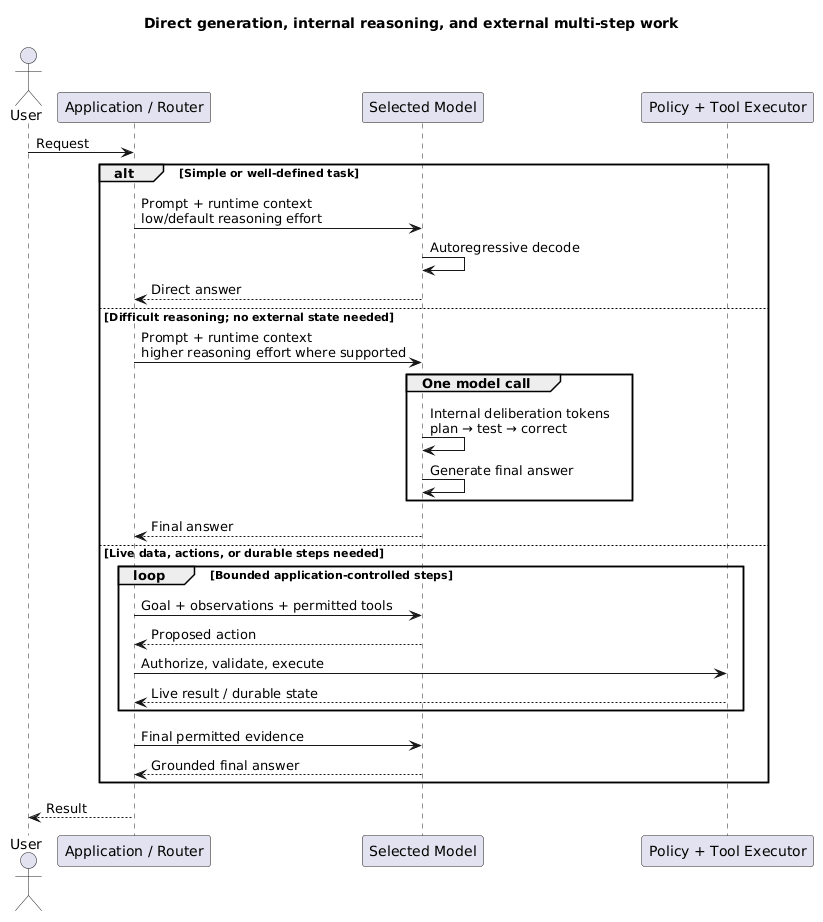

# AI Models and Providers

Use this page to select a model and decide how to consume it. It merges model characteristics and provider choices because they are evaluated together, while keeping the distinction explicit.

## 1. Model, provider, and cloud are different {#section-1-boundaries}

- **Model**: the trained artifact and inference behaviour.
- **Model provider**: the organisation that trains, publishes, or serves a model family.
- **Cloud/model platform**: the commercial and technical access path around the model.
- Example:
  - Claude is an Anthropic model family;
  - it can be consumed directly from Anthropic or through Amazon Bedrock;
  - the access path changes API shape, regions, quotas, billing, networking, and governance;
  - it does not make Bedrock the model.

```text
workload → model capability → provider/model family → access path → production controls
```

### 1.1 What belongs to the model {#section-1-1-model-package}

- A usable model/checkpoint normally expects a compatible package:
  - tokenizer rules and vocabulary;
  - token-ID mapping;
  - internal embedding and transformer weights;
  - output vocabulary/projection;
  - detokenizer/configuration.
- These components are trained or defined together and are not generally interchangeable across model families.
- Even versions within one family may change tokenizer, architecture, context limits, special tokens, or chat format; compatibility must be documented and tested.
- General algorithms such as softmax, temperature sampling, and top-p are not owned by one model provider, although exposed controls and serving behaviour vary.
- The request lifecycle and coupling are explained in [AI Fundamentals](/study/aiFundamentals#section-3-1-coupling).

### 1.2 Who owns and hosts what {#section-1-2-ownership}

- **Model creator/publisher**:
  - trains or releases the model family and defines its model artifacts/licence.
- **Direct API provider**:
  - serves its own or licensed models behind an API;
  - owns runtime concerns such as batching, capacity, upgrades, moderation, and exposed parameters.
- **Cloud model platform**:
  - provides access to models from one or more creators with cloud identity, networking, billing, governance, and regional availability;
  - does not become the creator of every model it hosts.
- **Self-hosting operator**:
  - runs compatible open-weight artifacts and owns serving engines, hardware, quantization, scaling, patching, and safety controls.
- The same model family can be available through several access paths, but API features, versions, latency, quotas, and governance can differ.

## 2. Select by workload, not leaderboard {#section-2-selection}

- Start with representative tasks and explicit acceptance thresholds.
- Choose the smallest, fastest, least expensive model that passes quality and safety requirements.
- Evaluate the full system because prompt, retrieval, tools, and model behaviour interact.
- Public benchmarks are useful for shortlisting, but may not represent:
  - domain terminology;
  - long documents;
  - exact identifiers;
  - tool schemas;
  - refusal policy;
  - production latency and throttling.

Core dimensions:

- **Task quality**: correctness, relevance, completeness, groundedness, and consistency.
- **Reasoning**: performance on multi-step constraints, planning, calculations, and ambiguous tasks.
- **Instruction following**: ability to respect policy, format, length, and evidence requirements.
- **Context performance**: usable recall across long input, not only the advertised maximum.
- **Modalities**: text, image, audio, video, and document input/output requirements.
- **Tool use**: correct tool selection, argument accuracy, recovery from tool errors, and parallel calls.
- **Structured output**: schema-valid output plus semantic field correctness.
- **Latency**: time to first token, tokens per second, and p95/p99 end-to-end time.
- **Throughput**: concurrent requests, quota, batching, and provisioned capacity.
- **Cost**: input/output tokens, retries, reasoning tokens, retrieval, tools, and idle capacity.
- **Operations**: availability, regional support, versioning, deprecation, observability, and support.

## 3. Model categories {#section-3-categories}

- Categories overlap; they describe workload role and inference behaviour more than universal neural-network architectures.
- A **general-purpose model** is broad, not automatically fast:
  - smaller, distilled, quantized, or serving-optimized variants are usually the fast tiers;
  - a large general model can still be slower and more expensive than a smaller reasoning model.
- A **reasoning model** is usually still an autoregressive transformer, but its training and serving encourage more useful intermediate deliberation:
  - reinforcement learning or related post-training can reward decomposition, checking, and correction;
  - more reasoning effort/test-time compute can generate more internal tokens before the final answer;
  - later tokens can attend to earlier reasoning and correct course, but the model does not literally rewrite earlier token IDs in place;
  - provider internals vary and may include hidden reasoning, verifiers, search, or other techniques.

<div class="image-wrapper">
  
  <div class="diagram-caption" data-snippet-id="model-reasoning-paths-snippet">
    🧭 Three execution paths: direct, reasoning, and external multi-step
  </div>
  <script type="text/plain" id="model-reasoning-paths-snippet">
@startuml
title Direct generation, internal reasoning, and external multi-step work
actor User
participant "Application / Router" as App
participant "Selected Model" as Model
participant "Policy + Tool Executor" as Tools

User -> App: Request

alt Simple or well-defined task
  App -> Model: Prompt + runtime context\nlow/default reasoning effort
  Model -> Model: Autoregressive decode
  Model --> App: Direct answer
else Difficult reasoning; no external state needed
  App -> Model: Prompt + runtime context\nhigher reasoning effort where supported
  group One model call
    Model -> Model: Internal deliberation tokens\nplan → test → correct
    Model -> Model: Generate final answer
  end
  Model --> App: Final answer
else Live data, actions, or durable steps needed
  loop Bounded application-controlled steps
    App -> Model: Goal + observations + permitted tools
    Model --> App: Proposed action
    App -> Tools: Authorize, validate, execute
    Tools --> App: Live result / durable state
  end
  App -> Model: Final permitted evidence
  Model --> App: Grounded final answer
end

App --> User: Result
@enduml
  </script>
</div>

- **Internal multi-step reasoning** occurs inside one model call and consumes inference time/tokens; providers may expose only a summary or no reasoning trace.
- **External multi-step execution** is an application, workflow, or agent loop across model calls and tools; the application owns authorization, state, limits, and retries.
- Shared conceptual levers include:
  - model/tier selection;
  - prompt and runtime context;
  - input/output token budgets;
  - RAG and tools around the model;
  - latency, cost, and quality thresholds.
- Model-specific levers include reasoning effort/thinking level, temperature/top-p availability, tool/structured-output support, and context/output limits. The names and semantics are not portable guarantees.

- **General-purpose model**:
  - broad generation, summarisation, extraction, coding, and conversation;
  - good default when task distribution is varied;
  - may be expensive and less predictable than a specialist.
- **Reasoning model**:
  - is post-trained and served to spend more useful inference compute on difficult multi-step tasks;
  - useful for difficult planning, coding, and constraint solving;
  - watch latency, token use, and unnecessary use on simple tasks.
- **Small language model**:
  - useful for classification, routing, extraction, moderation, and high-volume transformations;
  - lower cost and latency;
  - weaker on ambiguity and long-tail reasoning.
- **Embedding model**:
  - maps queries and documents into vectors for retrieval or clustering;
  - does not generate answers;
  - changing model/version/dimension usually requires re-embedding the corpus.
- **Reranking model**:
  - scores a query jointly with retrieved candidates;
  - improves top-result precision after cheaper broad retrieval;
  - adds per-candidate latency and cost.
- **Specialised model**:
  - targets speech, vision, classification, extraction, moderation, or a domain task;
  - can be cheaper and easier to evaluate than a general LLM.

Primary examples: [OpenAI reasoning training and test-time compute](https://openai.com/index/learning-to-reason-with-llms/), the [DeepSeek-R1 paper](https://arxiv.org/abs/2501.12948), and [Gemini thinking controls](https://ai.google.dev/gemini-api/docs/thinking).

## 4. Open weights versus managed models {#section-4-deployment}

- **Managed hosted API**:
  - fastest implementation path;
  - no GPU serving or model patching;
  - constrained by provider quotas, regions, API changes, and data terms.
- **Cloud model platform**:
  - central identity, billing, governance, regional integration, and model choice;
  - introduces platform-specific capabilities and uneven model availability.
- **Self-hosted open weights**:
  - control over version, deployment location, serving, quantization, and some customization;
  - requires accelerator capacity, autoscaling, batching, monitoring, patching, and safety controls;
  - may be justified by data boundaries, sustained volume, offline use, or specialized latency;
  - is rarely cheaper at low or unpredictable utilization.
- Open-weight does not necessarily mean open-source or unrestricted:
  - inspect licence terms;
  - permitted use;
  - redistribution;
  - training-data transparency;
  - derivative-model obligations.

## 5. Provider landscape {#section-5-providers}

Treat this as an ecosystem map, not a permanent ranking.

| Organisation | Famous model families | Typical shape | Common access paths |
|---|---|---|---|
| **OpenAI** | **GPT**; current GPT tiers include Sol, Terra, and Luna | Hosted general-purpose reasoning, coding, multimodal, structured-output, and tool models | OpenAI API and OpenAI applications |
| **Anthropic** | **Claude**: Fable, Opus, Sonnet, and Haiku tiers | Hosted reasoning, coding, long-context, and agent/tool workloads | Claude API, Amazon Bedrock, Google Cloud, and other supported platforms |
| **Google / Google DeepMind** | **Gemini**: Pro, Flash, and Flash-Lite tiers; Gemma open models | Multimodal models with strong Google Cloud/data integration | Gemini Developer API and Vertex AI |
| **DeepSeek** | **DeepSeek V4 Pro and V4 Flash** | Reasoning/coding with low-cost APIs and open-weight options | DeepSeek API, compatible API formats, and self/third-party hosting |
| **Meta** | **Llama** | Open-weight ecosystem with many sizes and community serving stacks | Self-hosting and many cloud/model hosts |
| **Mistral AI** | **Mistral and Mixtral** families | Hosted and open-weight models, often emphasizing efficient deployment | Mistral API, self-hosting, and cloud/model hosts |
| **Cohere** | **Command, Embed, and Rerank** | Enterprise generation plus dedicated retrieval and ranking models | Cohere API and supported cloud platforms |
| **Amazon** | **Nova** generation models and **Titan** embedding/model families | AWS-native model families and managed delivery | Amazon Bedrock |

- GPT is a model family; ChatGPT is an application that uses models and additional product services.
- Claude is Anthropic's model family; Claude.ai is an application, while Claude can also be invoked through other platforms.
- Gemini is used as both a model-family and product brand, so record the exact API model ID and access path.
- A cloud platform may host another organisation's model without becoming that model's creator.
- For every evaluation, record the exact model ID, API/access path, Region, date, and configuration.

## 6. API pricing and cost comparison {#section-6-pricing}

> Pricing snapshot: **20 August 2026**, USD per 1 million tokens (`MTok`). Prices, previews, discounts, and model availability change; verify the linked official pages before making a production decision.

Representative hosted text-model rates:

| Provider | Model | Position | Standard/cache-miss input / MTok | Output / MTok |
|---|---|---|---:|---:|
| OpenAI | GPT-5.6 Sol | Frontier | $5.00 | $30.00 |
| OpenAI | GPT-5.6 Terra | Balanced | $2.00 | $12.00 |
| OpenAI | GPT-5.6 Luna | High-volume | $0.20 | $1.20 |
| Anthropic | Claude Fable 5 | Highest capability | $10.00 | $50.00 |
| Anthropic | Claude Opus 4.8 | Advanced | $5.00 | $25.00 |
| Anthropic | Claude Sonnet 5 | Balanced | $2.00* | $10.00* |
| Anthropic | Claude Haiku 4.5 | Fast | $1.00 | $5.00 |
| Google | Gemini 3.1 Pro Preview | Advanced multimodal | $2.00 | $12.00 |
| Google | Gemini 3.5 Flash | Fast/balanced | $1.50 | $9.00 |
| Google | Gemini 3.1 Flash-Lite | High-volume | $0.25 | $1.50 |
| DeepSeek | DeepSeek V4 Pro | Advanced/open-weight | $0.435 | $0.87 |
| DeepSeek | DeepSeek V4 Flash | High-volume/open-weight | $0.14 | $0.28 |

\* Claude Sonnet 5 introductory rate through 31 August 2026; the documented standard rate is `$3` input / `$15` output per MTok.

Basic token-cost calculation:

```text
request cost ≈
    input_tokens  / 1,000,000 × input_rate
  + output_tokens / 1,000,000 × output_rate
```

Example using GPT-5.6 Terra:

```text
100,000 input tokens × $2 / MTok  = $0.20
 10,000 output tokens × $12 / MTok = $0.12
                                          ─────
Estimated model-token cost                $0.32
```

- Real cost may also include:
  - cached-input reads and cache writes;
  - reasoning/thinking tokens;
  - long-context price tiers;
  - batch, flex, priority, or provisioned capacity;
  - web search, grounding, file search, code execution, or other tools;
  - reranking, embeddings, storage, data transfer, and retries;
  - regional/data-residency premiums or cloud-platform pricing.
- Output is often more expensive because generation is sequential; minimizing unnecessary output can matter more than small prompt reductions.
- Compare **cost per successful task**, not only price per token. A cheap model that retries or fails often can cost more overall.
- Consumer plans such as ChatGPT Plus or Claude Pro purchase application access and usage allowances; they are not interchangeable with API credits or per-token rates.

Official references:

- [OpenAI models and prices](https://developers.openai.com/api/docs/models)
- [Anthropic Claude pricing](https://platform.claude.com/docs/en/about-claude/pricing)
- [Google Gemini API pricing](https://ai.google.dev/gemini-api/docs/pricing)
- [DeepSeek models and pricing](https://api-docs.deepseek.com/quick_start/pricing/)

## 7. Routing, cascades, and fallback {#section-7-routing}

```text
request → policy + difficulty classifier
          ├─ simple classification/extraction → small model
          ├─ retrieve documents              → embedding model
          ├─ reorder candidates              → reranker
          ├─ normal generation               → general model
          └─ difficult reasoning             → reasoning model
                                      failure ↓
                              tested semantic fallback
```

- Route using task type, risk, context length, latency budget, and measured confidence.
- Use cascades when a cheap first pass can reliably identify uncertain cases.
- Set an escalation budget; repeated model retries can cost more than using the stronger model once.
- A fallback must preserve a tested contract:
  - supported modalities;
  - tool names and schemas;
  - structured-output behaviour;
  - safety/refusal policy;
  - context and output limits.
- A configured second model is not a fallback until it has passed the same regression suite.

## 8. Portability and lock-in {#section-8-portability}

- Separate three kinds of portability:
  - **API portability**: another adapter can send messages and receive output.
  - **Behavioural portability**: the replacement preserves quality, tools, schemas, safety, and latency for the workload.
  - **Artifact compatibility**: tokenizer, weights, and runtime formats can actually be loaded together; this mainly matters when self-hosting.
- Put a thin internal boundary around:
  - messages and content parts;
  - timeouts, retries, and cancellation;
  - tracing and token/cost accounting;
  - tool and structured-output schemas;
  - model selection and fallback;
  - safety policy.
- Keep provider-native features behind explicit adapters.
- Store prompts, tool schemas, and evaluation datasets outside provider consoles where practical.
- Expect portability work because models and serving access paths differ in:
  - tokenization and context behaviour;
  - streaming events;
  - tool-call semantics;
  - multimodal formats;
  - reasoning controls;
  - safety refusals;
  - rate limits and errors.
- When changing generation models:
  - retain raw text/messages and tokenize them with the target model; never migrate cached token IDs blindly;
  - recalculate context and output limits;
  - retest prompts, tool schemas, structured output, safety, latency, and cost;
  - invalidate model-specific prompt/token caches;
  - re-embed a RAG corpus only if its dedicated embedding model or preprocessing changes—not merely because the generation model changed.
- Do not reduce every provider to the lowest common denominator if a native feature creates measurable value; isolate and test the dependency instead.

## 9. Enterprise decision checklist {#section-9-enterprise}

- Quality:
  - Does it pass the workload regression set and worst-case slices?
- Data:
  - Are prompts retained, logged, or used for training?
  - Where is data processed and stored?
- Security:
  - Are private connectivity, encryption keys, audit logs, and least-privilege access supported?
- Reliability:
  - What are quotas, rate limits, SLAs, regional availability, and deprecation policies?
- Operations:
  - Can requests, tokens, model versions, errors, and safety decisions be traced?
- Commercial:
  - What is cost per successful task under realistic prompt/output sizes and retry rates?
- Exit:
  - Can prompts, evaluation data, traces, and routing be moved?
  - Which native features would need replacement?

See [AI evaluation and infrastructure](/study/aiInfrastructure) for workload testing and production controls. AWS-specific access decisions are in [AWS AI services](/study/infrastructureAWSAiServices).
