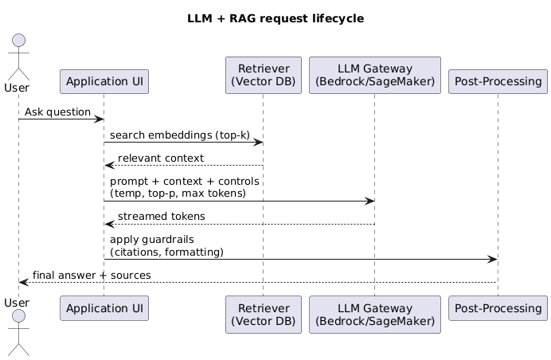
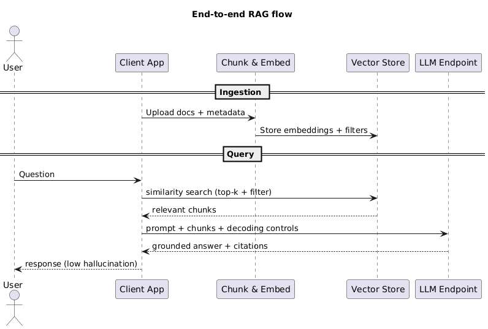

## 1. Foundation Models vs LLMs {#section-1-foundation-vs-llm}

Foundation models are massive neural networks trained on diverse data (text, code, audio, video, images) so they can be adapted to many downstream tasks. Large Language Models (LLMs) are a subset focused on token-based language tasks. Use the matrix below for quick exam recall.

<table class="study-table">
  <thead>
    <tr>
      <th>Dimension</th>
      <th>Foundation Model</th>
      <th>Large Language Model (LLM)</th>
    </tr>
  </thead>
  <tbody>
    <tr>
      <td><strong>Scope</strong></td>
      <td>Multi-modal (text, audio, image, video, code) or unimodal</td>
      <td>Primarily language + code; some add image adapters</td>
    </tr>
    <tr>
      <td><strong>Training Task</strong></td>
      <td>Generic self-supervised objectives (masking, contrastive learning, etc.)</td>
      <td>Autoregressive next-token prediction</td>
    </tr>
    <tr>
      <td><strong>Input / Output</strong></td>
      <td>Any supported modality, embeddings, or metadata</td>
      <td>Tokens (text/code) with optional tool-calls</td>
    </tr>
    <tr>
      <td><strong>Adaptation</strong></td>
      <td>Task-specific fine-tuning, adapters, RLHF</td>
      <td>Prompting, instruction tuning, RLHF, guardrails</td>
    </tr>
    <tr>
      <td><strong>Use Cases</strong></td>
      <td>Vision, audio, multi-modal search, robotics</td>
      <td>Chatbots, Q&A, summarization, agents, code-gen</td>
    </tr>
  </tbody>
</table>

---

## 2. Training Hyperparameters You Must Know {#section-2-training-basics}

- **Epochs** – One pass over the full training set. Multiple batches make up an epoch; models iterate through many epochs until accuracy converges or validation loss stops improving.
- **Batch size** – Number of records processed per update. Small batches fit on modest GPUs and introduce more gradient noise (helpful for generalization); large batches use more memory but stabilize training.
- **Learning rate** – Size of each weight update. High rates (e.g., `1e-1`) converge quickly but can overshoot; low rates (e.g., `5e-5` for BERT) are slower but safer. Most schedulers decay the rate as training progresses.

Remember: adjusting these three knobs is often enough to fix unstable training before you consider changing the model architecture.

---

## 3. Why Transformers Matter {#section-3-transformers}

Transformers replaced recurrent networks by relying on **self-attention**, which lets every token weigh every other token in the sequence to build contextual embeddings. Positional encodings preserve word order, and encoder/decoder stacks process inputs in parallel so latency scales well on GPUs. This architecture powers modern translation, summarization, speech, and vision-language models—and is the backbone of Bedrock and SageMaker JumpStart offerings.

---

## 4. Steering LLM Output {#section-4-generation-controls}

- **Temperature (0–1)** – Scales the probability distribution before sampling. Lower values push the model toward the single most likely answer (deterministic); higher values encourage creative or varied text.
- **Top-p (nucleus sampling)** – Keeps only the smallest set of tokens whose cumulative probability is ≥ `p`. Lower `p` limits the candidate pool to highly probable tokens; higher `p` allows adventurous replies. Amazon Bedrock exposes both parameters for every supported model.

---

## 5. Retrieval-Augmented Generation (RAG) {#section-5-rag}

RAG keeps foundation models up to date without re-training:

1. Ingest documents (PDFs, FAQs, catalogs) and chunk them with metadata.
2. Create embeddings and store them in a vector index such as OpenSearch Serverless, Aurora Postgres + pgvector, or Knowledge Bases for Amazon Bedrock.
3. When the user asks a question, retrieve the most relevant chunks.
4. Pass the question + retrieved context to the LLM so the answer cites fresh data.

This pattern is cheaper than fine-tuning every time the knowledge base changes and is the default recommendation on the exam for “most current answers at low cost.”

---

## 6. Specializing a Foundation Model {#section-6-specialization}

### 6.1 Domain Adaptation Fine-Tuning {#section-6-1-domain-adaptation}

- Start with a general foundation model, then fine-tune on labeled domain-specific prompts/responses.
- Best when you have curated task data (support tickets, contracts, medical summaries) and need the model to follow strict formats or voice.
- Requires fewer tokens than pre-training because you are only nudging existing weights.

### 6.2 Continued Pre-Training {#section-6-2-continued-pretraining}

- Feed the model a large unlabeled corpus from your domain to extend its vocabulary and context understanding before supervised fine-tuning.
- Use this when jargon-heavy data (legal, biotech, oil & gas) is missing from the public corpus. You still need to run a fine-tune afterward for task instructions.

Exam tip: choose fine-tuning for adapting behavior on known tasks; choose continued pre-training when the base knowledge is insufficient.

---

## 7. Embeddings and BERT {#section-7-embeddings}

Embedding models convert words, sentences, or images into dense vectors so that similar items land close together in multi-dimensional space. BERT (Bidirectional Encoder Representations from Transformers) generates contextual embeddings by looking at words both before and after the target token. Because embeddings change with context, BERT excels at intent detection, entity recognition, and semantic search where static word vectors fail.

---

## 8. AWS AI Services Cheat Sheet {#section-8-aws-services}

<table class="study-table">
  <thead>
    <tr>
      <th>Service</th>
      <th>Category</th>
      <th>What to Remember</th>
    </tr>
  </thead>
  <tbody>
    <tr>
      <td><strong>Amazon Bedrock</strong></td>
      <td>Foundation Models</td>
      <td>Serverless access to Titan, Anthropic, Meta, Cohere, Mistral models; built-in RAG and guardrails.</td>
    </tr>
    <tr>
      <td><strong>Amazon SageMaker</strong></td>
      <td>Build/Train/Deploy</td>
      <td>Custom training, fine-tuning, autopilot, and JumpStart model zoo.</td>
    </tr>
    <tr>
      <td><strong>Amazon Transcribe</strong></td>
      <td>Speech-to-Text</td>
      <td>Streaming/batch transcription with channel identification and redaction.</td>
    </tr>
    <tr>
      <td><strong>Amazon Comprehend</strong></td>
      <td>Natural Language</td>
      <td>Entity detection, sentiment, key phrases, PII redaction; supports custom classification.</td>
    </tr>
    <tr>
      <td><strong>Amazon Rekognition</strong></td>
      <td>Vision</td>
      <td>Image/video labels, face search, unsafe content, text detection.</td>
    </tr>
    <tr>
      <td><strong>Amazon Textract</strong></td>
      <td>Document AI</td>
      <td>Structured extraction (forms, tables) beyond OCR.</td>
    </tr>
    <tr>
      <td><strong>Amazon Polly</strong></td>
      <td>Text-to-Speech</td>
      <td>Neural voices, Speech Marks for lip-sync, Lex integration.</td>
    </tr>
    <tr>
      <td><strong>Amazon Lex</strong></td>
      <td>Conversational</td>
      <td>Build chat/voice bots with slots, Lambda fulfillment, multi-lingual support.</td>
    </tr>
    <tr>
      <td><strong>Amazon Translate</strong></td>
      <td>Machine Translation</td>
      <td>Real-time and batch translation with active custom terminology.</td>
    </tr>
  </tbody>
</table>

---

## 9. LLM Conversation Flow Diagram {#section-9-llm-diagram}

Use this UML snippet to visualize how user prompts move through retrieval, inference, and back to the UI.

  
  

    🧠 LLM Conversation Flow
  

  

---

## 10. Exam Reminders {#section-10-exam-reminders}

- Always justify RAG when the requirement is “fresh data without retraining.”
- Pick domain adaptation fine-tuning when the task format is known; pick continued pre-training when the vocabulary is missing.
- Control hallucinations by lowering temperature/top-p and grounding answers with retrieved context.
- Know the basic capability of each managed AI service—exam questions often ask you to swap Rekognition (vision) vs Textract (document parsing) vs Comprehend (text NLP).

---

## 11. Prompt Engineering Essentials {#section-11-prompt-engineering}

- **Zero-shot vs few-shot** – Zero-shot relies purely on instructions, ideal for broad Q&A; few-shot includes curated examples so the model mirrors tone or schema. Prefer few-shot when responses must follow strict formatting.
- **System vs user prompts** – System prompts set persona/policies; user prompts keep transient context. Adjust system prompts for compliance tone without retraining.
- **Structured outputs** – Describe the schema (JSON/YAML) and list mandatory/optional fields; combine with Bedrock Guardrails or Lex slot validation to reject malformed payloads.
- **Decoding controls** – Temperature, top-p, max tokens, and stop sequences govern creativity, latency, and runaway responses. Exams often ask you to lower temperature and add stop sequences to cap emails or policies.
- **Tool/function calling** – Document available functions (name + parameters). The LLM decides whether to call a tool and returns JSON so the orchestrator can act. Key concept for Bedrock Agents and custom controllers.

_Exam tip: Keep prompts short, move reusable policy text to templates, and cap `max_tokens` to avoid surprise billing._

---

## 12. RAG Architecture & Tuning {#section-12-rag-architecture}

- **Chunking + overlap** – Target 200–500 token chunks with 10–20% overlap so passages maintain context without blowing up storage.
- **Embeddings + vector stores** – Use Titan Text Embeddings, Cohere Embed, or open-source (bge/e5) with OpenSearch Serverless, Aurora pgvector, Neptune Analytics, or Bedrock Knowledge Bases.
- **Top-k retrieval + metadata filters** – Start with `k=3–5`, then filter by product, locale, or classification labels to cut noise.
- **Reranking + hybrid search** – Combine dense vectors with keyword/BM25 or use rerankers when rare terms or legal phrases matter.
- **Latency vs cost** – Larger vectors improve recall but add milliseconds and storage fees. Cache popular context windows; pre-compute embeddings offline.

  
  

    🧱 RAG Architecture
  

  

_Exam tip: Answer “Use Bedrock Knowledge Bases” whenever the question stresses managed ingestion + retrieval._

---

## 13. Agents & Tool Use {#section-13-agents}

- **Agent vs RAG** – Use RAG for better context inside a single response. Use agents when you need planning, multi-step workflows, or to call APIs/DBs dynamically.
- **Tool calling patterns** – The agent interprets intent, chooses a tool (Lambda/HTTPS/Step Functions), executes it, ingests the result, and may loop until complete.
- **AWS mapping** – Bedrock Agents orchestrate reasoning, call Lambda for business logic, Step Functions for long-running jobs, and can integrate RAG for grounding.

  
  

    🤖 Agent Tool Chain
  

  

_Exam tip: If the requirement says “call internal APIs and external SaaS with reasoning,” pick Bedrock Agents with Lambda tools._

---

## 14. Evaluation & Hallucination Control {#section-14-eval}

- **Offline evaluation** – Score prompts/models against golden datasets for accuracy, BLEU/ROUGE, or custom rubric. Automate in SageMaker pipelines.
- **Human + LLM-as-judge** – SMEs validate edge cases; LLM judges accelerate regression testing but must be calibrated.
- **Grounding + citations** – Return snippet IDs or URLs so auditors can verify answers. Bedrock Knowledge Bases can include citations automatically.
- **Temperature + guardrails** – Keep temperature/top-p low for factual tasks and add Guardrails for profanity/PII filters or JSON schemas.

_Exam tip: When compliance reviewers are mentioned, respond with “human-in-the-loop evaluation plus logged citations.”_

---

## 15. Responsible AI, Privacy, Security {#section-15-responsible-ai}

- **Bias/fairness** – Audit datasets, compare outputs across demographic slices, and document mitigations.
- **PII governance** – Mask prompts, encrypt data (KMS), route calls through VPC endpoints/PrivateLink, and restrict IAM roles for agents/tools.
- **Hallucination + safety** – Pair RAG grounding with Guardrails to block unsafe content and require human review for high-risk actions.
- **AWS mapping** – Use Bedrock Guardrails, IAM least privilege, CloudTrail logging, and encrypted vector stores/S3 buckets.

---

## 16. Cost Optimization for GenAI {#section-16-cost}

- **Token drivers** – Shorten system prompts, trim few-shot examples, and cap max tokens. Every unused token is direct cost.
- **Caching** – Cache embeddings, retrieval hits, and deterministic responses to avoid re-querying the LLM.
- **Model sizing** – Start with smaller models (e.g., 13B) and scale up only if KPIs demand it. Use distillation or parameter-efficient fine-tuning for narrow tasks.
- **Batch vs real-time** – Batch summarize archives or compliance logs; reserve real-time endpoints for interactive needs. SageMaker and Bedrock both support asynchronous invocations.
- **RAG vs fine-tune vs prompt** – RAG minimizes retraining when knowledge updates frequently, fine-tuning lowers per-request tokens for repetitive tasks, and improved prompting can defer expensive training entirely.

_Exam tip: Mention “use Bedrock serverless invocation + caching” whenever the question references “spiky demand” or “cost control.”_

---

## 17. Decision Matrix {#section-17-decision-matrix}

<table class="study-table">
  <thead>
    <tr>
      <th>Approach</th>
      <th>When to Choose</th>
      <th>Exam Trigger Words</th>
    </tr>
  </thead>
  <tbody>
    <tr>
      <td><strong>Prompting</strong></td>
      <td>General knowledge, low customization, rapid experimentation.</td>
      <td>“No training budget,” “quick prototype.”</td>
    </tr>
    <tr>
      <td><strong>RAG</strong></td>
      <td>Fresh proprietary data, citations, large document sets.</td>
      <td>“Latest manuals,” “ground answers,” “no retraining.”</td>
    </tr>
    <tr>
      <td><strong>Fine-tuning</strong></td>
      <td>Strict formats, domain tone, curated labeled data.</td>
      <td>“Consistent summaries,” “approved style guide.”</td>
    </tr>
    <tr>
      <td><strong>Continued Pretraining</strong></td>
      <td>Missing vocabulary/jargon, massive unlabeled domain corpus.</td>
      <td>“Industry-specific terms,” “expand base knowledge.”</td>
    </tr>
    <tr>
      <td><strong>Agents</strong></td>
      <td>Multi-step reasoning, tool invocation, integrations.</td>
      <td>“Plan workflow,” “call APIs,” “take actions.”</td>
    </tr>
  </tbody>
</table>

---
