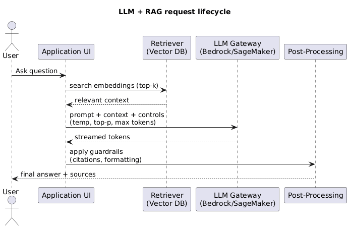
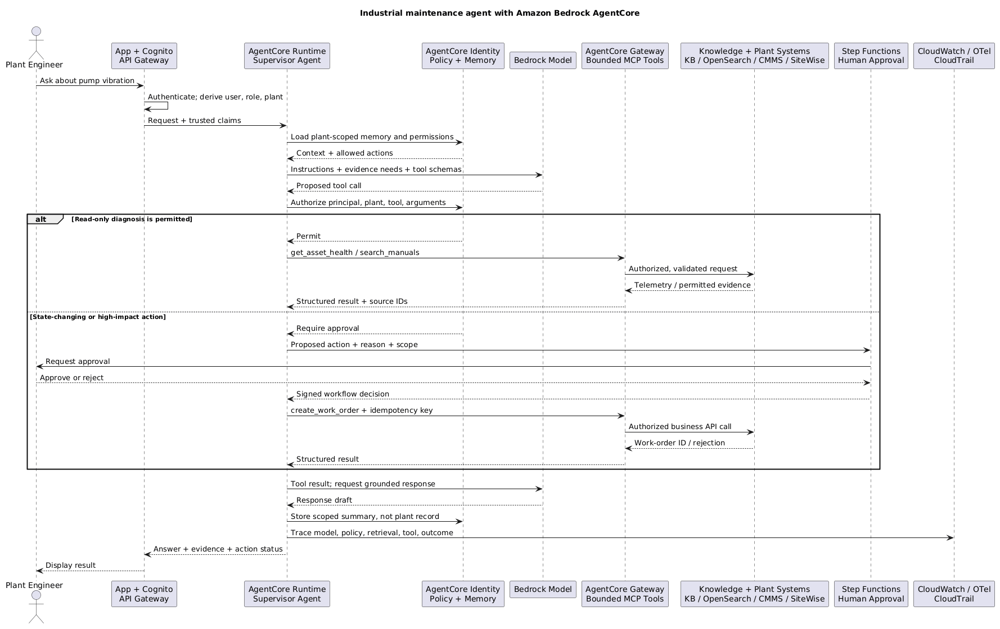

# AWS AI Services

Use this page to map an AI architecture to AWS services. It is intentionally AWS-specific; model mechanics, retrieval theory, agents, and cloud-neutral production controls remain on their dedicated pages.

## Agent architecture mapped to AWS {#agent-layer-map}

Start with the [bounded agent tool sequence](/study/aiAgents#section-1-boundaries). The layers below map each responsibility in that vendor-neutral design to AWS implementation choices; they are not a mandatory five-service stack.

<table class="study-table agent-layer-table">
  <thead>
    <tr>
      <th>Layer</th>
      <th>Bounded-agent responsibility</th>
      <th>AWS implementation choices</th>
      <th>Boundary to remember</th>
    </tr>
  </thead>
  <tbody>
    <tr>
      <td><strong>Interface Layer</strong></td>
      <td>
        <ul>
          <li>Accept the user request.</li>
          <li>Pass trusted identity to the Agent Controller.</li>
          <li>Return or stream the response.</li>
        </ul>
      </td>
      <td>
        <ul>
          <li>Amazon CloudFront and AWS WAF</li>
          <li>Amazon API Gateway</li>
          <li>Amazon Cognito</li>
          <li>Lambda or ECS application endpoint</li>
          <li>AgentCore Runtime endpoint where appropriate</li>
        </ul>
      </td>
      <td>
        <ul>
          <li>Authenticate the caller.</li>
          <li>Validate and throttle requests.</li>
          <li>Convert identity into trusted claims—not prompt text.</li>
        </ul>
      </td>
    </tr>
    <tr>
      <td><strong>Agent Layer</strong></td>
      <td>
        <ul>
          <li>Run the Agent Controller.</li>
          <li>Build context and choose bounded next steps.</li>
          <li>Apply policy, budgets, and approval decisions.</li>
        </ul>
      </td>
      <td>
        <ul>
          <li>AgentCore Runtime or Harness</li>
          <li>AgentCore Identity and Policy</li>
          <li>AWS Step Functions for deterministic workflow and approval</li>
          <li>Lambda, ECS, or EKS for custom orchestration</li>
          <li>Bedrock Agents Classic for existing workloads</li>
        </ul>
      </td>
      <td>
        <ul>
          <li>Enforce step, time, token, and cost limits.</li>
          <li>Treat model output as a proposal.</li>
          <li>Let policy and workflow make the final execution decision.</li>
        </ul>
      </td>
    </tr>
    <tr>
      <td><strong>Memory Layer</strong></td>
      <td>
        <ul>
          <li>Store conversation and working context.</li>
          <li>Persist task progress, tool results, and idempotency state.</li>
          <li>Retrieve useful long-term memories.</li>
        </ul>
      </td>
      <td>
        <ul>
          <li>AgentCore Memory for short- and long-term conversational memory</li>
          <li>Amazon DynamoDB for task and idempotency state</li>
          <li>Amazon Aurora or RDS for transactional state</li>
          <li>Amazon S3 for durable artifacts</li>
        </ul>
      </td>
      <td>
        <ul>
          <li>Scope memory by actor, session, and tenant.</li>
          <li>Do not treat inferred memories as verified facts.</li>
          <li>Keep authoritative business state in an explicit system of record.</li>
        </ul>
      </td>
    </tr>
    <tr>
      <td><strong>Tooling Layer</strong></td>
      <td>
        <ul>
          <li>Execute approved tool calls.</li>
          <li>Retrieve external knowledge.</li>
          <li>Return bounded observations to the Agent Controller.</li>
        </ul>
      </td>
      <td>
        <ul>
          <li>AgentCore Gateway for MCP, API, and Lambda tools</li>
          <li>Lambda and API Gateway adapters</li>
          <li>Step Functions for durable actions</li>
          <li>Bedrock Knowledge Bases, OpenSearch, or Kendra for retrieval</li>
          <li>EventBridge and SQS for asynchronous work</li>
        </ul>
      </td>
      <td>
        <ul>
          <li>Validate schema, authorization, risk, and timeout.</li>
          <li>Use idempotency for side effects.</li>
          <li>Do not confuse Gateway connectivity with business permission.</li>
        </ul>
      </td>
    </tr>
    <tr>
      <td><strong>Model Layer</strong></td>
      <td>
        <ul>
          <li>Interpret the supplied context.</li>
          <li>Propose an action or produce the final answer.</li>
        </ul>
      </td>
      <td>
        <ul>
          <li>Foundation models through Amazon Bedrock</li>
          <li>Custom or controlled endpoints through SageMaker AI</li>
        </ul>
      </td>
      <td>
        <ul>
          <li>Predict tokens; do not grant permissions.</li>
          <li>Do not provide transaction guarantees.</li>
          <li>Do not act as authoritative durable memory.</li>
        </ul>
      </td>
    </tr>
  </tbody>
</table>

- AgentCore spans several layers because it is modular:
  - Runtime/Harness and Policy belong mainly to the Agent Layer;
  - Memory belongs to the Memory Layer;
  - Gateway belongs to the Tooling Layer;
  - Identity connects trusted identity across Interface, Agent, and Tooling boundaries.
- Cross-cutting controls apply to every layer: IAM and resource policies, KMS, Secrets Manager, VPC endpoints/PrivateLink, CloudWatch, CloudTrail, WAF, and workload evaluation.
- Read the stack as:

~~~text
User → Interface → Agent Controller → Model
                         ↕
                       Memory
                         ↓
                Tools / Retrieval / Workflows
~~~

## 1. Start with the architecture problem {#section-1-decisions}

- Need managed access to foundation models and GenAI building blocks?
  - Start with **Amazon Bedrock**.
- Need custom training, full ML lifecycle, serving-container control, or dedicated model endpoints?
  - Start with **Amazon SageMaker AI**.
- Need custom lexical, vector, filtered, or hybrid search?
  - Start with **Amazon OpenSearch Service**.
- Need managed enterprise search with connectors and document ACL awareness?
  - Evaluate **Amazon Kendra**.
- Need managed standard RAG connected to a Bedrock model?
  - Evaluate **Knowledge Bases for Amazon Bedrock**.
- Need to deploy and operate custom agents with managed runtime, memory, tools, identity, policy, and tracing?
  - Evaluate **Amazon Bedrock AgentCore**.
- These choices can be combined; they are architecture boundaries, not mutually exclusive products.

<div class="image-wrapper">
  
  <div class="diagram-caption" data-snippet-id="aws-ai-flow-snippet">
    ☁️ AWS AI application request sequence
  </div>
  <script type="text/plain" id="aws-ai-flow-snippet">
@startuml
title AWS AI application request flow
actor User
participant "API Gateway / Application" as App
participant "Cognito / IAM" as Identity
participant "Bedrock Knowledge Base\nOpenSearch / Kendra" as Retrieval
participant "Amazon Bedrock" as Bedrock
participant "Lambda / AWS Service Tool" as Tool
participant "CloudWatch / CloudTrail" as Audit
User -> App: Request + identity token
App -> Identity: Authenticate and authorize
Identity --> App: Trusted principal + claims
App -> Retrieval: Query + permitted metadata filters
Retrieval --> App: Ranked evidence + source IDs
App -> Bedrock: Instructions + evidence + tool schema
Bedrock --> App: Answer or tool proposal
alt Tool proposed and authorized
  App -> Tool: Validated arguments + least-privilege role
  Tool --> App: Structured result
  App -> Bedrock: Tool result
  Bedrock --> App: Final response
end
App -> Audit: Metrics, trace, policy decision
App --> User: Response + citations
@enduml
  </script>
</div>

## 2. Amazon Bedrock {#section-2-bedrock}

- Bedrock is a fully managed platform for consuming foundation models from Amazon and third-party providers.
- Bedrock is **not itself a model**.
- The exact model determines:
  - modalities;
  - context and output limits;
  - tool/structured-output behaviour;
  - inference parameters;
  - regional availability;
  - quota and capacity options.
- Keep model IDs and Region support in deployment configuration because the catalogue changes.

### 2.1 Inference choices {#section-2-1-inference}

- **On-demand inference**:
  - useful for variable or early-stage workloads;
  - subject to service/model quotas and throttling.
- **Streaming inference**:
  - improves time to first visible output;
  - does not remove total token cost or the need for output controls.
- **Batch inference**:
  - useful for non-interactive, high-volume processing;
  - requires asynchronous job and output handling.
- **Inference profiles / cross-Region routing**:
  - can improve capacity and routing where supported;
  - require review of permitted processing Regions, IAM, quotas, and data-residency policy.
- **Provisioned Throughput**:
  - reserves model capacity where supported;
  - useful for predictable demand or throughput requirements;
  - creates commitment/utilization trade-offs.
- **Custom/imported models**:
  - Bedrock supports selected customization and import paths;
  - verify model, Region, deployment, and lifecycle constraints rather than assuming parity with SageMaker AI.

### 2.2 Bedrock application capabilities {#section-2-2-capabilities}

- **Knowledge Bases**:
  - managed ingestion and RAG retrieval/generation integration;
  - covered in the retrieval comparison below.
- **Bedrock Agents Classic**:
  - orchestrate model decisions across action groups and knowledge bases;
  - action groups commonly use Lambda or return control to the application;
  - use aliases/versions, traces, bounded execution, least-privilege roles, and approval gates;
  - is an existing-workload path: AWS states that it is no longer open to new customers after 30 July 2026 and directs similar new implementations toward AgentCore.
- **Flows**:
  - compose prompts, models, knowledge bases, conditions, and AWS integrations into explicit flows;
  - useful when visual/managed orchestration fits the process;
  - compare with Step Functions when broader durable AWS workflow semantics are needed.
- **Guardrails**:
  - apply configurable input/output policies such as content, denied topics, word filters, and sensitive-information handling where supported;
  - can be applied independently in selected workflows;
  - do not replace IAM, tenant authorization, tool validation, WAF, or domain rules.
- **Prompt management**:
  - versions and tests prompt templates and variables;
  - helps deployment discipline but does not replace repository versioning and end-to-end regression tests.
- **Evaluation**:
  - supports model and knowledge-base evaluation capabilities, including automated and human-oriented approaches where available;
  - retain workload-specific datasets and release gates outside any single managed feature.

## 3. Amazon Bedrock AgentCore {#section-3-agentcore}

- AgentCore is a modular platform for deploying and operating agents; it is **not a model**.
- It can run agents built with frameworks such as Strands Agents, LangGraph, CrewAI, or LlamaIndex and can use Bedrock or other supported model providers.
- Adopt only the components the architecture needs:
  - **Runtime** runs custom agent code in managed, isolated, serverless sessions.
  - **Harness** provides a managed agent loop when configuring instructions, models, and tools is preferable to owning the loop.
  - **Gateway** exposes APIs, Lambda functions, and services as controlled tools, including through MCP; it handles tool discovery, ingress authentication, and credential exchange.
  - **Identity** carries user/agent identity and obtains authorized credentials for AWS or third-party services.
  - **Policy** applies deterministic action rules independently of what the model proposes.
  - **Memory** stores short- and long-term agent context; it must be scoped by user and tenant and is not the business system of record.
  - **Browser** and **Code Interpreter** provide isolated capabilities for browsing and code execution where required.
  - **Observability** and **Evaluations** expose agent, model, and tool behaviour for tracing and quality measurement.
- AgentCore does not remove the need for application authentication, source-system authorization, least-privilege IAM, data isolation, or human approval.

### 3.1 AgentCore versus Bedrock Agents Classic versus Step Functions {#section-3-1-agentcore-boundary}

- Choose **AgentCore** for new implementations when custom or managed agent loops need runtime, memory, tool connectivity, identity, policy, and observability.
- Maintain or migrate **Bedrock Agents Classic** when an existing workload uses managed model-led orchestration around instructions, action groups, and knowledge bases.
- Choose **Step Functions** when the states, branches, retries, compensations, and approvals are known in advance.
- Combine them when useful:
  - AgentCore handles bounded reasoning and tool selection;
  - Step Functions owns durable business workflow and human approval;
  - business APIs remain responsible for validating and authorizing every state change.

### 3.2 Industrial example: plant-maintenance agent {#section-3-2-industrial-example}

- **Use case**: a plant engineer asks why a pump is vibrating and, if justified, requests a maintenance work order.
- **Entry boundary**:
  - AWS WAF protects the public endpoint;
  - Amazon Cognito authenticates the engineer;
  - API Gateway passes trusted identity claims such as `user_id`, `plant_id`, and `role` to the application.
- **Agent boundary**:
  - AgentCore Runtime hosts a supervisor agent built with a selected framework;
  - the agent invokes a Bedrock model for reasoning but treats model output as a proposal;
  - AgentCore Identity and Policy restrict which tools that principal can invoke for that plant.
- **Tool boundary**:
  - AgentCore Gateway exposes narrow tools such as `get_asset_health`, `search_manuals`, and `create_work_order`;
  - Lambda/API adapters call AWS IoT SiteWise, the maintenance system, or other industrial APIs;
  - tool schemas, server-side authorization, validation, timeouts, and idempotency remain mandatory.
- **Knowledge boundary**:
  - manuals and incident history can be retrieved through Bedrock Knowledge Bases or OpenSearch over documents in S3;
  - `plant_id`, asset class, and document ACLs constrain retrieval;
  - metadata relevance filters do not replace authorization at the source.
- **State boundary**:
  - AgentCore Memory can retain scoped conversational context and preferences;
  - asset telemetry and work-order status remain authoritative in their operational systems.
- **Safety boundary**:
  - read-only diagnosis may execute automatically when policy permits;
  - work orders, shutdown requests, or other high-impact actions use Step Functions and human approval;
  - the agent must not directly write to PLCs or bypass deterministic industrial safety controls.
- **Operations boundary**:
  - use VPC connectivity/private endpoints where supported, KMS encryption, and Secrets Manager for credentials;
  - CloudWatch/OpenTelemetry records the model, policy, retrieval, tool, latency, and outcome trace;
  - CloudTrail records supported AWS API activity;
  - EventBridge and SQS decouple telemetry/document ingestion and absorb bursts.

<div class="image-wrapper">
  
  <div class="diagram-caption" data-snippet-id="agentcore-industrial-sequence-snippet">
    🏭 Production AgentCore sequence: diagnose freely, mutate only with approval
  </div>
  <script type="text/plain" id="agentcore-industrial-sequence-snippet">
@startuml
title Industrial maintenance agent with Amazon Bedrock AgentCore
actor "Plant Engineer" as User
participant "App + Cognito\nAPI Gateway" as Edge
participant "AgentCore Runtime\nSupervisor Agent" as Runtime
participant "AgentCore Identity\nPolicy + Memory" as Controls
participant "Bedrock Model" as Model
participant "AgentCore Gateway\nBounded MCP Tools" as Gateway
participant "Knowledge + Plant Systems\nKB / OpenSearch / CMMS / SiteWise" as Systems
participant "Step Functions\nHuman Approval" as Approval
participant "CloudWatch / OTel\nCloudTrail" as Audit

User -> Edge: Ask about pump vibration
Edge -> Edge: Authenticate; derive user, role, plant
Edge -> Runtime: Request + trusted claims
Runtime -> Controls: Load plant-scoped memory and permissions
Controls --> Runtime: Context + allowed actions
Runtime -> Model: Instructions + evidence needs + tool schemas
Model --> Runtime: Proposed tool call
Runtime -> Controls: Authorize principal, plant, tool, arguments

alt Read-only diagnosis is permitted
  Controls --> Runtime: Permit
  Runtime -> Gateway: get_asset_health / search_manuals
  Gateway -> Systems: Authorized, validated request
  Systems --> Gateway: Telemetry / permitted evidence
  Gateway --> Runtime: Structured result + source IDs
else State-changing or high-impact action
  Controls --> Runtime: Require approval
  Runtime -> Approval: Proposed action + reason + scope
  Approval -> User: Request approval
  User --> Approval: Approve or reject
  Approval --> Runtime: Signed workflow decision
  Runtime -> Gateway: create_work_order + idempotency key
  Gateway -> Systems: Authorized business API call
  Systems --> Gateway: Work-order ID / rejection
  Gateway --> Runtime: Structured result
end

Runtime -> Model: Tool result; request grounded response
Model --> Runtime: Response draft
Runtime -> Controls: Store scoped summary, not plant record
Runtime -> Audit: Trace model, policy, retrieval, tool, outcome
Runtime --> Edge: Answer + evidence + action status
Edge --> User: Display result
@enduml
  </script>
</div>

## 4. Amazon Bedrock versus SageMaker AI {#section-4-bedrock-sagemaker}

- Choose **Bedrock** when the main goal is to:
  - consume supported foundation models through managed APIs;
  - switch among catalogue models with less serving infrastructure;
  - use managed GenAI capabilities such as Knowledge Bases, Agents, Flows, Guardrails, or prompt management;
  - integrate with AWS identity, networking, logging, and billing.
- Choose **SageMaker AI** when the main goal is to:
  - prepare data and run training jobs;
  - build custom ML models or use custom training code;
  - fine-tune with broader control over compute and artifacts;
  - deploy custom containers/models to controlled endpoints;
  - choose real-time, serverless, asynchronous, or batch inference patterns where supported;
  - operate notebooks, experiments, model registry, and ML pipelines/lifecycle.
- The real decision boundary is **managed model capability versus lifecycle/serving control**, not simply “GenAI versus ML”.
- Use both when useful:
  - custom classifier or embedding endpoint on SageMaker AI + generation on Bedrock;
  - model trained/customized through SageMaker AI and deployed through an appropriate SageMaker or Bedrock path;
  - Bedrock for rapid evaluation, then a controlled endpoint when economics or specialization justify it.
- Compare using:
  - supported model and customization technique;
  - serving/container and hardware control;
  - scaling and cold-start behaviour;
  - networking and encryption requirements;
  - operations expertise;
  - utilization and total cost;
  - model artifact portability.

## 5. Knowledge Bases for Amazon Bedrock {#section-5-bedrock-kb}

- A managed Knowledge Base can coordinate supported parts of:
  - source connection and ingestion;
  - parsing and chunking configuration;
  - embedding generation;
  - vector/knowledge store integration;
  - metadata filtering;
  - retrieval and reranking options;
  - `Retrieve` or retrieve-and-generate application flows;
  - citations/source attribution.
- Managed convenience is strongest for standard RAG with supported sources and stores.
- Validate rather than assume:
  - parser quality for PDFs, tables, images, and scanned documents;
  - chunking strategy and parent/child behaviour;
  - freshness and sync failure handling;
  - exact-match and hybrid-search behaviour;
  - metadata and ACL enforcement;
  - vector store, Region, embedding, and reranker compatibility;
  - retrieval traces and evaluation access.
- Use custom retrieval when the workload needs:
  - specialized document parsing;
  - complex entitlement logic;
  - carefully tuned lexical/vector fusion;
  - custom query rewriting or reranking;
  - graph, SQL, API, or multi-index retrieval;
  - strict freshness or ingestion transactions;
  - full control over candidate scoring and context assembly.
- Agentic retrieval can decompose complex questions and iterate across managed knowledge-base retrievers where supported:
  - useful for multi-step questions;
  - adds model calls, latency, cost, and more failure paths;
  - bound iterations and evaluate against simpler retrieval.

## 6. Amazon OpenSearch Service {#section-6-opensearch}

- Use OpenSearch when the application needs direct control over search/index design.
- Relevant capabilities:
  - inverted indexes and BM25 full-text search;
  - exact terms, filters, phrases, facets, and aggregations;
  - vector fields and approximate nearest-neighbour search;
  - neural/semantic search integrations;
  - hybrid search and search pipelines for combining signals;
  - metadata filtering and operational search APIs.
- Responsibilities that remain with the application/managed layer:
  - parsing and chunking;
  - document/ACL synchronization;
  - embedding lifecycle;
  - query rewriting;
  - score/rank fusion tuning;
  - reranking and context assembly;
  - generation and citation policy.
- Deployment choices:
  - managed domains provide node/topology control;
  - OpenSearch Serverless reduces cluster operations for supported collection patterns;
  - evaluate cost shape, scaling behaviour, limits, networking, and feature support.
- Failure modes:
  - vector-only retrieval misses identifiers;
  - raw BM25/vector scores are fused without normalization;
  - restrictive filters reduce ANN recall;
  - mappings or embedding dimensions drift;
  - index refresh or failed ingestion serves stale evidence;
  - an application filter is mistaken for complete authorization.

## 7. Amazon Kendra {#section-7-kendra}

- Kendra is a managed enterprise search service oriented around organizational content discovery.
- Useful capabilities include:
  - data-source connectors;
  - document indexing and field mapping;
  - ranked results, excerpts, and FAQ-style content;
  - document attributes and relevance tuning;
  - user/group context and ACL-aware filtering where supported.
- Kendra may be preferable when connector behavior and enterprise permissions are the primary problem.
- Check exact index type, API, connector, and edition/feature support:
  - ACL ingestion differs by connector;
  - documents without ACLs may be treated as public under relevant configurations;
  - group mapping and identity synchronization must stay current;
  - relevance tuning changes ranking, not authorization.
- Kendra returns search evidence; an application or Bedrock integration still owns generation, prompts, validation, and end-to-end citations.

## 8. Kendra versus OpenSearch versus Bedrock Knowledge Bases {#section-8-retrieval-choice}

- Choose **Bedrock Knowledge Bases** when:
  - managed standard RAG is the priority;
  - supported sources/stores and retrieval controls meet requirements;
  - reduced implementation effort is worth less stage-level control.
- Choose **OpenSearch** when:
  - exact terms, BM25, vectors, filters, facets, and hybrid tuning are central;
  - the team can own ingestion, schema, ranking, security integration, and operations.
- Choose **Kendra** when:
  - enterprise connectors and search-oriented ACL/user context are central;
  - managed relevance and organizational knowledge discovery matter more than low-level index control.
- Combine only with a clear boundary:
  - Bedrock Knowledge Bases can use supported retrieval stores/services;
  - a custom application can retrieve from OpenSearch or Kendra and call Bedrock for generation;
  - avoid indexing the same corpus several times without explicit ownership, freshness, and evaluation reasons.

## 9. Supporting AWS services by architecture role {#section-9-supporting-services}

### 9.1 Entry, identity, and protection {#section-9-1-entry}

- **Amazon API Gateway**:
  - authenticated API boundary, throttling, request validation, and service integration;
  - confirm streaming and timeout requirements for interactive model responses.
- **Amazon Cognito**:
  - application user sign-up/sign-in and token issuance;
  - pass trusted user/tenant claims into application authorization, not directly as model authority.
- **AWS IAM**:
  - least-privilege roles for model invocation, ingestion, retrieval, agents, Lambda, and operators;
  - use separate runtime and deployment roles; constrain resources and delegated roles.
- **AWS WAF**:
  - controls abusive/malformed public traffic and common web attacks;
  - is not a complete prompt-injection detector.
- **AWS PrivateLink / VPC endpoints**:
  - private access to supported services without public internet paths;
  - verify service/Region support and still enforce IAM and egress controls.

### 9.2 Compute and orchestration {#section-9-2-compute}

- **AWS Lambda**:
  - short ingestion transforms, validation, tool adapters, event handlers, and Agent action groups;
  - avoid forcing long-running/high-memory parsing or orchestration into Lambda limits.
- **Amazon ECS**:
  - containerized parsers, model gateways, retrieval services, workers, and long-running tools with simpler orchestration than Kubernetes.
- **Amazon EKS**:
  - Kubernetes-based custom serving and platform control;
  - justified when Kubernetes capabilities and operational maturity already exist.
- **AWS Step Functions**:
  - durable, explicit ingestion, evaluation, approval, and tool workflows;
  - useful for visible state, retries, compensation, callback, and long-running execution.
- **Amazon EventBridge**:
  - routes document, workflow, evaluation, and model lifecycle events between components.
- **Amazon SQS**:
  - buffers ingestion or inference jobs, smooths bursts/quotas, and isolates retries;
  - configure visibility timeout, dead-letter handling, deduplication/idempotency, and queue-age alarms.

### 9.3 Data and state {#section-9-3-data}

- **Amazon S3**:
  - versioned source documents, parser output, prompts, evaluation sets, model artifacts, and batch input/output;
  - use event-driven ingestion, encryption, access points/policies, lifecycle, and object versioning as required.
- **Amazon DynamoDB**:
  - task/conversation state, idempotency keys, tool status, routing configuration, and evaluation metadata;
  - design tenant-aware keys, conditional writes, and TTL deliberately.
- **Amazon Aurora / Amazon RDS**:
  - transactional application data, entitlements, audit relationships, and tool-backed business operations;
  - vector extensions may fit workloads already centered on relational consistency, but evaluate search scale/features.
- **AWS Glue**:
  - catalogues and transforms governed data for batch preparation, metadata enrichment, and analytics/evaluation pipelines;
  - it is not the online RAG orchestrator.
- **Amazon Macie**:
  - discovers sensitive data in S3 before documents enter indexes, prompts, or evaluation datasets;
  - findings need a response/quarantine workflow.

### 9.4 Encryption, secrets, and operations {#section-9-4-operations}

- **AWS KMS**:
  - customer-managed key policies and encryption boundaries for documents, indexes, logs, databases, and artifacts;
  - key policy and cross-account design are part of authorization.
- **AWS Secrets Manager**:
  - stores and rotates database, provider, and tool credentials;
  - applications retrieve secrets at runtime and never place them in model context.
- **AWS CloudTrail**:
  - records supported AWS control-plane/data events for governance and investigation;
  - configure the relevant event types, retention, and protected central storage.
- **Amazon CloudWatch**:
  - logs, metrics, alarms, dashboards, and traces for latency, throttling, errors, queues, and application outcomes;
  - redact sensitive prompts/responses and correlate with model/retrieval/tool IDs.

## 10. Reference AWS decision flow {#section-10-decision-flow}

```text
Need a managed foundation-model API?
  └─ Bedrock

Need custom training, serving code, hardware, or ML lifecycle control?
  └─ SageMaker AI

Need changing/private knowledge?
  └─ RAG
      ├─ managed standard Bedrock integration → Bedrock Knowledge Bases
      ├─ custom lexical/vector/hybrid search  → OpenSearch
      └─ enterprise connectors + ACL search  → Kendra

Need a known multi-step AWS process?
  └─ Step Functions / application workflow

Need dynamic tool choice?
  ├─ new agent/runtime implementation → AgentCore
  └─ existing action-group workload    → Bedrock Agents Classic / migration review

Need known durable states, compensation, or human approval?
  └─ Step Functions, optionally invoking an AgentCore agent
```

## 11. AWS architecture review checklist {#section-11-checklist}

- Model and Region:
  - exact model ID, quota, capacity mode, fallback, and deprecation plan are known.
- Identity:
  - caller, runtime role, agent/tool role, and deployment role are distinct and least privileged.
- Data:
  - classification, processing Region, encryption, retention, and provider-use terms are approved.
- Retrieval:
  - parser, chunking, embedding, lexical/hybrid behaviour, ACL sync, freshness, and evaluation are explicit.
- Network:
  - ingress, private endpoints, outbound destinations, DNS, and cross-account paths are documented.
- Reliability:
  - timeout, retry, idempotency, queue, quota, fallback, and degraded mode are tested.
- Safety:
  - guardrails, WAF, authorization, schema validation, and human approval have separate responsibilities.
- Observability:
  - one trace links API caller, model, retrieval, tool, IAM/policy decision, latency, tokens, and outcome.
- Evaluation:
  - prompt/model/retrieval changes run against a versioned workload suite before promotion.

For how retrieval works internally, see [AI knowledge bases](/study/aiKnowledgebases). For vendor-neutral security, reliability, cost, and evaluation, see [AI infrastructure and evaluation](/study/aiInfrastructure).

## Official references {#official-references}

- [Amazon Bedrock documentation](https://docs.aws.amazon.com/bedrock/)
- [Amazon Bedrock AgentCore overview](https://docs.aws.amazon.com/bedrock-agentcore/latest/devguide/what-is-bedrock-agentcore.html)
- [AgentCore Memory types](https://docs.aws.amazon.com/bedrock-agentcore/latest/devguide/memory-types.html)
- [AgentCore Gateway](https://docs.aws.amazon.com/bedrock-agentcore/latest/devguide/gateway.html)
- [AgentCore VPC connectivity](https://docs.aws.amazon.com/bedrock-agentcore/latest/devguide/agentcore-vpc.html)
- [AgentCore multi-tenant reference architecture](https://aws.amazon.com/blogs/machine-learning/shared-infrastructure-isolated-tenants-pool-model-multi-tenancy-with-amazon-bedrock-agentcore/)
- [Bedrock Agents Classic action groups and maintenance notice](https://docs.aws.amazon.com/bedrock/latest/userguide/agents-action-create.html)
- [Deploy models for inference with SageMaker AI](https://docs.aws.amazon.com/sagemaker/latest/dg/deploy-model.html)
- [Amazon OpenSearch Service neural and hybrid search](https://docs.aws.amazon.com/opensearch-service/latest/developerguide/serverless-configure-neural-search.html)
- [Amazon Kendra user-context filtering](https://docs.aws.amazon.com/kendra/latest/dg/user-context-filter.html)
- [Amazon Kendra relevance tuning](https://docs.aws.amazon.com/kendra/latest/dg/tuning.html)
