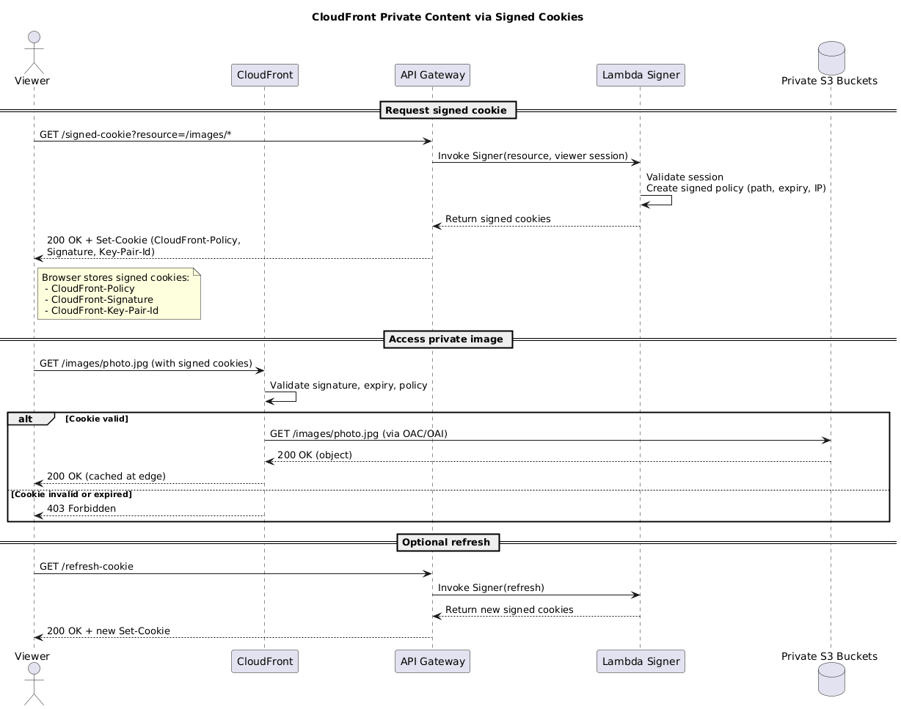
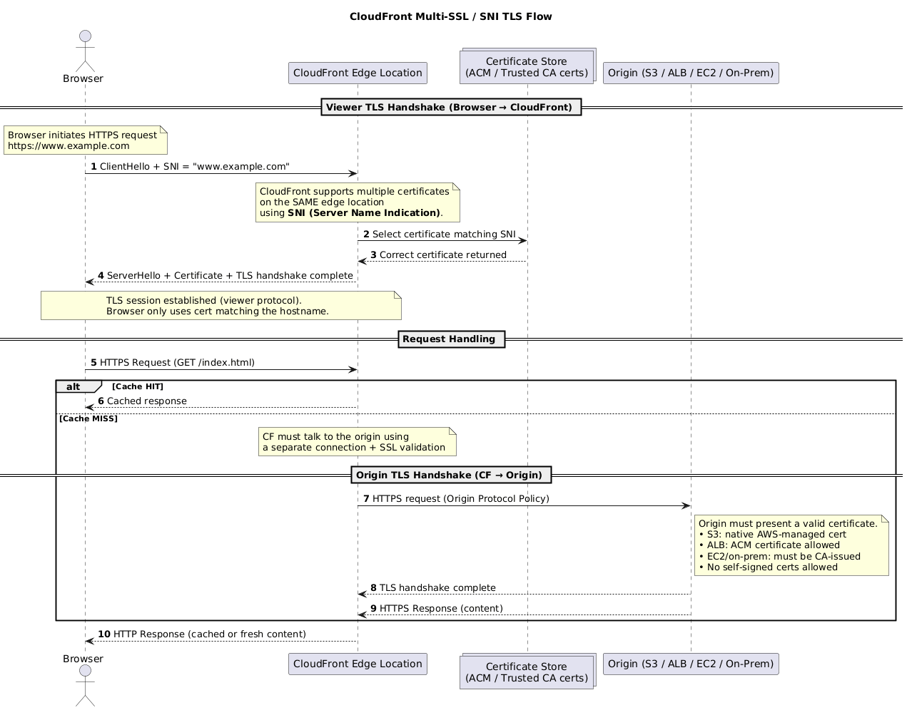

## 1. Amazon CloudFront {#section-1-amazon-cloudfront}

Global CDN that accelerates downloads by caching objects at edge locations (PoPs) backed by regional edge caches before reaching the origin (S3, ALB, MediaPackage, custom HTTP endpoints).

  
  
🧩 CloudFront signed-cookie flow

  

### 1.1 Private Content & Security {#section-1-1-cloudfront-security}

- **Origin Access Control (OAC)** – recommended successor to Origin Access Identity. Grants CloudFront a unique IAM principal to read private S3 buckets; attach the generated policy to S3.
- **Custom origins** – restrict access using secret headers or Web Application Firewall (WAF) IP sets (CloudFront IP ranges). OAC/OAI not supported with ALB/EC2 origins.
- **Private content** – require signed URLs or signed cookies per behavior. Trusted key groups provide flexible signer management. Combine with API Gateway/Lambda to issue short-lived cookies after auth.
- **Geo restriction** – built-in country-level allow/deny lists using geo-IP databases. For finer control, front CloudFront with an authorization service that issues signed URLs.
- **Field-level encryption** – encrypt sensitive form fields at the edge so only designated backends can decrypt payloads, even after CloudFront forwards over HTTPS.
- **TLS/SNI handshake** – when a viewer connects over HTTPS, CloudFront presents the certificate associated with your alternate domain name. Server Name Indication (SNI) allows multiple certs per IP, so viewers include the hostname in the TLS ClientHello before encryption. For legacy clients lacking SNI, use dedicated IP distributions. Between CloudFront and the origin, a second TLS session is negotiated using the origin’s cert; custom origins must present a cert from a trusted public CA.

  
  
🧩 CloudFront SNI flow

  

### 1.2 Distribution Building Blocks {#section-1-2-cloudfront-architecture}

- **Origins** – S3 bucket, ALB, MediaStore, MediaPackage, or any publicly reachable HTTP server. Each origin can be tied to one or more cache behaviors.
- **Cache behaviors** – routing rules based on path patterns (`*`, `img/*`, etc.) mapping viewers to specific origins, viewer/origin protocols, headers, cookies, and query strings.
- **Edge → Regional edge cache → Origin flow** – if the edge server misses, it checks the regional cache before touching the origin, reducing load.
- **Viewer vs Origin protocol** – choose HTTP/HTTPS per side; enforce minimum TLS versions for custom origins. ACM certificates (issued in `us-east-1`) cover alternate domain names.

### 1.3 Caching Controls {#section-1-3-cloudfront-caching}

- **TTL defaults** – 24 hours unless overridden. Cache keys include object name, optional query strings, cookies, and headers.
- **HTTP directives** – `Cache-Control: max-age`, `s-maxage`, and `Expires` headers override cache lifetime. Minimum and maximum TTLs can be enforced per behavior.
- **Invalidations** – manually expire objects before TTL (wildcards allowed). Versioned object names (`app_v42.js`) avoid invalidation charges.
- **Cache hit ratio** – higher hit ratios reduce origin load; forward only the headers/cookies/query strings required by the application to keep cache keys compact.

### 1.4 Lambda@Edge {#section-1-4-lambda-edge}

- Lightweight Node.js/Python Lambda functions deployed to edge locations.
- Hook points: viewer request, viewer response, origin request, origin response. Viewer triggers limited to 128 MB memory/5s; origin triggers up to 30s.
- Use cases: A/B testing, device-based redirects, origin migration, header normalization, country-based content.

---

## 2. Amazon ElastiCache {#section-2-amazon-elasticache}

Managed in-memory caching service offering Redis and Memcached clusters to offload read-heavy workloads, session data, and transient state from databases.

### 2.1 General Characteristics {#section-2-1-cache-general}

- **Purpose** – sub-millisecond access to hot data, reducing pressure on RDS/DynamoDB and enabling stateless app tiers.
- **Integration** – requires application logic to `GET`/`SET` cache entries, invalidate data, and fall back to the database.
- **Engine choices**:
  - **Memcached** – simple key/value store, multi-threaded, no replication, no persistence. Scale by sharding data across nodes.
  - **Redis** – richer data types (lists, sets, sorted sets, bitmaps), replication, Multi-AZ failover, snapshots/backups, pub/sub, Lua scripts, transactions.
- **Security/ops** – subnet groups place cache nodes in specific AZs; security groups restrict clients. Enable encryption in-transit/at-rest and AUTH tokens (Redis AUTH) for production. Use parameter groups to tune eviction policy (`allkeys-lru`, `volatile-ttl`, etc.).

### 2.2 Memcached vs Redis {#section-2-2-memcached-redis}

<table class="study-table">
<thead>
<tr>
<th>Feature</th>
<th>Memcached</th>
<th>Redis</th>
</tr>
</thead>
<tbody>
<tr>
<td><strong>Data types</strong></td>
<td>Strings only.</td>
<td>Strings, lists, hashes, sets, sorted sets, bitmaps, geospatial.</td>
</tr>
<tr>
<td><strong>Replication/HA</strong></td>
<td>None (client-side sharding only).</td>
<td>Multi-AZ replication with automatic failover.</td>
</tr>
<tr>
<td><strong>Persistence</strong></td>
<td>None.</td>
<td>Snapshots + append-only file (AOF) backups.</td>
</tr>
<tr>
<td><strong>Threading</strong></td>
<td>Multi-threaded per node.</td>
<td>Single-threaded per shard (cluster handles parallelism).</td>
</tr>
<tr>
<td><strong>Use cases</strong></td>
<td>Simple caches, horizontal sharding, minimal features.</td>
<td>Leaderboards, session stores, distributed locks, queues, richer data processing.</td>
</tr>
</tbody>
</table>

---

## 3. Related Concepts {#section-3-related}

- **CloudFront + API integrations** – combine private origins, WAF, and signed URLs/cookies for authenticated content distribution.
- **Caching guidance** – forward only the request properties that affect object variation (headers, cookies, query strings) to maximize cache hit ratio.
- **Origin security** – use OAC for S3, custom headers for ALB/EC2, and ACM certificates for HTTPS-only flows.
- **Dynamic sites** – CloudFront accelerates static assets and proxies dynamic requests, but you still need compute (ALB/EC2/ECS/Lambda) behind it; S3 static hosting is not enough for read/write applications.

---
