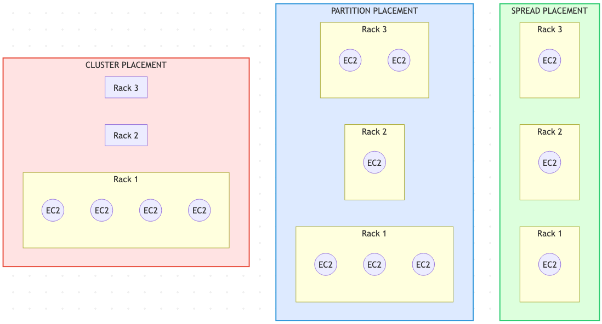

## 1. AWS Compute Overview {#section-1-aws-compute-overview}

Professional-level design questions expect you to remember that “compute” isn’t just EC2 boxes. AWS provides a toolkit and expects architects to combine pieces that best fit the workload’s shape.

- **Virtual servers (EC2)** – still the go-to when full OS control, custom AMIs, or exotic networking is required.
- **Containers (ECS, EKS, Fargate)** – great for repeatable deployments and for sprinkling Spot capacity into stateless services.
- **Serverless functions (Lambda)** – perfect glue for events and bursty jobs because idle time literally costs nothing.
- **Edge + load balancing** – Route 53, CloudFront, ALB/NLB/GWLB, and Global Accelerator decide *where* the traffic lands and how TLS is handled.
- **Fleet automation** – Auto Scaling Groups, launch templates, Parameter Store, and Systems Manager keep fleets patched without manual babysitting.

The remaining sections follow a logical progression: start with regional entry points, cover cost levers, tighten up networking, then finish with scaling and inline security.

---

## 2. Regional and Global Architecture {#section-2-regional-global-architecture}

High-level designs usually start at the regional entry point and then trace how traffic fans out globally. Key checkpoints:

- **Global reach** – place workloads close to customers via Regions, edge locations, and CDN nodes.
- **Health-aware routing** – global health checks and failover policies keep endpoints resilient.
- **Scalable ingress** – use regional load balancers or Global Accelerator to absorb demand before it reaches your apps.
- **Content acceleration** – pair compute tiers with CloudFront so static and dynamic responses stay fast worldwide.


<div class="image-wrapper">
  
  <div class="diagram-caption" data-snippet-id="global-architecture-snippet">
    🌍 Regional entry → global delivery path
  </div>
  <script type="text/plain" id="global-architecture-snippet">
@startuml
title Simplified AWS Architecture - Sequence Flow

actor User as U

participant "Route 53\n(Global DNS)" as R53
participant "CloudFront\n(CDN + Edge)" as CF
participant "Web Tier\n(ALB / API Gateway)" as WEB
participant "Compute Tier\n(EC2 / ECS / Lambda)" as COMP
participant "Caching\n(ElastiCache / DynamoDB DAX)" as CACHE
participant "DB Tier\n(RDS / Aurora / DynamoDB)" as DB
participant "App Services\n(SQS / SNS / EventBridge / Step Fn)" as APPS
participant "Storage\n(S3 / EFS)" as STORE

U -> R53: DNS lookup for application domain
R53 -> CF: Resolve best global edge location

U -> CF: HTTPS request (cached/static objects first check)
CF -> WEB: Forward request if not cached

WEB -> COMP: Application request (HTTP/HTTPS)
COMP -> CACHE: Read cached data?
alt Cache HIT
    CACHE --> COMP: Return cached data
else Cache MISS
    COMP -> DB: Query data / retrieve records
    DB --> COMP: Return data
    COMP -> CACHE: Write into cache (optional)
end

COMP -> APPS: Async tasks / events (SNS/SQS/EventBridge)
APPS --> COMP: Ack accepted

COMP -> STORE: Read/write files (images, logs, assets)
STORE --> COMP: Return stored content metadata

COMP --> WEB: Build response
WEB --> CF: Send response (cache based on policy)
CF --> U: Return final response (with caching headers)

@enduml
  </script>
</div>

---

## 3. EC2 Purchase & Savings Strategies {#section-3-ec2-purchase-savings-strategies}

After the region/edge layout is clear, cost strategy becomes the next focus. Picking the right commercial model matters just as much as sizing instances, so the tables below act as a quick reference for when each option shines.

### 3.1 Standard Purchase Options {#section-3-1-standard-purchase-options}

<table class="study-table">
<thead>
<tr>
<th>Model</th>
<th>Billing Traits</th>
<th>Best For</th>
<th>Key Watchouts</th>
</tr>
</thead>
<tbody>
<tr>
<td><strong>On-Demand</strong></td>
<td>Per-second billing on shared hardware, no commitments.</td>
<td>Default choice for short-lived, unpredictable, or interruption-intolerant tasks.</td>
<td>Most expensive rate; capacity not reserved.</td>
</tr>
<tr>
<td><strong>Spot</strong></td>
<td>Per-second billing, deep discounts (up to ~90%) on unused capacity.</td>
<td>Stateless, batch, or flexible jobs that can handle sudden interruptions.</td>
<td>Instances can disappear with little warning; design retry logic.</td>
</tr>
<tr>
<td><strong>Reserved Instances</strong></td>
<td>Commit to 1 or 3 years for reduced hourly rates; zonal RIs also reserve capacity.</td>
<td>Always-on workloads with predictable instance families/regions.</td>
<td>Locked to attributes (region, tenancy, family). Unused reservations still bill.</td>
</tr>
</tbody>
</table>

---

### 3.2 Dedicated Capacity Choices {#section-3-2-dedicated-capacity-choices}

<table class="study-table">
<thead>
<tr>
<th>Option</th>
<th>What You Get</th>
<th>Ideal Use</th>
<th>Notes</th>
</tr>
</thead>
<tbody>
<tr>
<td><strong>Dedicated Host</strong></td>
<td>Entire physical server under your control; BYOL-friendly.</td>
<td>Socket/core-licensed software, strict compliance, pinning instances.</td>
<td>You manage host capacity; pair with Host Affinity for placement guarantees.</td>
</tr>
<tr>
<td><strong>Dedicated Instance</strong></td>
<td>Instance runs on hardware isolated to your account, but AWS manages hosts.</td>
<td>Isolation requirements without host-level management.</td>
<td>No host visibility; pay instance fees with dedicated tenancy surcharge.</td>
</tr>
</tbody>
</table>

<div class="image-wrapper">
  
  <div class="diagram-caption" data-snippet-id="dedicated-tenancy-snippet">
    🧩 EC2 tenancy isolation options
  </div>
  <script type="text/plain" id="dedicated-tenancy-snippet">
flowchart TB

%% ------------ DEFAULT / SHARED HOST ------------
subgraph SHARED["DEFAULT / SHARED"]
    direction TB

    subgraph SH_HOST["EC2 HOST"]
        SH1([Your EC2]):::mine
        SH2([Others]):::other
        SH3([Others]):::other
        SH4([Your EC2]):::mine
        SH5([Others]):::other
    end
end

style SHARED fill:#e6f7ff,stroke:#0077b6,stroke-width:2px
style SH_HOST fill:#ffffff,stroke:#0077b6,stroke-width:1px


%% ------------ DEDICATED HOST ------------
subgraph DEDHOST["DEDICATED HOST"]
    direction TB

    subgraph DH_HOST["EC2 HOST "]
        DH1([Your EC2]):::mine
        DH2([Your EC2]):::mine
        DH3([Your EC2]):::mine
        DH4([Your EC2]):::mine
    end
end

style DEDHOST fill:#ffe6f2,stroke:#d63384,stroke-width:2px
style DH_HOST fill:#ffffff,stroke:#d63384,stroke-width:1px


%% ------------ DEDICATED INSTANCES ------------
subgraph DEDINST["DEDICATED INSTANCES"]
    direction TB

    subgraph DI_HOST["EC2 HOST"]
        DI1([Your EC2]):::mine
        DI_BLANK1([Reserved / Not shared]):::unused
        DI_BLANK2([Reserved / Not shared]):::unused
        DI2([Your EC2]):::mine
    end
end

style DEDINST fill:#fff3cd,stroke:#ff9500,stroke-width:2px
style DI_HOST fill:#ffffff,stroke:#ff9500,stroke-width:1px


%% ------------ COLOR DEFINITIONS ------------
classDef mine fill:#ff6b81,color:#ffffff,stroke-width:0px;
classDef other fill:#868e96,color:#ffffff,stroke-width:0px;
classDef unused fill:#adb5bd,color:#ffffff,stroke-width:0px;
  </script>
</div>

Quick note to future me: a *host* is the single physical server that runs the VMs, while a *rack* is the collection of hosts an AWS placement group carves up.

---

### 3.3 Reserved Instance Flavors {#section-3-3-reserved-instance-flavors}

- **Scheduled RIs** – Reserve recurring blocks (e.g., nightly batch for 5 hours). Minimum 1-year contract (~1,200 hrs/year). Not every region or family supported.
- **Regional RIs** – Apply discounts to matching instances in any AZ of the region, but do not reserve capacity.
- **Zonal RIs** – Attach to one AZ; gain both billing discount and capacity reservation.
- **On-Demand Capacity Reservations** – Guarantee capacity inside an AZ without term commitments. Pair with RIs or Savings Plans for discounts when possible.

---

### 3.4 Savings Plans {#section-3-4-savings-plans}

- Commit to spend **$X/hour** for 1 or 3 years to unlock reduced rates.
- **Compute Savings Plans** apply across EC2, Fargate, and Lambda, regardless of instance family or region.
- **EC2 Instance Savings Plans** limit flexibility (family + region) but offer deeper discounts.

---

### 3.5 Taxi Analogy for Charging Models {#section-3-5-taxi-analogy-for-charging-models}

<table class="study-table">
<thead>
<tr>
<th>Plan</th>
<th>Plain-English Explanation</th>
<th>Taxi Analogy 🚕</th>
<th>Commitment</th>
<th>Capacity Guaranteed?</th>
<th>Discount?</th>
<th>When to Use</th>
</tr>
</thead>
<tbody>
<tr>
<td><strong>On-Demand</strong></td>
<td>Pay only while the instance runs.</td>
<td>Hail a taxi whenever needed.</td>
<td>None</td>
<td>❌</td>
<td>❌</td>
<td>Tests, spikes, unpredictable workloads.</td>
</tr>
<tr>
<td><strong>Savings Plan</strong></td>
<td>Promise to spend $/hr for discount, flexible usage.</td>
<td>Retainer for any taxi ride at lower price.</td>
<td>1–3 yrs</td>
<td>❌</td>
<td>✅</td>
<td>Continuous usage that may change families/regions.</td>
</tr>
<tr>
<td><strong>Reserved Instance</strong></td>
<td>Lock specific attributes for big discount.</td>
<td>Lease the same taxi full-time.</td>
<td>1–3 yrs</td>
<td>❌ (✅ for zonal)</td>
<td>✅</td>
<td>Steady 24×7 fleets.</td>
</tr>
<tr>
<td><strong>Scheduled RI</strong></td>
<td>Recurring reserved blocks.</td>
<td>Pre-book the same taxi for rush hour.</td>
<td>1 yr</td>
<td>✅ (during window)</td>
<td>✅</td>
<td>Predictable periodic jobs.</td>
</tr>
<tr>
<td><strong>Capacity Reservation</strong></td>
<td>Keep capacity idle but ready.</td>
<td>Pay driver to wait while you shop.</td>
<td>Open-ended</td>
<td>✅</td>
<td>❌ (unless paired)</td>
<td>Mission-critical or DR kickoffs.</td>
</tr>
</tbody>
</table>

---

### 3.6 Dedicated Options Recap {#section-3-6-dedicated-options-recap}

<table class="study-table">
<thead>
<tr>
<th>Option</th>
<th>Analogy</th>
<th>Discount Potential</th>
<th>Why choose it</th>
</tr>
</thead>
<tbody>
<tr>
<td><strong>Dedicated Instance</strong></td>
<td>Private taxi, company-owned.</td>
<td>❌</td>
<td>Compliance isolation without hardware management.</td>
</tr>
<tr>
<td><strong>Dedicated Host</strong></td>
<td>Lease the whole car.</td>
<td>✅ (with RIs/SP)</td>
<td>BYOL licensing, socket/core tracking, placement control.</td>
</tr>
</tbody>
</table>

---

## 4. EC2 Networking & Image Strategy {#section-4-ec2-networking-image-strategy}

Cost planning is pointless if instances can’t talk or boot quickly, so the next pass is all about ENIs and image hygiene.

### 4.1 Elastic Network Interfaces (ENIs) {#section-4-1-elastic-network-interfaces}

- **Scoped to an AZ**: an ENI lives in a subnet, so you can only attach it to instances in the same AZ.
- **Static identity**: primary private IPv4 never changes for the lifetime of the ENI.
- **Addresses**: support multiple secondary IPv4s, IPv6 assignments, and an Elastic IP per private IPv4 if needed.
- **Security constructs**: attach multiple security groups, leverage source/destination checks, and gain a unique MAC address (handy for licensed software).
- **Attachment patterns**: add multiple ENIs per instance (subject to type limits) for different security zones or management planes.

---

### 4.2 Bootstrapping vs. AMI Baking {#section-4-2-bootstrapping-vs-ami-baking}

Application provisioning typically follows three layers:

1. **Base OS + Dependencies** – slowest layer, rarely changes.
2. **Application Binaries** – updated occasionally.
3. **Runtime Configuration** – fast, environment-specific tweaks.

**Strategies:**

- **User Data scripts** – customize step 1 or 2 at launch time; flexible but slower to become ready.
- **AMI Baking** – pre-build golden images with the heavy lifting done; fastest boot but requires pipeline updates when components change.
- **Dynamic config (Parameter Store / AppConfig)** – keep step 3 lightweight and environment-aware.

Optimal builds usually blend baked AMIs for heavy dependencies plus minimal bootstrapping for secrets, region settings, or last-minute patches.

---

## 5. Elastic Load Balancing {#section-5-elastic-load-balancing}

With networking squared away, the next layer is the load balancers that shape every request before it hits compute.

### 5.1 Architecture & Traffic Flow {#section-5-1-architecture-traffic-flow}

- Deploy load balancers across at least two subnets (one per AZ) to decouple presentation and application tiers.
- Each ELB exposes a DNS name; clients resolve it to per-AZ nodes.
- Listeners inspect protocol, port, and rule sets, then forward to target groups over private networking.
- Targets respond via the node, while health checks continuously verify status.
- Allocate /27-sized subnets (8+ free IPs) so nodes can scale out when demand spikes.

<div class="image-wrapper">
  
  <div class="diagram-caption" data-snippet-id="elb-architecture-snippet">
    ⚖️ ELB request flow (public + internal tiers)
  </div>
    <!-- Keep your PlantUML raw here -->
  <script type="text/plain" id="elb-architecture-snippet">
@startuml
title ELB Architecture + ELB Request Logic

actor User

participant "Route 53\n(A record → ELB DNS)" as R53
participant "Public ELB Node\n(Internet Facing)" as P_ELB
participant "Target Group" as TG
participant "Public EC2\n(Web Tier)" as PUB_EC2
participant "Private EC2\n(Web Tier)" as PRIV_EC2_WEB
participant "Internal ELB\n(Private Only)" as I_ELB
participant "Private EC2\n(App Tier)" as PRIV_EC2_APP


User -> R53: DNS Lookup (A record → ELB DNS name)
R53 --> User: Returns IP of an ELB node\n(may be any AZ)

User -> P_ELB: HTTP/HTTPS request hits ELB Node

note right of P_ELB
ELB internal flow:
1. Listener identifies port/protocol (e.g. HTTP:80 / HTTPS:443)
2. Listener checks rules (path, host-header, conditions)
3. Select healthy target using LB algorithm (round-robin/LC)
4. Sends traffic to target ENI
5. Maintains stickiness + performs health checks
end note

P_ELB -> TG: Check healthy targets

alt Target is Public EC2
    TG -> PUB_EC2: Forward request
    PUB_EC2 --> TG: Response
else Target is Private EC2
    TG -> PRIV_EC2_WEB: Forward request
    PRIV_EC2_WEB --> TG: Response
end

== Scaling tier-to-tier ==
PRIV_EC2_WEB -> I_ELB: HTTP/HTTPS request (private-only LB)
I_ELB -> PRIV_EC2_APP: Forward request
PRIV_EC2_APP --> I_ELB: Response

TG --> P_ELB: Return response
P_ELB --> User: Final HTTP/HTTPS response

@enduml
  </script>
</div>

---

### 5.2 Cross-Zone Load Balancing {#section-5-2-cross-zone-load-balancing}

- Default behavior is **per-AZ balancing** – each AZ receives an equal portion of traffic regardless of how many instances run inside it.
- Enable **cross-zone** to redistribute surplus requests from lightly provisioned AZs to others, preventing single-instance AZs from being overloaded.

<div class="image-wrapper">
  
  <div class="diagram-caption" data-snippet-id="cross-zone-snippet">
    🔁 Cross-zone load balancing fan-out
  </div>
    <!-- Keep your PlantUML raw here -->
  <script type="text/plain" id="cross-zone-snippet">
flowchart LR
    subgraph ClientSide["Client"]
        U[User Browser]
    end

    U -->|resolves DNS| LB_DNS["ALB / NLB DNS Name"]

    subgraph VPC["VPC (us-east-1)"]
        direction LR
        
        subgraph AZA["AZ A"]
            LB_A["LB Node (AZ A)"]
            EC2_A1["Target EC2 A1"]
            EC2_A2["Target EC2 A2"]
        end

        subgraph AZB["AZ B"]
            LB_B["LB Node (AZ B)"]
            EC2_B1["Target EC2 B1"]
        end
    end

    LB_DNS --> LB_A
    LB_DNS --> LB_B

    %% Cross-zone balancing
    LB_A --> EC2_A1
    LB_A --> EC2_A2
    LB_A --> EC2_B1

    LB_B --> EC2_A1
    LB_B --> EC2_A2
    LB_B --> EC2_B1
  </script>
</div>

---

### 5.3 User Session State {#section-5-3-user-session-state}

- Stateful features (shopping carts, wizards, login state) should ideally live in shared stores (Redis, DynamoDB) so any node can serve the next request.
- If server memory must hold state, use stickiness cautiously and plan for disruption during instance rotations.

---

### 5.4 Load Balancer Generations {#section-5-4-load-balancer-generations}

<table class="study-table">
<thead>
<tr>
<th>Type</th>
<th>Protocols</th>
<th>Highlights</th>
<th>Limitations</th>
</tr>
</thead>
<tbody>
<tr>
<td><strong>Classic LB (CLB)</strong></td>
<td>HTTP/HTTPS/TCP</td>
<td>Legacy option, basic Layer 4/7 support.</td>
<td>No SNI, only one SSL cert, minimal app awareness.</td>
</tr>
<tr>
<td><strong>Application LB (ALB)</strong></td>
<td>HTTP/HTTPS/WebSocket</td>
<td>True Layer 7: content-based routing, multiple certs, WebSockets.</td>
<td>No TCP/UDP listeners; TLS terminates at ALB.</td>
</tr>
<tr>
<td><strong>Network LB (NLB)</strong></td>
<td>TCP/TLS/UDP</td>
<td>Ultra-low latency, static IPs, preserves end-to-end encryption.</td>
<td>No HTTP header visibility or cookies.</td>
</tr>
<tr>
<td><strong>Gateway LB (GWLB)</strong></td>
<td>GENEVE encapsulated L3/L4</td>
<td>Auto-scales third-party appliances inline.</td>
<td>Requires appliance support for GENEVE.</td>
</tr>
</tbody>
</table>

---

### 5.5 Session Stickiness {#section-5-5-session-stickiness}

- ALB/CLB can inject cookies (e.g., `AWSALB`) lasting 1 second to 7 days to bind a client to a target.
- Stickiness helps when external caching isn’t available but can skew load or trap users on draining instances.

---

### 5.6 Connection Draining & Deregistration Delay {#section-5-6-connection-draining-deregistration-delay}

- **Connection Draining (CLB)** – allows 1–3600 seconds for in-flight requests to finish before removing a node.
- **Deregistration Delay (ALB/NLB)** – configured per target group (default 300s) so existing flows complete gracefully after a scale-in event.

---

### 5.7 Client IP Preservation {#section-5-7-client-ip-preservation}

- For HTTP/HTTPS, ALB adds `X-Forwarded-For`, `X-Forwarded-Proto`, and `X-Forwarded-Port` headers; read the leftmost IP to find the original client.
- For non-HTTP traffic, enable the **Proxy Protocol** (Layer 4). CLB uses v1 (text), NLB uses v2 (binary) to deliver client source info while keeping TLS intact.

---

## 6. Auto Scaling Groups (ASG) {#section-6-auto-scaling-groups}

All that front-door engineering falls flat without an automated fleet, so this section collects focused ASG reminders.

### 6.1 Core Concepts {#section-6-1-core-concepts}

- Use launch templates (preferred) or launch configurations to define AMI, networking, storage, and metadata.
- Set **min**, **desired**, and **max** capacity to bound fleet size.
- ASGs self-heal: failed instances trigger replacement up to desired capacity.
- Operate only inside a VPC but can span multiple subnets/AZs for resilience.

<div class="image-wrapper">
  
  <div class="diagram-caption" data-snippet-id="asg-sequence-snippet">
    ⚙️ ASG lifecycle hook timeline
  </div>
    <!-- Keep your PlantUML raw here -->
  <script type="text/plain" id="asg-sequence-snippet">
@startuml
title Auto Scaling Group Lifecycle Hooks (Scale-Out + Scale-In)

actor "Auto Scaling Group" as ASG
participant "EC2 Instance" as EC2
participant "Lifecycle Hook" as HOOK
participant "SNS / EventBridge" as EVT

== Scale OUT ==

ASG -> EC2: Launch new instance
EC2 -> HOOK: State = PENDING:WAIT\nLifecycle hook triggered
HOOK -> EVT: Publish event (SNS / EventBridge)

note over EVT
External process can initialize:
- app bootstrap
- data indexing / config
end note

EVT -> HOOK: CompleteLifecycleAction\n(continue or abandon)

HOOK -> EC2: State = PENDING:PROCEED
EC2 -> ASG: Instance ready
ASG -> EC2: State = InService


== Scale IN ==

ASG -> EC2: Mark instance for termination
EC2 -> HOOK: State = TERMINATING:WAIT\nLifecycle hook triggered
HOOK -> EVT: Publish event (SNS / EventBridge)

note over EVT
External process can do:
- backup logs
- drain connections
end note

EVT -> HOOK: CompleteLifecycleAction\n(continue termination)

HOOK -> EC2: State = TERMINATING:PROCEED
EC2 -> ASG: Termination completed
ASG -> EC2: State = TERMINATED

@enduml
  </script>
</div>

---

### 6.2 Scaling Policies {#section-6-2-scaling-policies}

- **Manual** – operators change desired count directly (no policy required).
- **Scheduled** – scale for predictable daily/weekly events.
- **Dynamic** – react to CloudWatch metrics:
  - *Simple* scaling: single threshold → fixed adjustment.
  - *Step* scaling: multiple thresholds map to incremental adjustments.
  - *Target tracking*: maintain a metric near a setpoint (thermostat-style).
- **SQS-driven** – trigger scaling from queue depth (e.g., `ApproximateNumberOfMessagesVisible`).
- Cooldowns prevent thrashing; customize per policy.

```python
TARGET_CPU = 50

while True:
    avg = get_average_cpu(asg_instances)
    error = avg - TARGET_CPU

    if error > 10 and desired_instances < max_instances:
        scale_out(by=1)
    elif error < -10 and desired_instances > min_instances:
        scale_in(by=1)

    cooldown(120)
    sleep(60)
```

<table class="study-table">
<thead>
<tr>
<th>Policy</th>
<th>Behavior</th>
<th>Notes</th>
</tr>
</thead>
<tbody>
<tr>
<td><strong>Simple</strong></td>
<td>One metric threshold, one action.</td>
<td>“If CPU > 70%, add 1 instance.”</td>
</tr>
<tr>
<td><strong>Step</strong></td>
<td>Multiple bands with different step sizes.</td>
<td>“>90% add 3, >70% add 2…”</td>
</tr>
<tr>
<td><strong>Target Tracking</strong></td>
<td>Feedback loop aims for target metric.</td>
<td>Works like cruise control; AWS manages math.</td>
</tr>
</tbody>
</table>

### 6.3 Health Checks & Hooks {#section-6-3-health-checks-hooks}

- **Health sources**: EC2 status (default), ELB health, or custom integration.
- **Grace period**: default 300s before first health check to allow bootstrapping.
- **Lifecycle hooks** pause instances during `Pending` or `Terminating` steps so you can run custom scripts (e.g., pre-warm cache, drain sessions). Resume via `CompleteLifecycleAction` or wait for timeout.

### 6.4 ASGs with Load Balancers {#section-6-4-asgs-with-load-balancers}

- Register ASG with target groups; new instances join automatically.
- Optionally rely on load balancer health checks so failing targets are replaced even if EC2 reports “ok.”
- Deregistration delays + lifecycle hooks create graceful scale-in workflows.

---

## 7. EC2 Placement Groups {#section-7-ec2-placement-groups}

When latency or blast-radius guarantees show up, placement groups keep the topology honest.

<table class="study-table">
<thead>
<tr>
<th>Strategy</th>
<th>Layout</th>
<th>Best For</th>
<th>Constraints</th>
</tr>
</thead>
<tbody>
<tr>
<td><strong>Cluster</strong></td>
<td>Packs instances close together in one AZ.</td>
<td>HPC, tightly coupled apps needing 10 Gbps+ per flow.</td>
<td>No cross-AZ spreading; low resilience. Launch similar instances simultaneously for best results.</td>
</tr>
<tr>
<td><strong>Spread</strong></td>
<td>Places up to 7 instances per AZ on distinct racks with separate power/network.</td>
<td>Small fleets needing maximum isolation (critical services, HA pairs).</td>
<td>Not available for Dedicated Hosts/Instances; limit 7 per AZ.</td>
</tr>
<tr>
<td><strong>Partition</strong></td>
<td>Segments racks into partitions; instances within a partition share hardware, but partitions are isolated.</td>
<td>Large-scale distributed systems (Hadoop, Cassandra, Kafka).</td>
<td>Up to 7 partitions per AZ; you assign instances to partitions for failure-domain control.</td>
</tr>
</tbody>
</table>

<div class="image-wrapper">
  
  <div class="diagram-caption" data-snippet-id="placement-snippet">
    🧱 Placement group rack layout
  </div>
    <!-- Keep your PlantUML raw here -->
  <script type="text/plain" id="placement-snippet">
flowchart TB

%% ------------------ SPREAD ------------------
subgraph SPREAD["SPREAD PLACEMENT"]
    direction LR

    subgraph S_R1["Rack 1"]
        S1((EC2))
    end

    subgraph S_R2["Rack 2"]
        S2((EC2))
    end

    subgraph S_R3["Rack 3"]
        S3((EC2))
    end
end
style SPREAD fill:#ddffdd,stroke:#2ecc71,stroke-width:2px


%% ------------------ PARTITION ------------------
subgraph PARTITION["PARTITION PLACEMENT"]
    direction LR

    subgraph P1["Rack 1"]
        P1R1((EC2))
        P1R2((EC2))
        P1R3((EC2))
    end

    subgraph P2["Rack 2"]
        P2R1((EC2))
    end

    subgraph P3["Rack 3"]
        P3R1((EC2))
        P3R2((EC2))
    end

end
style PARTITION fill:#ddeaff,stroke:#3498db,stroke-width:2px


%% ------------------ CLUSTER ------------------
subgraph CLUSTER["CLUSTER PLACEMENT"]
    direction LR

    subgraph C_R1["Rack 1"]
        C1((EC2))
        C2((EC2))
        C3((EC2))
        C4((EC2))
    end

    subgraph C_R2["Rack 2"]
    end

    subgraph C_R3["Rack 3"]
    end
end
style CLUSTER fill:#ffe3e3,stroke:#e74c3c,stroke-width:2px
  </script>
</div>


---

## 8. Gateway Load Balancer (GWLB) {#section-8-gateway-load-balancer}

The final piece is inline security. GWLB keeps third-party appliances elastic so next hops are not hard-coded everywhere.

Traditional inspection tiers often require manually chaining firewalls or IDS appliances, creating scaling pain. GWLB changes that by:

- Planting **GWLB Endpoints** (PrivateLink) inside each subnet, so routing can hairpin through inspection with a single hop.
- Wrapping flows in **GENEVE** and shipping them to a managed GWLB service that knows about health, scaling, and AZ isolation.
- Treating appliance fleets like any other target group, which means health checks, scaling, and fail-open/fail-closed logic stay consistent.
- Preserving the original source/destination IPs so the security rules stay accurate after inspection.


<div class="image-wrapper">
  
  <div class="diagram-caption" data-snippet-id="gwlb-snippet">
    🛡️ GWLB inline inspection flow
  </div>
    <!-- Keep your PlantUML raw here -->
  <script type="text/plain" id="gwlb-snippet">
@startuml
title Gateway Load Balancer — Ingress Inspection (GWLB before ALB)

skinparam participant {
    BackgroundColor<<AppVPC>> #ffe6f2
    BorderColor<<AppVPC>> #ff4da6
    BackgroundColor<<SecurityVPC>> #e6f0ff
    BorderColor<<SecurityVPC>> #4d79ff
}

actor Client

box "Application VPC (Ingress VPC — user's web request arrives here)" #ffe6f2
participant "GWLB Endpoint (GWLB-E)\nActs as next-hop in route table" as GWLBE <<AppVPC>>
participant "ALB\n(Application Load Balancer)" as ALB <<AppVPC>>
participant "App Target\n(EC2 / ECS / Lambda)" as APP <<AppVPC>>
end box

box "Security VPC (Inspection appliances)" #e6f0ff
participant "GWLB\n(Gateway Load Balancer)" as GWLB <<SecurityVPC>>
participant "Security Appliance\n(Firewall / IDS / IPS)" as APPLIANCE <<SecurityVPC>>
end box


== Ingress Request ==

Client -> GWLBE: 1. Client connects to public endpoint\n(route table sends traffic to GWLB-E)

GWLBE -> GWLB: 2. GENEVE encapsulation\n(original packet untouched)

GWLB -> APPLIANCE: 3. Forward encapsulated packet for inspection

APPLIANCE --> GWLB: 4. ALLOW / DENY / MODIFY decision

GWLB -> GWLBE: 5. Return encapsulated packet\n(symmetric return path)

GWLBE -> ALB: 6. Decapsulate, send ORIGINAL packet to ALB\n(no NAT, retains real client IP)

== Now load balancer routing ==

ALB -> APP: 7. ALB selects backend target\n(target group evaluation)

APP --> ALB: 8. Application response


== Outbound return traffic must also be inspected ==

ALB -> GWLBE: 9. Route table forces return traffic back to GWLB-E
GWLBE -> GWLB: 10. Encapsulate again (GENEVE)
GWLB -> APPLIANCE: 11. Return path inspection
APPLIANCE --> GWLB: 12. Decision
GWLB -> GWLBE: 13. Send cleaned packet back
GWLBE -> Client: 14. Final response to user

@enduml
  </script>
</div>

Use cases:

1. **Centralized security VPC** – route spoke VPC traffic via GWLB endpoints for inspection before reaching workloads.
2. **Inline egress filtering** – send outbound flows through IDS/IPS without hard-wiring next hops.
3. **Scalable appliances** – autoscale firewall AMIs with GWLB controlling attachment and health.

---

## 8. Operations & Exam Notes {#section-8-operations-notes}

- **EC2 lifecycle** – Reboot keeps the same host and IPs; Stop/Start moves to new hardware with a new public IP (unless EIP) and wipes instance store volumes.
- **ENIs** – secondary ENIs retain MAC/IP identity across stops; useful for licensing or failover IP swaps.
- **ALB refresh** – regional service with nodes (ENIs) in each subnet; stickiness is configured at the Target Group, not on the listener.
- **Lambda@Edge** – deploys Lambda functions to CloudFront PoPs for viewer/origin request/response manipulation (auth headers, redirects, AB tests).
- **ECS networking modes** – `bridge` (containers NAT behind host) vs `awsvpc` (task receives its own ENI, required for Fargate/Service Discovery).
- **Systems Manager Run/Session Manager** – requires SSM Agent plus the `AmazonSSMManagedInstanceCore` role and VPC endpoints (`ssm`, `ec2messages`, `ssmmessages`) when no Internet access.
- **Elastic Beanstalk deployments** – All-at-once (downtime), Rolling, Rolling with extra batch, Immutable, or Blue/Green (CNAME swap). Worker environments use SQS + EC2.
- **Elastic Fabric Adapter (EFA)** – HPC ENI with OS-bypass (Libfabric). Needs supported instances (e.g., c5n, p4d, hpc6a) + placement group + EFA-enabled AMI.
- **Spot Fleet** – mix On-Demand and Spot; set baseline On-Demand, choose allocation strategy (lowest price/diversified/capacity-optimized) to hit target capacity at lower cost.
- **Lambda concurrency** – Regions allow bursts from hundreds up to tens of thousands; request service quota increases for sustained concurrency.

---
