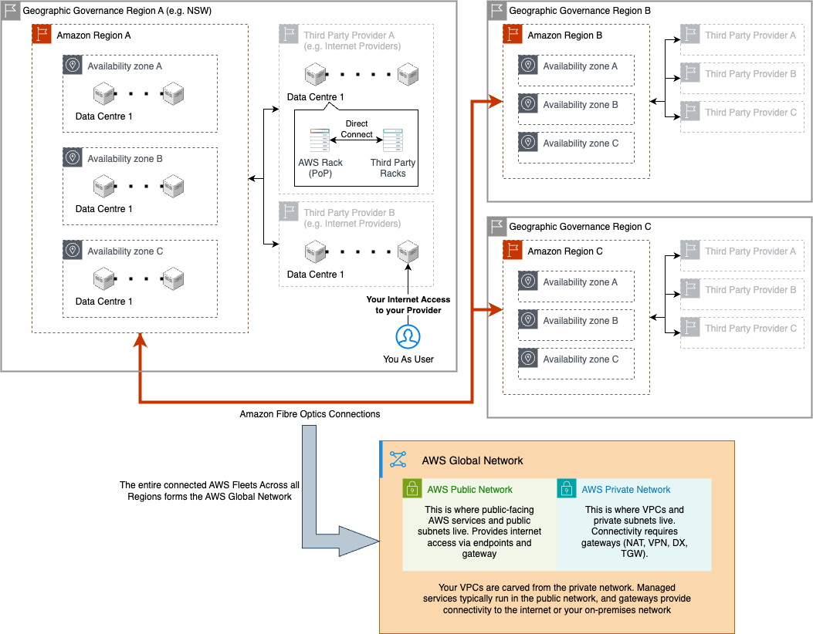
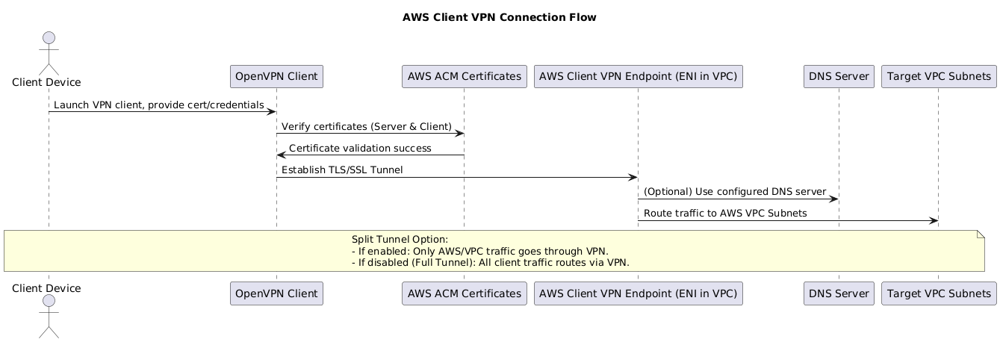
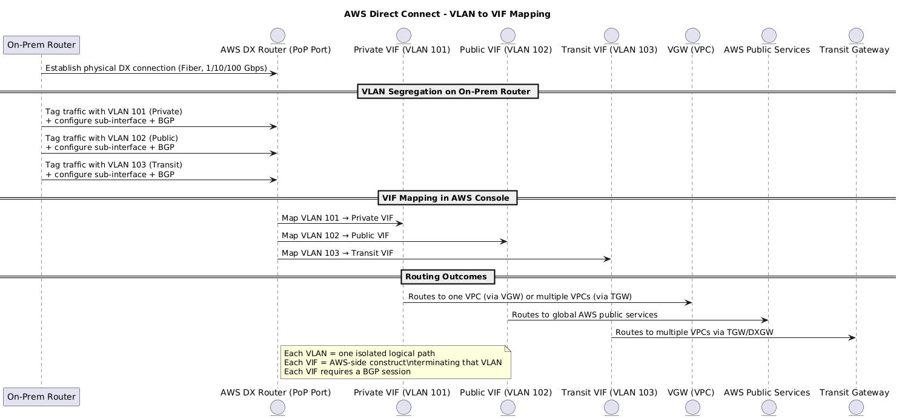
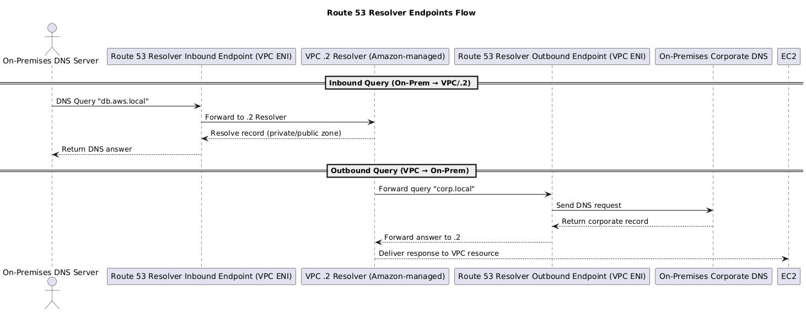

## 1. AWS Network Overview {#section-1-aws-network-overview}

AWS operates one of the largest private **fiber-optic backbones** in the world. This backbone connects **Data Centers**, groups them into **Availability Zones (AZs)**, and links multiple AZs to form a **Region**. From there, AWS extends outwards through **Points of Presence (PoPs)**, which connect to the **public internet** or provide private connectivity via **Direct Connect**.  

1. **Data Centers, AZs, and Regions**  
- **Data Centers** are the physical foundation.  
- A group of data centers = an **Availability Zone (AZ)**.  
- Several AZs = a **Region**, interconnected by the AWS backbone for **low-latency, fault-tolerant networking**.  

2. **Points of Presence (PoPs)**  
- AWS racks hosted inside **third-party colocation sites** (e.g., *Equinix, Digital Realty*).  
- Link the AWS backbone to **local ISPs** and **IXPs**.  
- Run edge services such as **CloudFront** (CDN caching) and **Global Accelerator** (traffic optimization).  

3. **Public Internet Connectivity**  
- PoPs handle AWS traffic **in and out of the public internet**.  
- Customers reach AWS services through **public endpoints** (e.g., *S3, EC2 APIs*).  

4. **Direct Connect (DX)**  
- A **dedicated private link** that bypasses the internet.  
- Provisioned at a PoP, giving you a **physical port on AWS gear**.  
- Delivers **lower latency, higher reliability, and consistent bandwidth** for hybrid cloud workloads.  

  
  
🌐 AWS Network Overview

---

## 2. Service Categories {#section-2-service-categories}
### 2.1 Internet Connectivity (Ingress & Egress) {#section-2-1-internet-connectivity-ingress-egress}

<table class="study-table">
<thead>
<tr>
<th>AWS Service</th>
<th>Purpose</th>
<th>OSI Layer</th>
<th>Upstream</th>
<th>Downstream</th>
<th>Limitations</th>
<th>Pricing</th>
</tr>
</thead>
<tbody>
<tr>
<td><strong>Internet Gateway (IGW)</strong></td>
<td>Enables VPC to access the internet.</td>
<td>L3 – Network</td>
<td>Public Subnet</td>
<td>Internet</td>
<td>• One IGW per VPC • No filtering (not a firewall)</td>
<td>Free</td>
</tr>
<tr>
<td><strong>NAT Gateway</strong></td>
<td>Allows private subnets to reach the internet.</td>
<td>L3 – Network</td>
<td>Private Subnet</td>
<td>IGW / Internet</td>
<td>• Outbound-only (no inbound) • Not HA by default (deploy per AZ)</td>
<td>Hourly charge + per GB data processing</td>
</tr>
<tr>
<td><strong>Virtual Private Gateway (VGW)</strong></td>
<td>AWS VPN tunnel endpoint for Site-to-Site VPN.</td>
<td>L3 – Network</td>
<td>On-prem VPN device (CGW)</td>
<td>VPC Route Tables</td>
<td>• One VGW per VPC • Max ~1.25 Gbps per tunnel • Cannot connect multiple VPCs directly</td>
<td>Hourly VPN + data transfer</td>
</tr>
<tr>
<td><strong>Customer Gateway (CGW)</strong></td>
<td>Customer-managed device establishing VPN tunnels to AWS.</td>
<td>L3 – Network</td>
<td>On-prem Router/Firewall</td>
<td>VGW / TGW</td>
<td>• Managed by customer • HA depends on design</td>
<td>N/A (customer hardware cost)</td>
</tr>
<tr>
<td><strong>Transit Gateway (TGW)</strong></td>
<td>Central router between VPCs, VPNs, and Direct Connect.</td>
<td>L3 – Network</td>
<td>VPCs / VPN / DX</td>
<td>VPCs / VPN / DX</td>
<td>• One RT per attachment • Propagation optional • Default full mesh • TGW Peering static routes only</td>
<td>Per attachment + per GB data processed</td>
</tr>
<tr>
<td><strong>Direct Connect (DX)</strong></td>
<td>Dedicated physical link to AWS, bypassing Internet.</td>
<td>L1 – Physical</td>
<td>On-prem Router/Switch</td>
<td>VPC via TGW / VGW</td>
<td>• Provisioning time weeks • No encryption by default • HA requires multiple DX</td>
<td>Per port-hour + data transfer (lower than internet egress)</td>
</tr>
</tbody>
</table>

---

<table class="study-table">
<thead>
<tr>
<th>AWS Service</th>
<th>Purpose</th>
<th>OSI Layer</th>
<th>Upstream</th>
<th>Downstream</th>
<th>Limitations</th>
<th>Pricing</th>
</tr>
</thead>
<tbody>
<tr>
<td><strong>VPC Peering</strong></td>
<td>Connects two VPCs privately.</td>
<td>L2 (abstracted)</td>
<td>VPC A</td>
<td>VPC B</td>
<td>• No transitive routing • Cannot use overlapping CIDRs</td>
<td>Data transfer per GB (intra-Region cheaper, inter-Region higher)</td>
</tr>
<tr>
<td><strong>Gateway Endpoints</strong></td>
<td>Route table entry to access <strong>S3/DynamoDB</strong> via AWS backbone.</td>
<td>L3 – Network</td>
<td>VPC Subnet</td>
<td>S3 / DynamoDB</td>
<td>• <strong>Only supports S3 and DynamoDB</strong> • One per route table • Supports VPC endpoint policies</td>
<td>Free</td>
</tr>
<tr>
<td><strong>Interface Endpoints (PrivateLink)</strong></td>
<td>ENI-based private access to other AWS services or partner services.</td>
<td>L3 / L4</td>
<td>VPC Subnet / ENI</td>
<td>AWS Service ENI</td>
<td>• <strong>Does NOT support S3/DynamoDB</strong> (use Gateway instead) • One per AZ for HA • Private DNS overrides service DNS • Supports VPC endpoint policies</td>
<td>Hourly ENI cost + per GB data processed</td>
</tr>
<tr>
<td><strong>Route 53 Resolver (.2)</strong></td>
<td>Built-in VPC DNS resolver (`.2` address in every subnet) for public zones and associated private zones.</td>
<td>L3 – Network</td>
<td>EC2 / Lambda / ENI</td>
<td>Internal DNS targets (via `.2`)</td>
<td>• VPC-only (not accessible from on-prem) • No customization • Hybrid DNS requires endpoints</td>
<td>Free (included with VPC)</td>
</tr>
<tr>
<td><strong>Route 53 Resolver Endpoints</strong></td>
<td>Extend DNS resolution across hybrid networks: • <em>Inbound</em> – On-prem → VPC resolver • <em>Outbound</em> – VPC → on-prem DNS</td>
<td>L3 – Network</td>
<td>On-prem DNS or VPC resources</td>
<td>Route 53 Resolver / On-prem DNS</td>
<td>• Requires ENIs in subnets • One per AZ for HA • Adds query latency vs. .2 • Query-based limits</td>
<td>Hourly ENI cost + query-based pricing</td>
</tr>
</tbody>
</table>

---

### 2.2 Load Balancing and Traffic Distribution {#section-2-2-load-balancing-and-traffic-distribution}

<table class="study-table">
<thead>
<tr>
<th>AWS Service</th>
<th>Purpose</th>
<th>OSI Layer</th>
<th>Upstream</th>
<th>Downstream</th>
<th>Limitations</th>
<th>Pricing</th>
</tr>
</thead>
<tbody>
<tr>
<td><strong>ALB (Application Load Balancer)</strong></td>
<td>Routes HTTP/HTTPS traffic.</td>
<td>L7 / L4</td>
<td>Internet / CloudFront</td>
<td>EC2 / Lambda / IPs</td>
<td>• HTTP/HTTPS only • No static IPs (unless behind GA)</td>
<td>Hourly + per LCU + data processed</td>
</tr>
<tr>
<td><strong>NLB (Network Load Balancer)</strong></td>
<td>Balances TCP/UDP traffic.</td>
<td>L4 – Transport</td>
<td>Internet / Internal VPC</td>
<td>EC2 / IPs</td>
<td>• No advanced routing (L7) • Health checks limited</td>
<td>Hourly + per LCU + data processed</td>
</tr>
<tr>
<td><strong>Gateway Load Balancer (GWLB)</strong></td>
<td>Sends traffic to firewalls/appliances.</td>
<td>L3 / L4</td>
<td>IGW / NLB</td>
<td>Security Appliance</td>
<td>• Appliances must support GENEVE • Adds latency</td>
<td>Hourly + per LCU + data processed</td>
</tr>
<tr>
<td><strong>Global Accelerator</strong></td>
<td>Routes global traffic via Anycast IPs.</td>
<td>L4 – Transport</td>
<td>End User</td>
<td>NLB / ALB / IPs</td>
<td>• Not a CDN • No caching</td>
<td>Per accelerator-hour + data transfer</td>
</tr>
</tbody>
</table>

---

### 2.3 Security and Access Control {#section-2-3-security-and-access-control}

<table class="study-table">
<thead>
<tr>
<th>AWS Service</th>
<th>Purpose</th>
<th>OSI Layer</th>
<th>Upstream</th>
<th>Downstream</th>
<th>Limitations</th>
<th>Pricing</th>
</tr>
</thead>
<tbody>
<tr>
<td><strong>WAF</strong></td>
<td>Filters HTTP/HTTPS requests.</td>
<td>L7 – Application</td>
<td>CloudFront / ALB</td>
<td>ALB / API Gateway</td>
<td>• L7 only • Rule limits apply</td>
<td>Per WCU (rule capacity unit) + requests</td>
</tr>
<tr>
<td><strong>AWS Shield / Advanced</strong></td>
<td>DDoS protection for infra/apps.</td>
<td>L3–L7</td>
<td>Internet / Edge</td>
<td>VPC Entry Points</td>
<td>• Shield Standard auto, Advanced = $$</td>
<td>Shield Std free, Advanced fixed monthly fee</td>
</tr>
<tr>
<td><strong>ACM</strong></td>
<td>Manages SSL/TLS certificates.</td>
<td>L6 – Presentation</td>
<td>N/A (integrated)</td>
<td>CloudFront / ALB / API GW</td>
<td>• Only ACM-issued certs auto-renew</td>
<td>Free for ACM-managed certs</td>
</tr>
<tr>
<td><strong>Security Groups / NACLs</strong></td>
<td>Allow/deny traffic at instance/subnet.</td>
<td>L3 / L4</td>
<td>Client / Peer Service</td>
<td>EC2 / ENI / Subnet</td>
<td>• SG stateful, NACL stateless • NACL rules limit</td>
<td>Free</td>
</tr>
</tbody>
</table>

---

### 2.4 Edge Services and DNS {#section-2-4-edge-services-and-dns}

<table class="study-table">
<thead>
<tr>
<th>AWS Service</th>
<th>Purpose</th>
<th>OSI Layer</th>
<th>Upstream</th>
<th>Downstream</th>
<th>Limitations</th>
<th>Pricing</th>
</tr>
</thead>
<tbody>
<tr>
<td><strong>CloudFront</strong></td>
<td>Distributes and caches content globally at PoP.</td>
<td>L7 – Application</td>
<td>End Users</td>
<td>ALB / S3 / API GW</td>
<td>• Cache invalidation costs • Regional edge cache not everywhere</td>
<td>Per request + data transfer out</td>
</tr>
<tr>
<td><strong>Route 53</strong></td>
<td>DNS resolution with routing policies.</td>
<td>L7 – Application</td>
<td>End Users</td>
<td>IP / ALB / CloudFront</td>
<td>• Query costs • Geo/latency policies add cost</td>
<td>Per hosted zone + per query</td>
</tr>
</tbody>
</table>

---

### 2.5 API and Microservice Communication {#section-2-5-api-and-microservice-communication}

<table class="study-table">
<thead>
<tr>
<th>AWS Service</th>
<th>Purpose</th>
<th>OSI Layer</th>
<th>Upstream</th>
<th>Downstream</th>
<th>Limitations</th>
<th>Pricing</th>
</tr>
</thead>
<tbody>
<tr>
<td><strong>API Gateway</strong></td>
<td>Expose/manage REST/HTTP/WebSocket APIs.</td>
<td>L7 – Application</td>
<td>Client / CloudFront</td>
<td>Lambda / Service Backend</td>
<td>• Payload size limits • Latency higher than ALB</td>
<td>Per million requests + data processed</td>
</tr>
<tr>
<td><strong>App Mesh</strong></td>
<td>Controls service-to-service traffic in a mesh.</td>
<td>L7 – Application</td>
<td>Microservice A</td>
<td>Microservice B</td>
<td>• Envoy sidecar overhead • Complexity</td>
<td>Per Envoy proxy-hour</td>
</tr>
</tbody>
</table>

---

### 2.6 Core Networking Components {#section-2-6-core-networking-components}

<table class="study-table">
<thead>
<tr>
<th>Component</th>
<th>Purpose</th>
<th>OSI Layer</th>
<th>Upstream</th>
<th>Downstream</th>
<th>Limitations</th>
<th>Pricing</th>
</tr>
</thead>
<tbody>
<tr>
<td><strong>VPC</strong></td>
<td>Isolated virtual network with subnets and routing.</td>
<td>L3 – Network</td>
<td>Internet / VPN</td>
<td>Subnets</td>
<td>• Max 5,000 subnets • CIDR block limits</td>
<td>Free</td>
</tr>
<tr>
<td><strong>Elastic Network Interface (ENI)</strong></td>
<td>Virtual NIC attached to resources.</td>
<td>L2 – Data Link</td>
<td>Subnet / VPC</td>
<td>EC2 / Lambda</td>
<td>• Limited ENIs per instance type</td>
<td>Free (included in instance cost)</td>
</tr>
</tbody>
</table>

---

## 3. VPN Connectivity {#section-3-vpn-connectivity}

Hybrid AWS environments typically stretch private address space across on-premises, branch, and cloud networks. AWS supplies both network-level **Site-to-Site VPN** options and user-level **Client VPN** so you can choose between full network extensions or individual remote access.

### 3.1 Site-to-Site VPN with Transit Gateway {#section-3-1-site-to-site-vpn}

This reference design places an **AWS Transit Gateway (TGW)** at the center of multiple VPCs and an on-premises environment. By tailoring TGW route tables and VPC associations you can allow or deny east-west traffic while still giving every spoke access to the corporate network.

#### 3.1.1 Deployment Workflow {#section-3-1-1-deployment-workflow}

- **Step 1: Create TGW and Attachments**  
  - Create TGW (default RT = **Route Table A**).  
  - Attach: **VPC1**, **VPC2**, and **On-premises** (via VPN or Direct Connect).  
  - Notes on VPN connectivity:  
    - Uses the **AWS Global Network**, but tunnels still traverse the **public Internet**.  
    - Provides **2 resilient public endpoints** with **2 IPSec tunnels** for redundancy.  
    - Performance, latency, and consistency vary due to Internet hops.  

- **Step 2: Configure TGW Route Table & Associations**  
  - By default, all attachments are **associated** with the TGW’s default route table (**Route Table A**).  
  - You can create **custom TGW route tables** and associate attachments to them for segmentation (e.g., Dev vs Prod).  
  - For this setup, keep **VPC1**, **VPC2**, and **On-premises** associated to **Route Table A**, but remove cross-VPC routes so **VPC1 ↔ VPC2** traffic is blocked.  

- **Step 3: Configure VPC Route Tables**  
  - **VPC1 RT**: Add `0.0.0.0/0` → TGW Attachment (for On-prem). No route to VPC2.  
  - **VPC2 RT**: Add `0.0.0.0/0` → TGW Attachment (for On-prem). No route to VPC1.  

- **Step 4: On-premises Integration (Propagation)**  
  - Enable **propagation** from On-prem → TGW RT so both VPCs can learn routes automatically.  
  - Ensure On-prem routes are advertised back to TGW.  
  - Options to connect:  
    1. **VGW → CGW (1:1 VPC)**  
    2. **TGW → CGW (1:M VPCs)**  
    3. **Accelerated Site-to-Site VPN (TGW only)**  
    4. **Direct Connect (DX)**:  
       - **Private VIF** → For VPC connectivity via TGW/VGW.  
       - **Public VIF** → For AWS public services (not VPC routing).  
       - **Transit VIF** → For scaling via TGW to multiple VPCs (enterprise-scale option).  

- **Step 5: BGP Exchange Sequence (Dynamic VPN)**  
  1. **On-Prem Router Configures BGP ASN** → prepares to exchange routes.  
  2. **Advertises Internal Routes** → on-prem router sends subnets (e.g., `192.168.1.0/24`).  
  3. **AWS VPN Gateway Setup** → VPN tunnels established.  
  4. **BGP Peering** → session formed between on-prem router and AWS VPN Gateway.  
  5. **Route Advertisement** → AWS advertises VPC subnets to the on-prem router.  
  6. **Route Learning** → on-prem router learns AWS subnets via BGP.  
  7. **Traffic to AWS** → routed to TGW using BGP-learned paths.  
  8. **TGW Forwarding** → TGW routes traffic to the correct VPC.  
  9. **Return Traffic from AWS** → VPC → TGW → VPN tunnels → back to on-prem router.  

- **Resulting Traffic Flows**
  - **VPC1 → TGW → On-premises** ✅  
  - **VPC2 → TGW → On-premises** ✅  
  - **VPC1 ↔ VPC2** ❌ (blocked by TGW RT config)  

#### 3.1.2 Operational Considerations {#section-3-1-2-operational-considerations}

- **Speed**: Maximum throughput is **1.25 Gbps** per VPN tunnel.  
- **Latency**: Varies and can be inconsistent, as traffic traverses the public Internet.  
- **Cost**: Hourly charges per VPN connection, plus standard AWS data transfer fees (outbound GB).  
- **Provisioning Speed**: Quick to set up, as VPNs are software-based and do not require physical circuits.  
- **High Availability**:  
  - Each VPN connection can support two tunnels for redundancy.  
  - HA depends on having multiple on-premises customer gateways (e.g., in different locations).  
- **Integration with Direct Connect**:  
  - VPNs can serve as a **backup for DX** (failover).  
  - VPN and DX can be used together for **hybrid redundancy**.  

---

### 3.2 Client VPN {#section-3-2-client-vpn}

AWS Client VPN is a **fully managed OpenVPN-based service** that allows **individual users** (laptops, developers, admins, remote workers) to securely connect to AWS resources and on-premises networks.  

- **Purpose**:
  - **Client VPN = User ↔ Network**  
  - Unlike Site-to-Site VPN (which connects entire networks), Client VPN provides **user-level access** into AWS.  

- **Architecture**:
  - Users connect to a **Client VPN Endpoint** deployed in a VPC.  
  - The endpoint is associated with one or more **subnets (ENIs)** across AZs for high availability.  
  - Billed based on the number of **network associations** and connected clients.  

- **Use Cases**:
  - Remote workforce access to AWS resources in a VPC.  
  - Secure developer/admin access without requiring a full corporate VPN.  
  - Extending access into on-premises networks if Client VPN is associated with a TGW or VGW.  

- **VPN Types**:
  - **Full Tunnel**: All traffic (AWS + Internet) routes through the VPN.  
  - **Split Tunnel** (not default): Only AWS/VPC traffic routes through the VPN; Internet-bound traffic goes out locally.  

- **Authentication**:
  - **Certificate-based** (via ACM).  
  - **Identity-based** (Active Directory, SAML, or federated IdPs).  

- **Setup Workflow**:
  1. **Create Certificates in ACM**  
     - Server certificate for the VPN endpoint.  
     - Client certificates for users.  
     - Certificates are used to establish trust between client and server.  
  2. **Create Client VPN Endpoint** in AWS.  
  3. **Associate Subnets (ENIs)** across AZs for HA.  
  4. **Configure Authorization Rules** (which clients can access which networks).  
  5. **Add a DNS Server IP** (so clients can resolve hostnames inside the VPC).  
  6. **Download/OpenVPN configuration file** and distribute to clients.  
  7. Clients connect using an **OpenVPN-compatible client**.  

#### 3.2.1 Connection Sequence {#section-3-2-1-connection-sequence}

  
  

    🔐 Client VPN – Authentication & Connection Flow
  

  <!-- Keep your PlantUML raw here -->
  

---

## 4. Route Tables {#section-4-route-tables}

- **VPC Route Tables**: Decide routing inside each VPC.  
- **TGW Route Tables**: Decide routing between VPCs, VPNs, and On-prem.  
- **Association**: Each attachment (VPC, VPN, DX) can only be linked to **one TGW RT**.  
- **Propagation**: Routes can automatically flow into TGW RTs (e.g., from VPN or On-prem).  

- **Routing Priority**:  
  - Inside VPC → VPC RT applies.  
  - Across attachments → TGW RT applies.  
  - **Longest prefix match** always wins.  
  - **Static routes** take precedence over propagated routes.  
  - If multiple propagated routes exist, AWS evaluates in this order:  
    1. Direct Connect (DX)  
    2. VPN Static  
    3. VPN BGP  
    4. AS_PATH length (shortest wins)  

- **Subnet Association**: Each subnet can only be associated with **one RT** (main or custom).  

- **CIDR Overlap**:  
  - Use separate RTs per subnet to send traffic to different VPCs with the same CIDR.  
  - Or rely on more specific prefixes, since routing favors specificity.  

- **Ingress Routing (Gateway Route Tables)**:  
  - Enables inspection/control of **inbound traffic flows**.  
  - Previously, RTs only controlled **outbound** traffic; ingress routing extends this capability for security appliances.  

---

## 5. Direct Connect {#section-5-direct-connect}

AWS Direct Connect (DX) provides a **dedicated, private network connection** between your on-premises environment and AWS. Unlike VPN (which traverses the Internet), DX offers **consistent latency, predictable bandwidth, and enterprise-grade reliability**.  

### 5.1 Direct Connect Physical Architecture {#section-5-1-direct-connect-physical-architecture}

- **Port Speeds**: 1 / 10 / 100 Gbps  
  - 1 Gbps → `1000BASE-LX` (1310 nm)  
  - 10 Gbps → `10GBASE-LR` (1310 nm)  
  - 100 Gbps → `100GBASE-LR4`  
- **Medium**: Single-mode fiber only (no copper).  
- **Configuration**: Auto-negotiation disabled → both ends must manually set **speed** and **full-duplex**.  
- **Routing**: Uses **BGP with MD5 authentication**.  
- **Optional**:  
  - **MACsec (802.1AE)** for Layer 2 encryption.  
  - **Bidirectional Forwarding Detection (BFD)** for fast failure detection.  

---

### 5.2 MACsec Security Layer {#section-5-2-macsec-security-layer}

DX traffic is not encrypted by default. **MACsec** secures the **physical hop** between your router and AWS’s DX router at the PoP.  

- **Scope**: Frame-level encryption (Layer 2).  
- **Guarantees**: Confidentiality, integrity, origin authentication, replay protection.  
- **Performance**: Hardware-accelerated, minimal overhead at 10/100 Gbps.  
- **Mechanism**: Secure Channels, Secure Associations, SCI identifiers, 16B tag + 16B ICV.  
- **Limitations**: Not end-to-end; only protects between directly connected devices. Use **IPsec over DX** if end-to-end encryption is required.  

---

### 5.3 Direct Connect Provisioning Workflow {#section-5-3-direct-connect-provisioning-workflow}

1. **LOA-CFA (Letter of Authorization – Connecting Facility Assignment)**  
   - AWS allocates a port inside their cage at the DX location (PoP).  
   - You receive LOA-CFA to hand to your provider or colo staff.  

2. **Physical Cross-Connect**  
   - Fiber is patched between your cage/router and the AWS DX router at the PoP.  
   - Ports are set with matching speed/duplex.  

---

### 5.4 Direct Connect Virtual Interfaces {#section-5-4-direct-connect-virtual-interfaces}

DX is a **Layer 2 link**. To run multiple logical networks, DX uses **802.1Q VLANs**, each mapping to a **Virtual Interface (VIF)** on the AWS side.  
- **Each VIF = one VLAN + one BGP session.**  
- On the customer side: configure sub-interfaces (per VLAN) with BGP.  

**Types of VIFs**:  
1. **Private VIF**  
   - Connects to **VGW** (1 VPC) or **TGW** (multiple VPCs).  
   - Used for **private VPC IP ranges**.  
   - Region-specific (per DX location).  
   - 1 VIF = 1 VGW = 1 VPC (unless TGW is used).  
   - No built-in encryption.  

2. **Public VIF**  
   - Connects to **AWS public endpoints** (e.g., S3, DynamoDB, STS).  
   - AWS advertises **all public IP prefixes**; you advertise your **public IPs**.  
   - Global scope (all AWS regions).  
   - Not transitive: your prefixes are not re-shared by AWS.  
   - Can combine with VPN for **DX + VPN** (low latency + encryption).  

3. **Transit VIF**  
   - Connects via **DX Gateway (DXGW) → TGW**.  
   - Scales to **multiple VPCs across accounts/regions**.  
   - Requires BGP.  
   - Enterprise-scale hub-and-spoke hybrid connectivity.  

---

### 5.5 Direct Connect Gateway {#section-5-5-direct-connect-gateway}

- DX is **per-region**, but DXGW allows sharing across accounts and regions.  
- **Public VIFs**: Can access all AWS regions (since public IPs are global).  
- **Private VIFs**: Normally regional, but DXGW extends them to multiple regions via VGWs or TGWs.  
- Enables **multi-account, multi-region hybrid architectures**.  

---

### 5.6 Operational Considerations {#section-5-6-operational-considerations}

- **Speed**: Up to 100 Gbps, depending on DX location/provider.  
- **Encryption**: Not built-in → use **MACsec** (L2 hop-by-hop) or **VPN over DX** (end-to-end).  
- **Resiliency**: Use redundant DX links at different PoPs for HA.  
- **Cost**: Port-hour charges + data transfer (cheaper than Internet egress).  
- **Provisioning**: Weeks (physical cabling) vs minutes for VPN.  
- **Routing Priority**:  
  - Longest prefix match always wins.  
  - Static > propagated.  
  - Typically, DX > VPN for the same prefix.  
- **Best Practice**: DX + VPN (over DX Public VIF) = encrypted, resilient connectivity.  

### 5.7 Connection Sequence {#section-5-7-connection-sequence}

  
  

    🔌 Direct Connect – Physical + VIF Sequence
  

  

---

## 6. Domain Name System (DNS) {#section-6-domain-name-system-dns}

DNS (Domain Name System) resolves human-readable domain names (e.g., `example.com`) into IP addresses or service endpoints. Inside AWS, **Route 53** is the managed DNS platform. For refresher material on registries, registrars, zone files, and baseline record types, see [Domain Name System](/study/infrastructureOsiModel#domain-name-system-dns).

### 6.1 Route 53 Record Support {#section-6-1-common-dns-record-types}

- **Public & Private Hosted Zones**: Route 53 can authoritatively serve internet-facing domains and split-horizon DNS tied to specific VPCs.
- **Standard Record Types**: Supports A, AAAA, CNAME, MX, TXT, NS, SOA, PTR, SRV, and CAA records, plus AWS-specific **Alias** records.
- **Alias Records**: Behave like CNAMEs but stay inside Route 53. They can point apex domains to AWS resources (ALB, NLB, CloudFront, S3 static sites, API Gateway, etc.) without extra DNS queries and incur no per-query charge.
- **Health Checks & Failover**: Records can reference Route 53 health checks to withdraw unhealthy endpoints, enabling DNS-level HA across Regions or on-prem targets.

---

### 6.2 Apex (Naked) Domains {#section-6-2-apex-naked-domains}

- A **naked domain** = root (e.g., `example.com`) without subdomain; RFCs prohibit using a CNAME at the zone apex.  
- Use **Alias A/AAAA records** to point the apex at AWS resources (ALB, NLB, CloudFront, API Gateway, S3 website endpoints) while keeping the record type compliant.  
- For subdomains (`www.example.com`), continue to use CNAME or Alias records depending on whether the target is AWS-managed.  
- Ensure the alias target lives in the same scope as the hosted zone: public zones can target global AWS endpoints, while private zones alias to in-VPC resources such as NLBs or interface endpoints.  

---

### 6.3 Route 53 Routing Policies {#section-6-3-route-53-routing-policies}

<table class="study-table">
<thead>
<tr>
<th>Routing Policy</th>
<th>Purpose</th>
<th>Example</th>
</tr>
</thead>
<tbody>
<tr>
<td><strong>Simple</strong></td>
<td>Single record → single resource</td>
<td><code>example.com → 192.0.2.1</code></td>
</tr>
<tr>
<td><strong>Weighted</strong></td>
<td>Split traffic by % between resources</td>
<td><code>80% → server1, 20% → server2</code></td>
</tr>
<tr>
<td><strong>Latency</strong></td>
<td>Route to lowest-latency region</td>
<td>US users → us-east-1, EU users → eu-west-1</td>
</tr>
<tr>
<td><strong>Failover</strong></td>
<td>Primary resource + backup on failure</td>
<td>Main site → backup site</td>
</tr>
<tr>
<td><strong>Geolocation</strong></td>
<td>Route by user’s country/region</td>
<td>US → 192.0.2.1, UK → 192.0.2.2</td>
</tr>
<tr>
<td><strong>Geoproximity</strong></td>
<td>Route by distance + optional bias</td>
<td>East Coast users → NJ DC, West Coast → CA DC</td>
</tr>
<tr>
<td><strong>Multi-Value</strong></td>
<td>Return multiple IPs for LB/HA</td>
<td>example.com → 192.0.2 .1, 192.0.2.2</td>
</tr>
<tr>
<td><strong>IP-based</strong></td>
<td>Route by client IP blocks</td>
<td>Corp IP range → private endpoint</td>
</tr>
</tbody>
</table>

----

### 6.4 DNSSEC Overview {#section-6-4-dnssec-overview}

Route 53 supports **DNSSEC signing** for public hosted zones, letting resolvers verify that responses originated from AWS without tampering. Review the cryptographic principles in [DNSSEC basics](/study/infrastructureOsiModel#section-7-5-dnssec-overview) before enabling it in production.

#### 6.4.1 Enable signing on Route 53 zones {#section-6-4-1-key-concepts}

- In the hosted zone, choose **Enable DNSSEC signing**. Route 53 provisions a managed key-signing key (KSK) in AWS KMS and handles zone-signing keys automatically.  
- After signing completes, download the generated **Delegation Signer (DS)** record that contains the key tag, algorithm, digest type, and digest.  
- Route 53 currently signs only public hosted zones; private hosted zones are not supported.  

#### 6.4.2 Publish DS at the registrar {#section-6-4-2-roles-and-responsibilities}

- Provide the DS record to your domain registrar so it can publish the delegation in the parent zone. Without this step, resolvers cannot build the chain of trust.  
- Confirm the registrar and registry support the chosen algorithm; Route 53 defaults to SHA-256 (algorithm 13).  
- Plan for rollover: disabling or re-enabling DNSSEC requires updating or removing the DS record to avoid validation failures.  

#### 6.4.3 Validation paths {#section-6-4-3-validation-paths}

- Many public recursive resolvers (Google Public DNS, Cloudflare, Quad9) already validate DNSSEC-signed zones. End users gain protection transparently once the DS record propagates.  
- The Amazon-provided `.2` resolver inside a VPC does **not** validate DNSSEC today. Use Route 53 Resolver outbound endpoints to forward queries to a validating resolver (e.g., self-managed BIND/Unbound or a third-party service) if validation is required on-premises.  
- For the full resolver handshake and signature-validation walkthrough, see [DNSSEC Validation Flow](/study/infrastructureOsiModel#section-7-5-3-dnssec-validation-flow).  

---

### 6.5 Route 53 Resolver and Endpoints {#section-6-5-route53-resolver-endpoints}

By default, every **VPC** has an **Amazon-managed DNS resolver** at the reserved IP `VPC-CIDR+.2` (e.g., `10.0.0.2`).  
- Accessible from **all subnets** in the VPC.  
- Resolves **public DNS records** and **private hosted zones** linked to the VPC.  
- No setup required — it’s built-in.  

👉 Limitation: The default `.2` resolver only works **inside the VPC**. It cannot be queried from on-premises networks or other VPCs directly.

To integrate DNS across hybrid or multi-VPC environments, AWS provides **Route 53 Resolver Endpoints**:  

- **Inbound Endpoint**:  
  - On-premises DNS servers → query AWS `.2` resolver via an ENI in the VPC.  
- **Outbound Endpoint**:  
  - VPC resources → forward queries to on-premises DNS servers.  

These endpoints solve the **DNS boundary problem** where VPC and on-prem DNS could not previously resolve each other.

  
  

    🔄 Route 53 Resolver – Inbound & Outbound Endpoint Flow
  

  

---

## 7. IPv6 in AWS {#section-7-ipv6-in-aws}

AWS VPCs support **dual-stack networking** (IPv4 + IPv6). Unlike IPv4, IPv6 is **globally unique and publicly routable**, which removes the need for NAT but requires careful access control.

### 7.1 Key Points {#section-7-1-key-points}

- **CIDR Allocation**:  
  - Each VPC gets an **Amazon-provided /56 IPv6 block**.  
  - Each subnet automatically receives a **/64 range** (one per subnet, up to 256 subnets per VPC).  

- **Routing**:  
  - IPv6 routes appear separately in route tables alongside IPv4 routes.  
  - Works with the same routing constructs (IGW, TGW, VGW, etc.), but must be explicitly added.  

- **Gateways**:  
  - **Internet Gateway (IGW)** → allows **bidirectional IPv4 + IPv6**.  
  - **Egress-Only IGW** → outbound-only for IPv6 (blocks unsolicited inbound).  

- **Service Support**:  
  - Must be enabled per VPC, subnet, and ENI.  
  - Not all AWS services support IPv6 (check service docs before enabling).  

- **No NAT Needed**:  
  - NAT Gateway is not required for IPv6 since all IPv6 addresses are globally routable. For IPv4, a NAT Gateway is needed because of address space limitations and the use of address masquerading (NAT) to share public IPs.
  - Security relies on **Security Groups / NACLs** instead of NAT hiding.  

---

### 7.2 Considerations {#section-7-2-considerations}

- Plan dual-stack carefully: some workloads may remain IPv4-only.  
- Use **Egress-Only IGW** to protect IPv6 workloads from unsolicited inbound traffic.  
- Validate which AWS services support IPv6 before rollout (e.g., some managed services may lag behind).  
- IPv6 helps with **address exhaustion** but introduces new **security + monitoring challenges**.

## 8. Exam Reminders {#section-8-exam-reminders}

- **DX virtual interfaces** – Private (VGW/TGW to VPC), Public (AWS public endpoints), Transit (TGW). Use Link Aggregation Groups (LAGs) for redundancy/throughput; multiple private VIFs attach to a DX Gateway for multi-VPC reach.
- **VPC DNS toggles** – `enableDnsSupport` lets instances resolve names; `enableDnsHostnames` lets instances receive hostnames. Both must be on for Route 53 private zones and many managed services (ECS/Fargate).
- **Endpoints** – Interface (most services) vs Gateway (S3/DynamoDB, free). Pick based on traffic pattern.
- **Internet plumbing** – One IGW per VPC; deploy NAT Gateways per AZ for resilient outbound access; remember subnets are AZ-scoped.
- **Routing hubs** – Transit Gateway centralizes many-to-many VPC/VPN/DX; VGW is VPC-specific with site-to-site VPN.
- **Route 53 quick sheet** – `A` = IPv4, `AAAA` = IPv6, `CNAME` aliases to another name (not zone apex), **Alias** targets AWS resources (allowed at apex, free queries).
- **Reserved subnet IPs** – `.0` network, `.1` router, `.2` DNS, `.3` future use, `.255` broadcast → usable addresses = CIDR size − 5.
- **Security boundaries** – Network ACLs are stateless and operate on subnets; Security Groups are stateful on ENIs. For NLB targets, lock down security groups to NLB IP ranges/ports, not URL paths.

---
