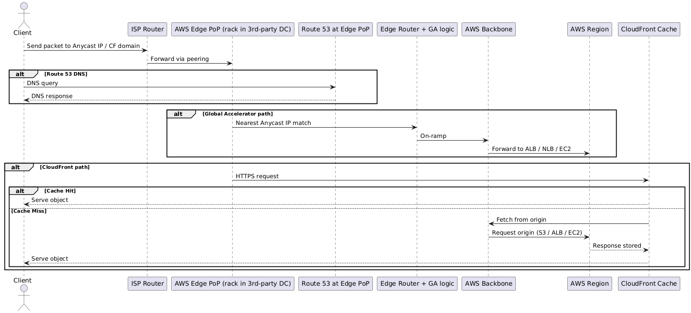

# AWS Network Services By OSI Model

<table class="study-table">
<thead>
<tr>
<th>OSI Layer</th>
<th>AWS Service</th>
<th>What It Does</th>
</tr>
</thead>
<tbody>
<tr>
<td><strong>L7 Application</strong></td>
<td>CloudFront</td>
<td>Content Delivery Network (CDN) for caching and accelerating web traffic.</td>
</tr>
<tr>
<td></td>
<td>Route 53</td>
<td>DNS resolution, domain registration, routing policies (latency, geo, failover).</td>
</tr>
<tr>
<td></td>
<td>WAF</td>
<td>Web Application Firewall filtering Layer 7 attacks (SQLi, XSS).</td>
</tr>
<tr>
<td></td>
<td>API Gateway</td>
<td>Expose/manage APIs, request/response routing.</td>
</tr>
<tr>
<td></td>
<td>App Mesh</td>
<td>Service mesh for microservice-to-microservice communication.</td>
</tr>
<tr>
<td><strong>L6 Presentation</strong></td>
<td>ACM (Certificate Manager)</td>
<td>Manages and deploys SSL/TLS certificates for encryption.</td>
</tr>
<tr>
<td></td>
<td>AWS Shield Advanced</td>
<td>DDoS protection including SSL/TLS-based attack mitigation.</td>
</tr>
<tr>
<td><strong>L5 Session</strong></td>
<td>Site-to-Site VPN</td>
<td>IPSec tunnels for connecting on-prem to AWS securely.</td>
</tr>
<tr>
<td></td>
<td>Client VPN</td>
<td>VPN for end-users to securely connect into AWS resources.</td>
</tr>
<tr>
<td></td>
<td>Direct Connect</td>
<td>Dedicated physical link for stable private connectivity into AWS.</td>
</tr>
<tr>
<td><strong>L4 Transport</strong></td>
<td>Global Accelerator</td>
<td>Anycast routing to improve global TCP/UDP performance and availability.</td>
</tr>
<tr>
<td></td>
<td>Elastic Load Balancer – NLB</td>
<td>Balances TCP/UDP traffic at connection level.</td>
</tr>
<tr>
<td></td>
<td>Elastic Load Balancer – ALB</td>
<td>Balances HTTP/HTTPS traffic (can inspect at L7, but transport at L4 too).</td>
</tr>
<tr>
<td></td>
<td>Transit Gateway</td>
<td>Hub-and-spoke model for connecting multiple VPCs and on-premises.</td>
</tr>
<tr>
<td><strong>L3 Network</strong></td>
<td>VPC</td>
<td>Logical isolated network with routing tables, subnets, ACLs.</td>
</tr>
<tr>
<td></td>
<td>Internet Gateway (IGW)</td>
<td>Provides L3 connectivity between VPC and the public internet.</td>
</tr>
<tr>
<td></td>
<td>NAT Gateway</td>
<td>Enables private instances to access the internet while hiding private IPs.</td>
</tr>
<tr>
<td></td>
<td>Virtual Private Gateway (VGW)</td>
<td>Endpoint for VPN connections into VPC.</td>
</tr>
<tr>
<td></td>
<td>Route 53 Resolver</td>
<td>DNS resolver inside a VPC for L3 name resolution.</td>
</tr>
<tr>
<td><strong>L2 Data Link</strong></td>
<td>Elastic Network Interface (ENI)</td>
<td>Virtual network card with MAC address, supporting multiple IPs.</td>
</tr>
<tr>
<td></td>
<td>VPC Peering (L2-ish abstraction)</td>
<td>Connects VPCs directly, routing frames/packets transparently.</td>
</tr>
<tr>
<td><strong>L1 Physical</strong></td>
<td>AWS Global Network Backbone</td>
<td>AWS's optical fiber, submarine cables, and data center cabling. Not exposed but forms the physical medium.</td>
</tr>
</tbody>
</table>

---


## Gateways and Their OSI Layer
<table class="study-table">
<thead>
<tr>
<th>AWS Gateway</th>
<th>OSI Layer</th>
<th>What It Does</th>
</tr>
</thead>
<tbody>
<tr>
<td><strong>Internet Gateway (IGW)</strong></td>
<td>L3 Network</td>
<td>Connects VPC to the public internet. Translates between private routing in VPC and global routing.</td>
</tr>
<tr>
<td><strong>NAT Gateway</strong></td>
<td>L3 Network</td>
<td>Lets private instances reach the internet. Performs IP + port translation (PAT).</td>
</tr>
<tr>
<td><strong>Virtual Private Gateway (VGW)</strong></td>
<td>L3 Network</td>
<td>VPN endpoint on AWS side; routes encrypted traffic into/out of VPC.</td>
</tr>
<tr>
<td><strong>Transit Gateway (TGW)</strong></td>
<td>L3 Network</td>
<td>Acts as a <strong>router hub</strong>: interconnects multiple VPCs, VPNs, and Direct Connect links using routing tables.</td>
</tr>
<tr>
<td><strong>PrivateLink / VPC Endpoint</strong></td>
<td>L3/L4</td>
<td>Provides private connectivity to AWS services over the VPC network. Works with DNS and TCP ports.</td>
</tr>
<tr>
<td><strong>Gateway Load Balancer (GWLB)</strong></td>
<td>L3/L4</td>
<td>Passes traffic to security appliances transparently, often used for firewalls/inspection.</td>
</tr>
</tbody>
</table>


# Understanding PoP

```
@startuml
actor Client

Client -> "ISP Router" : Send packet to Anycast IP / CF domain
"ISP Router" -> "AWS Edge PoP (rack in 3rd-party DC)" : Forward via peering

alt Route 53 DNS
  Client -> "Route 53 at Edge PoP" : DNS query
  "Route 53 at Edge PoP" --> Client : DNS response
end

alt Global Accelerator path
  "AWS Edge PoP (rack in 3rd-party DC)" -> "Edge Router + GA logic" : Nearest Anycast IP match
  "Edge Router + GA logic" -> "AWS Backbone" : On-ramp
  "AWS Backbone" -> "AWS Region" : Forward to ALB / NLB / EC2
end

alt CloudFront path
  "AWS Edge PoP (rack in 3rd-party DC)" -> "CloudFront Cache" : HTTPS request
  alt Cache Hit
    "CloudFront Cache" --> Client : Serve object
  else Cache Miss
    "CloudFront Cache" -> "AWS Backbone" : Fetch from origin
    "AWS Backbone" -> "AWS Region" : Request origin (S3 / ALB / EC2)
    "AWS Region" --> "CloudFront Cache" : Response stored
    "CloudFront Cache" --> Client : Serve object
  end
end
@enduml

```

Global Accelerator = Anycast IP + routing into backbone → your Region.
CloudFront = Anycast IP + CDN cache at edge → serve or fetch.
Both run on the same physical AWS PoP racks inside 3rd-party DCs.





# IPSEC VPN