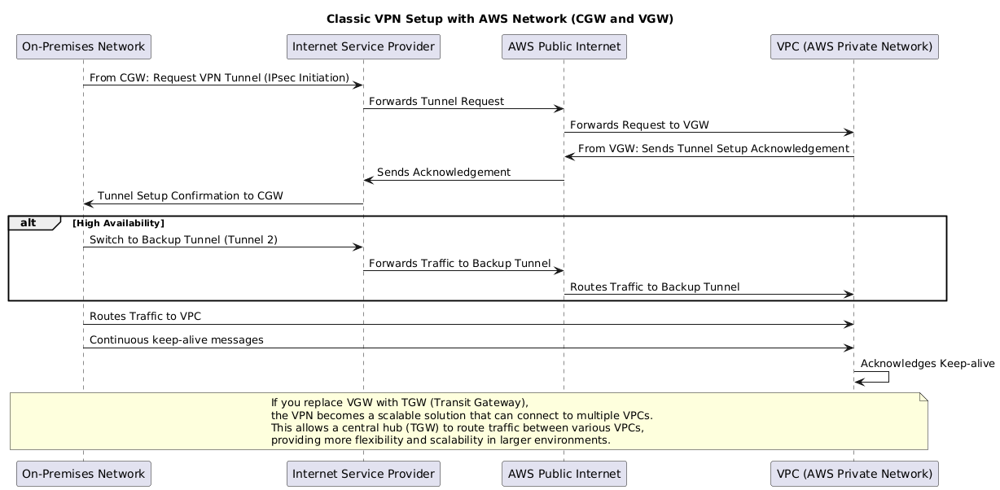

## AWS Network Overview  

AWS operates one of the largest private **fiber-optic backbones** in the world. This backbone connects **Data Centers**, groups them into **Availability Zones (AZs)**, and links multiple AZs to form a **Region**. From there, AWS extends outwards through **Points of Presence (PoPs)**, which connect to the **public internet** or provide private connectivity via **Direct Connect**.  

1. **Data Centers, AZs, and Regions**  
- **Data Centers** are the physical foundation.  
- A group of data centers = an **Availability Zone (AZ)**.  
- Several AZs = a **Region**, interconnected by the AWS backbone for **low-latency, fault-tolerant networking**.  

2. **Points of Presence (PoPs)**  
- AWS racks hosted inside **third-party colocation sites** (e.g., *Equinix, Digital Realty*).  
- Link the AWS backbone to **local ISPs** and **IXPs**.  
- Run edge services such as **CloudFront** (CDN caching) and **Global Accelerator** (traffic optimization).  

3. **Public Internet Connectivity**  
- PoPs handle AWS traffic **in and out of the public internet**.  
- Customers reach AWS services through **public endpoints** (e.g., *S3, EC2 APIs*).  

4. **Direct Connect (DX)**  
- A **dedicated private link** that bypasses the internet.  
- Provisioned at a PoP, giving you a **physical port on AWS gear**.  
- Delivers **lower latency, higher reliability, and consistent bandwidth** for hybrid cloud workloads.  

  
  
🌐 AWS Network Overview

---

## Service Type and Categories

### 1. 🌐 Internet Connectivity (Ingress / Egress)

<table class="study-table">
<thead>
<tr>
<th>AWS Service</th>
<th>Purpose</th>
<th>OSI Layer</th>
<th>Upstream</th>
<th>Downstream</th>
</tr>
</thead>
<tbody>
<tr>
<td><strong>Internet Gateway (IGW)</strong></td>
<td>Enables VPC to access the internet.</td>
<td>L3 – Network</td>
<td>Public Subnet</td>
<td>Internet</td>
</tr>
<tr>
<td><strong>NAT Gateway</strong></td>
<td>Allows private subnets to reach the internet.</td>
<td>L3 – Network</td>
<td>Private Subnet</td>
<td>IGW / Internet</td>
</tr>
<tr>
<td><strong>Virtual Private Gateway (VGW)</strong></td>
<td>VPN tunnel endpoint in AWS.</td>
<td>L3 – Network</td>
<td>On-prem VPN device</td>
<td>VPC Route Tables</td>
</tr>
<tr>
<td><strong>Transit Gateway (TGW)</strong></td>
<td>Central router between VPCs and VPN/Direct Connect.</td>
<td>L3 – Network</td>
<td>VPCs / VPN / DX</td>
<td>VPCs / VPN / DX</td>
</tr>
<tr>
<td><strong>Direct Connect</strong></td>
<td>Dedicated physical link to AWS.</td>
<td>L1 – Physical</td>
<td>On-prem Router/Switch</td>
<td>VPC via TGW / VGW</td>
</tr>
</tbody>
</table>

### 2. 🔁 Internal VPC & Private Service Communication

<table class="study-table">
<thead>
<tr>
<th>AWS Service</th>
<th>Purpose</th>
<th>OSI Layer</th>
<th>Upstream</th>
<th>Downstream</th>
</tr>
</thead>
<tbody>
<tr>
<td><strong>VPC Peering</strong></td>
<td>Connects two VPCs privately.</td>
<td>L2 (abstracted)</td>
<td>VPC A</td>
<td>VPC B</td>
</tr>
<tr>
<td><strong>PrivateLink / VPC Endpoint</strong></td>
<td>Connects to AWS services privately within VPC.</td>
<td>L3/L4</td>
<td>VPC Subnet / ENI</td>
<td>AWS Service ENI</td>
</tr>
<tr>
<td><strong>Route 53 Resolver</strong></td>
<td>Resolves DNS inside VPC.</td>
<td>L3 – Network</td>
<td>EC2 / Lambda / ENI</td>
<td>Internal DNS Targets</td>
</tr>
</tbody>
</table>

### 3. ⚖️ Load Balancing & Traffic Distribution

<table class="study-table">
<thead>
<tr>
<th>AWS Service</th>
<th>Purpose</th>
<th>OSI Layer</th>
<th>Upstream</th>
<th>Downstream</th>
</tr>
</thead>
<tbody>
<tr>
<td><strong>ALB (Application Load Balancer)</strong></td>
<td>Routes HTTP/HTTPS traffic.</td>
<td>L7 / L4</td>
<td>Internet / CloudFront</td>
<td>EC2 / Lambda / IPs</td>
</tr>
<tr>
<td><strong>NLB (Network Load Balancer)</strong></td>
<td>Balances TCP/UDP traffic.</td>
<td>L4 – Transport</td>
<td>Internet / Internal VPC</td>
<td>EC2 / IPs</td>
</tr>
<tr>
<td><strong>Gateway Load Balancer (GWLB)</strong></td>
<td>Sends traffic to firewalls/appliances.</td>
<td>L3 / L4</td>
<td>IGW / NLB</td>
<td>Security Appliance</td>
</tr>
<tr>
<td><strong>Global Accelerator</strong></td>
<td>Routes global traffic to optimal endpoint.</td>
<td>L4 – Transport</td>
<td>End User</td>
<td>NLB / ALB / IPs</td>
</tr>
</tbody>
</table>

### 4. 🔐 Security & Access Control

<table class="study-table">
<thead>
<tr>
<th>AWS Service</th>
<th>Purpose</th>
<th>OSI Layer</th>
<th>Upstream</th>
<th>Downstream</th>
</tr>
</thead>
<tbody>
<tr>
<td><strong>WAF</strong></td>
<td>Filters HTTP/HTTPS requests.</td>
<td>L7 – Application</td>
<td>CloudFront / ALB</td>
<td>ALB / API Gateway</td>
</tr>
<tr>
<td><strong>AWS Shield / Advanced</strong></td>
<td>DDoS protection for infrastructure and apps.</td>
<td>L3–L7</td>
<td>Internet / Edge</td>
<td>VPC Entry Points</td>
</tr>
<tr>
<td><strong>ACM</strong></td>
<td>Manages SSL/TLS certificates.</td>
<td>L6 – Presentation</td>
<td>N/A (integrated)</td>
<td>CloudFront / ALB / API GW</td>
</tr>
<tr>
<td><strong>Security Groups / NACLs</strong></td>
<td>Allow/deny traffic at instance or subnet boundary.</td>
<td>L3 / L4</td>
<td>Client or Peer Service</td>
<td>EC2 / ENI / Subnet</td>
</tr>
</tbody>
</table>

### 5. 🌍 Edge Services & DNS

<table class="study-table">
<thead>
<tr>
<th>AWS Service</th>
<th>Purpose</th>
<th>OSI Layer</th>
<th>Upstream</th>
<th>Downstream</th>
</tr>
</thead>
<tbody>
<tr>
<td><strong>CloudFront</strong></td>
<td>Distributes and caches content globally.</td>
<td>L7 – Application</td>
<td>End Users</td>
<td>ALB / S3 / API GW</td>
</tr>
<tr>
<td><strong>Route 53</strong></td>
<td>DNS resolution with traffic routing features.</td>
<td>L7 – Application</td>
<td>End Users</td>
<td>IP / ALB / CloudFront</td>
</tr>
</tbody>
</table>

### 6. 🧩 API & Microservice Communication

<table class="study-table">
<thead>
<tr>
<th>AWS Service</th>
<th>Purpose</th>
<th>OSI Layer</th>
<th>Upstream</th>
<th>Downstream</th>
</tr>
</thead>
<tbody>
<tr>
<td><strong>API Gateway</strong></td>
<td>Expose and manage REST/HTTP/WebSocket APIs.</td>
<td>L7 – Application</td>
<td>Client / CloudFront</td>
<td>Lambda / Service Backend</td>
</tr>
<tr>
<td><strong>App Mesh</strong></td>
<td>Controls and secures service-to-service traffic in a mesh.</td>
<td>L7 – Application</td>
<td>Microservice A</td>
<td>Microservice B</td>
</tr>
</tbody>
</table>

### 7. 🛠️ Core Networking Components

<table class="study-table">
<thead>
<tr>
<th>Component</th>
<th>Purpose</th>
<th>OSI Layer</th>
<th>Upstream</th>
<th>Downstream</th>
</tr>
</thead>
<tbody>
<tr>
<td><strong>VPC</strong></td>
<td>Isolated virtual network with subnets and routing.</td>
<td>L3 – Network</td>
<td>Internet / VPN</td>
<td>Subnets</td>
</tr>
<tr>
<td><strong>Elastic Network Interface (ENI)</strong></td>
<td>Virtual NIC attached to resources.</td>
<td>L2 – Data Link</td>
<td>Subnet / VPC</td>
<td>EC2 / Lambda</td>
</tr>
</tbody>
</table>

---

## Service Breakdown

## VPN

### Site to Site VPN

  
  

    🔐 Site-to-Site VPN – Communication Sequence (hover to see PlantUML code)
  

  <!-- Keep your PlantUML raw here -->
  

| **VPN Type**     | **On-Premise Side (CGW)**                                     | **Amazon Side (VGW/TGW)**                                                         | **Description**                                                                                                           |
| ---------------- | ------------------------------------------------------------- | --------------------------------------------------------------------------------- | ------------------------------------------------------------------------------------------------------------------------- |
| **Classic VPN**  | **CGW** – Customer Gateway (hardware or software VPN device)  | **VGW** – Virtual Private Gateway (VPN endpoint on AWS side for the VPC)          | Point-to-point VPN between on-premises and AWS using **VGW**. Route configuration can be **static** or **dynamic** (BGP). |
| **Scalable VPN** | **CGW** – Customer Gateway (supports BGP for dynamic routing) | **TGW** – Transit Gateway (centralized hub for connecting multiple VPCs and VPNs) | VPN for large-scale networks with **BGP** for dynamic routing and the ability to connect multiple VPCs via **TGW**.       |

**Static VPN**

* **Route**: Static routes in route tables (manual setup).
* **Pros**: Simple setup.
* **Cons**: No load balancing or failover.

**Dynamic VPN**

* **Route**: Uses **BGP** for automatic route exchange.
* **Pros**: HA, automatic failover, and load balancing.
* **Cons**: More complex setup.

**VPN Considerations**

* **Speed**: Max **1.25 Gbps**.
* **Latency**: Inconsistent due to public internet routing.
* **Cost**: Hourly charges + data transfer fees.
* **Setup Speed**: Fast, software-based.
* **Backup for DX**: Can be used as a failover for Direct Connect.
* **Direct Connect**: Can work with Direct Connect for redundancy.

Here's a concise summary:

1. **VPC Route Tables**: Each VPC has its own route table that determines how traffic within the VPC is routed. By default, the VPC route table takes priority for traffic originating from within that VPC.

2. **Transit Gateway (TGW)**: TGW acts as a central hub for connecting multiple VPCs, VPNs, and Direct Connect links. Each TGW has a **default route table** (RT) and supports **route propagation** and **association**.

3. **Association**:

   * **Associating a route table to an attachment** (e.g., a VPC or VPN) means specifying which **subnets or attachments** use that route table for routing decisions.
   * Each attachment (VPC, VPN, Direct Connect) can **only** be associated with **one route table** at a time.

4. **Propagation**:

   * **Propagation** automatically adds routes to a route table. For example, routes from a **VPC** or **VPN** can be propagated into the **TGW route table**, making it dynamic.
   * Without propagation, routes are **static** and must be manually added.

5. **Routing Priority**:

   * Traffic originating within a **VPC** follows the **VPC route table**.
   * For traffic routed to or from other VPCs via TGW, the **TGW route table** is used.
   * **Specific routes** (longest prefix match) take priority when multiple route tables have entries for the same destination.

6. **Multiple Route Tables**:

   * **Multiple route tables** can be created in a TGW for more advanced routing, like segmenting traffic for different environments (e.g., Dev, Prod).
   * Each attachment can only be associated with one route table, but one route table can support multiple attachments.

In short, **association** determines **which route table is used**, and **propagation** allows **automatic updates** of route tables with new routes based on connections.

---
Alright, let’s break this down step-by-step for your scenario. You want **VPC1** and **VPC2** to both have access to **on-premises**, but you don't want **VPC1** to communicate with **VPC2**. To achieve this, we need to carefully set up **Transit Gateway (TGW)**, **VPC route tables**, **TGW route tables**, and **VPC attachments** to control the traffic flow and routing.

### Step 1: **Create Transit Gateway (TGW) and Attachments**

1. **Create the Transit Gateway (TGW)**:

   * This creates a **TGW route table** (default route table, **Route Table A**) that will be used by all connected attachments by default.
2. **Attach VPCs and On-premises to TGW**:

   * Attach **VPC1**, **VPC2**, and **On-premises** to the **TGW**. Each attachment creates a link between the **TGW** and the connected resources.
   * For example:

     * **VPC1 Attachment**
     * **VPC2 Attachment**
     * **On-premises Attachment** (this can be a VPN or Direct Connect attachment)

   These attachments don't have individual route tables themselves, but they will be part of the **TGW route table** and can use **propagation** or be **associated** to different route tables.

### Step 2: **Set Up TGW Route Table**

* **By default**, the **TGW route table** (**Route Table A**) is used for all attachments. This means that initially, **VPC1**, **VPC2**, and **On-premises** will all be able to communicate with each other because the default TGW route table allows traffic between these attachments.
* However, you want to prevent **VPC1** from talking to **VPC2**. So, we'll modify the TGW route table to achieve this.

### Step 3: **Set Up VPC Route Tables**

Each VPC (VPC1 and VPC2) has its own **route table** (which is managed separately).

1. **VPC1 Route Table**:

   * Initially, **VPC1** will have a default route table that will route any traffic destined for **On-premises** through the **TGW attachment**.
   * **Add a Route in VPC1’s Route Table**:

     * Route: `0.0.0.0/0` → **TGW Attachment** (for On-premises access)

   VPC1 **will not have a route to VPC2** at this stage, so any traffic to VPC2 will be blocked.

2. **VPC2 Route Table**:

   * Similarly, **VPC2** will have a default route table that routes traffic for **On-premises** through the **TGW attachment**.
   * **Add a Route in VPC2’s Route Table**:

     * Route: `0.0.0.0/0` → **TGW Attachment** (for On-premises access)

   VPC2 **will not have a route to VPC1** by default.

### Step 4: **Control Communication Between VPCs Using TGW Route Tables**

Now let’s address the part where **VPC1** should **not** communicate with **VPC2**.

1. **Modify TGW Route Table**:

   * Go to **Route Table A** in the **TGW** and explicitly **remove the route** that allows traffic from **VPC1** to **VPC2**.
   * **VPC1 to VPC2 route**: Remove any route entries in **Route Table A** that would allow traffic from **VPC1** to **VPC2**. This will prevent **VPC1** from routing traffic to **VPC2** via the TGW.

2. **Route Propagation for On-premises**:

   * Allow **propagation** from **On-premises** to **TGW**, so both **VPC1** and **VPC2** can reach **On-premises**. Propagation ensures that when On-premises is attached to TGW, its routes are automatically added to the TGW route table, allowing all connected VPCs to access On-premises.

### Step 5: **Attachment and Propagation for On-premises**

* **On-premises Attachment**: The **On-premises** network will be attached to the **TGW** with its own **VPC attachment**.

  * This **attachment** will allow **VPC1**, **VPC2**, and **On-premises** to communicate.
  * For routing, the **On-premises route table** will propagate routes back into the TGW route table (so **VPC1** and **VPC2** can reach **On-premises**).

### Summary Flow:

1. **VPC1 → TGW → On-premises**:

   * **VPC1's Route Table**: Routes traffic destined for **On-premises** via **TGW**.
   * **TGW Route Table A**: Forwards traffic to **On-premises**.
   * **On-premises**: Receives traffic and responds.

2. **VPC2 → TGW → On-premises**:

   * **VPC2's Route Table**: Routes traffic destined for **On-premises** via **TGW**.
   * **TGW Route Table A**: Forwards traffic to **On-premises**.
   * **On-premises**: Receives traffic and responds.

3. **VPC1 and VPC2 cannot talk to each other** because the **TGW route table** has no routes allowing **VPC1 to communicate with VPC2**.

### Key Points:

* **VPCs** have their own **route tables**, and each **subnet** in a VPC is associated with a route table.
* **TGW** has its own route table to manage routing between attached VPCs and external networks.
* **Attachments** link VPCs and other resources (like On-premises) to the TGW but don't have route tables themselves.
* **Propagation** allows routes to be automatically added to the TGW route table from attached resources (like **On-premises**), but you **control communication** between VPCs by modifying the **TGW route table**.
* By **not propagating** routes between VPC1 and VPC2, you can prevent them from communicating.

---

Let me know if this helps, or if you need any additional clarification!

<!-- Image Modal -->

  

    &times;
    <button class="modal-nav modal-prev">&#8249;</button>
    <button class="modal-nav modal-next">&#8250;</button>
    
    

  

