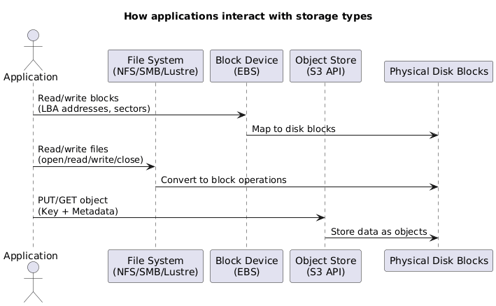

## 1. Storage Building Blocks {#section-1-storage-building-blocks}

AWS exposes storage through three primary layers. Understanding how each layer writes to blocks helps when selecting the right service or designing migration paths.

<table class="study-table">
<thead>
<tr>
<th>Layer</th>
<th>What It Exposes</th>
<th>How It Writes</th>
<th>Effect on Blocks</th>
</tr>
</thead>
<tbody>
<tr>
<td><strong>Block Device</strong></td>
<td>Logical block addresses (LBA 0…n)</td>
<td>Direct I/O; write a 4 KB block at a time.</td>
<td>Overwrites the block exactly as requested; no metadata awareness.</td>
</tr>
<tr>
<td><strong>File System</strong></td>
<td>Files, directories, inodes, and metadata.</td>
<td>Splits files into metadata + data blocks.</td>
<td>Blocks interleave metadata and file payloads.</td>
</tr>
<tr>
<td><strong>Object Store</strong></td>
<td>Object = key + metadata + blob.</td>
<td>Stores metadata in an index, data in hidden chunks.</td>
<td>Objects fan out across multiple block devices; layout abstracted.</td>
</tr>
</tbody>
</table>

  
  

    🧩 Storage System
  

  

---

## 2. Managed File Services {#section-2-managed-file-services}

AWS offers several turnkey file systems so lift-and-shift workloads do not require hand-built EC2 clusters. The three most common services cover Windows shares, HPC Lustre clusters, and general-purpose NFS for Linux.

### 2.1 Amazon FSx for Windows File Server {#section-2-1-fsx-windows}

- Presents fully managed SMB shares with native Windows semantics (NTFS ACLs, SMB dialects, DFS Namespaces).
- Supports Volume Shadow Copy Service (VSS) so users can self-serve file-level restores.
- Integrates with self-managed Active Directory or AWS Managed Microsoft AD; you keep ownership of the domain join.
- Delivers multi-AZ scale-out options and the ability to lift traditional Windows file server workloads without standing up EC2 hosts.

---

### 2.2 Amazon FSx for Lustre {#section-2-2-fsx-lustre}

- Purpose-built for Linux HPC workloads needing 100s of GB/s throughput and sub-millisecond latency.
- Two deployment modes:
  - **Scratch**: no replication, temporary storage, 200 MB/s per TiB baseline; best for ephemeral HPC runs.
  - **Persistent**: 50/100/200 MB/s per TiB baseline with intra-AZ replication and auto-healing.
- Metadata lives on Metadata Targets (MSTs); object data spreads across Object Storage Targets (OSTs).
- Minimum size 1.2 TiB (then 2.4 TiB increments). Larger filesystems add servers/disks for parallelism.
- Seamless S3 integration: link to an S3 bucket, lazily load objects into the file system, archive back to S3 via `hsm_archive`, and keep 0–35 day backups in S3.

---

### 2.3 Amazon Elastic File System (EFS) {#section-2-3-efs}

- Managed NFSv4 storage for Linux instances (EC2, on-prem via DX/VPN).
- Mount targets expose private IPs per subnet/AZ; traffic never traverses the public internet.
- Supports POSIX permissions, security groups, and access via multiple instances simultaneously.
- Performance modes:
  - **General Purpose** – low-latency workloads.
  - **Max I/O** – higher aggregate throughput and open file counts.
- Throughput modes:
  - **Bursting** – scales with filesystem size.
  - **Provisioned** – fixed MB/s regardless of stored data.
- Storage classes: **Standard** and **Infrequent Access (IA)** with lifecycle policies moving cold files automatically.

---

## 3. Amazon S3 Core Concepts {#section-3-amazon-s3-core-concepts}

Simple Storage Service underpins most AWS architectures. The focus areas below keep cost, durability, and replication under control.

### 3.1 Cost Model {#section-3-1-cost-model}

S3 charges on three levers: storage (GB-month), requests (per 1,000 API calls), and data transfer out (per GB). Choosing the right storage class, lifecycle rules, and replication strategy is how to keep those levers predictable.

---

### 3.2 Storage Classes {#section-3-2-storage-classes}

<table class="study-table">
<thead>
<tr>
<th>Class</th>
<th>Durability & Availability</th>
<th>Retrieval</th>
<th>Minimums</th>
<th>Best For</th>
</tr>
</thead>
<tbody>
<tr>
<td><strong>Standard</strong></td>
<td>11 nines durability, multi-AZ availability.</td>
<td>Milliseconds, no retrieval fee.</td>
<td>None.</td>
<td>Hot data, frequently accessed, mission critical.</td>
</tr>
<tr>
<td><strong>Standard-IA</strong></td>
<td>Multi-AZ, same durability.</td>
<td>Milliseconds, per-GB retrieval fee.</td>
<td>30-day storage; 128 KB minimum charge.</td>
<td>Long-lived but infrequently accessed data.</td>
</tr>
<tr>
<td><strong>One Zone-IA</strong></td>
<td>Single AZ (cost optimized).</td>
<td>Milliseconds, per-GB retrieval fee.</td>
<td>30-day storage; 128 KB minimum charge.</td>
<td>Re-creatable data that can tolerate AZ loss.</td>
</tr>
<tr>
<td><strong>Glacier Instant Retrieval</strong></td>
<td>Multi-AZ durability.</td>
<td>Milliseconds, higher retrieval fee.</td>
<td>90-day storage minimum.</td>
<td>Quarterly access patterns with instant retrieval needs.</td>
</tr>
<tr>
<td><strong>Glacier Flexible Retrieval</strong></td>
<td>Multi-AZ, cold archive.</td>
<td>Minutes to hours per retrieval job.</td>
<td>90-day storage minimum.</td>
<td>Archival data; bulk retrievals acceptable.</td>
</tr>
<tr>
<td><strong>Glacier Deep Archive</strong></td>
<td>Multi-AZ, lowest cost.</td>
<td>12–48 hours.</td>
<td>180-day storage minimum.</td>
<td>Compliance archives rarely accessed.</td>
</tr>
</tbody>
</table>

---

### 3.3 Intelligent-Tiering {#section-3-3-intelligent-tiering}

- Monitors objects for access and automatically moves them:
  - <30 days → Frequent Access tier.
  - 30+ days idle → Infrequent Access tier.
  - 90–270 days idle → Archive Instant Access tier.
  - 180–730 days idle → Deep Archive Access tier.
- No retrieval fees; small monitoring charge per object.
- Ideal when access patterns are unpredictable or when manual lifecycle rules become complex.

---

### 3.4 Lifecycle Policies {#section-3-4-lifecycle-policies}

- Transition actions move data between classes; minimum 30 days before any transition and another 30 days before moving to archive classes.
- Expiration actions permanently delete objects or previous versions.
- Rules can target prefixes or tags; multiple rules handle sequential transitions (e.g., Standard → Standard-IA → Glacier Flexible).

---

### 3.5 Replication (SRR/CRR) {#section-3-5-replication}

- Requires versioning on both source and destination buckets; not retroactive.
- IAM role grants S3 permission to replicate via HTTPS; cross-account destinations need a trusting bucket policy.
- Options:
  - **Same-Region Replication (SRR)** – log aggregation, sovereign backups, multi-environment sync.
  - **Cross-Region Replication (CRR)** – global resiliency, latency reduction, geo-compliance.
- Settings:
  - Filter objects (prefix, tags).
  - Override storage class at destination.
  - Define object ownership and replication metrics (including Replication Time Control for SLA-backed copy times).
- Limitations: Glacier/Deep Archive objects and bucket-level events do not replicate.

---

## 4. S3 Security & Data Management {#section-4-s3-security-data}

After the storage class and lifecycle decisions are made, attention shifts to encryption, secure sharing, and data-classification tooling around S3.

### 4.1 Encryption Choices {#section-4-1-encryption}

- **SSE-S3** – S3 manages keys (AES-256); simplest option.
- **SSE-KMS** – use AWS KMS CMKs for per-object DEKs, fine-grained access control, auditing, and rotation.
- **SSE-C** – bring your own keys in the request; AWS never stores them.
- **Client-side encryption** – encrypt before upload; S3 stores ciphertext only.
- **Bucket Keys** – cache a time-limited KMS key per bucket to reduce KMS API calls for SSE-KMS workloads; shows up as bucket events in CloudTrail and works with replication.

---

### 4.2 Presigned URLs {#section-4-2-presigned-urls}

- Provide time-bound, signed access for GET or PUT against otherwise private objects.
- Permissions inherit from the identity that generated the URL; “AccessDenied” often indicates the signer lacked permissions.
- Avoid using short-lived assumed roles to generate URLs—when the role session expires, the URL breaks.

---

### 4.3 S3 & Glacier Select {#section-4-3-select}

- Run SQL-like queries against CSV, JSON, or Parquet objects directly in S3/Glacier to retrieve only the filtered data.
- Reduces data transfer and client-side processing when dealing with multi-GB objects.

---

### 4.4 S3 Access Points {#section-4-4-access-points}

- Create dedicated endpoints (with their own policies and network controls) per application, team, or VPC instead of using a single bucket policy.
- Each access point can restrict prefixes, require VPC origins, or expose a public hostname.

---

### 4.5 Object Lock {#section-4-5-object-lock}

- Enables WORM behavior on a per-object-version basis; requires versioning and cannot be disabled once enabled on a bucket.
- Retention modes:
  - **Compliance** – immutable until the retention date; even the root user cannot shorten it.
  - **Governance** – privileged users with `s3:BypassGovernanceRetention` can adjust retention.
- **Legal holds** – binary on/off flag (`S3:PutObjectLegalHold`) with no expiry until removed.

---

### 4.6 Amazon Macie {#section-4-6-macie}

- Data security service that inspects S3 for PII/PHI/financial data using managed or custom identifiers.
- Findings categories:
  - **Policy** – encryption disabled, public access enabled, etc.
  - **Sensitive data** – exposed credentials, personal identifiers, multi-type matches.
- Integrates with Security Hub and EventBridge for automated response workflows and central management across accounts.

---

## 5. Block & Ephemeral Storage {#section-5-block-ephemeral}

EC2 workloads still rely on block devices for boot/root volumes and ultra-low-latency scratch space. This section summarizes the available performance tiers and when to pick each one.

### 5.1 SSD-backed EBS Volumes {#section-5-1-ssd-ebs}

<table class="study-table">
<thead>
<tr>
<th>Type</th>
<th>IOPS Model</th>
<th>Baseline / Burst</th>
<th>Notes</th>
</tr>
</thead>
<tbody>
<tr>
<td><strong>gp2</strong></td>
<td>3 IOPS/GB (minimum 100); credit bucket.</td>
<td>Up to 3,000 IOPS burst; 16,000 max.</td>
<td>Great for boot disks and general workloads; must manage I/O credits.</td>
</tr>
<tr>
<td><strong>gp3</strong></td>
<td>Provision IOPS independently of size.</td>
<td>3,000 IOPS & 125 MiB/s baseline; scale to 16,000 IOPS & 1,000 MiB/s.</td>
<td>20% cheaper than gp2; combines gp2 flexibility with io1 features.</td>
</tr>
<tr>
<td><strong>io1/io2</strong></td>
<td>Provision up to 64,000 IOPS (256,000 with io2 Block Express).</td>
<td>Consistent low latency; up to 4 GB/s throughput on Block Express.</td>
<td>Use for low-latency databases; io2 offers 500 IOPS/GB durability SLA.</td>
</tr>
</tbody>
</table>

---

### 5.2 HDD-backed EBS Volumes {#section-5-2-hdd-ebs}

<table class="study-table">
<thead>
<tr>
<th>Type</th>
<th>Workload</th>
<th>Baseline</th>
<th>Burst</th>
<th>Use Case</th>
</tr>
</thead>
<tbody>
<tr>
<td><strong>st1 (Throughput Optimized)</strong></td>
<td>Sequential, frequently accessed data.</td>
<td>40 MB/s per TiB.</td>
<td>Up to 250 MB/s per TiB (max 500 MB/s).</td>
<td>Big data, ETL streams, logs.</td>
</tr>
<tr>
<td><strong>sc1 (Cold HDD)</strong></td>
<td>Infrequently accessed data.</td>
<td>12 MB/s per TiB.</td>
<td>Up to 80 MB/s per TiB (max 250 MB/s).</td>
<td>Lowest-cost magnetic storage for archives.</td>
</tr>
</tbody>
</table>

---

### 5.3 Instance Store vs. EBS {#section-5-3-instance-store-vs-ebs}

- **Instance Store** – physically attached NVMe/SATA on the host; millions of IOPS, but data disappears when the instance stops, terminates, or the host fails.
- **EBS** – network-attached block storage; persistent, resilient, snapshot-capable, and independent of the instance lifecycle.
- Selection guidance:
  - Persistence/resilience/isolation → choose EBS.
  - Ultra-low latency scratch space or >260K IOPS → choose instance store (often striped RAID-0 for even higher throughput).
  - Cost-sensitive streaming workloads → HDD-based EBS (st1/sc1).

---

## 6. AWS Transfer Family {#section-6-transfer-family}

Managed service for lifting traditional file-transfer workflows into S3 or EFS without running custom servers.

<table class="study-table">
<thead>
<tr>
<th>Protocol</th>
<th>Use Case</th>
<th>Identity Options</th>
<th>Endpoint Modes</th>
</tr>
</thead>
<tbody>
<tr>
<td><strong>SFTP</strong></td>
<td>Secure shell file transfers (most common).</td>
<td>Service-managed, AWS Directory Service, or custom IdP.</td>
<td>Public, VPC (internet-facing with Elastic IP), or VPC-internal only.</td>
</tr>
<tr>
<td><strong>FTPS</strong></td>
<td>FTP over TLS for partners needing TLS termination.</td>
<td>Directory Service or custom IdP.</td>
<td>Public or VPC modes.</td>
</tr>
<tr>
<td><strong>FTP</strong></td>
<td>Legacy internal-only transfers.</td>
<td>Directory Service or custom IdP.</td>
<td>VPC-internal mode only.</td>
</tr>
<tr>
<td><strong>AS2</strong></td>
<td>Structured B2B document exchange.</td>
<td>Service-managed users.</td>
<td>Public endpoints.</td>
</tr>
</tbody>
</table>

Key traits:

- Multi-AZ architecture delivers resilience without patching or capacity management.
- Pay by the hour for the server endpoint plus standard S3/EFS request and transfer charges; no upfront fees.
- Works with DX/VPN for private ingestion pipelines.

---

## 4. Exam Reminders {#section-4-exam-reminders}

- **EBS vs instance store** – EBS is persistent, snapshot-capable, and survives stop/start; instance store is ephemeral and tied to host lifecycle.
- **Snapshots** – incremental, stored in S3, cross-Region copyable. Use them for PITR or as seeds for new volumes.
- **RAID quick sheet** – 0 (striping, no redundancy), 1 (mirroring), 5 (1 disk fault tolerance), 6 (2 disks), 10 (striped mirrors), 50/60 (stacked). Hot spares auto-replace failed disks.
- **RDS** – snapshots stored in S3; cross-Region replica promotion triggers reboot; deletion protection stops accidental wipes but is not a backup.
- **Redshift** – enable snapshot copy grants when copying encrypted snapshots to another Region (destination CMK required).
- **FSx for Lustre** – high-performance POSIX file system with manual resize; integrate with S3 via import/export.
- **Storage Gateway restores** – to recover a volume, restore snapshot → create EBS volume → attach to EC2; there is no direct S3→EC2 attach.
- **S3 SSE-C headers** – clients must send `x-amz-server-side-encryption-customer-algorithm` (usually `AES256`) and `x-amz-server-side-encryption-customer-key-MD5` (Base64 MD5 of the key).
- **S3 versioning** – existing objects receive `VersionId = null` when enabling versioning. Design prefixes for search/browse patterns since S3 has limited query capabilities.
- **Aurora fast restart** – buffer cache kept outside database process; restarts often finish in under a minute without full redo replay.
- **AWS Backup** – centralized service to define backup plans/schedules across EBS, RDS, DynamoDB, EFS, FSx, Storage Gateway, and on-prem connectors. Monitor backup jobs and compliance from a single console.
- **Storage Gateway (iSCSI)** – uses CHAP for initiator authentication, protecting against replay attacks before accessing cached/volume targets.

---
