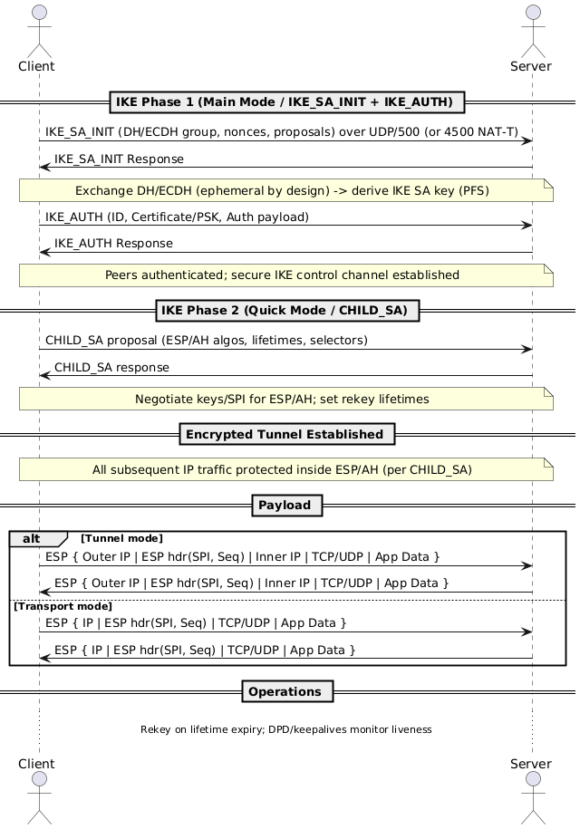

# OSI Model

The **OSI (Open Systems Interconnection) Model** is a conceptual framework that describes how data moves across a network. It breaks communication into **seven layers**, each with a distinct role—from physical signals up to human-facing applications.  

By separating responsibilities, the OSI model makes it easier to design, troubleshoot, and scale networks. Each higher layer builds on the services of the one below, while remaining logically independent.

---

## 1. The 7 Layers

<table class="study-table">
<thead>
<tr>
<th>Layer</th>
<th>Example Protocols</th>
<th>Data Unit</th>
<th>What It Adds / Handles</th>
<th>Notes</th>
</tr>
</thead>
<tbody>
<tr>
<td>L7 Application</td>
<td>HTTP, DNS, SMTP, FTP</td>
<td>Data</td>
<td>User-facing services</td>
<td>Browser → HTTP, Mail → SMTP.</td>
</tr>
<tr>
<td>L6 Presentation</td>
<td>TLS/SSL, JPEG, JSON</td>
<td>Record</td>
<td>Data format, encryption, compression</td>
<td>Often merged into L7.</td>
</tr>
<tr>
<td>L5 Session</td>
<td>NetBIOS, RPC</td>
<td>–</td>
<td>Session setup & teardown</td>
<td>Rarely explicit today.</td>
</tr>
<tr>
<td>L4 Transport</td>
<td>TCP, UDP</td>
<td>Segment</td>
<td>Reliable (TCP) vs fast (UDP)</td>
<td>TCP = handshake, ports, seq/ack. UDP = stateless.</td>
</tr>
<tr>
<td>L3 Network</td>
<td>IP, ICMP</td>
<td>Packet</td>
<td>Logical addressing & routing</td>
<td>Routers forward packets. Uses ARP for MAC resolution.</td>
</tr>
<tr>
<td>L2 Data Link</td>
<td>Ethernet, Wi-Fi, PPP</td>
<td>Frame</td>
<td>Local delivery</td>
<td>Frames = MAC headers + payload + CRC.</td>
</tr>
<tr>
<td>L1 Physical</td>
<td>Copper, Fiber, Wi-Fi PHY</td>
<td>Bits</td>
<td>Transmission of raw signals</td>
<td>Voltage, RF, or optical light.</td>
</tr>
</tbody>
</table>

🔁 **Encapsulation order:**  
`Application Data → Segment → Packet → Frame → Bits`

  
  

    <a href="https://bytebytego.com/guides/what-is-osi-model/" target="_blank" style="text-decoration: none; color: var(--accent);">
      📖 Source: OSI Model Explained – Byte Byte Go
    </a>
  

---

## 2. Devices at Each Layer

<table class="study-table">
<thead>
<tr>
<th>Device</th>
<th>Layer</th>
<th>What It Does</th>
<th>Protocols</th>
<th>Authentication</th>
</tr>
</thead>
<tbody>
<tr>
<td>Load Balancer</td>
<td>L4–L7</td>
<td>Distributes traffic</td>
<td>TCP, HTTP/S, gRPC</td>
<td>TLS certs, tokens</td>
</tr>
<tr>
<td>Firewall</td>
<td>L3–L4 (sometimes L7)</td>
<td>Filters packets/flows</td>
<td>IP, TCP/UDP, HTTP</td>
<td>Rules, TLS interception, VPN</td>
</tr>
<tr>
<td>Router</td>
<td>L3</td>
<td>Routes IP packets</td>
<td>IP, ICMP, BGP, OSPF</td>
<td>BGP MD5, IPsec</td>
</tr>
<tr>
<td>Switch</td>
<td>L2</td>
<td>Forwards frames by MAC</td>
<td>Ethernet, VLAN, ARP</td>
<td>802.1X, MAC binding</td>
</tr>
<tr>
<td>Hub</td>
<td>L1</td>
<td>Repeats bits blindly</td>
<td>–</td>
<td>None</td>
</tr>
</tbody>
</table>

---

## 3. Layer Interactions

### 3.1 Layer 2 – ARP

Maps IP → MAC via broadcast request and unicast reply.  

  
  

    🖼️ ARP – Address Resolution Protocol Sequence (hover to see PlantUML code)
  

    <!-- Keep your PlantUML raw here -->
  

### 3.2 Layer 2 – VLANs & Trunks
VLANs, trunks, and QinQ are needed to segment traffic, reduce broadcast domains, and efficiently carry multiple logical networks over the same physical infrastructure.

* **VLAN (802.1Q):**
  * Adds a VLAN ID tag inside Ethernet frames.
  * Splits one physical switch into **multiple broadcast domains** → improves scalability & security.

* **Trunks:**
  * A single link between switches that **carries multiple VLANs** using tagging.
  * Avoids needing one cable per VLAN.

* **QinQ (802.1AD):**
  * **VLAN stacking** (two tags: S-Tag + C-Tag).
  * Lets ISPs carry customer VLANs over their own backbone.
  * Expands VLAN ID space beyond the 4096 limit.

👉 All three work at **Layer 2 (Frames)** to logically separate traffic over shared physical networks.

### 3.3 Layer 3 – Routing
Routers strip old frames, keep IP header, attach new MAC header for next hop.  

  
  

    🖼️ L3 Routing – Packet Routing Sequence (hover to see PlantUML code)
  

  <!-- Keep your PlantUML raw here -->
  

### 3.4 Layer 3 & 5–6 - IPsec
IPsec = encrypted **network tunnels**.  
- **IKE (control plane)** negotiates SAs and keys (**Layer 5–6**, over UDP/500 or UDP/4500 for NAT-T).  
- **ESP/AH (data plane)** protects IP packets at **Layer 3**.  
- Commonly used for site-to-site and remote-access VPNs.  
- Protects *all traffic* (HTTP, SSH, DNS, ICMP, etc.), independent of app protocol.

  
  

    🖼️ IPsec – IKE Handshake Sequence (hover to see PlantUML code)
  

  <!-- Keep your PlantUML raw here -->
  

> Elliptic Curve Diffie–Hellman Ephemeral provides **Perfect Forward Secrecy (PFS)** by using a fresh, temporary key pair per session. Even if a server’s long-term private key is later compromised, past sessions remain confidential. Both TLS and IPsec commonly prefer ECDHE for key exchange.

### 3.5 Layer 5–6 - TLS
TLS = encrypted **application sessions**.  
- Runs above TCP (L4) and below Application (L7).  
- Provides confidentiality, integrity, authentication.  
- Examples: HTTPS, SMTPS, IMAPS.  
- Protects *specific app protocols*, not all traffic.

 

  
  

    🖼️ TLS – Secure Handshake Sequence (hover to see PlantUML code)
  

  <!-- Keep your PlantUML raw here -->
  

### 3.6 Traffic Addressing Modes (Unicast, Broadcast, Multicast, Anycast, Geocast)

How frames/packets are addressed determines who receives them and how the network treats them.

<table class="study-table">
<thead>
<tr>
  <th>Mode</th>
  <th>Who Receives</th>
  <th>OSI Context</th>
  <th>Typical Uses</th>
  <th>Key Notes</th>
</tr>
</thead>
<tbody>
<tr>
  <td><strong>Unicast</strong></td>
  <td>Exactly one host</td>
  <td>L2 (MAC→MAC), L3 (IP→IP)</td>
  <td>Web browsing, API calls, SSH</td>
  <td>Most traffic is unicast. Switched at L2, routed at L3.</td>
</tr>
<tr>
  <td><strong>Broadcast</strong></td>
  <td>All hosts in the L2 broadcast domain</td>
  <td>L2 (FF:FF:FF:FF:FF:FF)</td>
  <td>ARP, DHCP DISCOVER</td>
  <td>Routers block broadcasts by default.</td>
</tr>
<tr>
  <td><strong>Multicast</strong></td>
  <td>Members of a subscribed group</td>
  <td>L3 (224.0.0.0/4 IPv4; ff00::/8 IPv6)</td>
  <td>IPTV, conferencing, OSPF</td>
  <td>Uses IGMP/MLD (hosts), PIM (routers).</td>
</tr>
<tr>
  <td><strong>Anycast</strong></td>
  <td>“Nearest” one of many identical endpoints</td>
  <td>L3 (same IP announced in multiple sites)</td>
  <td>CDNs, DNS resolvers</td>
  <td>Routing selects the closest service.</td>
</tr>
<tr>
  <td><strong>Geocast</strong></td>
  <td>Hosts in a geographic region</td>
  <td>L3 concept</td>
  <td>Vehicular alerts, ITS</td>
  <td>Conceptual; app-layer in practice.</td>
</tr>
</tbody>
</table>

---

## 4. Commands by OSI Layer

<table class="study-table">
<thead>
<tr>
<th>Layer</th>
<th>Command</th>
<th>Purpose</th>
<th>Example</th>
</tr>
</thead>
<tbody>
<tr>
<td>L2</td>
<td><code>arp</code></td>
<td>Show ARP cache</td>
<td><code>arp -a</code></td>
</tr>
<tr>
<td>L3</td>
<td><code>ping</code></td>
<td>Test ICMP reachability</td>
<td><code>ping 8.8.8.8</code></td>
</tr>
<tr>
<td>L3</td>
<td><code>traceroute</code></td>
<td>Show hop path</td>
<td><code>mtr 8.8.8.8</code></td>
</tr>
<tr>
<td>L4</td>
<td><code>ss</code></td>
<td>List sockets</td>
<td><code>ss -ant</code></td>
</tr>
<tr>
<td>L4</td>
<td><code>tcpdump</code></td>
<td>Capture packets</td>
<td><code>tcpdump -i eth0 port 443</code></td>
</tr>
<tr>
<td>L7</td>
<td><code>dig</code></td>
<td>DNS lookup</td>
<td><code>dig example.com</code></td>
</tr>
<tr>
<td>L7</td>
<td><code>curl</code></td>
<td>Test HTTP</td>
<td><code>curl -vk https://site</code></td>
</tr>
<tr>
<td>Cross</td>
<td><code>nmap</code></td>
<td>Port scan</td>
<td><code>nmap -sS 10.1.2.3</code></td>
</tr>
</tbody>
</table>

---

## 5. IP Addressing Basics

### 5.1 IPv4 Classes & Reservations
- **Class A:** 0.0.0.0 – 127.255.255.255 (10.0.0.0/8 private, 127/8 loopback)  
- **Class B:** 128.0.0.0 – 191.255.255.255 (172.16.0.0/12 private)  
- **Class C:** 192.0.0.0 – 223.255.255.255 (192.168/16 private, TEST-NETs)  
- **Class D:** 224.0.0.0 – 239.255.255.255 (multicast)  
- **Class E:** 240.0.0.0 – 255.255.255.255 (experimental)  

👉 Today we use **CIDR** instead of classful boundaries.

### 5.1 Convert Binary to Decimal

1. Take the binary `10000100`.
2. Multiply each bit by its place value:

   * 1×128 + 0×64 + 0×32 + 0×16 + 0×8 + 1×4 + 0×2 + 0×1
3. Add them up → **132**.

<table class="study-table">
<thead>
<tr>
<th style="text-align: center;">Position</th>
<th style="text-align: center;">1</th>
<th style="text-align: center;">2</th>
<th style="text-align: center;">3</th>
<th style="text-align: center;">4</th>
<th style="text-align: center;">5</th>
<th style="text-align: center;">6</th>
<th style="text-align: center;">7</th>
<th style="text-align: center;">8</th>
<th style="text-align: center;">Sum</th>
</tr>
</thead>
<tbody>
<tr>
<td>Decimal</td>
<td style="text-align: center;">128</td>
<td style="text-align: center;">64</td>
<td style="text-align: center;">32</td>
<td style="text-align: center;">16</td>
<td style="text-align: center;">8</td>
<td style="text-align: center;">4</td>
<td style="text-align: center;">2</td>
<td style="text-align: center;">1</td>
<td style="text-align: center;"></td>
</tr>
<tr>
<td>Bit</td>
<td style="text-align: center;">1</td>
<td style="text-align: center;">0</td>
<td style="text-align: center;">0</td>
<td style="text-align: center;">0</td>
<td style="text-align: center;">0</td>
<td style="text-align: center;">1</td>
<td style="text-align: center;">0</td>
<td style="text-align: center;">0</td>
<td style="text-align: center;"></td>
</tr>
<tr>
<td>Value</td>
<td style="text-align: center;">128</td>
<td style="text-align: center;">0</td>
<td style="text-align: center;">0</td>
<td style="text-align: center;">0</td>
<td style="text-align: center;">0</td>
<td style="text-align: center;">4</td>
<td style="text-align: center;">0</td>
<td style="text-align: center;">0</td>
<td style="text-align: center; font-weight: bold;">132</td>
</tr>
</tbody>
</table>

👉 So `10000100` in decimal = **132**

### 5.2 Convert Decimal to to Binary

Take the first octet of `132.12.1.23`.

1. Start from **128** → 132 ≥ 128 → put **1**, remainder = 132 − 128 = 4.
2. Next (64) → 4 < 64 → **0**.
3. Next (32) → 4 < 32 → **0**.
4. Next (16) → 4 < 16 → **0**.
5. Next (8) → 4 < 8 → **0**.
6. Next (4) → 4 ≥ 4 → **1**, remainder = 0.
7. Next (2) → 0 < 2 → **0**.
8. Next (1) → 0 < 1 → **0**.

Result row: **1 0 0 0 0 1 0 0**

<table class="study-table">
<thead>
<tr>
<th style="text-align: center;">Position</th>
<th style="text-align: center;">1</th>
<th style="text-align: center;">2</th>
<th style="text-align: center;">3</th>
<th style="text-align: center;">4</th>
<th style="text-align: center;">5</th>
<th style="text-align: center;">6</th>
<th style="text-align: center;">7</th>
<th style="text-align: center;">8</th>
</tr>
</thead>
<tbody>
<tr>
<td>Decimal</td>
<td style="text-align: center;">128</td>
<td style="text-align: center;">64</td>
<td style="text-align: center;">32</td>
<td style="text-align: center;">16</td>
<td style="text-align: center;">8</td>
<td style="text-align: center;">4</td>
<td style="text-align: center;">2</td>
<td style="text-align: center;">1</td>
</tr>
<tr>
<td>Representation</td>
<td style="text-align: center;">1</td>
<td style="text-align: center;">0</td>
<td style="text-align: center;">0</td>
<td style="text-align: center;">0</td>
<td style="text-align: center;">0</td>
<td style="text-align: center;">1</td>
<td style="text-align: center;">0</td>
<td style="text-align: center;">0</td>
</tr>
</tbody>
</table>

👉 So `132` in binary = **10000100**

---

## 6. Advanced Networking Topics

### 6.1 NAT (Network Address Translation)

* Allows private IPs (RFC1918) to communicate with public networks.  
* Originally designed to conserve IPv4 addresses, also adds a basic security layer by hiding internal hosts.  
* **Types:**
  * **Static NAT** → Fixed 1:1 mapping (one private ↔ one public). Useful for servers that must be reachable externally.  
  * **Dynamic NAT** → Private IPs mapped temporarily to an available public IP from a pool. Mapping changes each session.  
  * **PAT (Port Address Translation)** → Many private hosts share a single public IP. NAT device rewrites source **IP+Port** to track flows. Example: home routers, AWS NAT Gateway.

### 6.2 DDoS Attacks (3 categories)

1. **Volumetric** → Flood bandwidth with massive traffic (e.g., UDP floods, DNS/NTP amplification).  
2. **Protocol** → Exploit L3/L4 weaknesses, exhausting connection state (e.g., SYN flood, Smurf attack, Ping of Death).  
3. **Application** → Target app layer (L7) with valid-looking requests that overwhelm servers (e.g., HTTP floods, Slowloris).  

### 6.3 BGP (Border Gateway Protocol)

The internet is a **network of networks** (Autonomous Systems, or AS):

* **AS (Autonomous System):** Collection of IP prefixes under one admin domain.  
* **ASN (Autonomous System Number):** Unique ID (Google = AS15169, Amazon = AS16509).  
* **BGP Basics:** Protocol to exchange routing info between ASes (runs over TCP/179).  
* **iBGP** → Routing **inside** an AS (e.g., Google’s internal backbone).  
* **eBGP** → Routing **between** ASes (e.g., ISP ↔ Cloudflare).  
* **ASPATH:** List of AS hops; shortest usually preferred.  
* **Policies & Tricks:**  
  * **ASPATH prepending** → make a path look less attractive.  
  * **Route filtering** → accept/export only selected prefixes.  
  * **Peering vs Transit** → prefer cheap/free peer routes over costly transit.

### 6.4 Jumbo Frames

* **Default MTU = 1500 bytes**, Jumbo Frames = ~9000 bytes.  
* **Benefits:** Less overhead, fewer packets, higher throughput for large data transfers.  
* **Limitations:** Must be supported end-to-end; mismatches cause fragmentation or drops.  
* **Supported in:** Local networks, datacenter links, AWS Direct Connect, TGW, same-region peering.  
* **Not supported in:** General internet, VPN over public internet, cross-region cloud traffic.  

### 6.5 Layer 7 Firewalls

* Extend firewalls beyond L3/L4 (IP, port) to **application-aware filtering at L7**.  
* Parse and inspect protocols (HTTP, DNS, SMTP, gRPC).  
* **Capabilities:**  
  * Block/allow traffic based on **URLs, headers, payloads**.  
  * Detect and stop **application-layer DDoS** (HTTP floods, bots).  
  * Enforce **auth/security policies** (tokens, TLS inspection).  
* **Examples:** AWS WAF, Cloudflare WAF, Palo Alto NGFW, F5 ASM.  

<!-- Image Modal -->

  

    &times;
    <button class="modal-nav modal-prev">&#8249;</button>
    <button class="modal-nav modal-next">&#8250;</button>
    
    

  

