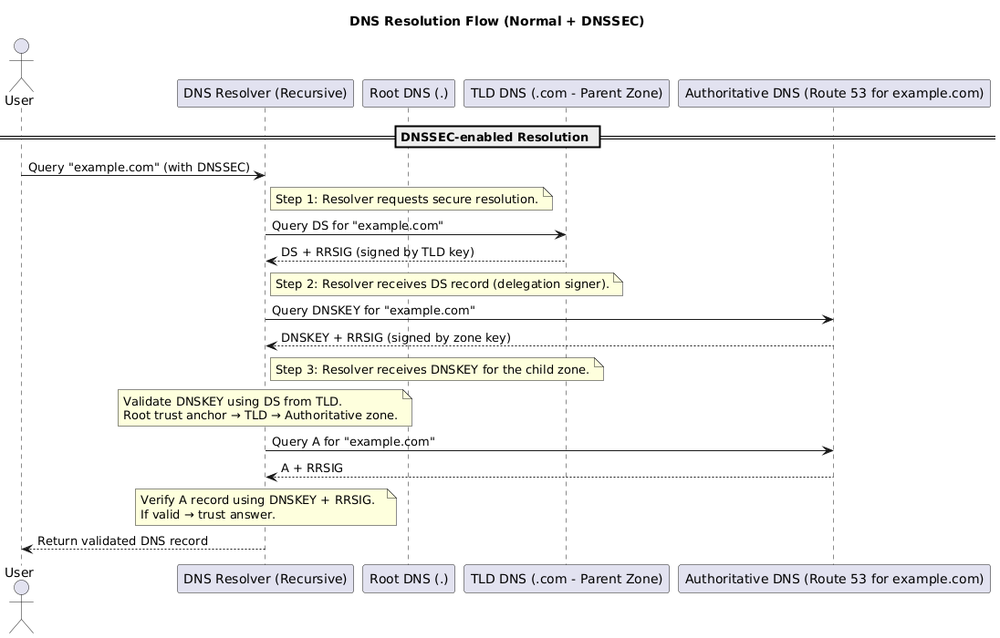
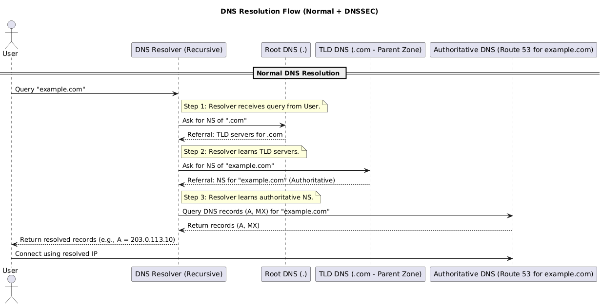
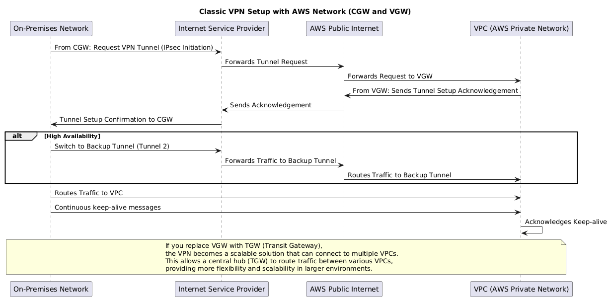

# OSI Model {#osi-model}

The **OSI (Open Systems Interconnection) Model** is a conceptual framework that describes how data moves across a network. It breaks communication into **seven layers**, each with a distinct role—from physical signals up to human-facing applications.  

By separating responsibilities, the OSI model makes it easier to design, troubleshoot, and scale networks. Each higher layer builds on the services of the one below, while remaining logically independent.

---

## 1. The 7 Layers {#section-1-the-7-layers}

<table class="study-table">
<thead>
<tr>
<th>Layer</th>
<th>Example Protocols</th>
<th>Data Unit</th>
<th>What It Adds / Handles</th>
<th>Notes</th>
</tr>
</thead>
<tbody>
<tr>
<td>L7 Application</td>
<td>HTTP, DNS, SMTP, FTP</td>
<td>Data</td>
<td>User-facing services</td>
<td>Browser → HTTP, Mail → SMTP.</td>
</tr>
<tr>
<td>L6 Presentation</td>
<td>TLS/SSL, JPEG, JSON</td>
<td>Record</td>
<td>Data format, encryption, compression</td>
<td>Often merged into L7.</td>
</tr>
<tr>
<td>L5 Session</td>
<td>NetBIOS, RPC</td>
<td>–</td>
<td>Session setup & teardown</td>
<td>Rarely explicit today.</td>
</tr>
<tr>
<td>L4 Transport</td>
<td>TCP, UDP</td>
<td>Segment</td>
<td>Reliable (TCP) vs fast (UDP)</td>
<td>TCP = handshake, ports, seq/ack. UDP = stateless.</td>
</tr>
<tr>
<td>L3 Network</td>
<td>IP, ICMP</td>
<td>Packet</td>
<td>Logical addressing & routing</td>
<td>Routers forward packets. Uses ARP for MAC resolution.</td>
</tr>
<tr>
<td>L2 Data Link</td>
<td>Ethernet, Wi-Fi, PPP</td>
<td>Frame</td>
<td>Local delivery</td>
<td>Frames = MAC headers + payload + CRC.</td>
</tr>
<tr>
<td>L1 Physical</td>
<td>Copper, Fiber, Wi-Fi PHY</td>
<td>Bits</td>
<td>Transmission of raw signals</td>
<td>Voltage, RF, or optical light.</td>
</tr>
</tbody>
</table>

🔁 **Encapsulation order:**  
`Application Data → Segment → Packet → Frame → Bits`

  
  

    <a href="https://bytebytego.com/guides/what-is-osi-model/" target="_blank" style="text-decoration: none; color: var(--accent);">
      📖 Source: OSI Model Explained – Byte Byte Go
    </a>
  

---

## 2. Devices at Each Layer {#section-2-devices-at-each-layer}

<table class="study-table">
<thead>
<tr>
<th>Device</th>
<th>Layer</th>
<th>What It Does</th>
<th>Protocols</th>
<th>Authentication</th>
</tr>
</thead>
<tbody>
<tr>
<td>Load Balancer</td>
<td>L4–L7</td>
<td>Distributes traffic</td>
<td>TCP, HTTP/S, gRPC</td>
<td>TLS certs, tokens</td>
</tr>
<tr>
<td>Firewall</td>
<td>L3–L4 (sometimes L7)</td>
<td>Filters packets/flows</td>
<td>IP, TCP/UDP, HTTP</td>
<td>Rules, TLS interception, VPN</td>
</tr>
<tr>
<td>Router</td>
<td>L3</td>
<td>Routes IP packets</td>
<td>IP, ICMP, BGP, OSPF</td>
<td>BGP MD5, IPsec</td>
</tr>
<tr>
<td>Switch</td>
<td>L2</td>
<td>Forwards frames by MAC</td>
<td>Ethernet, VLAN, ARP</td>
<td>802.1X, MAC binding</td>
</tr>
<tr>
<td>Hub</td>
<td>L1</td>
<td>Repeats bits blindly</td>
<td>–</td>
<td>None</td>
</tr>
</tbody>
</table>

---

## 3. Layer Interactions {#section-3-layer-interactions}

### 3.1 Layer 2 – ARP {#section-3-1-layer-2-arp}

Maps IP → MAC via broadcast request and unicast reply.  

  
  

    🖼️ ARP – Address Resolution Protocol Sequence
  

    <!-- Keep your PlantUML raw here -->
  

---

### 3.2 Layer 2 – VLANs & Trunks {#section-3-2-layer-2-vlans-trunks}
VLANs, trunks, and QinQ are needed to segment traffic, reduce broadcast domains, and efficiently carry multiple logical networks over the same physical infrastructure.

* **VLAN (802.1Q):**
  * Adds a VLAN ID tag inside Ethernet frames.
  * Splits one physical switch into **multiple broadcast domains** → improves scalability & security.

* **Trunks:**
  * A single link between switches that **carries multiple VLANs** using tagging.
  * Avoids needing one cable per VLAN.

* **QinQ (802.1AD):**
  * **VLAN stacking** (two tags: S-Tag + C-Tag).
  * Lets ISPs carry customer VLANs over their own backbone.
  * Expands VLAN ID space beyond the 4096 limit.

---

### 3.3 Layer 3 – Routing {#section-3-3-layer-3-routing}
Routers strip old frames, keep IP header, attach new MAC header for next hop.  

  
  

    🖼️ L3 Routing – Packet Routing Sequence
  

  <!-- Keep your PlantUML raw here -->
  

---

### 3.4 Layer 3 & 5–6 - IPsec {#section-3-4-layer-3-56---ipsec}
IPsec = encrypted **network tunnels**.  
- **IKE (control plane)** negotiates SAs and keys (**Layer 5–6**, over UDP/500 or UDP/4500 for NAT-T).  
- **ESP/AH (data plane)** protects IP packets at **Layer 3**.  
- Commonly used for site-to-site and remote-access VPNs.  
- Protects *all traffic* (HTTP, SSH, DNS, ICMP, etc.), independent of app protocol.

  
  

    🖼️ IPsec – IKE Handshake Sequence
  

  <!-- Keep your PlantUML raw here -->
  

> Elliptic Curve Diffie–Hellman Ephemeral provides **Perfect Forward Secrecy (PFS)** by using a fresh, temporary key pair per session. Even if a server’s long-term private key is later compromised, past sessions remain confidential. Both TLS and IPsec commonly prefer ECDHE for key exchange.

---

### 3.5 Layer 5–6 - TLS {#section-3-5-layer-56---tls}
TLS = encrypted **application sessions**.  
- Runs above TCP (L4) and below Application (L7).  
- Provides confidentiality, integrity, authentication.  
- Examples: HTTPS, SMTPS, IMAPS.  
- Protects *specific app protocols*, not all traffic.
 

  
  

    🖼️ TLS – Secure Handshake Sequence
  

  <!-- Keep your PlantUML raw here -->
  

---

### 3.6 Traffic Addressing Modes (Unicast, Broadcast, Multicast, Anycast, Geocast) {#section-3-6-traffic-addressing-modes-unicast-broadcast-multicast-anycast-geocast}

How frames/packets are addressed determines who receives them and how the network treats them.

<table class="study-table">
<thead>
<tr>
  <th>Mode</th>
  <th>Who Receives</th>
  <th>OSI Context</th>
  <th>Typical Uses</th>
  <th>Key Notes</th>
</tr>
</thead>
<tbody>
<tr>
  <td><strong>Unicast</strong></td>
  <td>Exactly one host</td>
  <td>L2 (MAC→MAC), L3 (IP→IP)</td>
  <td>Web browsing, API calls, SSH</td>
  <td>Most traffic is unicast. Switched at L2, routed at L3.</td>
</tr>
<tr>
  <td><strong>Broadcast</strong></td>
  <td>All hosts in the L2 broadcast domain</td>
  <td>L2 (FF:FF:FF:FF:FF:FF)</td>
  <td>ARP, DHCP DISCOVER</td>
  <td>Routers block broadcasts by default.</td>
</tr>
<tr>
  <td><strong>Multicast</strong></td>
  <td>Members of a subscribed group</td>
  <td>L3 (224.0.0.0/4 IPv4; ff00::/8 IPv6)</td>
  <td>IPTV, conferencing, OSPF</td>
  <td>Uses IGMP/MLD (hosts), PIM (routers).</td>
</tr>
<tr>
  <td><strong>Anycast</strong></td>
  <td>“Nearest” one of many identical endpoints</td>
  <td>L3 (same IP announced in multiple sites)</td>
  <td>CDNs, DNS resolvers</td>
  <td>Routing selects the closest service.</td>
</tr>
<tr>
  <td><strong>Geocast</strong></td>
  <td>Hosts in a geographic region</td>
  <td>L3 concept</td>
  <td>Vehicular alerts, ITS</td>
  <td>Conceptual; app-layer in practice.</td>
</tr>
</tbody>
</table>

---

## 4. Commands by OSI Layer {#section-4-commands-by-osi-layer}

<table class="study-table">
<thead>
<tr>
<th>Layer</th>
<th>Command</th>
<th>Purpose</th>
<th>Example</th>
</tr>
</thead>
<tbody>
<tr>
<td>L2</td>
<td><code>arp</code></td>
<td>Show ARP cache</td>
<td><code>arp -a</code></td>
</tr>
<tr>
<td>L3</td>
<td><code>ping</code></td>
<td>Test ICMP reachability</td>
<td><code>ping 8.8.8.8</code></td>
</tr>
<tr>
<td>L3</td>
<td><code>traceroute</code></td>
<td>Show hop path</td>
<td><code>mtr 8.8.8.8</code></td>
</tr>
<tr>
<td>L4</td>
<td><code>ss</code></td>
<td>List sockets</td>
<td><code>ss -ant</code></td>
</tr>
<tr>
<td>L4</td>
<td><code>tcpdump</code></td>
<td>Capture packets</td>
<td><code>tcpdump -i eth0 port 443</code></td>
</tr>
<tr>
<td>L7</td>
<td><code>dig</code></td>
<td>DNS lookup</td>
<td><code>dig example.com</code></td>
</tr>
<tr>
<td>L7</td>
<td><code>curl</code></td>
<td>Test HTTP</td>
<td><code>curl -vk https://site</code></td>
</tr>
<tr>
<td>Cross</td>
<td><code>nmap</code></td>
<td>Port scan</td>
<td><code>nmap -sS 10.1.2.3</code></td>
</tr>
</tbody>
</table>

---

## 5. IP Addressing Basics {#section-5-ip-addressing-basics}

### 5.1 IPv4 Classes & Reservations {#section-5-1-ipv4-classes-reservations}
- **Class A:** 0.0.0.0 – 127.255.255.255 (10.0.0.0/8 private, 127/8 loopback)  
- **Class B:** 128.0.0.0 – 191.255.255.255 (172.16.0.0/12 private)  
- **Class C:** 192.0.0.0 – 223.255.255.255 (192.168/16 private, TEST-NETs)  
- **Class D:** 224.0.0.0 – 239.255.255.255 (multicast)  
- **Class E:** 240.0.0.0 – 255.255.255.255 (experimental)  

---

### 5.2 Convert Binary to Decimal {#section-5-2-convert-binary-to-decimal}

1. Take the binary `10000100`.
2. Multiply each bit by its place value:

   * 1×128 + 0×64 + 0×32 + 0×16 + 0×8 + 1×4 + 0×2 + 0×1
3. Add them up → **132**.

<table class="study-table">
<thead>
<tr>
<th style="text-align: center;">Position</th>
<th style="text-align: center;">1</th>
<th style="text-align: center;">2</th>
<th style="text-align: center;">3</th>
<th style="text-align: center;">4</th>
<th style="text-align: center;">5</th>
<th style="text-align: center;">6</th>
<th style="text-align: center;">7</th>
<th style="text-align: center;">8</th>
<th style="text-align: center;">Sum</th>
</tr>
</thead>
<tbody>
<tr>
<td>Decimal</td>
<td style="text-align: center;">128</td>
<td style="text-align: center;">64</td>
<td style="text-align: center;">32</td>
<td style="text-align: center;">16</td>
<td style="text-align: center;">8</td>
<td style="text-align: center;">4</td>
<td style="text-align: center;">2</td>
<td style="text-align: center;">1</td>
<td style="text-align: center;"></td>
</tr>
<tr>
<td>Bit</td>
<td style="text-align: center;">1</td>
<td style="text-align: center;">0</td>
<td style="text-align: center;">0</td>
<td style="text-align: center;">0</td>
<td style="text-align: center;">0</td>
<td style="text-align: center;">1</td>
<td style="text-align: center;">0</td>
<td style="text-align: center;">0</td>
<td style="text-align: center;"></td>
</tr>
<tr>
<td>Value</td>
<td style="text-align: center;">128</td>
<td style="text-align: center;">0</td>
<td style="text-align: center;">0</td>
<td style="text-align: center;">0</td>
<td style="text-align: center;">0</td>
<td style="text-align: center;">4</td>
<td style="text-align: center;">0</td>
<td style="text-align: center;">0</td>
<td style="text-align: center; font-weight: bold;">132</td>
</tr>
</tbody>
</table>

👉 So `10000100` in decimal = **132**

---

### 5.3 Convert Decimal to to Binary {#section-5-3-convert-decimal-to-to-binary}

Take the first octet of `132.12.1.23`.

1. Start from **128** → 132 ≥ 128 → put **1**, remainder = 132 − 128 = 4.
2. Next (64) → 4 < 64 → **0**.
3. Next (32) → 4 < 32 → **0**.
4. Next (16) → 4 < 16 → **0**.
5. Next (8) → 4 < 8 → **0**.
6. Next (4) → 4 ≥ 4 → **1**, remainder = 0.
7. Next (2) → 0 < 2 → **0**.
8. Next (1) → 0 < 1 → **0**.

Result row: **1 0 0 0 0 1 0 0**

<table class="study-table">
<thead>
<tr>
<th style="text-align: center;">Position</th>
<th style="text-align: center;">1</th>
<th style="text-align: center;">2</th>
<th style="text-align: center;">3</th>
<th style="text-align: center;">4</th>
<th style="text-align: center;">5</th>
<th style="text-align: center;">6</th>
<th style="text-align: center;">7</th>
<th style="text-align: center;">8</th>
</tr>
</thead>
<tbody>
<tr>
<td>Decimal</td>
<td style="text-align: center;">128</td>
<td style="text-align: center;">64</td>
<td style="text-align: center;">32</td>
<td style="text-align: center;">16</td>
<td style="text-align: center;">8</td>
<td style="text-align: center;">4</td>
<td style="text-align: center;">2</td>
<td style="text-align: center;">1</td>
</tr>
<tr>
<td>Representation</td>
<td style="text-align: center;">1</td>
<td style="text-align: center;">0</td>
<td style="text-align: center;">0</td>
<td style="text-align: center;">0</td>
<td style="text-align: center;">0</td>
<td style="text-align: center;">1</td>
<td style="text-align: center;">0</td>
<td style="text-align: center;">0</td>
</tr>
</tbody>
</table>

👉 So `132` in binary = **10000100**

---

## 6. Advanced Networking Topics {#section-6-advanced-networking-topics}

### 6.1 NAT (Network Address Translation) {#section-6-1-nat-network-address-translation}

* Allows private IPs (RFC1918) to communicate with public networks.  
* Originally designed to conserve IPv4 addresses, also adds a basic security layer by hiding internal hosts.  
* **Types:**
  * **Static NAT** → Fixed 1:1 mapping (one private ↔ one public). Useful for servers that must be reachable externally.  
  * **Dynamic NAT** → Private IPs mapped temporarily to an available public IP from a pool. Mapping changes each session.  
  * **PAT (Port Address Translation)** → Many private hosts share a single public IP. NAT device rewrites source **IP+Port** to track flows. Example: home routers, carrier-grade NAT appliances.

---

### 6.2 DDoS Attacks (3 categories) {#section-6-2-ddos-attacks-3-categories}

1. **Volumetric** → Flood bandwidth with massive traffic (e.g., UDP floods, DNS/NTP amplification).  
2. **Protocol** → Exploit L3/L4 weaknesses, exhausting connection state (e.g., SYN flood, Smurf attack, Ping of Death).  
3. **Application** → Target app layer (L7) with valid-looking requests that overwhelm servers (e.g., HTTP floods, Slowloris).  

---

### 6.3 BGP (Border Gateway Protocol) {#section-6-3-bgp-border-gateway-protocol}

The internet is a **network of networks** (Autonomous Systems, or AS):

* **AS (Autonomous System):** Collection of IP prefixes under one admin domain.  
* **ASN (Autonomous System Number):** Unique ID (Google = AS15169, Amazon = AS16509).  
* **BGP Basics:** Protocol to exchange routing info between ASes (runs over TCP/179).  
* **iBGP** → Routing **inside** an AS (e.g., Google’s internal backbone).  
* **eBGP** → Routing **between** ASes (e.g., ISP ↔ Cloudflare).  
* **ASPATH:** List of AS hops; shortest usually preferred.  
* **Policies & Tricks:**  
  * **ASPATH prepending** → make a path look less attractive.  
  * **Route filtering** → accept/export only selected prefixes.  
  * **Peering vs Transit** → prefer cheap/free peer routes over costly transit.

---

### 6.4 Jumbo Frames {#section-6-4-jumbo-frames}

* **Default MTU = 1500 bytes**, Jumbo Frames = ~9000 bytes.  
* **Benefits:** Less overhead, fewer packets, higher throughput for large data transfers.  
* **Limitations:** Must be supported end-to-end; mismatches cause fragmentation or drops.  
* **Supported in:** Local networks, datacenter interconnects, dedicated private backbones, and direct cloud interconnect links.  
* **Not supported in:** General internet, VPN over public internet, cross-region cloud traffic.  

---

### 6.5 Layer 7 Firewalls {#section-6-5-layer-7-firewalls}

* Extend firewalls beyond L3/L4 (IP, port) to **application-aware filtering at L7**.  
* Parse and inspect protocols (HTTP, DNS, SMTP, gRPC).  
* **Capabilities:**  
  * Block/allow traffic based on **URLs, headers, payloads**.  
  * Detect and stop **application-layer DDoS** (HTTP floods, bots).  
  * Enforce **auth/security policies** (tokens, TLS inspection).  
* **Examples:** Cloudflare WAF, Palo Alto NGFW, F5 ASM, Imperva SecureSphere.  

---

## 7. Domain Name System (DNS) {#domain-name-system-dns}

### 7.1 What DNS Does {#section-7-1-what-dns-does}

**DNS (Domain Name System)** maps human-readable names (e.g., `example.com`) to IP addresses or other service endpoints. Two roles often get conflated:  
- **DNS hosting provider** → Runs the authoritative name servers that store and answer your zone’s records (A, MX, TXT, etc.).  
- **Domain registrar / registry** → Manages ownership of domain names within a top-level domain (`.com`, `.org`, etc.) and publishes NS/DS records that delegate authority to your DNS host.  

Some companies handle both functions (e.g., GoDaddy, Cloudflare), while others let you register in one place and host DNS somewhere else.  

---

### 7.2 Common DNS Record Types {#section-7-2-common-dns-record-types}

<table class="study-table">
<thead>
<tr>
<th>Record Type</th>
<th>Purpose</th>
<th>Example</th>
</tr>
</thead>
<tbody>
<tr>
<td><strong>A</strong></td>
<td>Maps domain → IPv4 address</td>
<td><code>example.com. IN A 192.0.2.1</code></td>
</tr>
<tr>
<td><strong>AAAA</strong></td>
<td>Maps domain → IPv6 address</td>
<td><code>example.com. IN AAAA 2001:db8::1</code></td>
</tr>
<tr>
<td><strong>CNAME</strong></td>
<td>Alias to another domain (not IP)</td>
<td><code>www.example.com. IN CNAME example.globalcdn.com.</code></td>
</tr>
<tr>
<td><strong>ANAME / Alias</strong></td>
<td>Provider-specific pseudo-record that behaves like a CNAME at the apex (e.g., Route 53 Alias, NS1 ANAME).</td>
<td><code>example.com. IN ALIAS edge.globalcdn.net</code></td>
</tr>
<tr>
<td><strong>MX</strong></td>
<td>Mail routing</td>
<td><code>example.com. IN MX 10 mail1.google.com.</code></td>
</tr>
<tr>
<td><strong>TXT</strong></td>
<td>Metadata (SPF, DKIM, domain verification)</td>
<td><code>example.com. IN TXT "v=spf1 include:_spf.google.com ~all"</code></td>
</tr>
<tr>
<td><strong>NS</strong></td>
<td>Authoritative name servers for a zone</td>
<td><code>example.com. IN NS ns1.dnsprovider.com.</code></td>
</tr>
<tr>
<td><strong>SOA</strong></td>
<td>Zone info (serial, refresh, retry)</td>
<td><code>example.com. IN SOA ns1 hostmaster 2025010101 3600 1800 1209600 86400</code></td>
</tr>
<tr>
<td><strong>PTR</strong></td>
<td>Reverse DNS (IP → domain)</td>
<td><code>1.2.0.192.in-addr.arpa. IN PTR example.com.</code></td>
</tr>
<tr>
<td><strong>CAA</strong></td>
<td>Restricts which Certificate Authorities can issue TLS certs</td>
<td><code>example.com. IN CAA 0 issue "letsencrypt.org"</code></td>
</tr>
<tr>
<td><strong>SRV</strong></td>
<td>Service-specific record (SIP, LDAP, Kerberos)</td>
<td><code>_sip._tcp.example.com. IN SRV 10 60 5060 sipserver.example.com.</code></td>
</tr>
</tbody>
</table>

---

### 7.3 Apex (Naked) Domains {#section-7-3-apex-naked-domains}

- The **zone apex** (e.g., `example.com`) represents the root of your domain.  
- DNS standards forbid placing a CNAME at the apex because it would conflict with other mandatory records (NS, SOA).  
- Many providers offer **ANAME/Alias** features to simulate a CNAME at the apex by resolving the target to an A/AAAA record on the server side (e.g., Route 53 Alias, Cloudflare CNAME flattening).  
- For subdomains like `www.example.com`, you can safely use CNAME, ANAME/Alias, or A/AAAA records depending on the use case.  

---

### 7.4 DNS Resolution Flow {#section-7-4-dns-resolution-flow}

1. A user queries `example.com` via a **recursive resolver** (ISP, Google Public DNS, Cloudflare, etc.).  
2. If the answer is uncached, the resolver asks the **root servers** which TLD (`.com`) server is authoritative.  
3. The resolver queries the **TLD servers**, which respond with the authoritative **NS records** for `example.com`.  
4. The resolver contacts the authoritative name servers for `example.com` (your DNS host) and retrieves the requested record (A, MX, TXT, ...).  
5. The resolver caches the response based on its TTL and returns the answer to the user’s application, which then reaches out to the resolved endpoint.  

---

### 7.5 DNSSEC Overview {#section-7-5-dnssec-overview}

**DNSSEC (Domain Name System Security Extensions)** protects against forged DNS data by cryptographically signing DNS responses. It ensures **authenticity** and **integrity**, but it does **not** encrypt traffic.

> Without DNSSEC, attackers can poison resolver caches or spoof responses. With DNSSEC, resolvers reject tampered data because signatures fail validation.

#### 7.5.1 Key Concepts {#section-7-5-1-key-concepts}

- **Digital Signatures**: Authoritative servers sign each RRset with a private key; resolvers validate using the corresponding public key.  
- **DNSSEC Records**:  
  - **DNSKEY** → Publishes the public keys for the zone.  
  - **DS (Delegation Signer)** → Parent zone pointer to the child zone’s key, extending the trust chain.  
  - **RRSIG** → Signature attached to each signed record set.  
- **Chain of Trust**: Root (trust anchor) → TLD → Authoritative zone. Every delegation must be signed to keep the chain intact.  

#### 7.5.2 Roles and Responsibilities {#section-7-5-2-roles-and-responsibilities}

- **Root & TLD Operators**: Maintain signed parent zones and publish DS records for child delegations.  
- **Zone Owners / DNS Hosts**: Generate keys, sign zones, and supply DS records to the registrar.  
- **Recursive Resolvers**: Validate signatures and refuse bogus data. Many public resolvers already validate DNSSEC by default.  
- **End Users**: No action required; they benefit from resolvers rejecting tampered responses.  

#### 7.5.3 Validation Flow {#section-7-5-3-dnssec-validation-flow}

1. Resolver requests the **DS record** for `example.com` from the TLD; verifies the response using the TLD’s signature.  
2. Resolver requests the **DNSKEY** record set from `example.com`’s authoritative servers and verifies it against the DS digest.  
3. Resolver fetches the desired record (e.g., `A example.com`) along with its **RRSIG**.  
4. Using the validated DNSKEY, the resolver checks the RRSIG. If it validates, the answer is accepted and cached; otherwise the response is discarded as suspicious.  

  
  

    🔐 DNSSEC Resolution – Validating DNS records with chain of trust
  

  

---

### 7.6 Route 53 Hosted Zone Resolution Flow {#section-7-6-route-53-hosted-zone-resolution-flow}

1. You create a **Hosted Zone** in Route 53 for your domain (`example.com`).  
2. Route 53 assigns **4 authoritative name servers (NS records)** for the domain.  
3. You add DNS records (A, CNAME, MX, TXT, etc.) inside the hosted zone.  
4. When a client queries `example.com`, the DNS resolver follows the chain:  
   - Root → TLD → **Route 53 authoritative NS** (Amazon-managed).  
5. Route 53 authoritative servers return the DNS record (e.g., A record with an IP).  
6. Resolver caches and returns result to user → user connects to the target resource.  

  
  

    🌐 DNS Resolution – Query to Answer
  

  

---

## 8. VPN {#section-8-vpn}

Note VPN builds on top of IPSec, for details on how IPSec works, see [3.4 Layer 3 & 5–6 - IPsec]({{ '/study/infrastructureOsiModel#layer-3-56---ipsec' | relative_url }})

### 8.1 Site-to-Site VPN {#section-8-1-site-to-site-vpn}

- **Purpose**:  
  - **Site-to-Site VPN = Network ↔ Network**  
  - Connects an entire on-premises network (via a CGW) to an AWS VPC network (via a VGW or TGW).  
  - Used for **hybrid cloud connectivity**, extending datacenter or branch office networks into AWS.  
  - **Example**: Your office LAN can securely reach EC2 instances inside VPCs.  

  
  

    🔐 Site-to-Site VPN – Communication Sequence
  

  <!-- Keep your PlantUML raw here -->
  

#### 8.1.1 Connectivity Types {#section-8-1-1-connectivity-types}

Keep in mind, VPN connections traverse the public Internet before reaching AWS’s network. Because of this, the routing path and how routes are exchanged are critical.

- **Static VPN**
  - **Route**: Static routes in route tables (manual setup).  
  - **Pros**: Simple setup.  
  - **Cons**: No load balancing or failover.  

- **Dynamic VPN**
  - **Route**: Uses **BGP** for automatic route exchange.  
  - **Pros**: High availability, automatic failover, and load balancing.  
  - **Cons**: More complex setup.  
