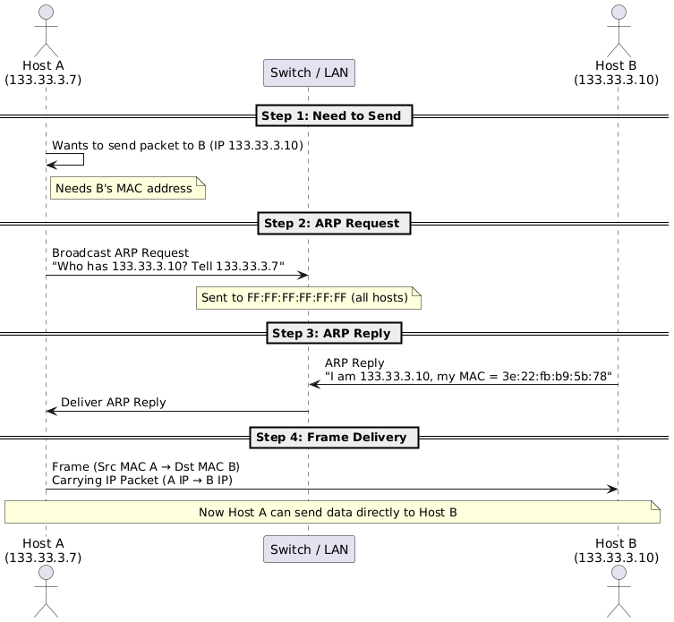
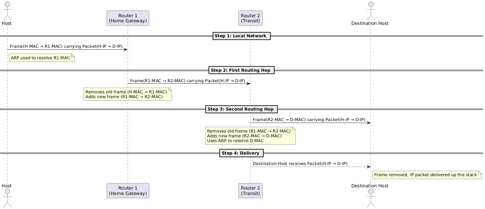
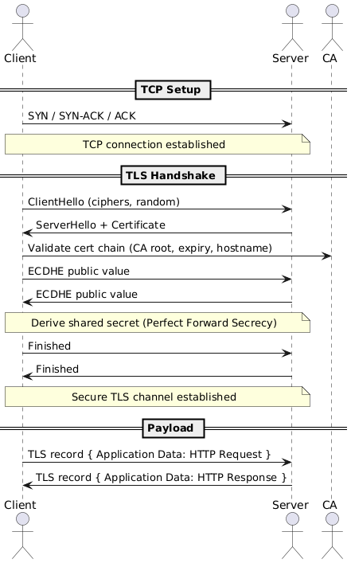

# Osi Model

The OSI (Open Systems Interconnection) Model is a conceptual framework that explains how data moves from one device to another across a network. It breaks communication into seven layers, each with a specific role—from turning raw electrical signals into bits, all the way up to human-readable applications like web browsers or email. By separating these responsibilities, the OSI model makes it easier to design, troubleshoot, and scale networks. It supports everything from simple device-to-device communication (like two computers in a LAN) to complex many-to-many interactions across the global internet. Each higher OSI layer builds on the services of the layer below, while layers remain functionally independent when viewed side-by-side.

<table style="width: 100%; border-collapse: collapse; margin: 20px 0; font-size: 14px;">
<thead>
<tr style="background-color: #f8f9fa;">
<th style="border: 1px solid #ddd; padding: 12px; text-align: left; font-weight: bold;">OSI Layer</th>
<th style="border: 1px solid #ddd; padding: 12px; text-align: left; font-weight: bold;">Example Protocols</th>
<th style="border: 1px solid #ddd; padding: 12px; text-align: left; font-weight: bold;">Data Unit</th>
<th style="border: 1px solid #ddd; padding: 12px; text-align: left; font-weight: bold;">What It Adds / Handles</th>
<th style="border: 1px solid #ddd; padding: 12px; text-align: left; font-weight: bold;">Key Details & Examples</th>
</tr>
</thead>
<tbody>
<tr>
<td style="border: 1px solid #ddd; padding: 12px; font-weight: bold;">L7 Application</td>
<td style="border: 1px solid #ddd; padding: 12px;">HTTP, DNS, SMTP, FTP</td>
<td style="border: 1px solid #ddd; padding: 12px;">Data</td>
<td style="border: 1px solid #ddd; padding: 12px;">User-facing services & protocols</td>
<td style="border: 1px solid #ddd; padding: 12px;">Apps talk in human-readable formats. Browser → HTTP Request, Mail client → SMTP.</td>
</tr>
<tr style="background-color: #f8f9fa;">
<td style="border: 1px solid #ddd; padding: 12px; font-weight: bold;">L6 Presentation</td>
<td style="border: 1px solid #ddd; padding: 12px;">TLS/SSL, JPEG, JSON</td>
<td style="border: 1px solid #ddd; padding: 12px;">Record</td>
<td style="border: 1px solid #ddd; padding: 12px;">Data format, encryption, compression</td>
<td style="border: 1px solid #ddd; padding: 12px;">TLS encrypts HTTP; JSON/XML standardize data; JPEG/MP3 compress media. Often merged into L7 in practice.</td>
</tr>
<tr>
<td style="border: 1px solid #ddd; padding: 12px; font-weight: bold;">L5 Session</td>
<td style="border: 1px solid #ddd; padding: 12px;">NetBIOS, RPC</td>
<td style="border: 1px solid #ddd; padding: 12px;">–</td>
<td style="border: 1px solid #ddd; padding: 12px;">Session control (setup, sync, teardown)</td>
<td style="border: 1px solid #ddd; padding: 12px;">Rarely explicit today. Example: RPC, NetBIOS. TLS sessions can resume without full handshake.</td>
</tr>
<tr style="background-color: #f8f9fa;">
<td style="border: 1px solid #ddd; padding: 12px; font-weight: bold;">L4 Transport</td>
<td style="border: 1px solid #ddd; padding: 12px;">TCP, UDP</td>
<td style="border: 1px solid #ddd; padding: 12px;">Segment</td>
<td style="border: 1px solid #ddd; padding: 12px;">Reliable delivery (TCP) or fast fire-and-forget (UDP)</td>
<td style="border: 1px solid #ddd; padding: 12px;">Fixes L3 issues: out-of-order, loss, no channels. TCP headers include ports, seq/ack, window, checksum. TCP 3-way handshake → SYN, SYN/ACK, ACK. Maintains state (reliable, ordered). UDP = stateless (no session info).</td>
</tr>
<tr>
<td style="border: 1px solid #ddd; padding: 12px; font-weight: bold;">L3 Network</td>
<td style="border: 1px solid #ddd; padding: 12px;">IP, ICMP</td>
<td style="border: 1px solid #ddd; padding: 12px;">Packet</td>
<td style="border: 1px solid #ddd; padding: 12px;">Logical addressing, routing between networks</td>
<td style="border: 1px solid #ddd; padding: 12px;">IP = addressing system. ICMP = control (ping, errors). Routers strip/replace frames at every hop. Uses ARP to resolve IP→MAC. Routing tables decide next hop (default 0.0.0.0/0). House = IP, Apartment = Port.</td>
</tr>
<tr style="background-color: #f8f9fa;">
<td style="border: 1px solid #ddd; padding: 12px; font-weight: bold;">L2 Data Link</td>
<td style="border: 1px solid #ddd; padding: 12px;">Ethernet, Wi-Fi, PPP</td>
<td style="border: 1px solid #ddd; padding: 12px;">Frame</td>
<td style="border: 1px solid #ddd; padding: 12px;">Local delivery between devices on the same medium</td>
<td style="border: 1px solid #ddd; padding: 12px;">MAC addresses unique per device. Frame = Header (src/dst MAC + EtherType) + Payload (L3 packet) + CRC. Handles collisions (CSMA/CD). Supports unicast, broadcast, VLAN tagging. Protocols: Ethernet, Wi-Fi, MPLS, PPP.</td>
</tr>
<tr>
<td style="border: 1px solid #ddd; padding: 12px; font-weight: bold;">L1 Physical</td>
<td style="border: 1px solid #ddd; padding: 12px;">Copper, Fiber, Wi-Fi PHY</td>
<td style="border: 1px solid #ddd; padding: 12px;">Bits</td>
<td style="border: 1px solid #ddd; padding: 12px;">Transmission of raw signals</td>
<td style="border: 1px solid #ddd; padding: 12px;">Defines voltage, RF, or light wavelength. No addressing or error detection. Standards: copper (RJ45), fiber optics, Wi-Fi PHY.</td>
</tr>
</tbody>
</table>


🔁 **Encapsulation order**:
**Frame → Packet → Segment → Application Data**
…and the whole frame turns into **bits/signals** at Layer 1.

A really good diagram illustration is from [Osi Model Explained - Byte Byte Go](https://bytebytego.com/guides/what-is-osi-model/)

<div style="text-align: center; margin: 20px 0;">

</div>


---

## Devices at Different Layers

Different network devices operate at different OSI layers, each handling only the information relevant to its role:

<table style="width: 100%; border-collapse: collapse; margin: 20px 0; font-size: 14px;"> <thead> <tr style="background-color: #f8f9fa;"> <th style="border: 1px solid #ddd; padding: 12px; text-align: left; font-weight: bold;">Device</th> <th style="border: 1px solid #ddd; padding: 12px; text-align: left; font-weight: bold;">OSI Layer</th> <th style="border: 1px solid #ddd; padding: 12px; text-align: left; font-weight: bold;">What It Does</th> <th style="border: 1px solid #ddd; padding: 12px; text-align: left; font-weight: bold;">Protocol Examples</th> <th style="border: 1px solid #ddd; padding: 12px; text-align: left; font-weight: bold;">Authentication</th> </tr> </thead> <tbody> <tr> <td style="border: 1px solid #ddd; padding: 12px; font-weight: bold;">Hub</td> <td style="border: 1px solid #ddd; padding: 12px;">L1 (Physical)</td> <td style="border: 1px solid #ddd; padding: 12px;">Blindly repeats bits to all ports. No concept of frames or addresses → collisions possible.</td> <td style="border: 1px solid #ddd; padding: 12px;">None (raw electrical/optical signals)</td> <td style="border: 1px solid #ddd; padding: 12px;">None</td> </tr> <tr style="background-color: #f8f9fa;"> <td style="border: 1px solid #ddd; padding: 12px; font-weight: bold;">Switch</td> <td style="border: 1px solid #ddd; padding: 12px;">L2 (Data Link)</td> <td style="border: 1px solid #ddd; padding: 12px;">Forwards Ethernet frames using MAC address table. Falls back to broadcast (flooding) if unknown.</td> <td style="border: 1px solid #ddd; padding: 12px;">Ethernet, ARP, VLAN (802.1Q), STP</td> <td style="border: 1px solid #ddd; padding: 12px;">Port security (MAC binding), 802.1X (RADIUS/EAP)</td> </tr> <tr> <td style="border: 1px solid #ddd; padding: 12px; font-weight: bold;">Router</td> <td style="border: 1px solid #ddd; padding: 12px;">L3 (Network)</td> <td style="border: 1px solid #ddd; padding: 12px;">Routes IP packets across networks. Strips L2 header and adds a new one for each hop.</td> <td style="border: 1px solid #ddd; padding: 12px;">IP, ICMP, OSPF, BGP, EIGRP</td> <td style="border: 1px solid #ddd; padding: 12px;">BGP MD5, OSPF auth (MD5/SHA), IPsec for secure tunnels</td> </tr> <tr style="background-color: #f8f9fa;"> <td style="border: 1px solid #ddd; padding: 12px; font-weight: bold;">Firewall</td> <td style="border: 1px solid #ddd; padding: 12px;">L3–L4 (sometimes L7)</td> <td style="border: 1px solid #ddd; padding: 12px;">Inspects and filters packets based on IP, ports, and sometimes application signatures.</td> <td style="border: 1px solid #ddd; padding: 12px;">IP, TCP/UDP, HTTP/S (for deep inspection)</td> <td style="border: 1px solid #ddd; padding: 12px;">Rule sets, TLS interception (certificates), VPN auth</td> </tr> <tr> <td style="border: 1px solid #ddd; padding: 12px; font-weight: bold;">Load Balancer</td> <td style="border: 1px solid #ddd; padding: 12px;">L4–L7</td> <td style="border: 1px solid #ddd; padding: 12px;">Distributes client requests across multiple servers, can also terminate TLS.</td> <td style="border: 1px solid #ddd; padding: 12px;">TCP, HTTP/S, TLS, gRPC</td> <td style="border: 1px solid #ddd; padding: 12px;">TLS certificates, client certs, token-based auth</td> </tr> </tbody> </table>


---

## Layer 2 - ARP

ARP (Address Resolution Protocol) maps an IP address (L3) to a MAC address (L2) so devices can deliver frames on a local network. It works by broadcasting “Who has this IP?” and the target replies with its MAC. Once resolved, the sender builds the frame (Src MAC → Dst MAC) and hands it to Layer 1, which transmits the raw bits as electrical, optical, or radio signals.

```
@startuml
actor "Host A\n(133.33.3.7)" as A
participant "Switch / LAN" as LAN
actor "Host B\n(133.33.3.10)" as B

== Step 1: Need to Send ==
A -> A: Wants to send packet to B (IP 133.33.3.10)
note right of A: Needs B's MAC address

== Step 2: ARP Request ==
A -> LAN: Broadcast ARP Request\n"Who has 133.33.3.10? Tell 133.33.3.7"
note over LAN: Sent to FF:FF:FF:FF:FF:FF (all hosts)

== Step 3: ARP Reply ==
B -> LAN: ARP Reply\n"I am 133.33.3.10, my MAC = 3e:22:fb:b9:5b:78"
LAN -> A: Deliver ARP Reply

== Step 4: Frame Delivery ==
A -> B: Frame (Src MAC A → Dst MAC B)\nCarrying IP Packet (A IP → B IP)
note over A,B: Now Host A can send data directly to Host B
@enduml

```

<div style="text-align: center; margin: 20px 0;">

</div>

---

## Layer 2 - VLANs, Trunks & QinQ 

VLANs, trunks, and QinQ are needed to segment traffic, reduce broadcast domains, and efficiently carry multiple logical networks over the same physical infrastructure.

* **VLAN (802.1Q):**
  * Adds a VLAN ID tag inside Ethernet frames.
  * Splits one physical switch into **multiple broadcast domains** → improves scalability & security.

* **Trunks:**
  * A single link between switches that **carries multiple VLANs** using tagging.
  * Avoids needing one cable per VLAN.

* **QinQ (802.1AD):**
  * **VLAN stacking** (two tags: S-Tag + C-Tag).
  * Lets ISPs carry customer VLANs over their own backbone.
  * Expands VLAN ID space beyond the 4096 limit.

👉 All three work at **Layer 2 (Frames)** to logically separate traffic over shared physical networks.

---

## Layer 3 - Routing

Layer 3 (Network) routing forwards packets across different networks. At each hop, the router keeps the IP packet unchanged (source IP → destination IP) but removes the old Layer 2 frame and attaches a new one with the next hop’s MAC address. This process lets traffic move from a local LAN to remote networks through multiple routers. Note, L3 Routing depends on L2 ARP.

```
@startuml
actor Host as H
participant "Router 1\n(Home Gateway)" as R1
participant "Router 2\n(Transit)" as R2
actor "Destination Host" as D

== Step 1: Local Network ==
H -> R1: Frame(H-MAC → R1-MAC) carrying Packet(H-IP → D-IP)
note right of H: ARP used to resolve R1 MAC

== Step 2: First Routing Hop ==
R1 -> R2: Frame(R1-MAC → R2-MAC) carrying Packet(H-IP → D-IP)
note over R1: Removes old frame (H-MAC → R1-MAC)\nAdds new frame (R1-MAC → R2-MAC)

== Step 3: Second Routing Hop ==
R2 -> D: Frame(R2-MAC → D-MAC) carrying Packet(H-IP → D-IP)
note over R2: Removes old frame (R1-MAC → R2-MAC)\nAdds new frame (R2-MAC → D-MAC)\nUses ARP to resolve D MAC

== Step 4: Delivery ==
D <-- R2: Destination Host receives Packet(H-IP → D-IP)
note right of D: Frame removed, IP packet delivered up the stack
@enduml

```

<div style="text-align: center; margin: 20px 0;">

</div>

---

## Multi Layer 4 & 7 - TLS and IPSec Tunnel

TLS handshake for encrypted communication:

```
@startuml
actor Server
actor Client
actor CA

== Certificate Setup (out of band) ==
Server -> CA: CSR (public key + org info)
CA -> Server: Signed Certificate (X.509)

== TCP 3-Way Handshake (TLS only) ==
Client -> Server: SYN
Server -> Client: SYN-ACK
Client -> Server: ACK
note over Client,Server: TCP connection established

== TLS Handshake ==
Client -> Server: ClientHello (supported ciphers, random)
Server -> Client: ServerHello + Certificate
Client -> CA: Validate Certificate Chain
note over Client: Check CA root, expiry, domain

alt RSA Key Exchange (older)
  Client -> Server: Pre-Master Secret (encrypted with server pubkey)
  note over Client,Server: Derive Master Secret & Session Keys
else (EC)DHE Key Exchange (modern)
  Client -> Server: DH/ECDH public value
  Server -> Client: DH/ECDH public value
  note over Client,Server: Derive Shared Secret (PFS)
end

Client -> Server: Finished
Server -> Client: Finished
note over Client,Server: Secure TLS Channel Established

== Application Data ==
Client -> Server: Encrypted HTTP Request
Server -> Client: Encrypted HTTP Response

== IPsec IKE Phase 1 (Main Mode) ==
Client -> Server: IKE_SA_INIT (DH values, nonces, proposals)
Server -> Client: IKE_SA_INIT Response
note over Client,Server: DH/ECDH → Shared Key (IKE SA)

Client -> Server: IKE_AUTH (ID, Certificate, Auth payload)
Server -> Client: IKE_AUTH Response
note over Client,Server: Peers authenticated, secure control channel

== IPsec IKE Phase 2 (Quick Mode) ==
Client -> Server: Child SA proposal (ESP/AH algorithms, lifetimes)
Server -> Client: Child SA response
note over Client,Server: Derive IPsec SA keys from Phase 1

== Encrypted Tunnel Established ==
Client -> Server: Encrypted IP packets (ESP/AH)
Server -> Client: Encrypted IP packets (ESP/AH)
@enduml


```

<div style="text-align: center; margin: 20px 0;">

</div>

---

## Commands by OSI Layer

<table style="width: 100%; border-collapse: collapse; margin: 20px 0; font-size: 14px;">
<thead>
<tr style="background-color: #f8f9fa;">
<th style="border: 1px solid #ddd; padding: 12px; text-align: left; font-weight: bold;">Layer</th>
<th style="border: 1px solid #ddd; padding: 12px; text-align: left; font-weight: bold;">Command</th>
<th style="border: 1px solid #ddd; padding: 12px; text-align: left; font-weight: bold;">Purpose</th>
<th style="border: 1px solid #ddd; padding: 12px; text-align: left; font-weight: bold;">Example</th>
<th style="border: 1px solid #ddd; padding: 12px; text-align: left; font-weight: bold;">Popular Flags</th>
</tr>
</thead>
<tbody>
<tr>
<td style="border: 1px solid #ddd; padding: 12px; font-weight: bold;">L2 Data Link</td>
<td style="border: 1px solid #ddd; padding: 12px;"><code>arp</code></td>
<td style="border: 1px solid #ddd; padding: 12px;">Show/modify ARP cache (IP↔MAC)</td>
<td style="border: 1px solid #ddd; padding: 12px;"><code>arp -a</code></td>
<td style="border: 1px solid #ddd; padding: 12px;"><code>-a</code> all, <code>-d</code> delete</td>
</tr>
<tr style="background-color: #f8f9fa;">
<td style="border: 1px solid #ddd; padding: 12px;"></td>
<td style="border: 1px solid #ddd; padding: 12px;"><code>ip link</code></td>
<td style="border: 1px solid #ddd; padding: 12px;">Manage NICs, errors, drops</td>
<td style="border: 1px solid #ddd; padding: 12px;"><code>ip -s link show eth0</code></td>
<td style="border: 1px solid #ddd; padding: 12px;"><code>-s</code> stats, <code>set</code> up/down</td>
</tr>
<tr>
<td style="border: 1px solid #ddd; padding: 12px;"></td>
<td style="border: 1px solid #ddd; padding: 12px;"><code>ethtool</code></td>
<td style="border: 1px solid #ddd; padding: 12px;">NIC driver/speed info</td>
<td style="border: 1px solid #ddd; padding: 12px;"><code>ethtool eth0</code></td>
<td style="border: 1px solid #ddd; padding: 12px;"><code>-i</code> driver info, <code>-S</code> stats</td>
</tr>
<tr style="background-color: #f8f9fa;">
<td style="border: 1px solid #ddd; padding: 12px; font-weight: bold;">L3 Network</td>
<td style="border: 1px solid #ddd; padding: 12px;"><code>ping</code></td>
<td style="border: 1px solid #ddd; padding: 12px;">Test reachability + latency (ICMP)</td>
<td style="border: 1px solid #ddd; padding: 12px;"><code>ping -c 4 8.8.8.8</code></td>
<td style="border: 1px solid #ddd; padding: 12px;"><code>-c</code> count, <code>-s</code> size, <code>-I</code> iface</td>
</tr>
<tr>
<td style="border: 1px solid #ddd; padding: 12px;"></td>
<td style="border: 1px solid #ddd; padding: 12px;"><code>traceroute</code>/<code>mtr</code></td>
<td style="border: 1px solid #ddd; padding: 12px;">Show hop path</td>
<td style="border: 1px solid #ddd; padding: 12px;"><code>mtr -rw 8.8.8.8</code></td>
<td style="border: 1px solid #ddd; padding: 12px;"><code>-r</code> report, <code>-n</code> numeric, <code>-w</code> wide</td>
</tr>
<tr style="background-color: #f8f9fa;">
<td style="border: 1px solid #ddd; padding: 12px;"></td>
<td style="border: 1px solid #ddd; padding: 12px;"><code>ip route</code></td>
<td style="border: 1px solid #ddd; padding: 12px;">Show/manage routing table</td>
<td style="border: 1px solid #ddd; padding: 12px;"><code>ip route show</code></td>
<td style="border: 1px solid #ddd; padding: 12px;">add/del routes</td>
</tr>
<tr>
<td style="border: 1px solid #ddd; padding: 12px; font-weight: bold;">L4 Transport</td>
<td style="border: 1px solid #ddd; padding: 12px;"><code>ss</code>/<code>netstat</code></td>
<td style="border: 1px solid #ddd; padding: 12px;">List sockets, ports, states</td>
<td style="border: 1px solid #ddd; padding: 12px;"><code>ss -antp</code></td>
<td style="border: 1px solid #ddd; padding: 12px;"><code>-a</code> all, <code>-t</code> TCP, <code>-u</code> UDP, <code>-p</code> proc</td>
</tr>
<tr style="background-color: #f8f9fa;">
<td style="border: 1px solid #ddd; padding: 12px;"></td>
<td style="border: 1px solid #ddd; padding: 12px;"><code>tcpdump</code></td>
<td style="border: 1px solid #ddd; padding: 12px;">Capture packets</td>
<td style="border: 1px solid #ddd; padding: 12px;"><code>tcpdump -i eth0 port 443 -nnvvXSs 1500</code></td>
<td style="border: 1px solid #ddd; padding: 12px;"><code>-i</code> iface, <code>-nn</code> no resolve, <code>-w</code> write</td>
</tr>
<tr>
<td style="border: 1px solid #ddd; padding: 12px; font-weight: bold;">L7 Application</td>
<td style="border: 1px solid #ddd; padding: 12px;"><code>dig</code></td>
<td style="border: 1px solid #ddd; padding: 12px;">DNS resolution</td>
<td style="border: 1px solid #ddd; padding: 12px;"><code>dig +trace example.com</code></td>
<td style="border: 1px solid #ddd; padding: 12px;"><code>+trace</code>, <code>@server</code></td>
</tr>
<tr style="background-color: #f8f9fa;">
<td style="border: 1px solid #ddd; padding: 12px;"></td>
<td style="border: 1px solid #ddd; padding: 12px;"><code>nslookup</code></td>
<td style="border: 1px solid #ddd; padding: 12px;">Legacy DNS tool</td>
<td style="border: 1px solid #ddd; padding: 12px;"><code>nslookup example.com 8.8.8.8</code></td>
<td style="border: 1px solid #ddd; padding: 12px;">server param</td>
</tr>
<tr>
<td style="border: 1px solid #ddd; padding: 12px;"></td>
<td style="border: 1px solid #ddd; padding: 12px;"><code>curl</code></td>
<td style="border: 1px solid #ddd; padding: 12px;">Test HTTP/TLS endpoints</td>
<td style="border: 1px solid #ddd; padding: 12px;"><code>curl -vk https://example.com</code></td>
<td style="border: 1px solid #ddd; padding: 12px;"><code>-v</code> verbose, <code>-k</code> ignore cert</td>
</tr>
<tr style="background-color: #f8f9fa;">
<td style="border: 1px solid #ddd; padding: 12px;"></td>
<td style="border: 1px solid #ddd; padding: 12px;"><code>wget</code></td>
<td style="border: 1px solid #ddd; padding: 12px;">Fetch HTTP/FTP files</td>
<td style="border: 1px solid #ddd; padding: 12px;"><code>wget --spider https://example.com</code></td>
<td style="border: 1px solid #ddd; padding: 12px;"><code>--spider</code> test only, <code>-O</code> output</td>
</tr>
<tr>
<td style="border: 1px solid #ddd; padding: 12px; font-weight: bold;">Cross</td>
<td style="border: 1px solid #ddd; padding: 12px;"><code>iftop</code></td>
<td style="border: 1px solid #ddd; padding: 12px;">Bandwidth by connection</td>
<td style="border: 1px solid #ddd; padding: 12px;"><code>iftop -i eth0</code></td>
<td style="border: 1px solid #ddd; padding: 12px;"><code>-n</code> numeric, <code>-P</code> show ports</td>
</tr>
<tr style="background-color: #f8f9fa;">
<td style="border: 1px solid #ddd; padding: 12px;"></td>
<td style="border: 1px solid #ddd; padding: 12px;"><code>nmap</code></td>
<td style="border: 1px solid #ddd; padding: 12px;">Scan ports/services</td>
<td style="border: 1px solid #ddd; padding: 12px;"><code>nmap -sS -p 1-1000 10.1.2.3</code></td>
<td style="border: 1px solid #ddd; padding: 12px;"><code>-sS</code> SYN, <code>-sV</code> version, <code>-A</code> aggressive</td>
</tr>
</tbody>
</table>


---

## IPv4 Classes & Reservations

IPv4 addresses are 32-bit numbers, written as four octets (groups of 8 bits) in decimal, separated by dots (e.g., 192.168.1.1). Early on, these addresses were divided into classes (A–E) to handle different network sizes and special purposes.

* **Class A (0.0.0.0 – 127.255.255.255)**
  * Originally: Very large networks (up to \~16 million hosts).
  * Reserved bits:
    * `0.0.0.0/8` → “this network.”
    * `127.0.0.0/8` → **loopback** (localhost, e.g., `127.0.0.1`).
    * `10.0.0.0/8` → **private addressing** (RFC 1918).

* **Class B (128.0.0.0 – 191.255.255.255)**
  * Originally: Medium networks (up to \~65,000 hosts).
  * Reserved bits:
    * `172.16.0.0 – 172.31.255.255` → **private use**.

* **Class C (192.0.0.0 – 223.255.255.255)**
  * Originally: Small networks (up to 254 hosts).
  * Reserved bits:
    * `192.168.0.0/16` → **private use**.
    * `192.0.2.0/24` → **TEST-NET-1** (docs/examples).
    * `198.51.100.0/24` → **TEST-NET-2**.
    * `203.0.113.0/24` → **TEST-NET-3**.

* **Class D (224.0.0.0 – 239.255.255.255)**
  * **Reserved for multicast.**
  * Examples:
    * `224.0.0.1` → all hosts in subnet.
    * `224.0.0.2` → all routers in subnet.

* **Class E (240.0.0.0 – 255.255.255.255)**
  * **Reserved for experimental use.**
  * Not routable on the public internet.

👉 In practice:
* **Classes A/B/C**: Mostly historical; we now use **CIDR (Classless Inter-Domain Routing)** instead of rigid class boundaries.
* **Class D**: Still active for multicast (e.g., streaming, routing protocols like OSPF).
* **Class E**: Reserved/unused.

### Decimal and Binary Converions

<table style="width: 100%; border-collapse: collapse; margin: 20px 0; font-size: 14px;">
<thead>
<tr style="background-color: #f8f9fa;">
<th style="border: 1px solid #ddd; padding: 12px; text-align: center; font-weight: bold;">Position</th>
<th style="border: 1px solid #ddd; padding: 12px; text-align: center; font-weight: bold;">1</th>
<th style="border: 1px solid #ddd; padding: 12px; text-align: center; font-weight: bold;">2</th>
<th style="border: 1px solid #ddd; padding: 12px; text-align: center; font-weight: bold;">3</th>
<th style="border: 1px solid #ddd; padding: 12px; text-align: center; font-weight: bold;">4</th>
<th style="border: 1px solid #ddd; padding: 12px; text-align: center; font-weight: bold;">5</th>
<th style="border: 1px solid #ddd; padding: 12px; text-align: center; font-weight: bold;">6</th>
<th style="border: 1px solid #ddd; padding: 12px; text-align: center; font-weight: bold;">7</th>
<th style="border: 1px solid #ddd; padding: 12px; text-align: center; font-weight: bold;">8</th>
</tr>
</thead>
<tbody>
<tr>
<td style="border: 1px solid #ddd; padding: 12px; font-weight: bold;">Decimal</td>
<td style="border: 1px solid #ddd; padding: 12px; text-align: center;">128</td>
<td style="border: 1px solid #ddd; padding: 12px; text-align: center;">64</td>
<td style="border: 1px solid #ddd; padding: 12px; text-align: center;">32</td>
<td style="border: 1px solid #ddd; padding: 12px; text-align: center;">16</td>
<td style="border: 1px solid #ddd; padding: 12px; text-align: center;">8</td>
<td style="border: 1px solid #ddd; padding: 12px; text-align: center;">4</td>
<td style="border: 1px solid #ddd; padding: 12px; text-align: center;">2</td>
<td style="border: 1px solid #ddd; padding: 12px; text-align: center;">1</td>
</tr>
<tr style="background-color: #f8f9fa;">
<td style="border: 1px solid #ddd; padding: 12px; font-weight: bold;">Representation</td>
<td style="border: 1px solid #ddd; padding: 12px; text-align: center;"></td>
<td style="border: 1px solid #ddd; padding: 12px; text-align: center;"></td>
<td style="border: 1px solid #ddd; padding: 12px; text-align: center;"></td>
<td style="border: 1px solid #ddd; padding: 12px; text-align: center;"></td>
<td style="border: 1px solid #ddd; padding: 12px; text-align: center;"></td>
<td style="border: 1px solid #ddd; padding: 12px; text-align: center;"></td>
<td style="border: 1px solid #ddd; padding: 12px; text-align: center;"></td>
<td style="border: 1px solid #ddd; padding: 12px; text-align: center;"></td>
</tr>
</tbody>
</table>

---

#### Convert `132` to Binary

Take the first octet of `132.12.1.23`.

1. Start from **128** → 132 ≥ 128 → put **1**, remainder = 132 − 128 = 4.
2. Next (64) → 4 < 64 → **0**.
3. Next (32) → 4 < 32 → **0**.
4. Next (16) → 4 < 16 → **0**.
5. Next (8) → 4 < 8 → **0**.
6. Next (4) → 4 ≥ 4 → **1**, remainder = 0.
7. Next (2) → 0 < 2 → **0**.
8. Next (1) → 0 < 1 → **0**.

Result row: **1 0 0 0 0 1 0 0**

<table style="width: 100%; border-collapse: collapse; margin: 20px 0; font-size: 14px;">
<thead>
<tr style="background-color: #f8f9fa;">
<th style="border: 1px solid #ddd; padding: 12px; text-align: center; font-weight: bold;">Position</th>
<th style="border: 1px solid #ddd; padding: 12px; text-align: center; font-weight: bold;">1</th>
<th style="border: 1px solid #ddd; padding: 12px; text-align: center; font-weight: bold;">2</th>
<th style="border: 1px solid #ddd; padding: 12px; text-align: center; font-weight: bold;">3</th>
<th style="border: 1px solid #ddd; padding: 12px; text-align: center; font-weight: bold;">4</th>
<th style="border: 1px solid #ddd; padding: 12px; text-align: center; font-weight: bold;">5</th>
<th style="border: 1px solid #ddd; padding: 12px; text-align: center; font-weight: bold;">6</th>
<th style="border: 1px solid #ddd; padding: 12px; text-align: center; font-weight: bold;">7</th>
<th style="border: 1px solid #ddd; padding: 12px; text-align: center; font-weight: bold;">8</th>
</tr>
</thead>
<tbody>
<tr>
<td style="border: 1px solid #ddd; padding: 12px; font-weight: bold;">Decimal</td>
<td style="border: 1px solid #ddd; padding: 12px; text-align: center;">128</td>
<td style="border: 1px solid #ddd; padding: 12px; text-align: center;">64</td>
<td style="border: 1px solid #ddd; padding: 12px; text-align: center;">32</td>
<td style="border: 1px solid #ddd; padding: 12px; text-align: center;">16</td>
<td style="border: 1px solid #ddd; padding: 12px; text-align: center;">8</td>
<td style="border: 1px solid #ddd; padding: 12px; text-align: center;">4</td>
<td style="border: 1px solid #ddd; padding: 12px; text-align: center;">2</td>
<td style="border: 1px solid #ddd; padding: 12px; text-align: center;">1</td>
</tr>
<tr style="background-color: #f8f9fa;">
<td style="border: 1px solid #ddd; padding: 12px; font-weight: bold;">Representation</td>
<td style="border: 1px solid #ddd; padding: 12px; text-align: center;">1</td>
<td style="border: 1px solid #ddd; padding: 12px; text-align: center;">0</td>
<td style="border: 1px solid #ddd; padding: 12px; text-align: center;">0</td>
<td style="border: 1px solid #ddd; padding: 12px; text-align: center;">0</td>
<td style="border: 1px solid #ddd; padding: 12px; text-align: center;">0</td>
<td style="border: 1px solid #ddd; padding: 12px; text-align: center;">1</td>
<td style="border: 1px solid #ddd; padding: 12px; text-align: center;">0</td>
<td style="border: 1px solid #ddd; padding: 12px; text-align: center;">0</td>
</tr>
</tbody>
</table>

👉 So `132` in binary = **10000100**

#### Convert 10000100 to Decimals

1. Take the binary `10000100`.
2. Multiply each bit by its place value:

   * 1×128 + 0×64 + 0×32 + 0×16 + 0×8 + 1×4 + 0×2 + 0×1
3. Add them up → **132**.

<table style="width: 100%; border-collapse: collapse; margin: 20px 0; font-size: 14px;">
<thead>
<tr style="background-color: #f8f9fa;">
<th style="border: 1px solid #ddd; padding: 12px; text-align: center; font-weight: bold;">Position</th>
<th style="border: 1px solid #ddd; padding: 12px; text-align: center; font-weight: bold;">1</th>
<th style="border: 1px solid #ddd; padding: 12px; text-align: center; font-weight: bold;">2</th>
<th style="border: 1px solid #ddd; padding: 12px; text-align: center; font-weight: bold;">3</th>
<th style="border: 1px solid #ddd; padding: 12px; text-align: center; font-weight: bold;">4</th>
<th style="border: 1px solid #ddd; padding: 12px; text-align: center; font-weight: bold;">5</th>
<th style="border: 1px solid #ddd; padding: 12px; text-align: center; font-weight: bold;">6</th>
<th style="border: 1px solid #ddd; padding: 12px; text-align: center; font-weight: bold;">7</th>
<th style="border: 1px solid #ddd; padding: 12px; text-align: center; font-weight: bold;">8</th>
<th style="border: 1px solid #ddd; padding: 12px; text-align: center; font-weight: bold;">Sum</th>
</tr>
</thead>
<tbody>
<tr>
<td style="border: 1px solid #ddd; padding: 12px; font-weight: bold;">Decimal</td>
<td style="border: 1px solid #ddd; padding: 12px; text-align: center;">128</td>
<td style="border: 1px solid #ddd; padding: 12px; text-align: center;">64</td>
<td style="border: 1px solid #ddd; padding: 12px; text-align: center;">32</td>
<td style="border: 1px solid #ddd; padding: 12px; text-align: center;">16</td>
<td style="border: 1px solid #ddd; padding: 12px; text-align: center;">8</td>
<td style="border: 1px solid #ddd; padding: 12px; text-align: center;">4</td>
<td style="border: 1px solid #ddd; padding: 12px; text-align: center;">2</td>
<td style="border: 1px solid #ddd; padding: 12px; text-align: center;">1</td>
<td style="border: 1px solid #ddd; padding: 12px; text-align: center;"></td>
</tr>
<tr style="background-color: #f8f9fa;">
<td style="border: 1px solid #ddd; padding: 12px; font-weight: bold;">Bit</td>
<td style="border: 1px solid #ddd; padding: 12px; text-align: center;">1</td>
<td style="border: 1px solid #ddd; padding: 12px; text-align: center;">0</td>
<td style="border: 1px solid #ddd; padding: 12px; text-align: center;">0</td>
<td style="border: 1px solid #ddd; padding: 12px; text-align: center;">0</td>
<td style="border: 1px solid #ddd; padding: 12px; text-align: center;">0</td>
<td style="border: 1px solid #ddd; padding: 12px; text-align: center;">1</td>
<td style="border: 1px solid #ddd; padding: 12px; text-align: center;">0</td>
<td style="border: 1px solid #ddd; padding: 12px; text-align: center;">0</td>
<td style="border: 1px solid #ddd; padding: 12px; text-align: center;"></td>
</tr>
<tr>
<td style="border: 1px solid #ddd; padding: 12px; font-weight: bold;">Value</td>
<td style="border: 1px solid #ddd; padding: 12px; text-align: center;">128</td>
<td style="border: 1px solid #ddd; padding: 12px; text-align: center;">0</td>
<td style="border: 1px solid #ddd; padding: 12px; text-align: center;">0</td>
<td style="border: 1px solid #ddd; padding: 12px; text-align: center;">0</td>
<td style="border: 1px solid #ddd; padding: 12px; text-align: center;">0</td>
<td style="border: 1px solid #ddd; padding: 12px; text-align: center;">4</td>
<td style="border: 1px solid #ddd; padding: 12px; text-align: center;">0</td>
<td style="border: 1px solid #ddd; padding: 12px; text-align: center;">0</td>
<td style="border: 1px solid #ddd; padding: 12px; text-align: center; font-weight: bold;">132</td>
</tr>
</tbody>
</table>

👉 So `10000100` in decimal = **132**

---

## 🌐 NAT (Network Address Translation)

* Lets private IPs communicate with public IPs.
* Originally designed to conserve IPv4 addresses, also adds security.
* **Types:**
  * **Static NAT** → 1 private ↔ 1 public mapping.
  * **Dynamic NAT** → 1 private ↔ first available public from a pool (temporary).
  * **PAT (Port Address Translation)** → Many private IPs share 1 public; NAT gateway tracks Source IP+Port and rewrites to Public IP+Port. Your home Router is a good example.

---

## 🛡️ DDoS Attacks (3 categories)

1. **Volumetric** → Flood bandwidth.
2. **Protocol** → Abuse protocol weaknesses (SYN flood, Smurf).
3. **Application** → Target app layer (HTTP flood).

---

## 🌍 BGP (Border Gateway Protocol)

Think of the internet as a **network of networks**:

* Each big network (Google, Amazon, your ISP) is an **Autonomous System (AS)**.
* Each AS has a unique number, called an **ASN** (e.g., Google = **AS15169**, Amazon = **AS16509**).
* Inside an AS, the company controls all routing policies.
* Between ASes, they must **talk to each other** → that’s what **BGP (Border Gateway Protocol)** does.

<table style="width: 100%; border-collapse: collapse; margin: 20px 0; font-size: 14px;">
<thead>
<tr style="background-color: #f8f9fa;">
<th style="border: 1px solid #ddd; padding: 12px; text-align: left; font-weight: bold;">Term</th>
<th style="border: 1px solid #ddd; padding: 12px; text-align: left; font-weight: bold;">What it Means</th>
<th style="border: 1px solid #ddd; padding: 12px; text-align: left; font-weight: bold;">Example</th>
</tr>
</thead>
<tbody>
<tr>
<td style="border: 1px solid #ddd; padding: 12px; font-weight: bold;">AS (Autonomous System)</td>
<td style="border: 1px solid #ddd; padding: 12px;">A collection of IP networks under one admin with one routing policy.</td>
<td style="border: 1px solid #ddd; padding: 12px;">Google's AS15169, Amazon's AS16509, Cloudflare's AS13335</td>
</tr>
<tr style="background-color: #f8f9fa;">
<td style="border: 1px solid #ddd; padding: 12px; font-weight: bold;">ASN</td>
<td style="border: 1px solid #ddd; padding: 12px;">Autonomous System Number (unique ID).</td>
<td style="border: 1px solid #ddd; padding: 12px;">Public (IANA/RIR assigned) / Private (64512–65534)</td>
</tr>
<tr>
<td style="border: 1px solid #ddd; padding: 12px; font-weight: bold;">BGP</td>
<td style="border: 1px solid #ddd; padding: 12px;">Protocol that connects ASes by exchanging route info.</td>
<td style="border: 1px solid #ddd; padding: 12px;">Runs over TCP/179</td>
</tr>
<tr style="background-color: #f8f9fa;">
<td style="border: 1px solid #ddd; padding: 12px; font-weight: bold;">iBGP</td>
<td style="border: 1px solid #ddd; padding: 12px;">Routing <strong>inside</strong> an AS.</td>
<td style="border: 1px solid #ddd; padding: 12px;">Google moving traffic between data centers.</td>
</tr>
<tr>
<td style="border: 1px solid #ddd; padding: 12px; font-weight: bold;">eBGP</td>
<td style="border: 1px solid #ddd; padding: 12px;">Routing <strong>between</strong> ASes.</td>
<td style="border: 1px solid #ddd; padding: 12px;">ISP ↔ Google ↔ Amazon connections.</td>
</tr>
<tr style="background-color: #f8f9fa;">
<td style="border: 1px solid #ddd; padding: 12px; font-weight: bold;">ASPATH</td>
<td style="border: 1px solid #ddd; padding: 12px;">A list of AS hops to reach a network (shortest path usually wins).</td>
<td style="border: 1px solid #ddd; padding: 12px;">Client → ISP (AS123) → Google (AS15169).</td>
</tr>
<tr>
<td style="border: 1px solid #ddd; padding: 12px; font-weight: bold;">Tricks/Policies</td>
<td style="border: 1px solid #ddd; padding: 12px;">Control routing with ASPATH prepending, filtering, or peering vs transit deals.</td>
<td style="border: 1px solid #ddd; padding: 12px;">ISP may "prefer" cheaper peering routes.</td>
</tr>
</tbody>
</table>


---

## 📦 Jumbo Frames

* Default MTU = 1500 bytes; Jumbo = 9000 bytes.
* Benefits: less overhead, higher throughput.
* **Limitations:** Not supported over internet, VPN, or inter-region peering.
* **Supported:** Same-region peering, Direct Connect, TGW.

---

## 🔐 Layer 7 - Firewall

* Traditional firewalls work at L3/L4 (IP, ports) or L5 (stateful sessions).
* **L7 Firewall:** Understands app protocols (HTTP, DNS, etc.).

  * Detects protocol-specific attacks (e.g., HTTP floods).
  * Can filter by headers, content, rates.
* Example: AWS CloudFront with WAF for HTTP filtering.

---


## Casting

| Cast Type     | Who Receives            | Example                   | OSI Level         |
| ------------- | ----------------------- | ------------------------- | ----------------- |
| **Broadcast** | Everyone in subnet      | ARP requests              | L2                |
| **Unicast**   | One specific host       | Accessing a website       | L3 (IP)           |
| **Multicast** | Group of hosts (opt-in) | IPTV, video conference    | L3 (IP Multicast) |
| **Anycast**   | Closest host (routing)  | DNS root servers          | L3                |
| **Geocast**   | Hosts in a region       | Vehicle-to-vehicle alerts | L3 (conceptual)   |

VLAN - Draws a invisible boundary inside the same Physical Switch, allowing L2 Broadcast to be "VLAN" Specific. This is done by VLAN tagging (IEEE 802.1Q) inserts a 4-byte header into the Ethernet frame between the Source MAC and EtherType, containing a 12-bit VLAN ID that tells switches which VLAN the frame belongs to.