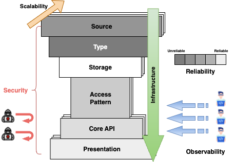

# Hourglass Design {#hour-glass}

The **Hourglass Design** is something I came up with as a way to think about system design without falling into endless loops of detail. At the top sit the **Sources**—devices, services, or users—each producing data in different forms and rhythms. That raw input is defined by its **Type**, the schema, format, and encoding that determine how data is understood and carried forward. From there, the flow narrows through the **Access Pattern**, where you decide how data can be searched, filtered, or aggregated, and through the **Core API** that governs how the business interacts with **Storage**. This middle is the waist of the hourglass: a stable contract that gives freedom to change databases, pipelines, or infrastructure without rewriting the entire system.  

At the bottom is the **Presentation layer**, where data is delivered outward again—whether to people (UI) or to other systems (External APIs). Around the glass, the cross-cutting forces—**Scalability, Security, Reliability, Observability, and Deployment**—define how well each component can expand, resist failure, and stay operable in practice. The shape is simple but powerful: many inputs narrow through one clear contract before expanding again into many outputs.  

  
  
Hourglass Overview

---

<table class="study-table">
  <thead>
    <tr>
      <th>Critical Question</th>
      <th>Impact on Design</th>
    </tr>
  </thead>
  <tbody>

    <!-- Source -->
    <tr><td colspan="2" style="text-align:center;"><strong>Source (Data Origin &amp; Ingress)</strong></td></tr>
    <tr>
      <td>Who are the producers (IoT, user, service)?</td>
      <td>Protocol &amp; scale: MQTT/Kafka for IoT; REST/gRPC for apps; webhooks for partners.</td>
    </tr>
    <tr>
      <td>Push or pull?</td>
      <td>Push → broker/queue; Pull → scheduler/poller with backoff.</td>
    </tr>
    <tr>
      <td>How frequent (stream vs batch)?</td>
      <td>Stream → streaming pipeline &amp; backpressure; Batch → ETL windows &amp; SLAs.</td>
    </tr>
    <tr>
      <td>Can sources pre-filter or pre-compute?</td>
      <td>Yes → lower ingest cost/noise; No → server-side filtering &amp; enrichment.</td>
    </tr>
    <tr>
      <td>Are sources uniquely identifiable?</td>
      <td>Stable IDs enable partitioning, idempotency, and lineage.</td>
    </tr>

    <!-- Type -->
    <tr><td colspan="2" style="text-align:center;"><strong>Type (Schema, Format, Encoding)</strong></td></tr>
    <tr>
      <td>Is schema enforced?</td>
      <td>Yes → SQL or registry (Avro/Protobuf); No → JSON/NoSQL/object storage.</td>
    </tr>
    <tr>
      <td>Narrow or wide payload?</td>
      <td>Narrow → time-series stores; Wide → columnar OLAP.</td>
    </tr>
    <tr>
      <td>Compact or human-readable?</td>
      <td>Compact (Avro/Protobuf) vs readable (JSON/CSV) affects cost &amp; DX.</td>
    </tr>
    <tr>
      <td>Nested or flat values?</td>
      <td>Nested → JSONB/NoSQL; Flat → relational with indexes.</td>
    </tr>

    <!-- Storage -->
    <tr><td colspan="2" style="text-align:center;"><strong>Storage (Scale, Structure, Retention)</strong></td></tr>
    <tr>
      <td>Daily volume &amp; retention?</td>
      <td>High/long → tiered storage (S3 + hot DB) &amp; lifecycle policies.</td>
    </tr>
    <tr>
      <td>Write pattern: hot or cold?</td>
      <td>Hot → append logs/stream DB; Cold → relational with indices.</td>
    </tr>
    <tr>
      <td>Mutable or immutable?</td>
      <td>Mutable → versioning/locks; Immutable → event store/compaction.</td>
    </tr>
    <tr>
      <td>Joins vs time filters?</td>
      <td>Joins → relational; Time-range → TSDB/partitioned tables.</td>
    </tr>
    <tr>
      <td>Consistency needs?</td>
      <td>Strong → RDBMS; Eventual → NoSQL/object storage.</td>
    </tr>

    <!-- Access Pattern -->
    <tr><td colspan="2" style="text-align:center;"><strong>Access Pattern (Read Behavior &amp; Consumers)</strong></td></tr>
    <tr>
      <td>Real-time, periodic, or ad-hoc?</td>
      <td>Real-time → cache/precompute; Ad-hoc → OLAP/query planner.</td>
    </tr>
    <tr>
      <td>Read by ID, time, or search?</td>
      <td>ID → key-value; Time → TSDB; Search → inverted index.</td>
    </tr>
    <tr>
      <td>Global or scoped (user/region)?</td>
      <td>Partitioning, row-level access, tenant isolation.</td>
    </tr>
    <tr>
      <td>Do consumers need aggregates?</td>
      <td>Pre-aggregated/materialized views improve latency &amp; cost.</td>
    </tr>

    <!-- API -->
    <tr><td colspan="2" style="text-align:center;"><strong>Core API (Interface &amp; Protocols)</strong></td></tr>
    <tr>
      <td>User-triggered or system-triggered?</td>
      <td>User → REST/GraphQL; System → webhooks, MQTT, Kafka.</td>
    </tr>
    <tr>
      <td>Is real-time push needed?</td>
      <td>Yes → WebSocket/SSE/MQTT; No → polling with ETags &amp; caching.</td>
    </tr>
    <tr>
      <td>Precompute or on-demand?</td>
      <td>Precompute → Redis/materialized views; On-demand → compute budget.</td>
    </tr>
    <tr>
      <td>Large/batch downloads?</td>
      <td>Async job + signed URL; otherwise paginated endpoints.</td>
    </tr>

    <!-- Presentation -->
    <tr><td colspan="2" style="text-align:center;"><strong>Presentation (Frontend/Analytics)</strong></td></tr>
    <tr>
      <td>Need low-latency/live updates?</td>
      <td>Push or fast polling; optimistic UI.</td>
    </tr>
    <tr>
      <td>Large lists/maps?</td>
      <td>Pagination, infinite scroll, viewport virtualization.</td>
    </tr>
    <tr>
      <td>Advanced search/filter?</td>
      <td>Search engine (Typesense/Meilisearch/Elasticsearch).</td>
    </tr>
    <tr>
      <td>Offline or flaky networks?</td>
      <td>Service Workers, IndexedDB/LocalStorage, sync queues.</td>
    </tr>
    <tr>
      <td>Personalized views?</td>
      <td>RBAC + query-level filters.</td>
    </tr>

    <!-- Security -->
    <tr><td colspan="2" style="text-align:center;"><strong>Security (Auth, Privacy, Protection)</strong></td></tr>
    <tr>
      <td>Who can access what?</td>
      <td>Public read vs private scopes; IAM/JWT/API keys; WAF.</td>
    </tr>
    <tr>
      <td>Tenant or user boundaries?</td>
      <td>Row-level security, per-tenant schemas/keys, encryption.</td>
    </tr>
    <tr>
      <td>Is access audited?</td>
      <td>Append-only audit logs, forwarding &amp; retention.</td>
    </tr>
    <tr>
      <td>Abuse protection?</td>
      <td>Rate limits, CAPTCHA, throttling/backoff.</td>
    </tr>

    <!-- Scalability -->
    <tr><td colspan="2" style="text-align:center;"><strong>Scalability (Throughput &amp; Growth)</strong></td></tr>
    <tr>
      <td>Growth: linear or exponential?</td>
      <td>Plan sharding/partitions early; avoid single-writer bottlenecks.</td>
    </tr>
    <tr>
      <td>CPU, memory, or I/O bound?</td>
      <td>Match scaling: workers, queues/backpressure, caches/batching.</td>
    </tr>
    <tr>
      <td>Horizontal scale possible?</td>
      <td>Stateless services, partitioned DBs, idempotent handlers.</td>
    </tr>
    <tr>
      <td>Natural partition keys?</td>
      <td>Device ID, region, tenant → predictable scale-out.</td>
    </tr>

    <!-- Reliability -->
    <tr><td colspan="2" style="text-align:center;"><strong>Reliability</strong></td></tr>
    <tr>
      <td>Impact of a component failure?</td>
      <td>Retries with jitter, fallbacks, circuit breakers, graceful degradation.</td>
    </tr>
    <tr>
      <td>Are retries safe?</td>
      <td>Idempotency keys, sequence numbers; avoid duplicate side effects.</td>
    </tr>
    <tr>
      <td>Durability vs availability?</td>
      <td>Sync replication/WAL/backups vs looser RPO/RTO.</td>
    </tr>
    <tr>
      <td>Dependency isolation?</td>
      <td>Bulkheads, timeouts, rate limits, queues.</td>
    </tr>

    <!-- Observability -->
    <tr><td colspan="2" style="text-align:center;"><strong>Observability (Monitoring, Logging, Tracing)</strong></td></tr>
    <tr>
      <td>Alert on the right signals?</td>
      <td>Golden signals &amp; anomaly detection; dead-man’s switch for silence.</td>
    </tr>
    <tr>
      <td>Trace across services?</td>
      <td>Correlation IDs, OpenTelemetry, X-Ray/Jaeger.</td>
    </tr>
    <tr>
      <td>Structured, centralized logs?</td>
      <td>ELK/Loki/Datadog; consistent fields &amp; sampling.</td>
    </tr>
    <tr>
      <td>Business KPIs as metrics?</td>
      <td>Emit product KPIs alongside infra metrics.</td>
    </tr>

    <!-- Deployment -->
    <tr><td colspan="2" style="text-align:center;"><strong>Infrastructure</strong></td></tr>
    <tr>
      <td>Cloud, hybrid, or on-prem?</td>
      <td>Managed services vs portable containers/orchestration.</td>
    </tr>
    <tr>
      <td>Multi-region?</td>
      <td>Global DNS, replication strategy, active-active/DR.</td>
    </tr>
    <tr>
      <td>IaC &amp; CI/CD?</td>
      <td>Terraform/CDK + pipelines; policy as code.</td>
    </tr>
    <tr>
      <td>Release safety?</td>
      <td>Canary, feature flags, rollbacks; infra drift detection.</td>
    </tr>

  </tbody>
</table>

---

# System Design Scenarios {#system-design-scenarios}

These scenarios illustrate how to apply the **Hourglass Design Method** to real-world systems, from IoT to social platforms to eCommerce.  
Each table follows the same structure: **Block → Design Choice → Justification**.

---

## Scenario 1: Realtime Temperature Monitoring (IoT Sensors) {#scenario-1-realtime-temperature-monitoring-iot-sensors}

**Goal**: Build a system for **1M IoT devices** reporting temperature every 10s across NSW.  
- **Realtime heatmap** (~10s latency)  
- **Historical dashboard** (daily/weekly/monthly)  
- **Retention**: 6 months  

<table class="study-table">
<thead>
<tr>
<th>Block</th>
<th>Design Choice</th>
<th>Justification</th>
</tr>
</thead>
<tbody>
<tr>
<td><strong>Source</strong></td>
<td>MQTT protocol, 1M IoT devices JSON payload: <code>{ device_id, timestamp, temperature }</code></td>
<td>MQTT is lightweight, supports millions of persistent low-power clients</td>
</tr>
<tr>
<td><strong>Type</strong></td>
<td>Structured time-series, fixed schema JSON at ingest → binary at storage</td>
<td>Efficient parsing and optimized storage</td>
</tr>
<tr>
<td><strong>Storage</strong></td>
<td>Realtime table (~16 MB) Daily aggregation (~2.9 GB / 180 days) Metadata (~20 MB) <strong>Total ≈ 3.5 GB</strong></td>
<td>Tiered storage: hot (real-time) vs cold (aggregates)</td>
</tr>
<tr>
<td><strong>Preprocessing / Compute</strong></td>
<td>Realtime updates per reading Daily min/max aggregation Redis for fast compare Batch writes → TimescaleDB</td>
<td>Low latency ingest + efficient aggregation</td>
</tr>
<tr>
<td><strong>Core API</strong></td>
<td>REST polling every 10s (map) REST queries (historical)</td>
<td>Polling is simple, cost-efficient for low concurrency</td>
</tr>
<tr>
<td><strong>Presentation</strong></td>
<td>Web map grid updated every 10s Historical dashboard with calendar filter</td>
<td>Lightweight visualization for end users</td>
</tr>
<tr>
<td><strong>Security</strong></td>
<td>No login API throttling (CloudFront + WAF) MQTT cert-based auth</td>
<td>Basic protection, open data model</td>
</tr>
<tr>
<td><strong>Scalability</strong></td>
<td>~100K writes/sec Kafka/Kinesis buffer Partition DB by device_id + time Stateless API, autoscaling</td>
<td>Horizontal scalability and decoupling</td>
</tr>
<tr>
<td><strong>Reliability</strong></td>
<td>MQTT at-least-once Retry pipeline Re-runnable daily jobs</td>
<td>Ensures data completeness under failure</td>
</tr>
<tr>
<td><strong>Observability</strong></td>
<td>Metrics: ingest rate, write latency, last_seen Logs: ingestion + API</td>
<td>Full visibility into data pipeline health</td>
</tr>
<tr>
<td><strong>Infrastructure</strong></td>
<td>AWS IoT Core or EMQX → Kinesis/Kafka → ECS/Fargate → TimescaleDB IaC: Terraform/CDK</td>
<td>Cloud-native, modular, reproducible</td>
</tr>
</tbody>
</table>

---

## Scenario 2: Twitter-like Microblogging Platform {#scenario-2-twitter-like-microblogging-platform}

**Goal**: Design a social platform similar to Twitter.  
- **Realtime feed updates**  
- **Millions of posts/day**  
- **Support search, hashtags, user timelines**  

<table class="study-table">
<thead>
<tr>
<th>Block</th>
<th>Design Choice</th>
<th>Justification</th>
</tr>
</thead>
<tbody>
<tr>
<td><strong>Source</strong></td>
<td>User posts (tweets), likes, follows Ingest via REST API + WebSockets</td>
<td>REST for write operations; WebSocket for live updates</td>
</tr>
<tr>
<td><strong>Type</strong></td>
<td>JSON payloads (id, user_id, timestamp, text, media_url) Hashtags/mentions indexed</td>
<td>Schema is semi-structured but consistent enough for indexing</td>
</tr>
<tr>
<td><strong>Storage</strong></td>
<td>OLTP DB (Postgres/CockroachDB) for metadata Object store (S3) for media ElasticSearch for search/index</td>
<td>Separate transactional vs. search workloads</td>
</tr>
<tr>
<td><strong>Preprocessing / Compute</strong></td>
<td>Fanout service builds timelines Kafka for async event distribution</td>
<td>Decouples writes from personalized feed building</td>
</tr>
<tr>
<td><strong>Core API</strong></td>
<td>REST (post, follow) WebSocket/GraphQL (feed updates)</td>
<td>REST reliable for writes; streaming API for low-latency feeds</td>
</tr>
<tr>
<td><strong>Presentation</strong></td>
<td>Web + mobile apps Infinite scroll timeline, notifications</td>
<td>Optimized UX for engagement</td>
</tr>
<tr>
<td><strong>Security</strong></td>
<td>OAuth2 login Rate limiting (API Gateway) WAF for spam</td>
<td>Standard identity + abuse protection</td>
</tr>
<tr>
<td><strong>Scalability</strong></td>
<td>Sharded user/tweet DB CDN for media Async fanout to caches</td>
<td>Ensures horizontal scale to millions of users</td>
</tr>
<tr>
<td><strong>Reliability</strong></td>
<td>Durable Kafka log Retry for writes Timeline cache fallback</td>
<td>Feed always eventually consistent</td>
</tr>
<tr>
<td><strong>Observability</strong></td>
<td>Metrics: post latency, fanout lag Logs: auth, API, feed delivery</td>
<td>Critical for SLO monitoring</td>
</tr>
<tr>
<td><strong>Infrastructure</strong></td>
<td>AWS: API Gateway + Lambda/ECS, DynamoDB/Postgres, S3, ElasticSearch</td>
<td>Mix of serverless + managed DB for scale</td>
</tr>
</tbody>
</table>

---

## Scenario 3: eCommerce Platform {#scenario-3-ecommerce-platform}

**Goal**: Design a modern eCommerce system.  
- **Product catalog, cart, checkout**  
- **User accounts, payments**  
- **Scalable search + inventory**  

<table class="study-table">
<thead>
<tr>
<th>Block</th>
<th>Design Choice</th>
<th>Justification</th>
</tr>
</thead>
<tbody>
<tr>
<td><strong>Source</strong></td>
<td>Users browsing, adding to cart, checkout actions External payment gateway callbacks</td>
<td>Standard REST ingestion with webhook integration</td>
</tr>
<tr>
<td><strong>Type</strong></td>
<td>Structured JSON for users/products Catalog with categories, variants</td>
<td>Strong schema required for payments + orders</td>
</tr>
<tr>
<td><strong>Storage</strong></td>
<td>RDBMS (Aurora/MySQL) for orders/payments DynamoDB for cart sessions S3 for product media</td>
<td>Transactional consistency for payments; NoSQL for ephemeral cart</td>
</tr>
<tr>
<td><strong>Preprocessing / Compute</strong></td>
<td>Inventory service decrements stock Async order events via SNS/SQS</td>
<td>Event-driven ensures reliable order flow</td>
</tr>
<tr>
<td><strong>Core API</strong></td>
<td>REST (catalog, cart, order) GraphQL (flexible queries for product search)</td>
<td>REST for critical workflows; GraphQL for frontend flexibility</td>
</tr>
<tr>
<td><strong>Presentation</strong></td>
<td>Web + mobile storefront Search, cart, checkout flows</td>
<td>Responsive UX, optimized conversions</td>
</tr>
<tr>
<td><strong>Security</strong></td>
<td>OAuth2 login, MFA for admin PCI-DSS compliant payment handling WAF + Shield</td>
<td>Protects sensitive user/payment data</td>
</tr>
<tr>
<td><strong>Scalability</strong></td>
<td>Autoscaling ALB/NLB ElasticSearch for catalog search CDN for static assets</td>
<td>Handles traffic spikes during sales</td>
</tr>
<tr>
<td><strong>Reliability</strong></td>
<td>Multi-AZ RDS Order queue with DLQ Event replay for payments</td>
<td>Ensures orders are never lost</td>
</tr>
<tr>
<td><strong>Observability</strong></td>
<td>Metrics: checkout latency, error rate Logs: API + payment gateway</td>
<td>Monitors user impact and failures</td>
</tr>
<tr>
<td><strong>Infrastructure</strong></td>
<td>AWS: ALB + ECS, Aurora, DynamoDB, S3, ElasticSearch, CloudFront</td>
<td>Mix of managed + serverless services for resilience</td>
</tr>
</tbody>
</table>

---

### Scenario 4: Short URL Service (URL Shortener) {#scenario-a-short-url}

**Goal**: Map long URLs to short codes with **low latency**, **high write QPS**, and **massive read QPS**.  
- **Create** short code, **redirect** instantly  
- **Unique codes**, collision-resistant  
- **Analytics** (clicks, geo, referrer)  

<table class="study-table">
<thead>
<tr>
<th>Block</th>
<th>Design Choice</th>
<th>Justification</th>
</tr>
</thead>
<tbody>
<tr>
<td><strong>Source</strong></td>
<td>REST API: <code>POST /shorten</code>, <code>GET /{code}</code></td>
<td>Simple CRUD over HTTPS; easy client integration</td>
</tr>
<tr>
<td><strong>Type</strong></td>
<td>JSON: <code>{ long_url, owner_id, ttl }</code></td>
<td>Minimal schema for fast validation and storage</td>
</tr>
<tr>
<td><strong>Storage</strong></td>
<td>DynamoDB (PK=code) for mapping; S3 for logs</td>
<td>Single-digit ms reads; elastic scale; cheap analytics storage</td>
</tr>
<tr>
<td><strong>Preprocessing / Compute</strong></td>
<td>Code gen via base62/ULID; optional custom alias; async analytics (Kinesis)</td>
<td>Collision avoidance; decouple hot path from analytics</td>
</tr>
<tr>
<td><strong>Core API</strong></td>
<td>REST + 301/302 redirect; rate-limits per owner</td>
<td>Browser-native redirect semantics; abuse protection</td>
</tr>
<tr>
<td><strong>Presentation</strong></td>
<td>Simple web console + CLI; QR export</td>
<td>Low-friction creation and sharing</td>
</tr>
<tr>
<td><strong>Security</strong></td>
<td>Auth (API keys/OAuth); domain allowlist; malware scanning</td>
<td>Prevents phishing/abuse; protects brand domains</td>
</tr>
<tr>
<td><strong>Scalability</strong></td>
<td>CloudFront → Lambda@Edge redirect cache; hot keys sharded</td>
<td>Edge-cached redirects minimize origin load/latency</td>
</tr>
<tr>
<td><strong>Reliability</strong></td>
<td>Multi-Region table (global tables); DLQ for failed writes</td>
<td>Regional failover; durable retry</td>
</tr>
<tr>
<td><strong>Observability</strong></td>
<td>Metrics: p50/p99 redirect latency, 4xx/5xx; click streams</td>
<td>Track UX and abuse; support analytics</td>
</tr>
<tr>
<td><strong>Infrastructure</strong></td>
<td>API Gateway + Lambda, DynamoDB, Kinesis, S3, CloudFront, WAF</td>
<td>Serverless, cost-efficient at any scale</td>
</tr>
</tbody>
</table>

---

### Scenario 5: Search Engine (Vertical Site/Search Service) {#scenario-b-search-engine}

**Goal**: Index documents/webpages and provide **full-text search** with **filters**, **ranking**, and **autosuggest**.  
- **Ingest & crawl** sources  
- **Index** fields + vectors  
- **Query**: keyword + semantic, filters, facets  

<table class="study-table">
<thead>
<tr>
<th>Block</th>
<th>Design Choice</th>
<th>Justification</th>
</tr>
</thead>
<tbody>
<tr>
<td><strong>Source</strong></td>
<td>Crawler / webhooks / batch uploads (S3)</td>
<td>Multiple ingestion modes for coverage and freshness</td>
</tr>
<tr>
<td><strong>Type</strong></td>
<td>JSON docs: title, body, facets, embedding</td>
<td>Supports keyword and vector (semantic) search</td>
</tr>
<tr>
<td><strong>Storage</strong></td>
<td>OpenSearch/Elastic (inverted index) + vector index; S3 cold store</td>
<td>Hybrid BM25 + ANN; cheap archive</td>
</tr>
<tr>
<td><strong>Preprocessing / Compute</strong></td>
<td>ETL: clean, dedupe, tokenize, embed; incremental indexing</td>
<td>Higher relevance; fast refresh with partial updates</td>
</tr>
<tr>
<td><strong>Core API</strong></td>
<td>Search REST: q, filters, sort; autosuggest endpoint</td>
<td>Standard search UX; low-latency responses</td>
</tr>
<tr>
<td><strong>Presentation</strong></td>
<td>Web UI: search box, facets, highlighting; pagination</td>
<td>Discoverability and relevance feedback</td>
</tr>
<tr>
<td><strong>Security</strong></td>
<td>Signed requests; per-tenant filter; index-level RBAC</td>
<td>Isolation and least privilege</td>
</tr>
<tr>
<td><strong>Scalability</strong></td>
<td>Sharded indexes; warm replicas; query cache/CDN for hot queries</td>
<td>Throughput and low tail latency</td>
</tr>
<tr>
<td><strong>Reliability</strong></td>
<td>Multi-AZ cluster; snapshot to S3; blue/green index swaps</td>
<td>Safe reindex; fast recovery</td>
</tr>
<tr>
<td><strong>Observability</strong></td>
<td>Metrics: QPS, p99, recall@k/CTR; slow logs; relevancy dashboards</td>
<td>Quality and performance tuning</td>
</tr>
<tr>
<td><strong>Infrastructure</strong></td>
<td>ECS/EKS crawlers, Lambda ETL, OpenSearch, S3, API Gateway, CloudFront</td>
<td>Managed search + serverless ETL</td>
</tr>
</tbody>
</table>

---

### Scenario 6: Ride-Sharing (Dispatch & Matching) {#scenario-c-ride-sharing}

**Goal**: Match **riders ↔ drivers** in real time with **ETA estimates**, **pricing**, and **tracking**.  
- **High write** (location updates) + **low-latency reads** (nearby drivers)  
- **Geo-index** + **surge pricing**  
- **Trip lifecycle** events  

<table class="study-table">
<thead>
<tr>
<th>Block</th>
<th>Design Choice</th>
<th>Justification</th>
</tr>
</thead>
<tbody>
<tr>
<td><strong>Source</strong></td>
<td>Mobile apps (drivers/riders) → gRPC/HTTP + WebSocket</td>
<td>Bi-directional updates; efficient on mobile</td>
</tr>
<tr>
<td><strong>Type</strong></td>
<td>JSON/Protobuf: lat/lon, speed, status; trip events</td>
<td>Compact on-wire; structured for stream processing</td>
</tr>
<tr>
<td><strong>Storage</strong></td>
<td>Redis/KeyDB (geo sets) for live locations; Postgres for trips/payments; S3 for telemetry</td>
<td>Fast geo-nearby; durable transactional store</td>
</tr>
<tr>
<td><strong>Preprocessing / Compute</strong></td>
<td>Stream (Kafka): location smoothing, ETA calc, surge pricing; ML for ETA/dispatch</td>
<td>Low-latency decisions; adaptive pricing</td>
</tr>
<tr>
<td><strong>Core API</strong></td>
<td>REST: request/cancel trip, quote; WebSocket: live driver ETA/track</td>
<td>Seamless UX for requests + realtime updates</td>
</tr>
<tr>
<td><strong>Presentation</strong></td>
<td>Mobile map with live driver markers; push notifications</td>
<td>High-frequency updates with low battery impact</td>
</tr>
<tr>
<td><strong>Security</strong></td>
<td>JWT auth; signed location updates; fraud detection rules</td>
<td>Protects users and platform integrity</td>
</tr>
<tr>
<td><strong>Scalability</strong></td>
<td>Region-sharded dispatch; partition by city/zone; edge caches for maps/tiles</td>
<td>Reduces cross-region chatter; scales horizontally</td>
</tr>
<tr>
<td><strong>Reliability</strong></td>
<td>Leader election per region; idempotent trip ops; DLQs for events</td>
<td>Failover and consistent trip lifecycle</td>
</tr>
<tr>
<td><strong>Observability</strong></td>
<td>Metrics: match time, cancel rate, ETA error; traces for dispatch path</td>
<td>Operational and model quality monitoring</td>
</tr>
<tr>
<td><strong>Infrastructure</strong></td>
<td>API Gateway + ECS/EKS, Redis Geo, Kafka, Postgres/Aurora, S3, CloudFront, Pinpoint/SNS</td>
<td>Mix of in-memory geo + durable stores</td>
</tr>
</tbody>
</table>