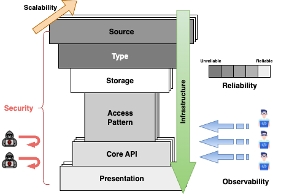

# Hourglass Design {#hour-glass}

The **Hourglass Design** is a way to think about system design as data transformation: consume data from a source, turn it into something useful, and present it to the end user at the right place, at the right time, and in the right format.

This is similar to **just-in-time manufacturing**: do not produce every possible output upfront. Understand demand first, then decide what must be prebuilt, what can be assembled on demand, and what should be delivered only when the user or downstream system needs it. In system design terms, that means choosing what to store raw, what to transform ahead of time, what to compute on read, and what to cache close to the consumer.

The top of the hourglass is broad because many things can produce data: users, devices, services, partners, files, jobs, and webhooks. The middle narrows because a good system needs a clear transformation contract: what data means, where it is stored, how it is queried, and what business logic turns input into useful output. The bottom widens again because transformed data may be presented through mobile apps, dashboards, notifications, exports, APIs, search, feeds, or analytics.

Use the hourglass with the interview flow from [Interview Tips](/study/systemDesignInterviewTips): clarify the scope, draw the high-level data flow, then deep dive where the design risk is highest. The six core blocks are **Source, Type, Storage, Pattern, Logic, and Presentation**. Around them, the cross-cutting concerns are **Security, Scalability, Reliability, Observability, and Infrastructure**.

The short version:

```
Source tells you what Data A is
Type tells you what Data A means
Storage tells you what state must be kept
Pattern tells you how Data B will be requested
Logic tells you how Data A becomes Data B
Presentation tells you how Data B is delivered
```

<div class="image-wrapper">
  
  <div class="image-caption">Hourglass Overview</div>
</div>

---

## Hourglass Checklist {#hourglass-checklist}

Use this as a vertical checklist while designing. Each step should produce an answer that makes the next step easier. Start with one unit of **Data A**, scale it into a dataset, then follow the transformation until **Data B** is ready for the final user-facing output.

### 1. Source: what does one producer emit?

Core question: for a single producer, what is one unit of Data A?

- **Producer:** user, device, service, partner, file, scheduled job, or webhook.
- **Event:** the payload emitted by that producer.
- **Ingress:** protocol or mechanism: REST, gRPC, MQTT, webhook, queue, upload, or batch job.
- **Identity and trust:** source ID, event ID, auth, validation, and deduplication.

Output: one clear **Data A** event. This feeds Type because you now know what fields must be understood at scale.

### 2. Type: what does Data A look like across all producers?

Core question: when many producers emit Data A, what dataset does that create?

- **Schema:** required fields, optional fields, validation rules, and schema evolution.
- **Representation:** JSON, Protobuf, Avro, CSV, image, video, log line, or binary payload.
- **Meaning:** units, timestamps, time zones, IDs, encoding, enums, and field semantics.
- **Scale shape:** producer count × per-producer frequency × event size.

Output: schema, event size, event rate, and rough daily volume. This feeds Storage because volume and shape determine what can be stored, indexed, or discarded.

### 3. Storage: where do Data A and Data B live?

Core question: what must be stored as source-of-truth Data A, and what can be rebuilt as derived Data B?

- **Source of truth:** canonical records, raw events, objects, or transaction state.
- **Derived state:** feeds, search indexes, aggregates, reports, caches, and analytics.
- **Lifecycle:** mutability, retention, archival, deletion, and consistency needs.

Output: what is stored, what is derived, how long it lives, and how consistent it must be. This feeds Pattern because stored state must match how Data B will be read.

### 4. Pattern: how will Data B be requested?

Core question: what access pattern does Data B need to support?

- **Lookup:** by ID, owner, time range, location, search term, relationship, or tenant.
- **Shape:** single object, list, feed, aggregate, ranking, map, graph, export, or stream.
- **Freshness and scope:** latest vs stale, global vs tenant/user/region/permission scoped.

Output: query shape, indexes, partition keys, cache keys, and freshness expectations. This feeds Logic because the transformation should produce Data B in the shape consumers need.

### 5. Logic: how does Data A become Data B?

Core question: what validation, enrichment, computation, and side effects turn Data A into useful Data B?

- **Validation:** reject invalid, duplicate, unauthorized, or malformed input.
- **Transformation:** enrich, join, normalize, classify, geocode, rank, score, summarize, or aggregate.
- **Timing:** compute on write, on read, on a schedule, or continuously in a stream.
- **Side effects:** notifications, search indexing, analytics, billing, emails, and webhooks.

Output: the transformation plan from Data A to Data B. This feeds Presentation because the final surface should receive useful, timely, correctly shaped data.

### 6. Presentation: how is Data B delivered just in time?

Core question: who needs Data B, where do they need it, when do they need it, and in what format?

- **Audience:** end users, admins, partners, internal operators, analysts, or other systems.
- **Delivery:** mobile, web, dashboard, notification, API, export, embedded widget, or report.
- **Timing:** instant, live, eventually, scheduled, or on demand.
- **Format:** table, chart, map, feed, ranking, card, file, alert, or machine-readable response.

Output: the delivery contract for Data B: audience, place, time, format, latency, and permissions.

### Cross-Cutting Checks

After the six core blocks, check the system qualities around the hourglass:

- **Security:** who can create, transform, store, and view each piece of data?
- **Scalability:** what grows: sources, objects, writes, reads, transformations, or outputs?
- **Reliability:** can the system retry safely, recover from failure, and rebuild derived data?
- **Observability:** can we see data moving from source to transformed output?
- **Infrastructure:** where does the logic run, and how are schema, code, index, and job changes released safely?


---

# Numbers That Matter {#numbers-that-matter}

The Hourglass method tells you what to decide. The sizing math tells you whether the design is plausible. For powers of two, latency units, latency estimates, and availability targets, see [Numbers That Matter in System Design](/study/systemDesignNumbersThatMatter).

---

# System Design Scenarios {#system-design-scenarios}

These scenarios illustrate how to apply the **Hourglass Design Method** to real-world systems, from IoT to social platforms to eCommerce.  
Each scenario first names **Data A** and **Data B**, then the table follows the same structure: **Block → Design Choice → Justification**.

---

## Scenario 1: Realtime Temperature Monitoring (IoT Sensors) {#scenario-1-realtime-temperature-monitoring-iot-sensors}

**Goal**: Build a system for **1M IoT devices** reporting temperature every 10s across NSW.  
- **Realtime heatmap** (~10s latency)  
- **Historical dashboard** (daily/weekly/monthly)  
- **Retention**: 6 months  

**Data A → Data B**

- **Data A:** raw sensor readings: `device_id`, timestamp, temperature, and device metadata.
- **Data B:** live regional heatmap cells, historical aggregates, alertable trends, and dashboard-ready time-series views.

<table class="study-table">
<thead>
<tr>
<th>Block</th>
<th>Design Choice</th>
<th>Justification</th>
</tr>
</thead>
<tbody>
<tr>
<td><strong>Source</strong></td>
<td>One sensor publishes one reading over MQTT<br>Single-device payload: <code>{ device_id, lat, lon, timestamp, temperature }</code></td>
<td>Estimate one reading first: <code>device_id</code> (<code>8 B</code>) + lat/lon doubles (<code>16 B</code>) + temperature double (<code>8 B</code>) + timestamp (<code>8 B</code>) = ~40 B before overhead. JSON is often ~100-200 B because field names and punctuation are included.</td>
</tr>
<tr>
<td><strong>Type</strong></td>
<td>Structured time-series across 1M devices<br>1M devices / 10s = ~100K readings/sec<br>Fixed schema with timestamp, location, and numeric temperature<br>JSON at ingest → binary at storage</td>
<td>Type scales the single reading: ~100K readings/sec × 86,400 sec ≈ 8.64B readings/day. At ~100 B each, raw ingest is ~864 GB/day before replicas and indexes.</td>
</tr>
<tr>
<td><strong>Storage</strong></td>
<td>Realtime latest-value table (~16 MB)<br>Daily aggregation (~2.9 GB / 180 days)<br>Metadata (~20 MB)<br>Raw readings optional: much larger if retained</td>
<td>Storage follows retention: latest-value storage stays tiny, aggregate storage is compact, but retaining all raw readings for 180 days would be ~155 TB before replicas/indexes.</td>
</tr>
<tr>
<td><strong>Logic / Transformation</strong></td>
<td>Realtime updates per reading<br>Daily min/max aggregation<br>Redis for fast compare<br>Batch writes → TimescaleDB</td>
<td>Low latency ingest + efficient aggregation</td>
</tr>
<tr>
<td><strong>Pattern / Access</strong></td>
<td>REST polling every 10s (map)<br>REST queries (historical)</td>
<td>Polling is simple, cost-efficient for low concurrency</td>
</tr>
<tr>
<td><strong>Presentation</strong></td>
<td>Web map grid updated every 10s<br>Historical dashboard with calendar filter</td>
<td>Lightweight visualization for end users</td>
</tr>
<tr>
<td><strong>Security</strong></td>
<td>No login<br>API throttling (CloudFront + WAF)<br>MQTT cert-based auth</td>
<td>Basic protection, open data model</td>
</tr>
<tr>
<td><strong>Scalability</strong></td>
<td>~100K writes/sec<br>Kafka/Kinesis buffer<br>Partition DB by device_id + time<br>Stateless API, autoscaling</td>
<td>Horizontal scalability and decoupling</td>
</tr>
<tr>
<td><strong>Reliability</strong></td>
<td>MQTT at-least-once<br>Retry pipeline<br>Re-runnable daily jobs</td>
<td>Ensures data completeness under failure</td>
</tr>
<tr>
<td><strong>Observability</strong></td>
<td>Metrics: ingest rate, write latency, last_seen<br>Logs: ingestion + API</td>
<td>Full visibility into data pipeline health</td>
</tr>
<tr>
<td><strong>Infrastructure</strong></td>
<td>AWS IoT Core or EMQX → Kinesis/Kafka → ECS/Fargate → TimescaleDB<br>IaC: Terraform/CDK</td>
<td>Cloud-native, modular, reproducible</td>
</tr>
</tbody>
</table>

---

## Scenario 2: Twitter-like Microblogging Platform {#scenario-2-twitter-like-microblogging-platform}

**Goal**: Design a social platform similar to Twitter.  
- **Realtime feed updates**  
- **Millions of posts/day**  
- **Support search, hashtags, user timelines**  

**Data A → Data B**

- **Data A:** user actions: posts, likes, follows, replies, media uploads, hashtags, and mentions.
- **Data B:** personalized timelines, searchable posts, notifications, counters, and profile/user timeline views.

<table class="study-table">
<thead>
<tr>
<th>Block</th>
<th>Design Choice</th>
<th>Justification</th>
</tr>
</thead>
<tbody>
<tr>
<td><strong>Source</strong></td>
<td>One user emits one action: create post, like, follow, reply, or upload media<br>Example post payload: <code>{ author_id, text, media_ids, created_at }</code></td>
<td>Estimate one post first: IDs/timestamp are ~24 B, 280 chars of English UTF-8 is ~280 B, worst-case UTF-8 can be ~1.1 KB, and media pointers/counters add tens to hundreds of bytes.</td>
</tr>
<tr>
<td><strong>Type</strong></td>
<td>Mixed event stream across millions of users<br>Post, like, follow, reply, and media events have related but different schemas<br>Text fields need UTF-8 sizing; hashtags/mentions become indexed fields</td>
<td>Type scales the event family: a post metadata row is roughly ~0.5-2 KB. At 10M posts/day and ~1 KB average, post metadata is ~10 GB/day before indexes.</td>
</tr>
<tr>
<td><strong>Storage</strong></td>
<td>OLTP DB (Postgres/CockroachDB) for metadata<br>Object store (S3) for media<br>ElasticSearch for search/index</td>
<td>Storage separates workloads: if 10% of 10M posts include 1 MB media, media adds ~1 TB/day, which dominates metadata storage.</td>
</tr>
<tr>
<td><strong>Logic / Transformation</strong></td>
<td>Fanout service builds timelines<br>Kafka for async event distribution</td>
<td>Logic can multiply writes: 10M posts/day × 200 followers average ≈ 2B timeline write events/day, so fanout should be async.</td>
</tr>
<tr>
<td><strong>Pattern / Access</strong></td>
<td>REST (post, follow)<br>WebSocket/GraphQL (feed updates)</td>
<td>REST reliable for writes; streaming API for low-latency feeds</td>
</tr>
<tr>
<td><strong>Presentation</strong></td>
<td>Web + mobile apps<br>Infinite scroll timeline, notifications</td>
<td>Optimized UX for engagement</td>
</tr>
<tr>
<td><strong>Security</strong></td>
<td>OAuth2 login<br>Rate limiting (API Gateway)<br>WAF for spam</td>
<td>Standard identity + abuse protection</td>
</tr>
<tr>
<td><strong>Scalability</strong></td>
<td>Sharded user/tweet DB<br>CDN for media<br>Async fanout to caches</td>
<td>Ensures horizontal scale to millions of users</td>
</tr>
<tr>
<td><strong>Reliability</strong></td>
<td>Durable Kafka log<br>Retry for writes<br>Timeline cache fallback</td>
<td>Feed always eventually consistent</td>
</tr>
<tr>
<td><strong>Observability</strong></td>
<td>Metrics: post latency, fanout lag<br>Logs: auth, API, feed delivery</td>
<td>Critical for SLO monitoring</td>
</tr>
<tr>
<td><strong>Infrastructure</strong></td>
<td>AWS: API Gateway + Lambda/ECS, DynamoDB/Postgres, S3, ElasticSearch</td>
<td>Mix of serverless + managed DB for scale</td>
</tr>
</tbody>
</table>

---

## Scenario 3: eCommerce Platform {#scenario-3-ecommerce-platform}

**Goal**: Design a modern eCommerce system.  
- **Product catalog, cart, checkout**  
- **User accounts, payments**  
- **Scalable search + inventory**  

**Data A → Data B**

- **Data A:** product updates, browsing events, cart changes, checkout requests, inventory changes, and payment callbacks.
- **Data B:** searchable catalog pages, available inventory, cart state, confirmed orders, receipts, and fulfillment events.

<table class="study-table">
<thead>
<tr>
<th>Block</th>
<th>Design Choice</th>
<th>Justification</th>
</tr>
</thead>
<tbody>
<tr>
<td><strong>Source</strong></td>
<td>One producer emits one event: product update, product view, add-to-cart, checkout request, inventory update, or payment callback</td>
<td>Estimate one product record first: IDs and numeric fields are small, title is ~100 B, description can be ~1-4 KB, attributes JSON ~0.5-3 KB, and media URLs ~300 B-1 KB.</td>
</tr>
<tr>
<td><strong>Type</strong></td>
<td>Structured event families: product/catalog records, cart events, order commands, inventory mutations, payment callbacks<br>Catalog is read-heavy; checkout/payment is correctness-heavy</td>
<td>Type separates scale profiles: catalog rows are often ~2-10 KB, cart events are small and ephemeral, while checkout/payment events need strict validation.</td>
</tr>
<tr>
<td><strong>Storage</strong></td>
<td>RDBMS (Aurora/MySQL) for orders/payments<br>DynamoDB for cart sessions<br>S3 for product media</td>
<td>Storage follows object type: 1M products × ~5 KB average ≈ 5 GB catalog metadata, while 1M × 3 images × 500 KB ≈ 1.5 TB media.</td>
</tr>
<tr>
<td><strong>Logic / Transformation</strong></td>
<td>Inventory service decrements stock<br>Async order events via SNS/SQS</td>
<td>Checkout math drives correctness: 10K checkout/min ≈ 167 checkout/sec, but browsing/search reads may be 100x higher.</td>
</tr>
<tr>
<td><strong>Pattern / Access</strong></td>
<td>REST (catalog, cart, order)<br>GraphQL (flexible queries for product search)</td>
<td>REST for critical workflows; GraphQL for frontend flexibility</td>
</tr>
<tr>
<td><strong>Presentation</strong></td>
<td>Web + mobile storefront<br>Search, cart, checkout flows</td>
<td>Responsive UX, optimized conversions</td>
</tr>
<tr>
<td><strong>Security</strong></td>
<td>OAuth2 login, MFA for admin<br>PCI-DSS compliant payment handling<br>WAF + Shield</td>
<td>Protects sensitive user/payment data</td>
</tr>
<tr>
<td><strong>Scalability</strong></td>
<td>Autoscaling ALB/NLB<br>ElasticSearch for catalog search<br>CDN for static assets</td>
<td>Handles traffic spikes during sales</td>
</tr>
<tr>
<td><strong>Reliability</strong></td>
<td>Multi-AZ RDS<br>Order queue with DLQ<br>Event replay for payments</td>
<td>Ensures orders are never lost</td>
</tr>
<tr>
<td><strong>Observability</strong></td>
<td>Metrics: checkout latency, error rate<br>Logs: API + payment gateway</td>
<td>Monitors user impact and failures</td>
</tr>
<tr>
<td><strong>Infrastructure</strong></td>
<td>AWS: ALB + ECS, Aurora, DynamoDB, S3, ElasticSearch, CloudFront</td>
<td>Mix of managed + serverless services for resilience</td>
</tr>
</tbody>
</table>

---

### Scenario 4: Short URL Service (URL Shortener) {#scenario-a-short-url}

**Goal**: Map long URLs to short codes with **low latency**, **high write QPS**, and **massive read QPS**.  
- **Create** short code, **redirect** instantly  
- **Unique codes**, collision-resistant  
- **Analytics** (clicks, geo, referrer)  

**Data A → Data B**

- **Data A:** long URL, owner, optional alias/TTL, redirect request, and click metadata such as timestamp, referrer, device, and geo.
- **Data B:** short code mapping, low-latency redirect response, QR/shareable link, and aggregated click analytics.

<table class="study-table">
<thead>
<tr>
<th>Block</th>
<th>Design Choice</th>
<th>Justification</th>
</tr>
</thead>
<tbody>
<tr>
<td><strong>Source</strong></td>
<td>One client request creates a mapping or resolves a code<br>Create payload: <code>{ long_url, owner_id, ttl }</code><br>Redirect request: <code>GET /{code}</code></td>
<td>Estimate one mapping first: short code is 7 ASCII chars (~7 B), owner ID is ~8 B, timestamps/TTL ~16 B, and long URL is often ~100-2,000 chars.</td>
</tr>
<tr>
<td><strong>Type</strong></td>
<td>Two main data shapes: mapping records and click events<br>Mapping records are small but durable; click events are append-only and much higher volume</td>
<td>Type separates durable mappings from click logs: mapping rows are often ~200 B-2 KB, while click events with IP/referrer/user-agent/geo are often ~300 B-1 KB.</td>
</tr>
<tr>
<td><strong>Storage</strong></td>
<td>DynamoDB (PK=code) for mapping; S3 for logs</td>
<td>Storage separates hot lookups and analytics: 100M URLs × ~500 B ≈ 50 GB mapping metadata; 1B click logs/day × ~500 B ≈ 500 GB/day in logs.</td>
</tr>
<tr>
<td><strong>Logic / Transformation</strong></td>
<td>Code gen via base62/ULID; optional custom alias; async analytics (Kinesis)</td>
<td>Code-space math guides collision strategy: 62^7 ≈ 3.5T possible codes, enough for 100M URLs with a large safety margin.</td>
</tr>
<tr>
<td><strong>Pattern / Access</strong></td>
<td>REST + 301/302 redirect; rate-limits per owner</td>
<td>Browser-native redirect semantics; abuse protection</td>
</tr>
<tr>
<td><strong>Presentation</strong></td>
<td>Simple web console + CLI; QR export</td>
<td>Low-friction creation and sharing</td>
</tr>
<tr>
<td><strong>Security</strong></td>
<td>Auth (API keys/OAuth); domain allowlist; malware scanning</td>
<td>Prevents phishing/abuse; protects brand domains</td>
</tr>
<tr>
<td><strong>Scalability</strong></td>
<td>CloudFront → Lambda@Edge redirect cache; hot keys sharded</td>
<td>Edge-cached redirects minimize origin load/latency</td>
</tr>
<tr>
<td><strong>Reliability</strong></td>
<td>Multi-Region table (global tables); DLQ for failed writes</td>
<td>Regional failover; durable retry</td>
</tr>
<tr>
<td><strong>Observability</strong></td>
<td>Metrics: p50/p99 redirect latency, 4xx/5xx; click streams</td>
<td>Track UX and abuse; support analytics</td>
</tr>
<tr>
<td><strong>Infrastructure</strong></td>
<td>API Gateway + Lambda, DynamoDB, Kinesis, S3, CloudFront, WAF</td>
<td>Serverless, cost-efficient at any scale</td>
</tr>
</tbody>
</table>

---

### Scenario 5: Search Engine (Vertical Site/Search Service) {#scenario-b-search-engine}

**Goal**: Index documents/webpages and provide **full-text search** with **filters**, **ranking**, and **autosuggest**.  
- **Ingest & crawl** sources  
- **Index** fields + vectors  
- **Query**: keyword + semantic, filters, facets  

**Data A → Data B**

- **Data A:** raw documents, webpages, titles, body text, metadata, facets, links, and uploaded files.
- **Data B:** searchable index entries, ranked result sets, highlighted snippets, facets, autosuggest terms, and vector-search candidates.

<table class="study-table">
<thead>
<tr>
<th>Block</th>
<th>Design Choice</th>
<th>Justification</th>
</tr>
</thead>
<tbody>
<tr>
<td><strong>Source</strong></td>
<td>One crawler fetch, webhook event, or batch upload produces one raw document or document update</td>
<td>Estimate one document first: document ID ~8-16 B, title ~100 B, body text often ~10 KB, facets/tags ~100-500 B, URL ~100-2,000 chars, metadata JSON ~0.5-2 KB.</td>
</tr>
<tr>
<td><strong>Type</strong></td>
<td>Document corpus across many sources<br>Fields include title, body, URL, facets, metadata, language, and optional embedding</td>
<td>Type scales one document into a corpus: use ~10-20 KB per raw document for rough sizing; fields support keyword, filter, ranking, and vector search.</td>
</tr>
<tr>
<td><strong>Storage</strong></td>
<td>OpenSearch/Elastic (inverted index) + vector index; S3 cold store</td>
<td>Storage can rival raw content: 100M docs × 10 KB ≈ 1 TB raw; search index may add ~300 GB-1 TB; 768-dim float vectors add ~307 GB before index overhead.</td>
</tr>
<tr>
<td><strong>Logic / Transformation</strong></td>
<td>ETL: clean, dedupe, tokenize, embed; incremental indexing</td>
<td>Higher relevance; fast refresh with partial updates</td>
</tr>
<tr>
<td><strong>Pattern / Access</strong></td>
<td>Search REST: q, filters, sort; autosuggest endpoint</td>
<td>Standard search UX; low-latency responses</td>
</tr>
<tr>
<td><strong>Presentation</strong></td>
<td>Web UI: search box, facets, highlighting; pagination</td>
<td>Discoverability and relevance feedback</td>
</tr>
<tr>
<td><strong>Security</strong></td>
<td>Signed requests; per-tenant filter; index-level RBAC</td>
<td>Isolation and least privilege</td>
</tr>
<tr>
<td><strong>Scalability</strong></td>
<td>Sharded indexes; warm replicas; query cache/CDN for hot queries</td>
<td>Throughput and low tail latency</td>
</tr>
<tr>
<td><strong>Reliability</strong></td>
<td>Multi-AZ cluster; snapshot to S3; blue/green index swaps</td>
<td>Safe reindex; fast recovery</td>
</tr>
<tr>
<td><strong>Observability</strong></td>
<td>Metrics: QPS, p99, recall@k/CTR; slow logs; relevancy dashboards</td>
<td>Quality and performance tuning</td>
</tr>
<tr>
<td><strong>Infrastructure</strong></td>
<td>ECS/EKS crawlers, Lambda ETL, OpenSearch, S3, API Gateway, CloudFront</td>
<td>Managed search + serverless ETL</td>
</tr>
</tbody>
</table>

---

### Scenario 6: Ride-Sharing (Dispatch & Matching) {#scenario-c-ride-sharing}

**Goal**: Match **riders ↔ drivers** in real time with **ETA estimates**, **pricing**, and **tracking**.  
- **High write** (location updates) + **low-latency reads** (nearby drivers)  
- **Geo-index** + **surge pricing**  
- **Trip lifecycle** events  

**Data A → Data B**

- **Data A:** driver locations, rider pickup/dropoff requests, driver availability, trip events, traffic signals, and payment events.
- **Data B:** nearby driver candidates, match decisions, ETA, price quote, live trip state, route updates, and notifications.

<table class="study-table">
<thead>
<tr>
<th>Block</th>
<th>Design Choice</th>
<th>Justification</th>
</tr>
</thead>
<tbody>
<tr>
<td><strong>Source</strong></td>
<td>One mobile app emits one event: driver location update, rider request, driver accept, trip status update, or payment event</td>
<td>Estimate one location event first: driver ID ~8 B, lat/lon ~8-16 B, timestamp ~8 B, speed/heading/status ~10-30 B, request metadata ~20-100 B.</td>
</tr>
<tr>
<td><strong>Type</strong></td>
<td>Regional event stream across active riders and drivers<br>Location events are high-frequency; trip/payment events are lower-frequency but more correctness-sensitive</td>
<td>Type separates high-volume telemetry from durable lifecycle events: compact location events are ~60-150 B, while JSON events are often ~150-300 B.</td>
</tr>
<tr>
<td><strong>Storage</strong></td>
<td>Redis/KeyDB (geo sets) for live locations; Postgres for trips/payments; S3 for telemetry</td>
<td>Storage follows frequency: 100K active drivers / 5s = 20K location writes/sec; at ~150 B each ≈ 3 MB/sec, ~259 GB/day before replicas/log overhead.</td>
</tr>
<tr>
<td><strong>Logic / Transformation</strong></td>
<td>Stream (Kafka): location smoothing, ETA calc, surge pricing; ML for ETA/dispatch</td>
<td>Logic should stay regional: dispatch queries nearby drivers by city/zone rather than scanning the global location set.</td>
</tr>
<tr>
<td><strong>Pattern / Access</strong></td>
<td>REST: request/cancel trip, quote; WebSocket: live driver ETA/track</td>
<td>Seamless UX for requests + realtime updates</td>
</tr>
<tr>
<td><strong>Presentation</strong></td>
<td>Mobile map with live driver markers; push notifications</td>
<td>High-frequency updates with low battery impact</td>
</tr>
<tr>
<td><strong>Security</strong></td>
<td>JWT auth; signed location updates; fraud detection rules</td>
<td>Protects users and platform integrity</td>
</tr>
<tr>
<td><strong>Scalability</strong></td>
<td>Region-sharded dispatch; partition by city/zone; edge caches for maps/tiles</td>
<td>Reduces cross-region chatter; scales horizontally</td>
</tr>
<tr>
<td><strong>Reliability</strong></td>
<td>Leader election per region; idempotent trip ops; DLQs for events</td>
<td>Failover and consistent trip lifecycle</td>
</tr>
<tr>
<td><strong>Observability</strong></td>
<td>Metrics: match time, cancel rate, ETA error; traces for dispatch path</td>
<td>Operational and model quality monitoring</td>
</tr>
<tr>
<td><strong>Infrastructure</strong></td>
<td>API Gateway + ECS/EKS, Redis Geo, Kafka, Postgres/Aurora, S3, CloudFront, Pinpoint/SNS</td>
<td>Mix of in-memory geo + durable stores</td>
</tr>
</tbody>
</table>
