# System Design Interviews with C4 {#interview-tips}

Use C4 to keep the discussion at one abstraction level at a time:

```text
Scope        What problem and constraints are we solving?
   ↓
Context      Who uses the system, and what is outside it?
   ↓
Container    Which applications and data stores own the work?
   ↓
Component    How does one high-risk container work internally?
   ↓
Detail       Which critical mechanism needs further explanation?
```

- **Scope is not a C4 level.** It establishes the boundary and design drivers before drawing.
- **Context** treats the platform as one software system.
- **Container** opens that system into independently runnable applications and data stores. A C4 container does not mean only a Docker container.
- **Component** opens one selected container; it does not combine internals from several containers.
- **Detail is optional.** Stop when the important decision is understood.

C4 communicates architecture; it does not replace requirements, sizing, data modelling, security, reliability, or trade-off analysis.

---

## Interview Flow {#the-interview-flow}

### Mindset

- Clarify before drawing.
- State assumptions instead of becoming blocked by missing numbers.
- Follow one critical user journey through the design.
- Tie every box to a requirement or risk.
- Keep names and abstraction levels consistent.
- Zoom into the highest-risk part, not the most familiar part.
- Explain trade-offs; do not present technology choices as universally correct.
- Think aloud and use the interviewer as a design partner.

### The flow

<table class="study-table">
  <thead>
    <tr>
      <th>Stage</th>
      <th>Key questions</th>
      <th>Output</th>
    </tr>
  </thead>
  <tbody>
    <tr>
      <td><strong>1. Scope</strong></td>
      <td><ul><li>Who are the actors?</li><li>What is the critical journey?</li><li>What is in and out of scope?</li><li>Which quality requirement can change the design?</li></ul></td>
      <td>Requirements, assumptions, scale, and one critical invariant.</td>
    </tr>
    <tr>
      <td><strong>2. Context</strong></td>
      <td><ul><li>What does our system own?</li><li>Which people and external systems interact directly with it?</li><li>Where are the ownership and trust boundaries?</li></ul></td>
      <td>One in-scope system, its users, external systems, and labelled relationships.</td>
    </tr>
    <tr>
      <td><strong>3. Container</strong></td>
      <td><ul><li>Where does the request enter?</li><li>Which container owns each responsibility and source of truth?</li><li>Which work is synchronous or asynchronous?</li><li>How does the critical journey complete?</li></ul></td>
      <td>Major applications, services, workers, queues, and data stores.</td>
    </tr>
    <tr>
      <td><strong>4. Deep dive</strong></td>
      <td><ul><li>Where can correctness, scale, latency, or failure break the design?</li><li>Which one container owns that risk?</li><li>Which mechanism protects it?</li></ul></td>
      <td>A Component or Dynamic view, plus targeted implementation detail.</td>
    </tr>
    <tr>
      <td><strong>5. Review</strong></td>
      <td><ul><li>What is the bottleneck?</li><li>What fails, retries, or degrades?</li><li>What must be strongly consistent?</li><li>What did we optimize and sacrifice?</li></ul></td>
      <td>Main decisions, failure modes, trade-offs, and next investigation.</td>
    </tr>
  </tbody>
</table>

### Key questions at every level {#data-and-request-flow-lens}

- **Data:** what enters, what is stored, and what is returned?
- **Ownership:** which component is authoritative for each state transition?
- **Scale:** what grows, how quickly, and where is the hot spot?
- **Correctness:** which invariant must never be violated?
- **Failure:** what happens on timeout, retry, duplicate delivery, or dependency failure?
- **Security:** who is authenticated, what are they authorized to do, and where is sensitive data handled?
- **Observability:** which latency, error, saturation, and business metrics prove the journey works?

Use [Numbers That Matter](/study/systemDesignNumbersThatMatter) for quick sizing and [SLA, SLO & SLI](/study/systemDesignSlaSloSli) for measurable reliability targets.

---

## Worked Examples {#system-design-scenarios}

Each example uses the same progression:

```text
World → Software System → High-risk Container → Critical mechanism
```

<details>
  <summary><strong>C4 System Design Interview #1 — Ticket Booking System</strong></summary>

<div markdown="1">

### Exercise

Design a ticket-booking platform for concerts and sporting events.

- Customers browse events and available seats, then select and purchase seats.
- Event organizers create and manage events and view bookings and sales.
- The application and email confirm successful bookings.
- An external payment provider processes payments.
- An event may have about `50,000` seats.
- Hundreds of thousands of users may arrive within minutes of an on-sale time.
- **Critical invariant:** one seat must never be successfully sold to two customers.

The critical journey is:

```text
browse event → inspect seats → hold seat → pay → confirm booking → notify customer
```

### 1. Scope before C4

Identify the actors and the integration boundary before drawing architecture:

- **Customer:** browses events and purchases tickets.
- **Event Organizer:** creates and manages events; views bookings and sales.
- **Payment Provider:** authorizes and captures payment.
- **Email Provider:** delivers confirmation emails.
- **Ticket Booking System:** confirms the booking automatically after payment and reservation succeed; organizers do not confirm each booking manually.

The platform integrates with a payment provider, not normally with banks or card networks directly. Those downstream systems do not belong on this Context diagram because they are outside our direct integration boundary.

### 2. Context — the system in its world

The first interview mistake is drawing `Booking System`, `Payment System`, and `Event System` inside the Ticket Booking System. That mixes Context and Container levels.

At Context level, the entire platform is **one software system**. Show only people, that system, directly connected external systems, and why they interact.

<div class="image-wrapper">
  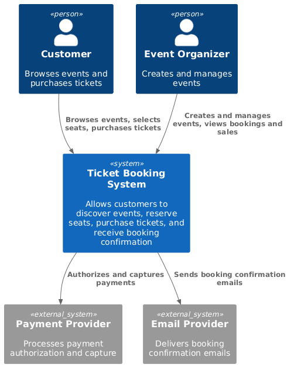
  <div class="diagram-caption" data-snippet-id="c4-ticket-booking-context-snippet">
    🔎 Context — who uses the platform and what is outside it?
  </div>
  <script type="text/plain" id="c4-ticket-booking-context-snippet">

  </script>
</div>

Walk the critical external journey:

```text
Customer → Ticket Booking System → Payment Provider
Customer ← Email Provider ← Ticket Booking System
```

Do not expose databases, queues, internal APIs, services, or caches yet.

### 3. Container — open the Ticket Booking System

Say the zoom explicitly: **“I am opening the Ticket Booking System.”**

Derive containers from the critical journey rather than inventing microservices first:

- `Event Catalog Service` owns events, venues, prices, and seat definitions.
- `Seat Inventory Service` owns availability, temporary holds, and reservations.
- `Order Service` owns booking and order lifecycle.
- `Payment Service` isolates payment-provider coordination.
- `Notification Worker` handles confirmation outside the critical transaction.
- Separate databases make ownership visible; the queue decouples confirmation email.

<div class="image-wrapper">
  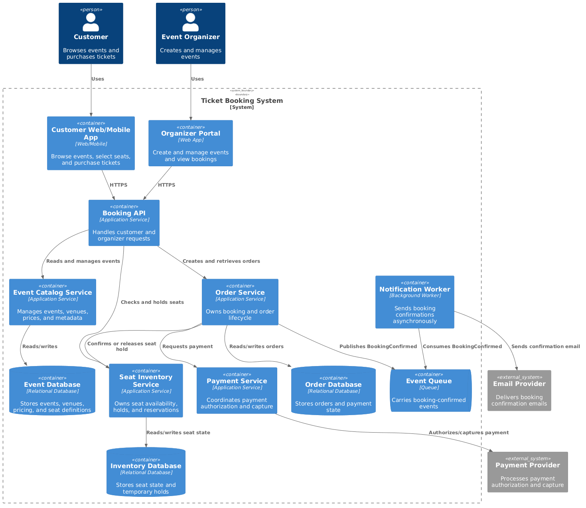
  <div class="diagram-caption" data-snippet-id="c4-ticket-booking-containers-snippet">
    🧱 Container — which runnable part owns each responsibility?
  </div>
  <script type="text/plain" id="c4-ticket-booking-containers-snippet">

  </script>
</div>

`Seat Inventory Service` and `Order Service` could begin as modules in one application. Separate deployment is justified only if responsibility, consistency, scale, ownership, or reliability requires it.

Here, inventory owns the hardest invariant:

> A seat can belong to at most one successful reservation.

That makes Seat Inventory Service the best candidate for the next zoom—not because C4 requires another diagram, but because risk does.

### 4. Component — open Seat Inventory Service

Say: **“The riskiest container is Seat Inventory Service. I will open that container to explain concurrent seat claims.”**

<div class="image-wrapper">
  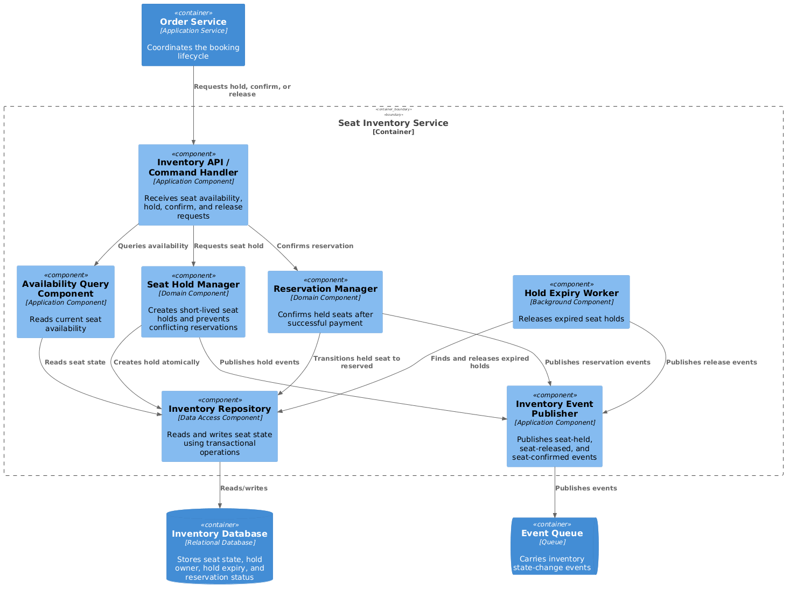
  <div class="diagram-caption" data-snippet-id="c4-ticket-booking-inventory-components-snippet">
    ⚙️ Component — how does Seat Inventory Service protect seat ownership?
  </div>
  <script type="text/plain" id="c4-ticket-booking-inventory-components-snippet">

  </script>
</div>

A Component diagram opens **one** selected Container. The database, queue, and Order Service appear only as dependencies outside that boundary; their internals are not exposed.

### 5. Targeted detail — prevent double booking

A read followed by an unconditional write is unsafe:

```text
User A reads A12 = AVAILABLE
User B reads A12 = AVAILABLE
User A writes A12 = HELD
User B writes A12 = HELD       ← race condition
```

The important property is an **atomic conditional transition**:

```sql
UPDATE seats
SET status = 'HELD', hold_id = ?, expires_at = ?
WHERE seat_id = 'A12'
  AND status = 'AVAILABLE';
```

- `rows_updated == 1`: this request acquired the hold.
- `rows_updated == 0`: another request changed the seat first.
- The mechanism could be a transaction, conditional write, optimistic version check, or lock; the invariant matters more than the syntax.

The lifecycle is:

```text
AVAILABLE ── hold atomically ──> HELD ── payment succeeds ──> RESERVED
                                  │
                                  └── expires / cancels ──> AVAILABLE
```

- Hold before taking payment, or the customer may be charged for a seat the platform cannot reserve.
- Give holds an expiry so abandoned checkouts release inventory.
- Make hold, payment, and confirmation commands idempotent because clients and services retry after timeouts.
- If payment succeeds but confirmation is uncertain, preserve payment/order state and reconcile; do not charge again blindly.

This is sufficient targeted detail. Do not draw a Level 4 code diagram unless the interviewer asks for the state-machine or storage implementation.

### 6. Pressure-test the design

- **Traffic spike:** protect hot events with admission control, a virtual waiting room, rate limits, and backpressure.
- **Read scale:** cache event metadata and seat-map views, but never treat cached availability as authority for acquiring a seat.
- **Hot inventory:** partition carefully by event or section; one popular event can become a hot partition even when total database capacity is high.
- **Consistency:** seat transitions require strong conditional writes; catalogue views and email delivery may be eventually consistent.
- **Failure:** use timeouts, bounded retries, idempotency keys, durable events, and reconciliation around payment and confirmation.
- **Security:** authenticate customers and organizers, authorize organizer actions by event, avoid storing raw card details, and audit booking changes.
- **Observability:** measure hold-conflict rate, checkout success, payment/confirmation mismatch, expired holds, queue lag, and p95/p99 booking latency.

### Interview conclusion

- Scope established the boundary and the double-sale invariant.
- Context showed the platform as one system in its world.
- Container assigned runtime and data ownership.
- Component opened only the highest-risk container.
- Targeted detail proved how `AVAILABLE → HELD → RESERVED` remains safe under concurrency.
- The design spends strong consistency on seat ownership while allowing catalogue reads and notifications to scale more loosely.

</div>
</details>

<details>
  <summary><strong>C4 System Design Interview #2 — IoT Sensor Dashboard</strong></summary>

<div markdown="1">

### Exercise and scope

Design a dashboard for `1 million` temperature sensors reporting every `10 seconds`.

- **Sensor Fleet:** publishes timestamped device, location, and temperature readings.
- **Operations User:** views a heatmap within about `10 seconds` and historical trends.
- **Critical risk:** sustain bursty ingestion without losing replayability or corrupting aggregates with duplicate events.

```text
sensor reading → ingest → validate/deduplicate → latest state + raw history → aggregate → dashboard
```

### Context — one monitoring system

<div class="image-wrapper">
  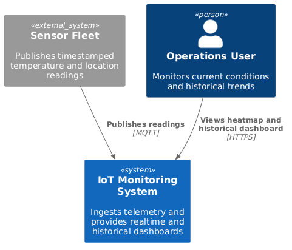
  <div class="diagram-caption" data-snippet-id="c4-iot-dashboard-context-snippet">🔎 Context — devices send readings; users consume operational views</div>
  <script type="text/plain" id="c4-iot-dashboard-context-snippet">

  </script>
</div>

At Context level, MQTT brokers, streams, time-series databases, and workers remain hidden.

### Container — open the IoT Monitoring System

<div class="image-wrapper">
  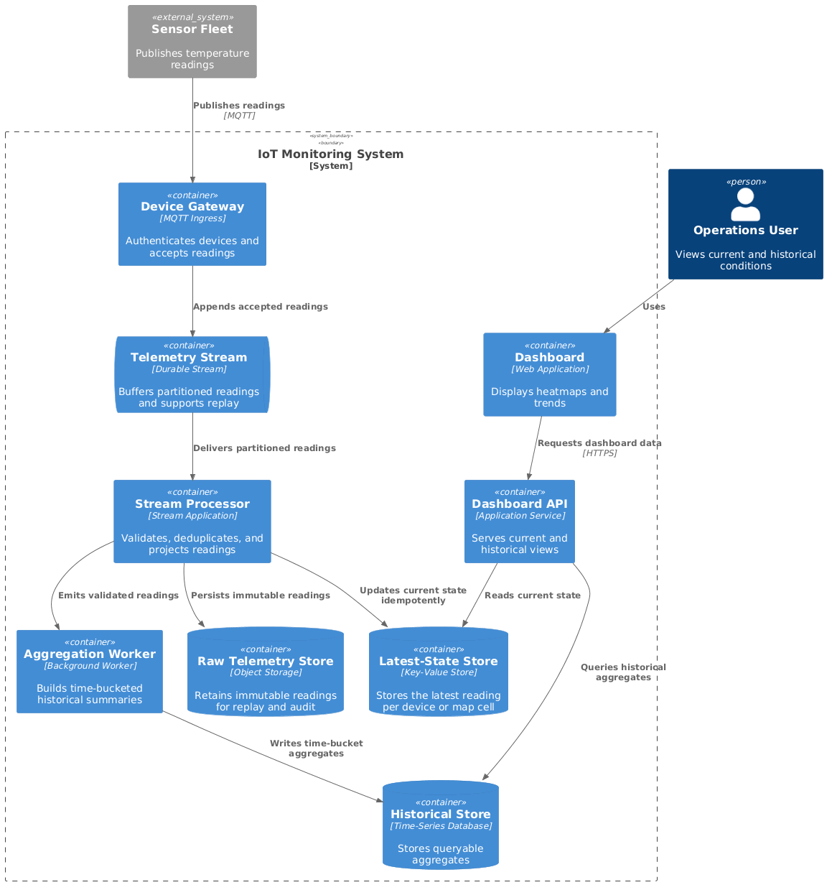
  <div class="diagram-caption" data-snippet-id="c4-iot-dashboard-containers-snippet">🧱 Container — separate the high-volume write path from dashboard reads</div>
  <script type="text/plain" id="c4-iot-dashboard-containers-snippet">

  </script>
</div>

- The durable telemetry stream absorbs bursts and permits replay.
- The latest-state store serves the heatmap without scanning history.
- Raw storage preserves rebuildable facts; the aggregate store serves bounded historical queries.
- The dashboard API reads prepared views rather than coupling users to ingestion.

### Component — open Stream Processor

<div class="image-wrapper">
  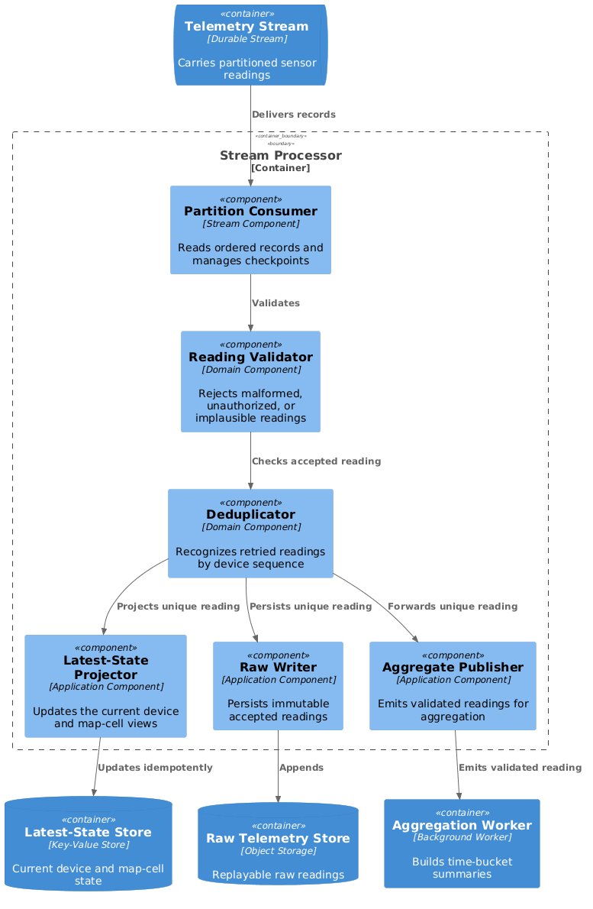
  <div class="diagram-caption" data-snippet-id="c4-iot-stream-components-snippet">⚙️ Component — validate, deduplicate, route, and checkpoint safely</div>
  <script type="text/plain" id="c4-iot-stream-components-snippet">

  </script>
</div>

### Targeted detail — size and protect ingestion

```text
1,000,000 devices / 10 seconds = 100,000 readings/second average
100,000 × 100 bytes             = 10 MB/second before overhead
10 MB × 86,400                  = 864 GB/day
864 GB × 180 days               ≈ 155 TB raw for six months
```

- Size for peak and reconnect bursts, not only the average.
- Partition by a stable device or region key while watching for hot partitions.
- Assume at-least-once delivery: identify events by `device_id + sequence/timestamp` and make updates idempotent.
- Checkpoint only after required writes succeed; retain raw events so projections can be rebuilt.
- Downsample historical data by time bucket instead of querying six months of raw readings.
- Measure ingest lag, invalid/duplicate rate, partition skew, dashboard freshness, and replay time.

</div>
</details>

<details>
  <summary><strong>C4 System Design Interview #3 — Enterprise Support Chatbot with AgentCore</strong></summary>

<div markdown="1">

### Exercise and scope

Design an authenticated company-support chatbot that can:

- answer policy questions from private documents;
- retrieve the live state of a support Case;
- propose updates to a Case, with authorization and approval;
- preserve scoped conversation memory;
- explain actions and produce auditable traces.

The critical boundary is:

```text
model proposes an action → policy and application authorize it → deterministic API performs it
```

### Context — one support assistant

<div class="image-wrapper">
  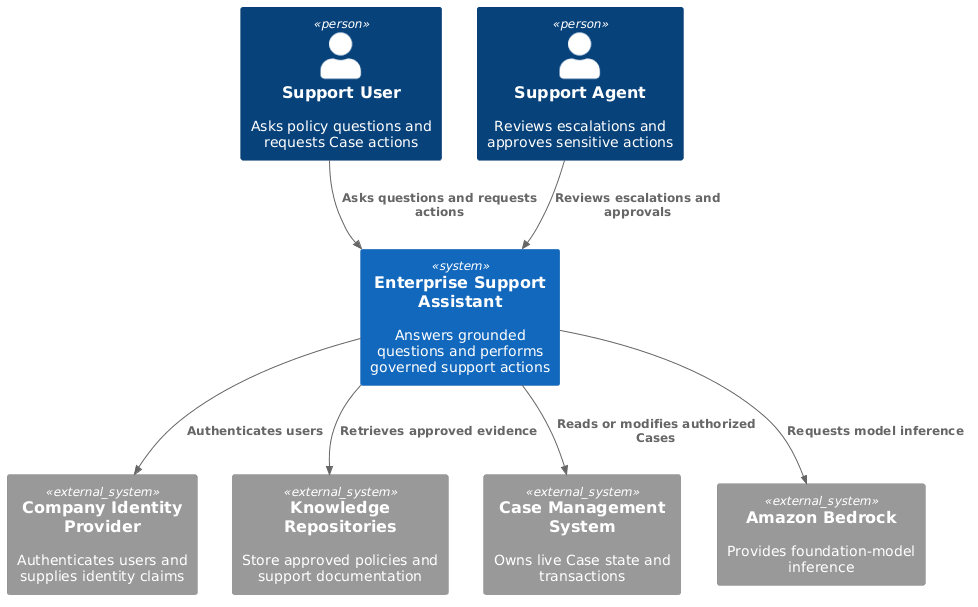
  <div class="diagram-caption" data-snippet-id="c4-agentcore-chatbot-context-snippet">🔎 Context — users, company knowledge, live Cases, identity, and the model platform</div>
  <script type="text/plain" id="c4-agentcore-chatbot-context-snippet">

  </script>
</div>

AgentCore is not the model or the chatbot itself. It supplies modular runtime, memory, identity, policy, gateway, and observability capabilities around agent code. See the [official AgentCore overview](https://docs.aws.amazon.com/bedrock-agentcore/latest/devguide/what-is-bedrock-agentcore.html).

### Container — open the Enterprise Support Assistant

<div class="image-wrapper">
  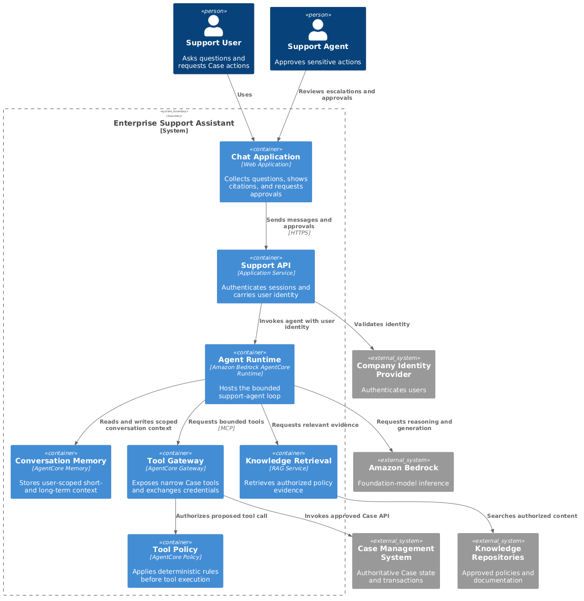
  <div class="diagram-caption" data-snippet-id="c4-agentcore-chatbot-containers-snippet">🧱 Container — retrieval answers questions; governed tools access live Cases</div>
  <script type="text/plain" id="c4-agentcore-chatbot-containers-snippet">

  </script>
</div>

- `Support API` authenticates the request and carries the user's identity.
- `Agent Runtime` hosts the bounded agent loop and calls the model.
- `Knowledge Retrieval` supplies current private policy evidence.
- `AgentCore Memory` stores scoped conversational context, not authoritative Case state.
- `AgentCore Gateway` exposes narrow tools; `AgentCore Policy` deterministically checks proposed calls.
- The Case Management System remains responsible for authorization, validation, and idempotent transactions.

### Component — open the Agent Runtime

<div class="image-wrapper">
  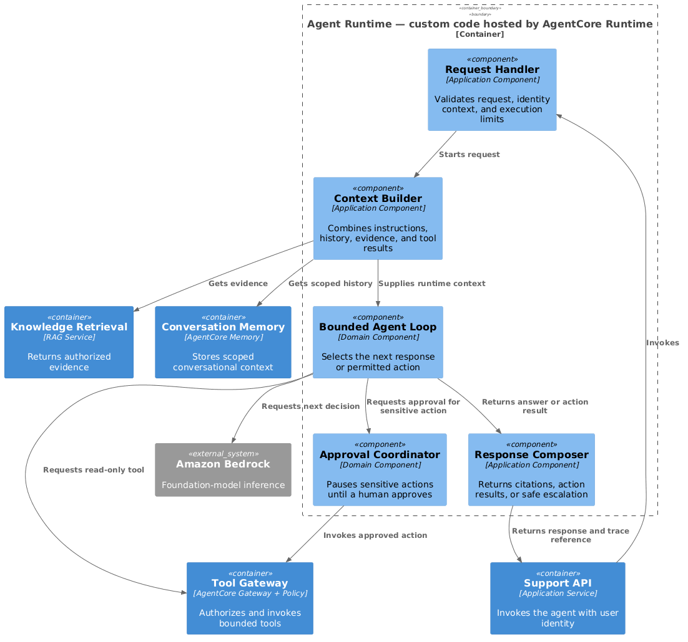
  <div class="diagram-caption" data-snippet-id="c4-agentcore-runtime-components-snippet">⚙️ Component — build context, reason, request tools, require approval, respond</div>
  <script type="text/plain" id="c4-agentcore-runtime-components-snippet">

  </script>
</div>

### Targeted detail — separate knowledge, state, and authority

- **Policy answer:** retrieve approved documents, cite them, and abstain when evidence is insufficient.
- **Live Case status:** call a read-only `get_case(case_id)` tool using the user's delegated identity.
- **Case update:** the model may propose `close_case`, but policy, user approval, and the Case API decide whether it executes.
- **Transaction safety:** pass an idempotency key; the Case API enforces “close exactly once.”
- **Prompt injection:** retrieved text and tool results are untrusted data, not higher-priority instructions.
- **Failure:** bound agent steps, tool retries, time, and token spend; return a safe partial answer or escalate to a human.
- **Measure:** grounded-answer quality, retrieval success, tool-call success, policy denials, approval rate, latency, tokens, and task completion.

For the full AWS service boundaries and industrial sequence, see [AWS AI Services — AgentCore](/study/infrastructureAWSAiServices#section-3-agentcore). For provider-neutral agent reasoning, see [AI Agents](/study/aiAgents).

</div>
</details>

<details>
  <summary><strong>C4 System Design Interview #4 — eCommerce Platform</strong></summary>

<div markdown="1">

### Exercise and scope

Design an online store supporting catalogue search, carts, checkout, payment, inventory, fulfillment, and confirmation.

- **Customer:** browses products and places orders.
- **Store Manager:** manages products, prices, and stock.
- **Warehouse:** fulfils confirmed orders.
- **Payment Provider:** authorizes and captures payment.
- **Critical invariant:** confirmed orders must not oversell available stock.

```text
browse → cart → reserve stock → authorize payment → confirm order → fulfil → notify
```

### Context — one commerce platform

<div class="image-wrapper">
  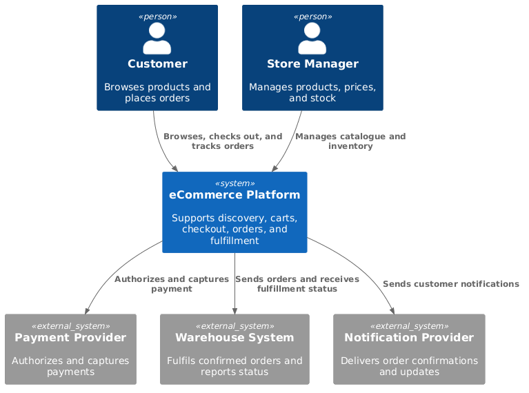
  <div class="diagram-caption" data-snippet-id="c4-ecommerce-context-snippet">🔎 Context — customers, managers, warehouse, payment, and notification</div>
  <script type="text/plain" id="c4-ecommerce-context-snippet">

  </script>
</div>

### Container — open the eCommerce Platform

<div class="image-wrapper">
  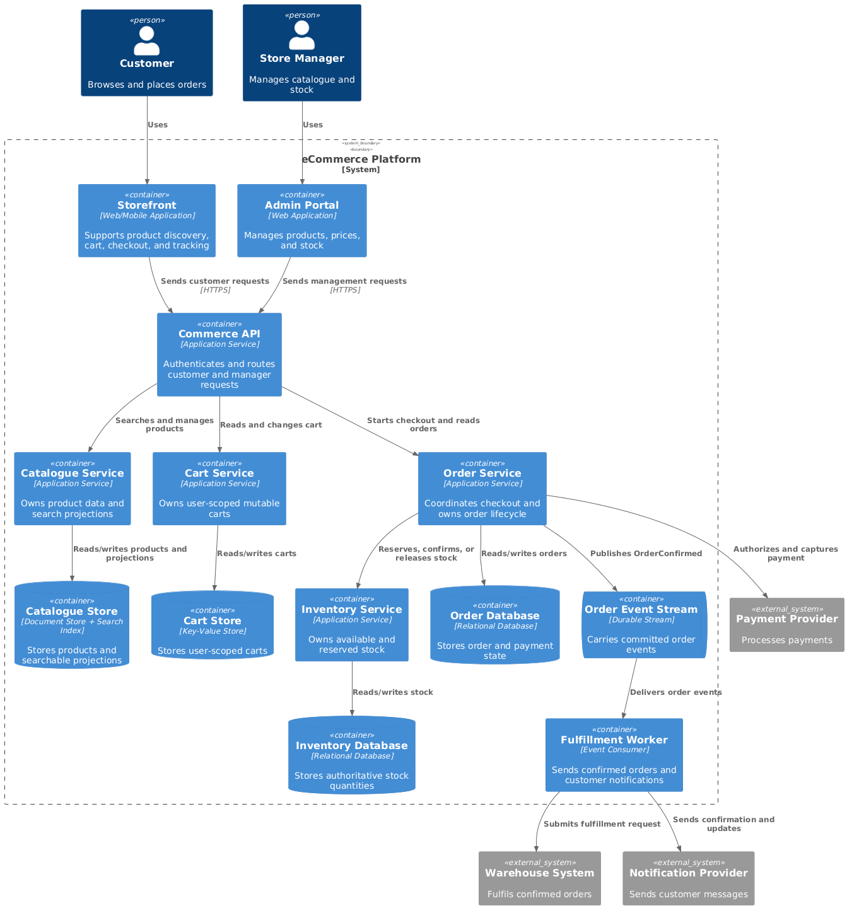
  <div class="diagram-caption" data-snippet-id="c4-ecommerce-containers-snippet">🧱 Container — separate read-heavy discovery from correctness-heavy checkout</div>
  <script type="text/plain" id="c4-ecommerce-containers-snippet">

  </script>
</div>

- Catalogue and search are read-heavy and may use caches or derived indexes.
- Cart is user-scoped, mutable, and not an inventory guarantee.
- Inventory is authoritative for reservable quantity.
- Order owns checkout state and coordinates inventory and payment.
- Fulfillment and confirmation consume committed order events asynchronously.

### Component — open Inventory Service

<div class="image-wrapper">
  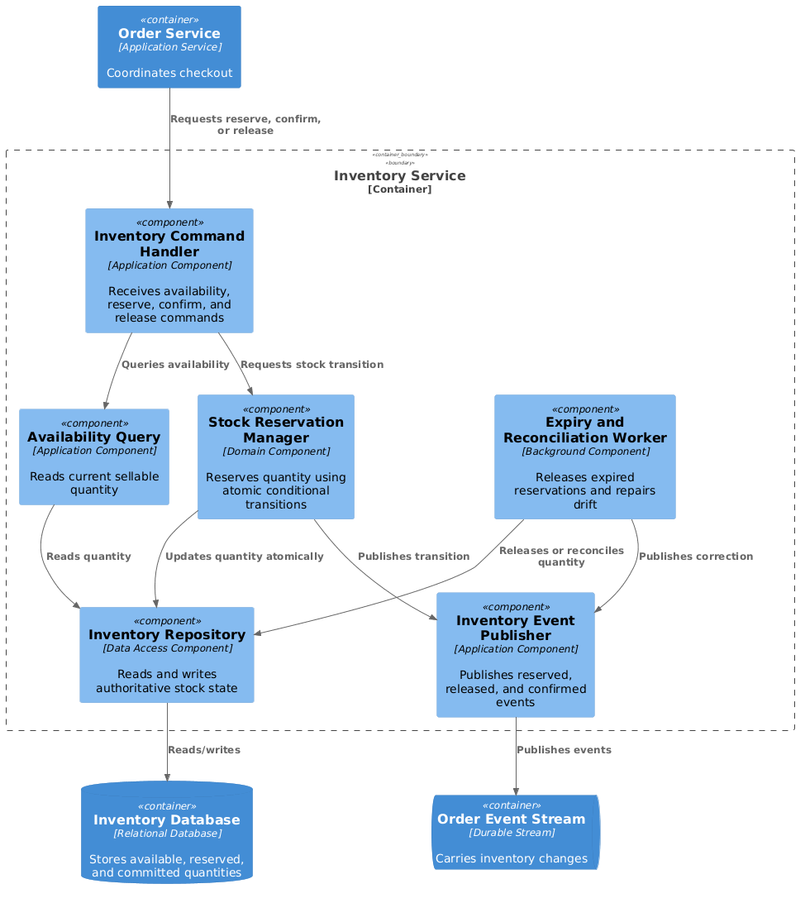
  <div class="diagram-caption" data-snippet-id="c4-ecommerce-inventory-components-snippet">⚙️ Component — reserve quantity atomically and release abandoned reservations</div>
  <script type="text/plain" id="c4-ecommerce-inventory-components-snippet">

  </script>
</div>

### Targeted detail — prevent overselling

The cart may display approximate availability, but checkout needs an atomic conditional reservation:

```sql
UPDATE inventory
SET available = available - ?, reserved = reserved + ?
WHERE sku = ?
  AND available >= ?;
```

- One updated row means the requested quantity was reserved; zero means insufficient stock or a concurrent buyer won.
- Reserve stock before payment, expire abandoned reservations, and release stock when checkout fails.
- Use idempotency keys for order submission, payment requests, reservation confirmation, and event consumers.
- Reconcile uncertain payment/order states rather than retrying financial side effects blindly.
- Cache product pages and search results, but never use the cache as checkout authority.
- Measure reservation conflicts, checkout conversion, payment/order mismatches, inventory drift, event lag, and fulfillment delay.

</div>
</details>

---

## Final Checklist {#final-review-checklist}

- Did I establish actors, scope, scale, and one critical invariant?
- Does each diagram stay at one abstraction level?
- Did I announce which parent system or container I was opening?
- Can I trace one critical journey end to end?
- Is the source of truth for each important state clear?
- Did I justify boundaries from responsibility or risk rather than defaulting to microservices?
- Did I cover concurrency, retries, idempotency, failure, security, and observability where relevant?
- Did I explain the main trade-off and stop when further zoom added no value?

---

## References {#official-c4-references}

- [C4 model introduction and abstraction levels](https://c4model.com/introduction)
- [C4 core and supplementary diagrams](https://c4model.com/diagrams)
- [System Context diagram](https://c4model.com/diagrams/system-context)
- [Container diagram](https://c4model.com/diagrams/container)
- [Component diagram](https://c4model.com/diagrams/component)
- [C4 diagram review checklist](https://c4model.com/diagrams/checklist)
